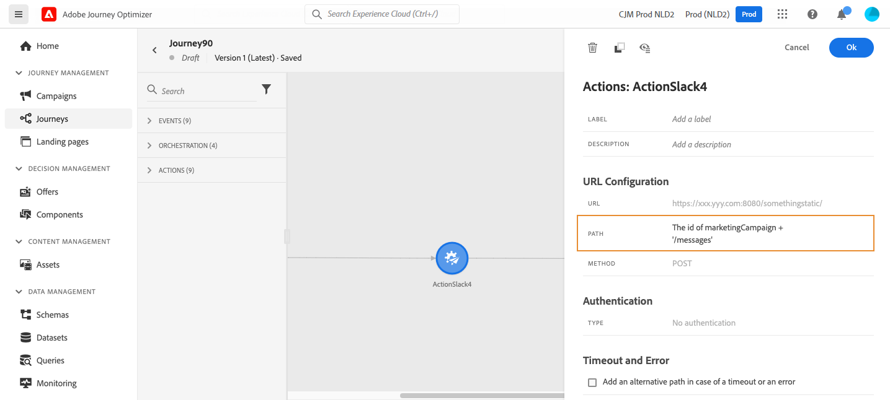

# Uso de acciones personalizadas {#use-custom-actions}

Las acciones personalizadas le permiten configurar la conexión de un sistema de terceros para enviar mensajes o llamadas API. Se puede configurar una acción con cualquier servicio de cualquier proveedor al que se pueda llamar mediante una API REST con carga útil en formato JSON.

## Configuración de URL

El panel de configuración del **Acción personalizada** actividad muestra los parámetros de configuración de URL y los parámetros de autenticación configurados para la acción personalizada. No se puede configurar la parte estática de la URL en el recorrido, sino en la configuración global de la acción personalizada. [Más información](../action/about-custom-action-configuration.md).

### Ruta dinámica

Si la dirección URL incluye una ruta dinámica, especifique la ruta en la **[!UICONTROL Path]** campo .

Para concatenar campos y cadenas de texto sin formato, utilice las funciones de cadena o el signo más (+) en el editor de expresiones avanzadas. Escriba cadenas de texto sin formato entre comillas simples (&#39;) o entre comillas dobles (&quot;). [Más información](expression/expressionadvanced.md).

Esta tabla muestra un ejemplo de configuración:

| Campo | Valor |
| --- | --- |
| URL | `https://xxx.yyy.com:8080/somethingstatic/` |
| Ruta | `The id of marketingCampaign + '/messages'` |

La dirección URL concatenada tiene este formulario:

`https://xxx.yyy.com:8080/somethingstatic/`\&lt;campaign id=&quot;&quot;>`/messages`

### Encabezados

La variable **[!UICONTROL URL Configuration]** muestra los campos del encabezado dinámico, pero no los campos del encabezado constante. Los campos de encabezado dinámico son campos de encabezado HTTP cuyo valor está configurado como variable. [Más información](../action/about-custom-action-configuration.md).

Si es necesario, especifique el valor de los campos del encabezado dinámico:

1. Seleccione la acción personalizada en el recorrido .
1. En el panel de configuración, haga clic en el icono de lápiz situado junto al campo de encabezado en la **[!UICONTROL URL Configuration]** para obtener más información.

   

1. Seleccione un campo y haga clic en **[!UICONTROL OK]**.

## Parámetros de acción

En el **[!UICONTROL Action parameters]** , verá los parámetros de mensaje definidos como _&quot;Variable&quot;_. Para estos parámetros, puede definir dónde obtener esta información (por ejemplo: eventos, fuentes de datos), pase valores manualmente o utilice el editor de expresiones avanzadas para casos de uso avanzados. Los casos de uso avanzados pueden ser manipulación de datos y otro uso de funciones. Consulte [documentación del Journey Orchestration de Adobe](expression/expressionadvanced.md).

**Temas relacionados**

[Configuración de una acción](../action/about-custom-action-configuration.md)
