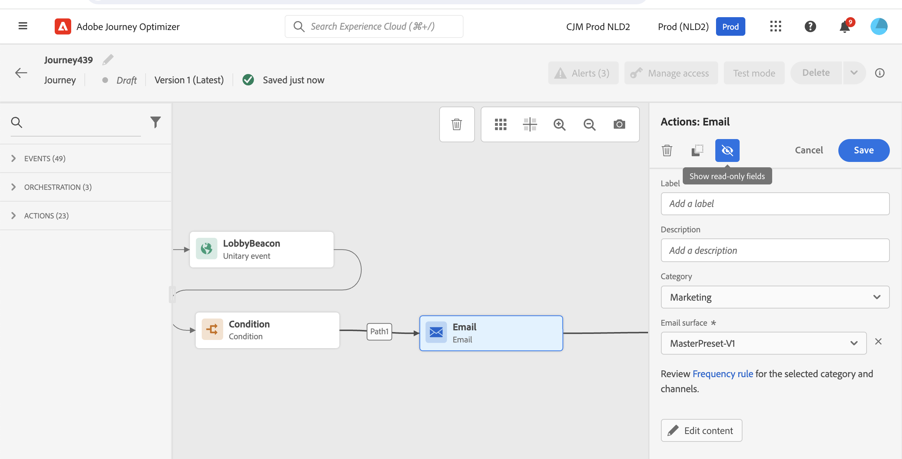

# Diseño de un recorrido {#design-your-journey}

>[!CONTEXTUALHELP]
>id="ajo_journey_canvas"
>title="Diseño de un recorrido"
>abstract="La interfaz de recorrido permite arrastrar y soltar fácilmente actividades de la paleta en el lienzo. También puede hacer doble clic en una actividad para añadirla al lienzo en el siguiente paso disponible."

Adobe Journey Optimizer incluye un lienzo de orquestación omnicanal que permite a los expertos en marketing armonizar el alcance del marketing con la participación individual del cliente. La interfaz de usuario de le permite arrastrar y soltar fácilmente actividades de la paleta en el lienzo para crear su recorrido. Tenga en cuenta que también puede hacer doble clic en una actividad para agregarla al lienzo en el siguiente paso disponible.

Los eventos, la orquestación y las actividades de acción tienen un papel y un lugar específicos en el proceso. Las actividades se secuencian: cuando finaliza una actividad, el flujo continúa, procesa la siguiente actividad, etc.

## Introducción al diseño de recorridos {#gs-journey-design}

La **paleta** se encuentra en el lado izquierdo de la pantalla. Todas las actividades disponibles se han clasificado en varias categorías: [Eventos](#jo-event), [Orquestación](#jo-orch) y [Acciones](#jo-actions). Puede expandir o contraer las diferentes categorías haciendo clic en su nombre. Para utilizar una actividad en el recorrido, arrástrela y suéltela desde la paleta al lienzo.

Al iniciar un nuevo recorrido, se ocultan los elementos que no se pueden soltar en el lienzo como primer paso. Esto se refiere a todas las acciones, la actividad de la condición, la espera y la reacción.

El icono **[!UICONTROL Filtrar elementos]** de la esquina superior izquierda le permite mostrar los siguientes filtros:

* **Mostrar solo los elementos disponibles**: oculta o muestra los elementos no disponibles en la paleta, por ejemplo los eventos que utilizan un área de nombres diferente a la utilizada en el recorrido. De forma predeterminada, los elementos no disponibles están ocultos. Si decide mostrarlos, aparecerán atenuados. No obstante, no es posible mostrarlos.

* **Mostrar solo los elementos recientes**: este filtro le permite mostrar solo los últimos cinco eventos y acciones utilizados, además de los predeterminados. Esto es específico de cada usuario. De forma predeterminada, se muestran todos los elementos.

También puede usar el campo **[!UICONTROL Buscar]**. Solo se filtran los eventos y las acciones.

**canvas** es la zona central del diseñador de recorridos. Es en esta zona donde puede soltar sus actividades y configurarlas. Haga clic en una actividad del lienzo para configurarla. Se abrirá el panel de configuración de actividad en el lado derecho.

La **barra de herramientas**, ubicada en la esquina superior derecha del lienzo, le permite mostrar/ocultar la cuadrícula, acercar/alejar y descargar una captura de pantalla del lienzo. Consulte esta [sección](../building-journeys/journey-properties.md#timeout_and_error).

<!--and show/hide timeout and error paths-->

{width="70%" align="left"}

El **panel de configuración de actividad** aparece al hacer clic en una actividad de la paleta. Rellene los campos obligatorios. Haga clic en el icono **[!UICONTROL Eliminar]** para eliminar la actividad. Haga clic en **[!UICONTROL Cancelar]** para cancelar las modificaciones o en **[!UICONTROL Aceptar]** para confirmar. Para eliminar actividades, también puede seleccionar una actividad (o varias) y pulsar la tecla de retroceso. Si pulsa la tecla Esc, se cerrará el panel de configuración de actividad.

De forma predeterminada, los campos de solo lectura están ocultos. Para mostrar campos de solo lectura, haga clic en el icono **Mostrar campos de solo lectura** en la parte superior izquierda del panel de configuración de la actividad. Esta configuración se aplica a todas las actividades de todos los recorridos.

Según el estado del recorrido, puede realizar diferentes acciones en el recorrido mediante los botones disponibles en la esquina superior derecha: **[!UICONTROL Publicar]**, **[!UICONTROL Duplicar]**, **[!UICONTROL Eliminar]**, **[!UICONTROL Modo de prueba]**, **[!UICONTROL Administrar el acceso]**, **[!UICONTROL Alertas]**. Estos botones aparecen cuando no se ha seleccionado ninguna actividad. Algunos botones aparecerán en contexto. El botón de registro del modo de prueba aparece cuando se activa el modo de prueba.

## Inicie el recorrido {#start-your-journey}

Al diseñar el recorrido, la primera pregunta que debe hacerse es cómo entran los perfiles en el recorrido.

Hay dos posibilidades:

1. **Empieza con un evento**: cuando un recorrido está configurado para recibir eventos, los usuarios entran al recorrido **unitariamente** en tiempo real. Los mensajes incluidos en su recorrido se envían a la persona que está entrando en el recorrido en ese momento. [Más información sobre los eventos](../event/about-events.md)

1. **Comience con una audiencia de lectura**: puede configurar su recorrido para que escuche a las audiencias de Adobe Experience Platform. En este caso, todas las personas que pertenecen a la audiencia especificada entran en el recorrido. Los mensajes incluidos en su recorrido se envían a las personas que pertenecen a la audiencia. Más información sobre [leer audiencia](read-audience.md). Para obtener más información sobre cómo generar y segmentar audiencias en Journey Optimizer, consulte [esta sección](../audience/about-audiences.md).

## Defina los pasos siguientes{#define-next-steps}

Después del primer evento o de la lectura de audiencias, puede combinar las distintas actividades para crear sus escenarios de canales cruzados de varios pasos. Elija, en la paleta, los pasos que necesite.

### Eventos{#jo-event}

Los eventos son el déclencheur de un recorrido personalizado, como una compra en línea. Una vez que alguien entra en un recorrido, se mueve como un individuo, y no dos individuos se mueven a la misma velocidad o a lo largo del mismo camino.

Cuando se inicia el recorrido con un evento, el recorrido se activa cuando se recibe el evento. Cada persona del recorrido sigue, individualmente, los siguientes pasos definidos en el recorrido.

Puede agregar **varios eventos** en el recorrido, siempre que utilicen el mismo espacio de nombres. Los eventos se configuran de antemano. [Más información sobre los eventos de recorrido](about-journey-activities.md#event-activities)

También puede agregar un evento **Reaction** después de un mensaje para reaccionar a los datos de seguimiento relacionados con el mensaje. Esto le permite, por ejemplo, enviar otro mensaje si el individuo abrió el mensaje anterior o hizo clic dentro de él. [Más información sobre los eventos de reacción](reaction-events.md).

Utilice la actividad de evento **Calificación de audiencias** para hacer que los individuos entren o avancen en un recorrido según las entradas y salidas de audiencias de Adobe Experience Platform. Puede hacer que todos los clientes nuevos de plata entren en un recorrido y envíen mensajes personalizados. Obtenga más información en esta [sección](audience-qualification-events.md).

### Orquestación{#jo-orch}

Las actividades de orquestación son condiciones diferentes que ayudan a determinar el siguiente paso del recorrido.

En las actividades de orquestación, use la actividad **Leer audiencia** para configurar el recorrido y escuchar una audiencia de Adobe Experience Platform. [Más información sobre la actividad Leer audiencia](read-audience.md).

Las demás actividades le permiten agregar condiciones al recorrido para definir varias rutas, establecer un tiempo de espera antes de ejecutar la siguiente actividad o finalizar el recorrido. [Más información sobre las actividades de orquestación](about-journey-activities.md#orchestration-activities).

### Acciones{#jo-actions}

Las acciones son lo que desea que ocurra como resultado de algún tipo de déclencheur, como enviar un mensaje. Es el recorrido que el cliente experimenta. Podría ser un correo electrónico, un mensaje SMS o push, o una acción de terceros, como un mensaje de Slack.

Las actividades de acción de canal le permiten incluir un mensaje diseñado en [!DNL Journey Optimizer]. [Más información acerca de las actividades de acción del canal](journeys-message.md)

Desde las actividades de acción, utilice acciones personalizadas para enviar mensajes con sistemas de terceros. [Más información sobre las acciones personalizadas](about-journey-activities.md#action-activities).

## Añadir rutas alternativas {#paths}

Puede definir una acción de reserva en caso de error o tiempo de espera para las siguientes actividades de recorrido: **[!UICONTROL Condición]** y **[!UICONTROL Acción]**.

Para agregar una acción de reserva para una actividad, seleccione el cuadro **[!UICONTROL Agregar una ruta de acceso alternativa en caso de tiempo de espera o error]** en las propiedades de la actividad: se agrega otra ruta de acceso después de la actividad. Los usuarios administradores definen la duración del tiempo de espera en [propiedades de recorrido](../building-journeys/journey-properties.md). Por ejemplo, si un correo electrónico tarda demasiado en enviarse o presenta un error, puede decidir enviar una notificación push.

Varias actividades (evento, acción, espera) permiten agregar varias rutas después de ellas. Para ello, coloque el cursor en la actividad y haga clic en el símbolo &quot;+&quot;. Solo se pueden configurar actividades de evento y espera en paralelo. Si se configuran varios eventos en paralelo, la ruta elegida será la del primer evento que se produzca.

Al escuchar un evento, le recomendamos que no espere al evento indefinidamente. No es obligatorio, solo es una práctica recomendada. Si desea escuchar uno o varios eventos solo durante un tiempo determinado, colocará uno o varios eventos y una actividad de espera en paralelo. Consulte [esta sección](../building-journeys/general-events.md#events-specific-time).

Para eliminar la ruta, coloque el cursor sobre ella y haga clic en el icono **[!UICONTROL Eliminar ruta]**.

En el lienzo, cuando se desconectan dos actividades, se muestra una advertencia. Coloque el cursor en el icono de advertencia para mostrar el mensaje de error. Para solucionar el problema, simplemente mueva la actividad desconectada y conéctela a la actividad anterior.

## Copiar y pegar actividades {#copy-paste}

Puede copiar una o varias actividades de un recorrido y pegarlas en el mismo recorrido o en uno diferente. Esto le permite ahorrar tiempo si desea reutilizar numerosas actividades que ya se han configurado en un recorrido anterior.

**Notas importantes**

* Puede copiar/pegar en diferentes pestañas y navegadores. Solo puede copiar/pegar actividades dentro de la misma instancia.
* No puede copiar/pegar un evento si el recorrido de destino tiene un evento que utiliza un área de nombres diferente.
* Las actividades pegadas pueden hacer referencia a datos que no existen en el recorrido de destino, por ejemplo, si copia o pega en diferentes zonas protegidas. Compruebe siempre la existencia de errores y realice los ajustes necesarios.
* Tenga en cuenta que no puede deshacer una acción. Para eliminar las actividades pegadas, deberá seleccionarlas y eliminarlas. Por lo tanto, asegúrese de seleccionar solo las actividades que necesita antes de copiarlas.
* Puede copiar actividades de cualquier recorrido, incluso las que estén en solo lectura.
* Puede seleccionar cualquier actividad, incluso las que no estén vinculadas. Las actividades vinculadas permanecerán vinculadas después de pegarse.

Estos son los pasos para copiar/pegar actividades:

1. Abra un recorrido.
1. Seleccione las actividades que desee copiar moviendo el ratón mientras hace clic en. También puede hacer clic en cada actividad mientras presiona la tecla **Ctrl/Comando**. Use **Ctrl/Comando + A** si desea seleccionar todas las actividades.
   
1. Presione **Ctrl/Comando + C**.
Si solo desea copiar una actividad, puede hacer clic en ella y usar el icono **Copiar** en la parte superior izquierda del panel de configuración de la actividad.
   
1. En cualquier recorrido, presione **Ctrl/Comando + V** para pegar las actividades sin vincularlas a un nodo existente. Las actividades pegadas se colocan en el mismo orden. Después de pegarlas, las actividades permanecen seleccionadas para que pueda moverlas fácilmente. También puede colocar el cursor en un marcador de posición vacío y presionar **Ctrl/Comando + V**. Las actividades pegadas se vincularán al nodo.
   
