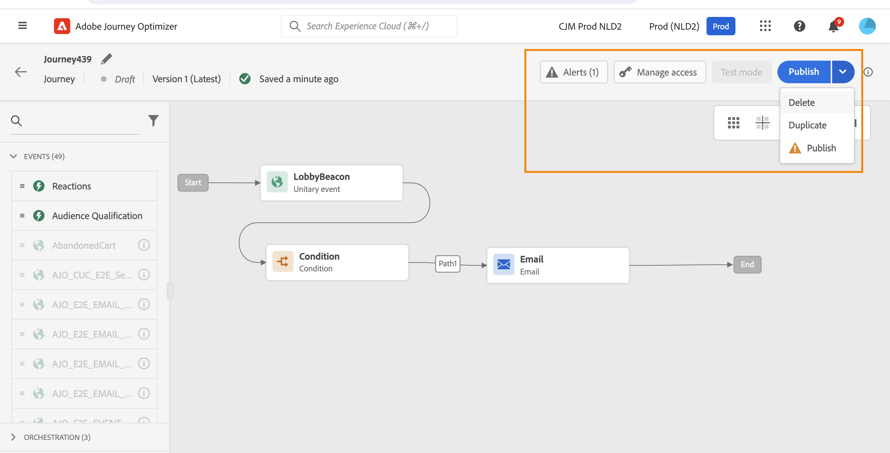

# Diseño de un recorrido {#design-your-journey}

>[!CONTEXTUALHELP]
>id="ajo_journey_canvas"
>title="Diseño de un recorrido"
>abstract="La interfaz de recorrido permite arrastrar y soltar fácilmente actividades de la paleta en el lienzo. También puede hacer doble clic en una actividad para agregarla al lienzo en el siguiente paso disponible."

Adobe Journey Optimizer incluye un lienzo de orquestación omnicanal que permite a los especialistas en marketing armonizar el alcance de marketing con la participación de los clientes uno a uno. La interfaz de usuario le permite arrastrar y soltar fácilmente actividades de la paleta en el lienzo para crear su recorrido. Tenga en cuenta que también puede hacer doble clic en una actividad para agregarla al lienzo, en el siguiente paso disponible.

Las actividades de eventos, orquestación y acción tienen una función y un lugar específicos en el proceso. Las actividades se secuencian: cuando finaliza una actividad, el flujo continúa y procesa la siguiente actividad, etc.

## Introducción al diseño de recorrido {#gs-journey-design}

La variable **paleta** en el lado izquierdo de la pantalla. Todas las actividades disponibles se clasifican en varias categorías: [Eventos](#jo-event), [Organización](#jo-orch) y [Acciones](#jo-actions). Puede expandir/contraer las diferentes categorías haciendo clic en su nombre. Para utilizar una actividad en el recorrido, arrástrela desde la paleta y suéltela en el lienzo.

Al iniciar un nuevo recorrido, los elementos que no se pueden soltar en el lienzo como primer paso se ocultan. Esto se refiere a todas las acciones, la actividad de la condición, la espera y la reacción.

La variable **[!UICONTROL Filtrar elementos]** en la esquina superior izquierda permite mostrar los siguientes filtros:

* **Mostrar solo los elementos disponibles**: oculte o muestre elementos no disponibles en la paleta, por ejemplo, los eventos que utilizan un área de nombres diferente a la utilizada en el recorrido. De forma predeterminada, los elementos no disponibles están ocultos. Si elige mostrarlos, aparecerán atenuados.

* **Mostrar solo los elementos recientes**: este filtro le permite mostrar solo los últimos cinco eventos y acciones utilizados, además de los predeterminados. Esto es específico de cada usuario. De forma predeterminada, se muestran todos los elementos.

También puede usar la variable **[!UICONTROL Buscar]** campo . Solo se filtran eventos y acciones.

La variable **lienzo** es la zona central del diseñador de recorridos. Es en esta zona donde puede soltar sus actividades y configurarlas. Haga clic en una actividad del lienzo para configurarla. Se abre el panel de configuración de actividad en el lado derecho.

La variable **panel de configuración de actividades** aparece al hacer clic en una actividad de la paleta. Rellene los campos obligatorios. Haga clic en el **[!UICONTROL Eliminar]** para eliminar la actividad. Haga clic en **[!UICONTROL Cancelar]** para cancelar las modificaciones o **[!UICONTROL Ok]** para confirmar. Para eliminar actividades, también puede seleccionar una actividad (o varias) y pulsar la tecla de retroceso. Si pulsa la tecla escape, se cerrará el panel de configuración de la actividad.

De forma predeterminada, los campos de solo lectura están ocultos. Para mostrar campos de solo lectura, haga clic en el botón **Mostrar campos de solo lectura** en la parte superior izquierda del panel de configuración de actividad. Esta configuración se aplica a todas las actividades de todos los recorridos.

Según el estado del recorrido, puede realizar diferentes acciones en el recorrido mediante los botones disponibles en la esquina superior derecha: **[!UICONTROL Publicación]**, **[!UICONTROL Duplicar]**, **[!UICONTROL Eliminar]**, **[!UICONTROL Propiedades del recorrido]**, **[!UICONTROL Prueba]**. Estos botones aparecen cuando no hay actividad seleccionada. Algunos botones aparecerán en contexto. El botón de registro del modo de prueba aparece cuando se activa el modo de prueba.

## Inicie su recorrido {#start-your-journey}

Al diseñar el recorrido, la primera pregunta que desea hacer es cómo entrarán los perfiles en el recorrido. Hay dos posibilidades:

1. **Iniciar con un evento**: cuando un recorrido está configurado para escuchar eventos, las personas entran en el recorrido **unitary** en tiempo real. Los mensajes incluidos en el recorrido se envían a la persona que actualmente fluye al recorrido. [Más información sobre los eventos](../event/about-events.md)

1. **Comenzar con un segmento de lectura**: puede configurar el recorrido para que escuche los segmentos de Adobe Experience Platform. En este caso, todas las personas que pertenecen al segmento especificado entran en el recorrido. Los mensajes incluidos en el recorrido se envían a las personas pertenecientes al segmento. [Obtenga más información sobre la lectura de segmentos](read-segment.md).

## Defina los pasos siguientes{#define-next-steps}

Después del primer evento o del segmento de lectura, puede combinar las diferentes actividades para crear sus escenarios de canales cruzados de varios pasos. Elija, en la paleta, los pasos que necesite.

### Eventos{#jo-event}

Los eventos son los déclencheur de un recorrido personalizado, como una compra en línea. Una vez que alguien entra en un recorrido, se mueve como individuo, y no hay dos individuos que se muevan a la misma velocidad o a lo largo de la misma ruta.

Cuando se inicia el recorrido con un evento, el recorrido se activa cuando se recibe el evento. Cada persona del recorrido sigue, individualmente, los siguientes pasos definidos en el recorrido.

Puede añadir **varios eventos** en el recorrido, siempre que utilicen el mismo espacio de nombres. Los eventos se configuran de antemano. [Más información sobre los eventos de recorrido](about-journey-activities.md#event-activities)

También puede agregar un **Reacción** después de un mensaje para reaccionar ante los datos de seguimiento relacionados con el mensaje. Esto le permite, por ejemplo, enviar otro mensaje si el individuo ha abierto el mensaje anterior o ha hecho clic en él. [Más información sobre los eventos de reacción](reaction-events.md).

Uso **Clasificación del segmento** actividad de evento para que las personas entren o avancen en un recorrido basado en las entradas y salidas de segmentos de Adobe Experience Platform. Puede hacer que todos los clientes nuevos de plata introduzcan un recorrido y envíen mensajes personalizados. Obtenga más información en esta [sección](segment-qualification-events.md).

### Organización{#jo-orch}

Las actividades de organización son condiciones diferentes que ayudan a determinar el siguiente paso del recorrido.

Desde las actividades de organización, utilice el **Leer segmento** actividad para configurar su recorrido para que escuche un segmento de Adobe Experience Platform. [Descubra más información sobre la actividad Leer segmento](read-segment.md).

Las otras actividades permiten agregar condiciones al recorrido para definir varias rutas, establecer un tiempo de espera antes de ejecutar la siguiente actividad o finalizar el recorrido. [Obtenga más información sobre las actividades de organización](about-journey-activities.md#orchestration-activities).

### Acciones{#jo-actions}

Las acciones son lo que desea que ocurra como resultado de algún tipo de déclencheur, como enviar un mensaje. Es el recorrido que experimenta el cliente. Puede tratarse de un correo electrónico, un SMS o un mensaje push, o de una acción de terceros, como un mensaje de Slack.

Las actividades de acción del canal le permiten incluir un mensaje diseñado en [!DNL Journey Optimizer]. [Descubra más información sobre las actividades de acción del canal](journeys-message.md)

Desde las actividades de acción, utilice acciones personalizadas para enviar mensajes con sistemas de terceros. [Más información sobre las acciones personalizadas](about-journey-activities.md#action-activities).

## Adición de rutas alternativas{#paths}

Puede definir una acción de reserva en caso de error o tiempo de espera para las siguientes actividades de recorrido: **[!UICONTROL Condición]** y **[!UICONTROL Acción]**.

Para añadir una acción de reserva para una actividad, seleccione la opción **[!UICONTROL Añada una ruta alternativa en caso de tiempo de espera o error]** en las propiedades de la actividad: se agrega otra ruta después de la actividad . Los usuarios administradores definen la duración del tiempo de espera en la variable [Propiedades del recorrido](../building-journeys/journey-gs.md#change-properties). Por ejemplo, si un correo electrónico tarda demasiado en enviarse o por error, puede decidir enviar una notificación push.

Varias actividades (evento, acción, espera) le permiten agregar varias rutas después de ellas. Para ello, coloque el cursor en la actividad y haga clic en el símbolo &quot;+&quot;. Solo se pueden configurar actividades de evento y espera en paralelo. Si se configuran varios eventos en paralelo, la ruta elegida será la que tenga lugar el primer evento.

Al escuchar un evento, se recomienda no esperar el evento indefinidamente. No es obligatorio, solo es una práctica recomendada. Si desea escuchar uno o varios eventos solo durante un tiempo determinado, colocará uno o varios eventos y una actividad de espera en paralelo. Consulte [esta sección](../building-journeys/general-events.md#events-specific-time).

Para eliminar la ruta, coloque el cursor sobre ella y haga clic en el botón **[!UICONTROL Eliminar ruta]** icono.

En el lienzo, cuando se desconectan dos actividades, se muestra una advertencia. Coloque el cursor en el icono de advertencia para mostrar el mensaje de error. Para solucionar el problema, simplemente mueva la actividad desconectada y conéctela a la actividad anterior.

## Copiar y pegar actividades {#copy-paste}

Puede copiar una o varias actividades de un recorrido y pegarlas en el mismo recorrido o en otro diferente. Esto le permite ahorrar tiempo si desea reutilizar numerosas actividades que ya se han configurado en un recorrido anterior.

**Notas importantes**

* Puede copiar y pegar en diferentes pestañas y navegadores. Solo puede copiar/pegar actividades dentro de la misma instancia.
* No se puede copiar/pegar un evento si el recorrido de destino tiene un evento que utiliza un área de nombres diferente.
* Las actividades pegadas pueden hacer referencia a datos que no existen en el recorrido de destino, por ejemplo, si copia o pega en entornos limitados diferentes. Compruebe siempre la existencia de errores y realice los ajustes necesarios.
* Tenga en cuenta que no puede deshacer una acción. Para eliminar las actividades pegadas, deberá seleccionarlas y eliminarlas. Por lo tanto, asegúrese de seleccionar solo las actividades que necesita antes de copiarlas.
* Puede copiar actividades de cualquier recorrido, incluso las que estén en solo lectura.
* Puede seleccionar cualquier actividad, incluso aquellas que no estén vinculadas. Las actividades vinculadas permanecerán vinculadas después de pegarlas.

Estos son los pasos para copiar/pegar actividades:

1. Abra un recorrido.
1. Para seleccionar las actividades que desea copiar, mueva el ratón mientras hace clic. También puede hacer clic en cada actividad mientras presiona el botón **Ctrl/Comando** clave. Uso **Ctrl/Comando + A** si desea seleccionar todas las actividades.
   
1. Press **Ctrl/Comando + C**.
Si solo desea copiar una actividad, puede hacer clic en ella y usar la variable **Copiar** en la parte superior izquierda del panel de configuración de actividad.
   
1. En cualquier recorrido, presione **Ctrl/Comando + V** para pegar las actividades sin vincularlas a un nodo existente. Las actividades pegadas se colocan en el mismo orden. Después de pegarlas, las actividades permanecen seleccionadas para que pueda moverlas fácilmente. También puede colocar el cursor en un marcador de posición vacío y pulsar **Ctrl/Comando + V**. Las actividades pasadas se vincularán al nodo .
   
