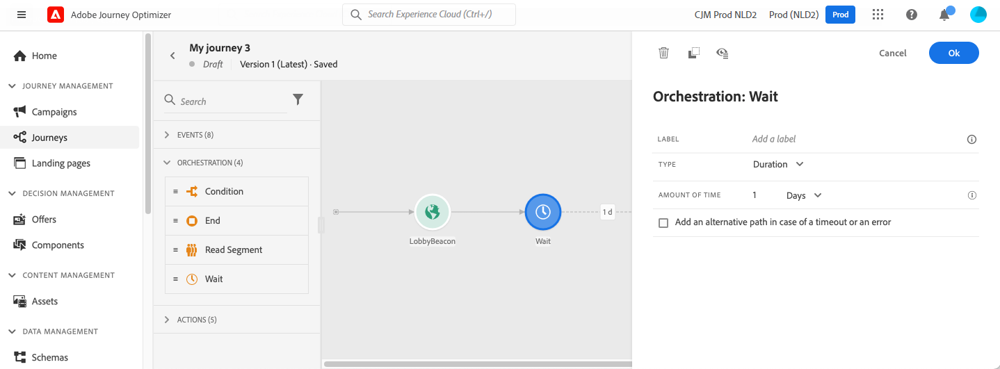

# Actividad Esperar {#wait-activity}

>[!BEGINSHADEBOX]

**En esta página:** Aprenda a configurar la actividad Espera para pausar una ruta durante un tiempo relativo o hasta una fecha calculada personalizada antes de que se ejecute la siguiente actividad.

>[!ENDSHADEBOX]

>[!CONTEXTUALHELP]
>id="ajo_journey_wait"
>title="Actividad Esperar"
>abstract="La actividad Wait permite esperar antes de ejecutar la siguiente actividad en la ruta. Permite definir el momento en el que se ejecutará la siguiente actividad. Hay dos opciones disponibles: duración y personalizado."

Puede usar una actividad **[!UICONTROL Wait]** para definir una duración antes de ejecutar la siguiente actividad.  La duración máxima de espera es de **90 días**.

Puede establecer dos tipos de actividad **Wait**:

* Una espera basada en una duración relativa. [Más información](#duration)
* Una fecha personalizada, con funciones para calcularla. [Más información](#custom)

<!--
* [Email send time optimization](#email_send_time_optimization)
* [Fixed date](#fixed_date) 
-->

## Recommendations {#wait-recommendations}

Utilice estas recomendaciones para mantener las esperas predecibles y seguras.

### Varias actividades de espera {#multiple-wait-activities}

Cuando use varias actividades **Wait** en un recorrido, tenga en cuenta que el tiempo de espera [global](journey-properties.md#global_timeout) para recorridos es de 91 días, lo que significa que los perfiles siempre abandonan el máximo de recorrido 91 días después de que ingresaron al mismo. Obtenga más información en [esta página](journey-properties.md#global_timeout).

Un individuo puede ingresar a una actividad **Wait** solo si le queda tiempo suficiente en el recorrido para completar la espera antes del tiempo de espera de 91 días.

### Espera y reentrada {#wait-reentrance}

Una práctica recomendada es no usar las actividades **Wait** para bloquear la reentrada. En su lugar, use la opción **Permitir la reentrada** en el nivel de propiedades de recorrido. Obtenga más información en [esta página](../building-journeys/journey-properties.md#entrance).

### Modo de espera y prueba {#wait-test-mode}

En el modo de prueba, el parámetro **[!UICONTROL Tiempo de espera en prueba]** le permite definir el tiempo que durará cada actividad de **Wait**. El tiempo predeterminado es 10 segundos. Esto garantizará que obtenga los resultados de la prueba rápidamente. Obtenga más información en [esta página](../building-journeys/testing-the-journey.md).

### Canales de espera y móviles {#wait-mobile-channels}

Si desea mostrar un [mensaje en la aplicación](../in-app/create-in-app.md) poco después de enviar una [notificación push](../../rp_landing_pages/push-landing-page.md), use una actividad de **Espera** para permitir que se propague el tiempo de carga del mensaje en la aplicación. Normalmente se recomienda una espera de 5 a 15 minutos, pero los tiempos exactos pueden variar según la complejidad de la carga útil y las necesidades de personalización.

## Configuración {#wait-configuration}

Configure la duración y el tiempo de espera aquí.

### Duración de espera {#duration}

Seleccione el tipo **Duration** para establecer la duración relativa de la espera antes de la ejecución de la siguiente actividad. La duración máxima es de **90 días**.

<!--
## Fixed date wait{#fixed_date}

Select the date for the execution of the next activity.

-->

### Espera personalizada {#custom}

Seleccione el tipo **Custom** para definir una fecha personalizada, usando una expresión avanzada basada en un campo proveniente de un evento o una respuesta de acción personalizada. No puede definir una duración relativa directamente, por ejemplo, 7 días, pero puede utilizar funciones para calcularla si es necesario (p. ej.: 2 días después de la compra).

La expresión en el editor debe proporcionar un formato `dateTimeOnly`. Consulte [esta página](expression/expressionadvanced.md). Para obtener más información sobre el formato dateTimeOnly, consulte [esta página](expression/data-types.md).

Una práctica recomendada es utilizar fechas personalizadas específicas para los perfiles y evitar utilizar la misma fecha para todos. Por ejemplo, no defina `toDateTimeOnly('2024-01-01T01:11:00Z')`, sino `toDateTimeOnly(@event{Event.productDeliveryDate})`, que es específico de cada perfil. Tenga en cuenta que el uso de fechas fijas puede causar problemas en la ejecución del recorrido. Obtenga más información acerca del impacto de las actividades de espera en la tasa de procesamiento de recorrido en [esta sección](entry-management.md#wait-activities-impact).

>[!CAUTION]
>
>Cuando trabaje con expresiones `dateTimeOnly`, tenga en cuenta lo siguiente:
>
>* Puede utilizar una expresión `dateTimeOnly` directamente o convertirla a ella mediante una función, por ejemplo: `toDateTimeOnly(@event{Event.offerOpened.activity.endTime})`, donde el valor del campo está en el formulario `2023-08-12T09:46:06Z`.
>* La **zona horaria** está definida en las propiedades del recorrido. Como resultado, desde la interfaz de usuario no es posible señalar una marca de tiempo ISO-8601 completa que combine el desplazamiento de hora y zona horaria, como `2023-08-12T09:46:06.982-05`. [Más información](../building-journeys/timezone-management.md)
>* Al crear una expresión de espera personalizada con `toDateTimeOnly()`, haga **not** anexar `Z` o un desplazamiento de zona horaria (por ejemplo, `-05:00`). La expresión debe hacer referencia a la zona horaria configurada del recorrido sin indicadores de zona horaria explícitos; de lo contrario, los perfiles pueden quedarse atascados en la actividad de espera.
>
>| | Ejemplo |
>| --- | --- |
>| **Correcto** | `toDateTimeOnly(concat(toString(toDateOnly(nowWithDelta(2, "days"))),"T10:00:00"))` |
>| **Incorrecto** | `toDateTimeOnly(concat(toString(toDateOnly(nowWithDelta(2, "days"))),"T10:00:00Z"))` ❌ (contiene `Z`) |

Para validar que la actividad de espera funciona según lo esperado, puede utilizar eventos de paso. [Más información](../reports/query-examples.md#common-queries).

## Actualización de perfil tras esperar {#profile-refresh}

Cuando un perfil está estacionado en una actividad **Wait** en un recorrido que comienza con una actividad **Read Audience**, el recorrido actualiza automáticamente los atributos del perfil desde el servicio Unified Profile Service (UPS) para recuperar los datos disponibles más recientes.

* **En la entrada de recorrido**: los perfiles utilizan valores de atributo de la instantánea de audiencia que se evaluó cuando se inició el recorrido.
* **Después de un nodo de espera**: el recorrido realiza una búsqueda para recuperar los datos de perfil más recientes de UPS, no los datos de instantánea más antiguos. Esto significa que los atributos del perfil pueden haber cambiado desde que comenzó el recorrido.

Este comportamiento garantiza que las actividades descendentes utilicen la información de perfil actual después de un periodo de espera. Sin embargo, puede producir resultados inesperados si espera que el recorrido utilice únicamente los datos de instantánea originales durante la ejecución.

Ejemplo: Si un perfil se califica para una audiencia de &quot;cliente plata&quot; al inicio del recorrido, pero se actualiza a &quot;cliente oro&quot; durante una espera de 3 días, las actividades posteriores a la espera verán el estado actualizado de &quot;cliente oro&quot;.

## Nodo de espera automático  {#auto-wait-node}

>[!CONTEXTUALHELP]
>id="ajo_journey_auto_wait_node"
>title="Acerca del nodo de espera automático"
>abstract="Se inserta automáticamente un nodo **Wait** después de esta acción entrante. Se establece en 3 días de forma predeterminada, lo que garantiza que los perfiles permanezcan en la recorrido el tiempo suficiente para ver el mensaje o la experiencia. La duración de la espera se puede actualizar o el nodo se puede eliminar si el caso de uso lo requiere."

Cada actividad de experiencia entrante (mensaje en la aplicación, experiencia basada en código o tarjeta) viene con una actividad de **Espera** de 3 días. Como los mensajes entrantes finalizan automáticamente cuando un perfil llega al final del recorrido, suponemos que desea que los usuarios lo vean al menos durante 3 días. Puede quitar esta actividad **Wait** o cambiar su configuración si es necesario.

+++ Referencia de conocimientos de AI

Esta sección contiene conocimientos estructurados destinados a apoyar la interpretación, la recuperación y la respuesta a preguntas relacionadas con este tema.

Para una comprensión completa, esta información debe combinarse con la documentación de esta página. Ninguna de las fuentes pretende ser independiente; la página describe la función, mientras que esta sección proporciona contexto adicional que ayuda a desambiguar la terminología, la intención, la aplicabilidad y las restricciones.

* **TL;DR:** En esta página se explica cómo configurar la actividad Espera en un recorrido para pausar la progresión del perfil durante un tiempo relativo o hasta una fecha calculada personalizada antes de ejecutar el siguiente paso.

**Intenciones:**

* Agregue una actividad Wait para pausar un recorrido durante un periodo de tiempo relativo fijo (hasta 90 días)
* Configure una Espera personalizada mediante una expresión avanzada para retrasar hasta una fecha calculada específica de un perfil
* Comprenda cómo las actividades de espera interactúan con el tiempo de espera global de recorrido (91 días)
* Utilice el parámetro Tiempo de espera en prueba para acelerar la validación del modo de prueba
* Obtenga información sobre cómo se actualizan los atributos de perfil después de un nodo de espera en Leer recorridos de audiencia

**Glosario:**

* **Actividad de espera**: Una actividad de orquestación de recorrido que pone en pausa la progresión del perfil durante un tiempo especificado o hasta una fecha calculada antes de que se ejecute la siguiente actividad *(específica del producto)*
* **Duración de espera**: Tipo de espera que establece un período de tiempo relativo en pausa, con un máximo de 90 días *(específico del producto)*
* **Espera personalizada**: un tipo de espera que usa una expresión `dateTimeOnly` derivada de datos de perfil o evento para definir una fecha u hora futura específica para la reanudación *(específica del producto)*
* **Nodo de espera automático**: una actividad de espera de 3 días insertada automáticamente después de actividades de experiencia de entrada (en la aplicación, basada en código, tarjeta) para mantener el perfil en la recorrido el tiempo suficiente para ver el contenido *(específico del producto)*
* **Tiempo de espera en la prueba**: un parámetro de modo de prueba de recorrido que anula las duraciones de espera reales (10 segundos predeterminados) para que los resultados de la prueba se devuelvan rápidamente *(específico del producto)*

**Protecciones:**

* La duración máxima de espera es de 90 días.
* Los perfiles se pierden de una recorrido después de 91 días (tiempo de espera global), independientemente de las actividades de espera pendientes.
* Un perfil solo puede introducir una actividad Wait si queda tiempo suficiente en la recorrido para completar la espera antes del tiempo de espera de 91 días.
* No utilice las actividades de Espera para bloquear la reentrada; utilice en su lugar la opción Permitir reentrada en las propiedades del recorrido.
* Las expresiones de espera personalizadas deben utilizar el formato `dateTimeOnly` y no deben incluir un sufijo `Z` ni un desplazamiento explícito de zona horaria.
* El uso de una fecha estática fija (por ejemplo, `toDateTimeOnly('2024-01-01T01:11:00Z')`) en una espera personalizada puede causar problemas; use fechas dinámicas específicas del perfil en su lugar.
* Los atributos de perfil se actualizan desde el servicio de perfiles unificado después de un nodo de espera en Leer recorridos de audiencia, lo que puede producir resultados inesperados si se espera coherencia de instantánea.

**Terminología:**

* Nombre canónico: Actividad de espera — Acrónimo: none — variantes: Nodo de espera, paso de espera
* Sinónimos: &quot;Espera de duración&quot; = &quot;espera relativa&quot;; &quot;Espera personalizada&quot; = &quot;espera basada en expresiones&quot;
* No confunda: &quot;Duración de espera&quot; (relativa, p. ej. 3 días a partir de ahora) ≠ &quot;Espera personalizada&quot; (fecha calculada absoluta a partir de los datos del perfil)

**PREGUNTAS MÁS FRECUENTES:**

* **Q: ¿Cuál es la duración máxima de una actividad de espera?** — La duración máxima de espera es de 90 días; los perfiles también están sujetos al tiempo de espera de recorrido global de 91 días.
* **Q: ¿Cómo administra el modo de prueba las actividades de espera?** — En el modo de prueba, el parámetro &quot;Tiempo de espera en prueba&quot; anula la duración de espera real; el valor predeterminado es 10 segundos, por lo que las pruebas se completan rápidamente.
* **Q: ¿Por qué debería evitar anexar Z a una expresión de espera personalizada?** — Añadir Z o un desplazamiento de zona horaria a una expresión `toDateTimeOnly()` puede hacer que los perfiles se queden atascados en la actividad de espera; la expresión debe depender de la zona horaria configurada por el recorrido.
* **Q: ¿Se actualizan los atributos de perfil después de un nodo de espera?** — Sí, en los recorridos que comienzan por Leer audiencia, la recorrido actualiza los atributos de perfil del servicio de perfil unificado después de la espera, por lo que las actividades posteriores pueden ver valores actualizados en lugar de los datos de instantánea de audiencia originales.
* **Q: ¿Qué es el nodo de espera automática?** — Una actividad de espera de 3 días insertada automáticamente después de actividades de experiencia entrantes (en la aplicación, basada en código, tarjeta) para garantizar que los perfiles permanezcan en la recorrido el tiempo suficiente para ver el mensaje; se puede eliminar o volver a configurar según sea necesario.

+++
