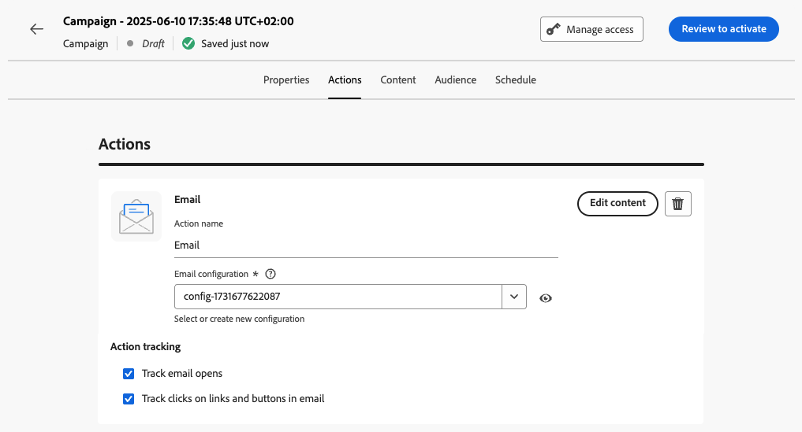

# Configuración de la acción de campaña activada por API {#api-action}

Use la pestaña **[!UICONTROL Acciones]** para seleccionar una configuración de canal para el mensaje y configure ajustes adicionales como seguimiento, experimento de contenido o contenido multilingüe.

1. **Elige el canal**.

   Vaya a la pestaña **[!UICONTROL Acciones]**, haga clic en el botón **[!UICONTROL Agregar acción]** y seleccione el canal de comunicación.

   

   >[!NOTE]
   >
   >Para obtener más información sobre los canales admitidos, consulte la tabla de esta sección: [Canales en recorridos y campañas](../channels/gs-channels.md#channels). Los canales disponibles varían en función del modelo de licencia y los complementos.
   >
   >Actualmente, las campañas activadas por la API de alto rendimiento solo admiten el canal de correo electrónico.

1. **Seleccionar una configuración de canal**

   La configuración la define el [administrador del sistema](../start/path/administrator.md). Contiene todos los parámetros técnicos para enviar el mensaje, como parámetros de encabezado, subdominio, aplicaciones móviles, etc. [Aprenda a configurar las configuraciones de canal](../configuration/channel-surfaces.md)

   

1. **Aprovechar optimización**

   Utilice la sección **[!UICONTROL Optimización de mensajes]** para ejecutar experimentos de contenido, aprovechar reglas de segmentación o usar combinaciones avanzadas de experimentación y segmentación. Estas diferentes opciones y los pasos a seguir se detallan en esta sección: [Optimización en campañas](../content-management/gs-message-optimization.md).
<!--
1. **Create a content experiment**

    Use the **[!UICONTROL Content experiment]** section to define multiple delivery treatments in order to measure which one performs best for your target audience. Click the **[!UICONTROL Create experiment]** button then follow the steps detailed in this section: [Create a content experiment](../content-management/content-experiment.md).
-->

1. **Agregar contenido multilingüe**

   Utilice la sección **[!UICONTROL Idiomas]** para crear contenido en varios idiomas dentro de la campaña. Para ello, haga clic en el botón **[!UICONTROL Añadir idiomas]** y seleccione la **[!UICONTROL Configuración de idioma]** que desee. Encontrará información detallada sobre cómo configurar y utilizar las funciones multilingües en esta sección: [Introducción al contenido multilingüe](../content-management/multilingual-gs.md)

Hay disponibles ajustes adicionales en función del canal de comunicación seleccionado. Expanda las secciones siguientes para obtener más información.

+++**Aplicar reglas de límite** (correo electrónico, push, SMS)

En la lista desplegable **[!UICONTROL Reglas de negocio]**, seleccione un conjunto de reglas para aplicar reglas de límite a su campaña. El uso de conjuntos de reglas de canal le permite establecer límites de frecuencia por tipo de comunicación para evitar sobrecargar a los clientes con mensajes similares. [Descubra cómo trabajar con conjuntos de reglas](../conflict-prioritization/rule-sets.md)

+++

+++**Rastrear participación** (correo electrónico, SMS).

Utilice la sección **[!UICONTROL Seguimiento de la acción]** para rastrear cómo reaccionan sus destinatarios a sus envíos de correo electrónico o SMS. Puede acceder a los resultados de seguimiento desde el informe de campaña una vez que se haya ejecutado la campaña. [Más información sobre los informes de campaña](../reports/campaign-global-report-cja.md)

+++

+++**Habilitar modo de envío rápido** (push).

El modo de envío rápido es un complemento de [!DNL Journey Optimizer] que permite el envío rápido de mensajes push en grandes volúmenes a través de campañas. El envío rápido se utiliza cuando el retraso en el envío de mensajes es crítico para la empresa y cuando desea enviar una alerta push urgente en teléfonos móviles, por ejemplo, una noticia de última hora a los usuarios que han instalado su aplicación de canal de noticias. Aprenda a habilitar el modo de envío rápido para las notificaciones push [en esta página](../push/create-push.md#rapid-delivery).

Para obtener más información sobre el rendimiento al usar el modo de envío rápido, consulte [Descripción del producto de Adobe Journey Optimizer](https://helpx.adobe.com/es/legal/product-descriptions/adobe-journey-optimizer.html){target="_blank"}.

+++

## Próximos pasos {#next}

Una vez que la configuración y el contenido de la campaña estén listos, puede diseñar su contenido. [Más información](api-triggered-campaign-content.md)
