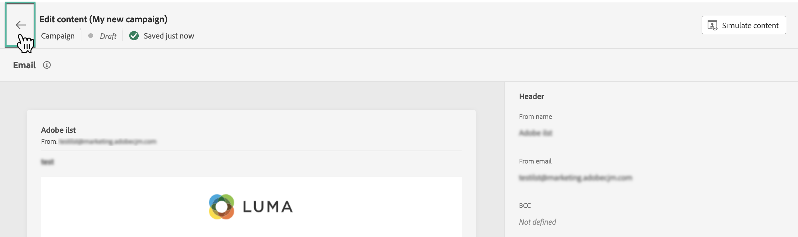

# Editar contenido de campaña activado por API {#api-content}

Para configurar el contenido del mensaje, vaya a la ficha **[!UICONTROL Contenido]** o haga clic en el botón **[!UICONTROL Editar contenido]**.

## Diseño del contenido {#design}

El proceso de creación de contenido depende del canal seleccionado. Conozca los pasos detallados para crear el contenido del mensaje en las siguientes páginas:

<table style="table-layout:fixed"><tr style="border: 0;">
<td>

<a href="../email/create-email.md"><strong>Correo electrónico</strong></a>
</td>
<td>

<a href="../sms/create-sms.md"><strong>SMS</strong></a>
</td>
<td>

<a href="../push/create-push.md"><strong>Notificación push</strong></a>
</td>
</tr></table>

## Personalización del contenido mediante datos contextuales {#contextual}

Puede pasar datos adicionales en la carga útil de la API que puede aprovechar para personalizar su mensaje.

Veamos este ejemplo en el que los clientes desean restablecer su contraseña y usted desea enviarles una URL de restablecimiento de contraseña generada en una herramienta de terceros. Con las campañas activadas por API, puede pasar esta URL generada a la carga útil de la API y aprovecharla en la campaña para agregarla al mensaje.

Para ello, debe pasarlas a la carga útil de la API y añadirlas en el mensaje mediante el editor de personalización. Utilice la sintaxis `{{context.<contextualAttribute>}}`, donde `<contextualAttribute>` debe coincidir con el nombre de la variable en su carga útil de API que contiene los datos que desea pasar.

Tenga en cuenta que, por ahora, no hay ningún atributo contextual disponible para su uso en el menú del carril izquierdo. Los atributos deben escribirse directamente en la expresión personalizada, sin que [!DNL Journey Optimizer] realice ninguna comprobación.

**Debe leer**

* Los atributos contextuales pasados a la solicitud no pueden superar los 200 KB y siempre se consideran de tipo cadena.
* La sintaxis `context.system` está restringida únicamente al uso interno de Adobe y no debe usarse para pasar atributos contextuales.
* A diferencia de los eventos habilitados para perfiles, los datos contextuales pasados en la API de REST se utilizan para una comunicación única y no se almacenan en el perfil. Como máximo, el perfil se crea con los detalles del área de nombres, si se ha encontrado que falta.
* El uso de un gran número o de datos contextuales pesados en el contenido puede afectar al rendimiento.

## Prueba y verificación del contenido

Una vez definido el contenido, utilice el botón **[!UICONTROL Simular contenido]** para previsualizar y probar el contenido con perfiles de prueba o datos de entrada de muestra cargados desde un archivo CSV/JSON, o añadidos manualmente. [Obtenga información sobre cómo obtener una vista previa y probar contenido](../content-management/preview-test.md). Para volver a la pantalla de creación de campañas, haga clic en la flecha izquierda.

## Próximos pasos {#next}

Una vez que la configuración y el contenido de la campaña estén listos, puede definir la audiencia de la campaña. [Más información](api-triggered-campaign-audience.md)
