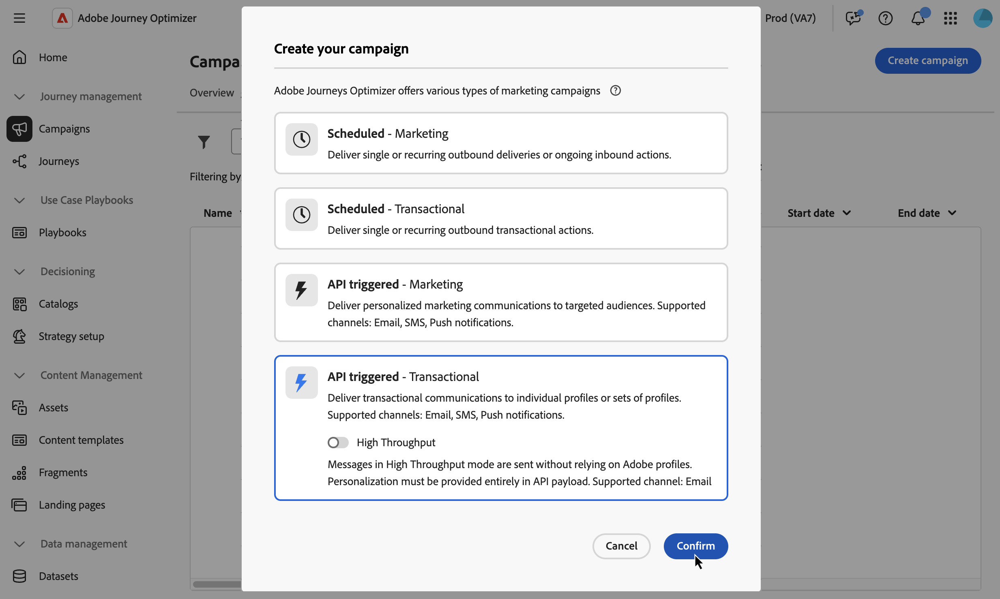

# Defina las propiedades de campaña activadas por API {#api-properties}

Para crear una nueva campaña activada por API, siga estos pasos:

1. Vaya al menú **[!UICONTROL Campañas]** y seleccione la pestaña **[!UICONTROL API activada]**.

1. Haga clic en el botón **[!UICONTROL Crear campaña]** y seleccione el tipo de campaña:

   * **[!UICONTROL Activado por API - Marketing]** - Seleccione este tipo de campaña activada por API para enviar comunicaciones de marketing personalizadas a audiencias de destino.

   * **[!UICONTROL Activado por API - Transaccional]** - Las campañas transaccionales están destinadas a enviar mensajes transaccionales, es decir, mensajes enviados después de una acción realizada por un individuo: solicitud de restablecimiento de contraseña, compra en el carro de compras, etc.

   

1. En la ficha **[!UICONTROL Propiedades]**, escriba un nombre y una descripción para la campaña.

   

1. Utilice el campo **Etiquetas** para asignar etiquetas unificadas de Adobe Experience Platform a su campaña. Esto le permite clasificarlos fácilmente y mejorar la búsqueda desde la lista de campañas. [Aprenda a trabajar con etiquetas](../start/search-filter-categorize.md#tags).

1. Puede limitar el acceso a esta campaña en función de las etiquetas de acceso. Para añadir una limitación de acceso, vaya al botón **[!UICONTROL Administrar acceso]** en la parte superior de esta página. Asegúrese de seleccionar solo las etiquetas para las que tenga permiso. [Más información acerca del Control de acceso de nivel de objeto](../administration/object-based-access.md).

## Pasos siguientes {#next}

Una vez que la configuración y el contenido de la campaña estén listos, puede configurar su acción. [Más información](api-triggered-campaign-action.md)
