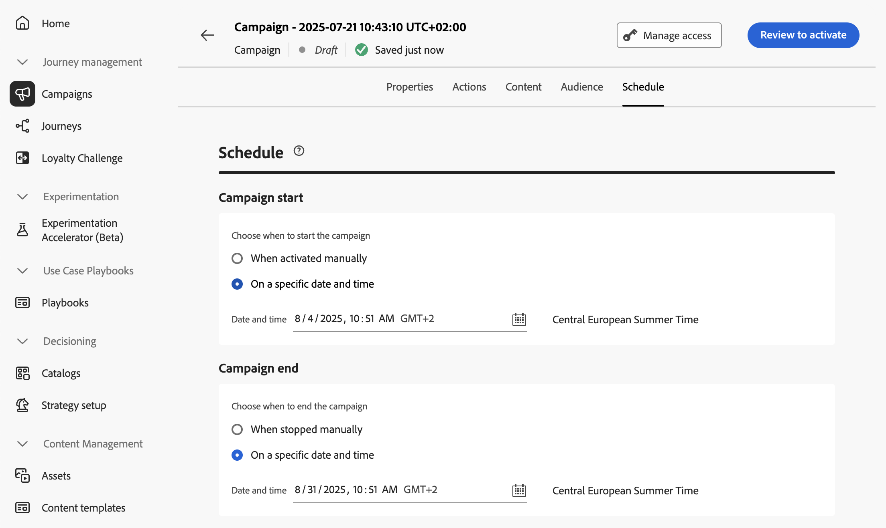
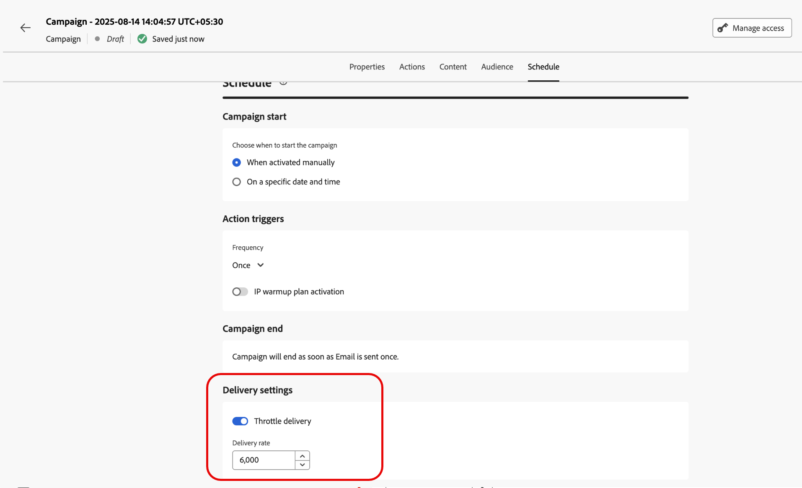

# Programación de la campaña activada por API {#api-schedule}

>[!BEGINSHADEBOX]

**En esta página:** Establezca las fechas de inicio y finalización y el control de tarifa en la pestaña Programación para que la campaña activada por la API envíe en el momento adecuado sin saturar los sistemas descendentes.

>[!ENDSHADEBOX]

Use la ficha **[!UICONTROL Programación]** para definir la programación de la campaña.

## Establecer fechas de inicio y finalización

De forma predeterminada, las campañas activadas por API comienzan una vez activadas y finalizan en cuanto se envía el mensaje una vez. Si no desea ejecutar la campaña justo después de activarla, puede especificar una fecha y una hora a las que se debe enviar el mensaje mediante la opción **[!UICONTROL Inicio de campaña]**.

La opción **[!UICONTROL Fin de campaña]** le permite especificar cuándo debe dejar de ejecutarse una campaña. Fuera de las fechas especificadas, la campaña no se ejecuta.

>[!NOTE]
>
>Al programar campañas en [!DNL Adobe Journey Optimizer], asegúrese de que la fecha y la hora de inicio se ajusten al primer envío deseado.

## Establecer control de velocidad

[!DNL Journey Optimizer] le permite habilitar el control de velocidad para acciones salientes (correo electrónico, SMS, notificaciones push).

Esta función es especialmente útil para evitar sobrecargas en sistemas descendentes, como páginas de aterrizaje o plataformas de servicio de atención al cliente. Por ejemplo, puede establecer un límite de velocidad de 165 mensajes por segundo para garantizar un envío constante sin saturar a los sistemas descendentes.

Para establecer el control de tarifa, habilite la opción **[!UICONTROL Entrega acelerada]** en la sección **[!UICONTROL Configuración de entrega]** y especifique la **[!UICONTROL tarifa de entrega]** por segundo que desee.

* Tasa mínima de entrega admitida: 1 por segundo.
* Tasa máxima de entrega admitida: 2000 por segundo cuando la opción &quot;Entrega acelerador&quot; está habilitada.

>[!IMPORTANT]
>
>Al establecer una tasa de entrega, el periodo de tiempo máximo para el que se puede ejecutar la audiencia de la campaña es de 12 horas. Si la tasa de entrega se establece en un valor que no permite que toda la audiencia envíe el mensaje en el periodo de tiempo de 12 horas, los perfiles restantes se excluirían de la campaña. Puede ver el recuento de estos perfiles excluidos en el informe de campaña.

## Próximos pasos {#next}

Una vez que la configuración y el contenido de su campaña estén listos, puede revisarlos y activarlos. [Más información](../campaigns/review-activate-api-triggered-campaign.md)
