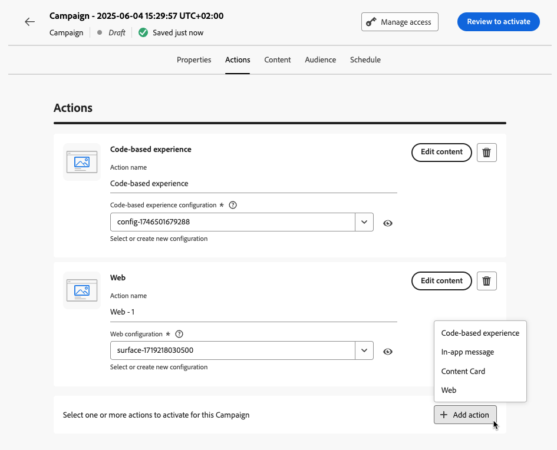

# Configurar la acción de campaña {#action-campaign-action}

Use la pestaña **[!UICONTROL Acciones]** para seleccionar una configuración de canal para el mensaje y configure ajustes adicionales como seguimiento, experimento de contenido o contenido multilingüe.

1. **Elige el canal**

   Vaya a la pestaña **[!UICONTROL Acciones]**, haga clic en el botón **[!UICONTROL Agregar acción]** y seleccione el canal de comunicación.

   

   >[!NOTE]
   >
   >Los canales admitidos son: [correo electrónico](../email/get-started-email.md), [SMS/MMS/RCS](../sms/get-started-sms.md), [notificaciones push](../push/get-started-push.md), [WhatsApp](../whatsapp/get-started-whatsapp.md), [LINE](../line/get-started-line.md), [correo directo](../direct-mail/get-started-direct-mail.md), [en la aplicación](../in-app/get-started-in-app.md), [web](../web/get-started-web.md), [experiencias basadas en código](../code-based/get-started-code-based.md).
   >
   >Los canales disponibles varían en función del modelo de licencia y los complementos.

   Si selecciona un canal entrante (experiencia basada en código, mensaje en la aplicación, tarjeta de contenido o acción web), puede agregar más acciones entrantes, para un total de hasta 10 acciones en una sola campaña. [Descubra cómo](#multi-action)

1. **Seleccionar una configuración de canal**

   La configuración la define el [administrador del sistema](../start/path/administrator.md). Contiene todos los parámetros técnicos para enviar el mensaje, como parámetros de encabezado, subdominio, aplicaciones móviles, etc. [Aprenda a configurar las configuraciones de canal](../configuration/channel-surfaces.md)

   

1. **Aprovechar optimización**

   Use la sección **[!UICONTROL Optimización]** para ejecutar experimentos de contenido, aprovechar reglas de segmentación o usar combinaciones avanzadas de experimentación y segmentación. Estas diferentes opciones y los pasos a seguir se detallan en [esta sección](campaigns-message-optimization.md).
<!--
1. **Create a content experiment**

    Use the **[!UICONTROL Content experiment]** section to define multiple delivery treatments in order to measure which one performs best for your target audience. Click the **[!UICONTROL Create experiment]** button then follow the steps detailed in this section: [Create a content experiment](../content-management/content-experiment.md).-->

1. **Agregar contenido multilingüe**

   Utilice la sección **[!UICONTROL Idiomas]** para crear contenido en varios idiomas dentro de la campaña. Para ello, haga clic en el botón **[!UICONTROL Añadir idiomas]** y seleccione la **[!UICONTROL Configuración de idioma]** que desee. Encontrará información detallada sobre cómo configurar y utilizar las capacidades multilingües en [esta sección](../content-management/multilingual-gs.md).

Hay disponibles ajustes adicionales en función del canal de comunicación seleccionado. Expanda las secciones siguientes para obtener más información.

+++**Aplicar reglas de límite** (correo electrónico, correo directo, push, SMS)

En la lista desplegable **[!UICONTROL Reglas de negocio]**, seleccione un conjunto de reglas para aplicar reglas de límite a su campaña. El uso de conjuntos de reglas de canal le permite establecer límites de frecuencia por tipo de comunicación para evitar sobrecargar a los clientes con mensajes similares. [Descubra cómo trabajar con conjuntos de reglas](../conflict-prioritization/rule-sets.md)

+++

+++**Rastrear participación** (correo electrónico, SMS).

Utilice la sección **[!UICONTROL Seguimiento de la acción]** para rastrear cómo reaccionan sus destinatarios a sus envíos de correo electrónico o SMS. Puede acceder a los resultados de seguimiento desde el informe de campaña una vez que se haya ejecutado la campaña. [Más información sobre los informes de campaña](../reports/campaign-global-report-cja.md)

+++

+++**Habilitar modo de envío rápido** (push).

El modo de envío rápido es un complemento de [!DNL Journey Optimizer] que permite el envío rápido de mensajes push en grandes volúmenes a través de campañas. El envío rápido se utiliza cuando el retraso en el envío de mensajes es crítico para la empresa y cuando desea enviar una alerta push urgente en teléfonos móviles, por ejemplo, una noticia de última hora a los usuarios que han instalado su aplicación de canal de noticias. Para obtener más información sobre el rendimiento al usar el modo de envío rápido, consulte [Descripción del producto de Adobe Journey Optimizer](https://helpx.adobe.com/es/legal/product-descriptions/adobe-journey-optimizer.html){target="_blank"}.

+++

+++**Asignar puntuaciones de prioridad** (web, en la aplicación, basado en código)

Asignar una puntuación de prioridad a la campaña le permite priorizar una campaña entrante cuando hay una restricción impuesta, como un límite de frecuencia. Introduzca un valor numérico (de 0 a 100). Tenga en cuenta que, cuanto mayor sea el número, también lo será la prioridad. [Aprenda a asignar puntuaciones de prioridad a recorridos y campañas](../conflict-prioritization/priority-scores.md)

+++

+++**Establecer reglas de envío adicionales** (Tarjetas de contenido)

Para las campañas de tarjeta de contenido, puede habilitar reglas de entrega adicionales para elegir los eventos y criterios que almacenan el mensaje en déclencheur. [Aprenda a crear tarjetas de contenido](../content-card/create-content-card.md)

+++

+++**Definir déclencheur** (en la aplicación)

Para los mensajes en la aplicación, puedes usar el botón **[!UICONTROL Editar déclencheur]** para elegir los eventos y los criterios que almacenan el mensaje en déclencheur. [Aprenda a crear un mensaje en la aplicación](../in-app/create-in-app.md)

+++

## Añadir varias acciones entrantes {#multi-action}

>[!CONTEXTUALHELP]
>id="ajo_multi_action"
>title="Añadir varias acciones entrantes"
>abstract="Puede seleccionar varias acciones entrantes dentro de una sola campaña. Esta función le permite enviar varias experiencias basadas en código, mensajes en la aplicación, tarjetas de contenido o acciones web a diferentes ubicaciones al mismo tiempo, y cada acción con un contenido específico."

Para simplificar la orquestación de la campaña, puede definir varias acciones entrantes dentro de una sola campaña, cada una de las cuales tiene un contenido específico.

>[!NOTE]
>
>Esta capacidad solo está disponible para canales entrantes. Actualmente, no se admiten canales salientes como correo electrónico.

Esta capacidad le permite enviar varias experiencias basadas en código, mensajes en la aplicación, tarjetas de contenido o acciones web a diferentes ubicaciones al mismo tiempo, sin necesidad de crear varias campañas. Facilita la implementación de la campaña y permite generar informes más fluidos, con todos los datos consolidados en una sola campaña.

Por ejemplo, puede enviar una experiencia basada en código a varios extremos con contenido ligeramente diferente. Para ello, cree varias acciones basadas en código dentro de la misma campaña, cada una con una configuración de extremo diferente.

Para definir varias acciones entrantes en una campaña, siga los pasos a continuación.

1. Seleccione una acción entrante (**Experiencia basada en código**, **Mensaje en la aplicación**, **Tarjeta de contenido** o **Web**) de la sección **[!UICONTROL Acciones]**.

1. Seleccione la configuración de canal y defina un contenido específico para esa acción.

1. Utilice el botón **[!UICONTROL Agregar acción]** para seleccionar otra acción de entrada de la lista desplegable.

   {width="80%"}

1. Continúe de la misma manera para agregar más acciones. Puede añadir hasta 10 acciones entrantes en una campaña.

Una vez que la campaña esté [activa](review-activate-campaign.md), todas las acciones se activan simultáneamente.

## Próximos pasos {#next}

Una vez que la acción de campaña esté lista, puede diseñar su contenido. [Más información](campaign-content.md)
