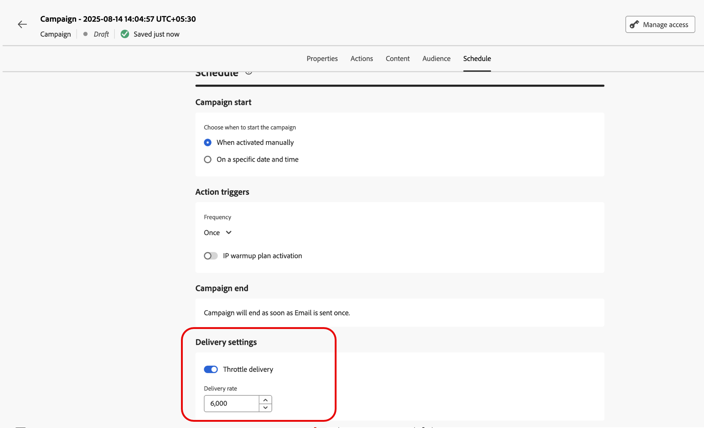

# Programación de la campaña de acción {#action-campaign-schedule}

Use la ficha **[!UICONTROL Programación]** para definir la programación de la campaña.

## Establecer una fecha de inicio de campaña

De forma predeterminada, las campañas de acción se inician una vez que se activan manualmente y finalizan en cuanto se envía el mensaje una vez.

Si no desea ejecutar la campaña justo después de su activación, puede especificar una fecha y una hora a las que se debe enviar el mensaje en la sección **[!UICONTROL Inicio de campaña]**.

>[!NOTE]
>
>Al programar campañas en [!DNL Adobe Journey Optimizer], asegúrese de que la fecha y la hora de inicio se ajusten al primer envío deseado. En el caso de las campañas recurrentes, si ya ha pasado la hora programada inicial, las campañas se transferirán a la siguiente franja horaria disponible según sus reglas de periodicidad.

## Establecer una frecuencia de ejecución

Para las acciones **Correo electrónico**, **SMS** y **Notificación push**, puede definir una frecuencia a la que se debe enviar el mensaje de la campaña. Para ello, usa las opciones **[!UICONTROL déclencheur de acción]** en la pantalla de creación de campañas para especificar si la campaña se debe ejecutar diaria, semanal o mensualmente.

>[!NOTE]
>
>Para las acciones **email**, puede crear campañas específicas de activación del plan de calentamiento de IP. La programación de campaña se basa en el plan de calentamiento de IP con el que está asociado, lo que significa que la programación ya no está definida en la propia campaña. [Aprenda a crear campañas de calentamiento de IP](../configuration/ip-warmup-campaign.md).

## Establecer una fecha de finalización

La sección **[!UICONTROL Fin de campaña]** le permite especificar cuándo debe dejar de ejecutarse una campaña. Fuera de las fechas especificadas, la campaña no se ejecuta.

## Establecer control de velocidad

[!DNL Journey Optimizer] le permite habilitar el control de velocidad para acciones salientes (correo electrónico, SMS, notificaciones push).

Esta función es especialmente útil para evitar sobrecargas en sistemas descendentes, como páginas de aterrizaje o plataformas de servicio de atención al cliente. Por ejemplo, puede establecer un límite de velocidad de 165 mensajes por segundo para garantizar un envío constante sin saturar a los sistemas descendentes.

Para establecer el control de tarifa, habilite la opción **[!UICONTROL Entrega acelerada]** en la sección **[!UICONTROL Configuración de entrega]** y especifique la **[!UICONTROL tarifa de entrega]** por segundo que desee.

* Tasa mínima de entrega admitida: 1 por segundo.
* Tasa máxima de entrega admitida: 2000 por segundo cuando la opción &quot;Entrega acelerador&quot; está habilitada.

>[!IMPORTANT]
>
>Al establecer una tasa de entrega, el periodo de tiempo máximo para el que se puede ejecutar la audiencia de la campaña es de 12 horas. Si la tasa de entrega se establece en un valor que no permite que toda la audiencia envíe el mensaje en el periodo de tiempo de 12 horas, los perfiles restantes se excluirían de la campaña. Puede ver el recuento de estos perfiles excluidos en el informe de campaña.

## Próximos pasos {#next}

Una vez que la programación de la campaña esté lista, puede revisarla y activarla. [Más información](review-activate-campaign.md)
