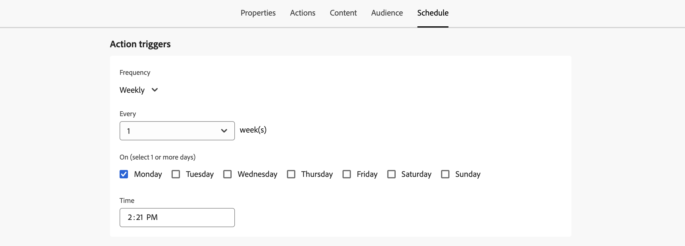

# Programación de la campaña de acción {#action-campaign-schedule}

Use la ficha **[!UICONTROL Programación]** para definir la programación de la campaña.

## Establecer una fecha de inicio de campaña

De forma predeterminada, las campañas de acción se inician una vez que se activan manualmente y finalizan en cuanto se envía el mensaje una vez. Si no desea ejecutar la campaña justo después de su activación, puede especificar una fecha y una hora a las que se debe enviar el mensaje en la sección **[!UICONTROL Inicio de campaña]**.

Al programar campañas en [!DNL Adobe Journey Optimizer], asegúrese de que la fecha y la hora de inicio se ajusten al primer envío deseado. En el caso de las campañas recurrentes, si ya ha pasado la hora programada inicial, las campañas se transferirán a la siguiente franja horaria disponible según sus reglas de periodicidad.

## Enviar a la hora local del destinatario {#profile-timezone}

>[!CONTEXTUALHELP]
>id="ajo_campaigns_schedule_profile_timezone"
>title="Usar zona horaria del perfil"
>abstract="Envíe mensajes en función de la zona horaria de perfil de cada destinatario. Todos los destinatarios reciben el mensaje a la misma hora local, independientemente de su ubicación geográfica. El sistema utiliza el campo &quot;timeZone&quot; de los perfiles de Adobe Experience Platform, con la zona horaria del creador de la campaña como reserva."

Al programar una campaña para una fecha y hora específicas, puede elegir enviar mensajes en función de la zona horaria del perfil de cada destinatario. Esto garantiza que todos los destinatarios reciban el mensaje a la misma hora local, independientemente de su ubicación geográfica.

Por ejemplo, si programa una campaña para que se envíe a las 9 a. m. utilizando la zona horaria del perfil, los destinatarios de Nueva York (ET) la recibirán a las 9 a. m. ET, mientras que los destinatarios de Los Ángeles (PT) la recibirán a las 9 a. m. PT.

>[!AVAILABILITY]
>
>La programación mediante zonas horarias de perfil solo está disponible para estos canales salientes: correo electrónico, push, SMS, WhatsApp y LINE.

Para habilitar la programación de zona horaria de perfil:

1. En la sección **[!UICONTROL Inicio de campaña]**, especifique la fecha y la hora en que se debe enviar el mensaje.

1. Habilite la opción **[!UICONTROL Usar zona horaria del perfil]**.

   

**Cómo funciona:**

El sistema utiliza el campo `profile.timeZone` del perfil Adobe Experience Platform de cada destinatario para determinar su zona horaria local. Si un perfil no tiene un valor de zona horaria, el sistema utiliza la zona horaria en la que se creó la campaña como alternativa.

La campaña permanece en estado **Activo** mientras los mensajes se envían a todas las zonas horarias. Una vez procesadas todas las zonas horarias, el estado de la campaña cambia a **Completada**.

**Identificadores de zona horaria admitidos:**

El formato `profile.timeZone` puede ser una denominación IANA o definirse como desplazamientos UTC. La denominación IANA es el formato preferido, ya que se ajusta automáticamente para las reglas de horario de verano.

Para la nomenclatura IANA, los identificadores distinguen entre mayúsculas y minúsculas y deben coincidir con la nomenclatura IANA oficial. Los desplazamientos pueden cambiar con el tiempo debido a las reglas del horario de verano y a las actualizaciones históricas. Consulte la [Base de datos de husos horarios de IANA](https://www.iana.org/time-zones){_blank} para obtener la lista oficial de identificadores.

## Establecer una frecuencia de ejecución

Para las acciones **Correo electrónico**, **SMS** y **Notificación push**, puede definir una frecuencia a la que se debe enviar el mensaje de la campaña. Para ello, usa las opciones **[!UICONTROL déclencheur de acción]** en la pantalla de creación de campañas para especificar si la campaña se debe ejecutar diaria, semanal o mensualmente.

>[!NOTE]
>
>Para las acciones **email**, puede crear campañas específicas de activación del plan de calentamiento de IP. La programación de campaña se basa en el plan de calentamiento de IP con el que está asociado, lo que significa que la programación ya no está definida en la propia campaña. [Aprenda a crear campañas de calentamiento de IP](../configuration/ip-warmup-campaign.md).

## Establecer una fecha de finalización

La sección **[!UICONTROL Fin de campaña]** le permite especificar cuándo debe dejar de ejecutarse una campaña. Fuera de las fechas especificadas, la campaña no se ejecuta.

## Establecer control de velocidad

[!DNL Journey Optimizer] le permite habilitar el control de velocidad para acciones salientes (correo electrónico, SMS, notificaciones push).

Esta función es especialmente útil para evitar sobrecargas en sistemas descendentes, como páginas de aterrizaje o plataformas de servicio de atención al cliente. Por ejemplo, puede establecer un límite de velocidad de 165 mensajes por segundo para garantizar un envío constante sin saturar a los sistemas descendentes.

Para establecer el control de tarifa, habilite la opción **[!UICONTROL Entrega acelerada]** en la sección **[!UICONTROL Configuración de entrega]** y especifique la **[!UICONTROL tarifa de entrega]** por segundo que desee.

* Tasa mínima de entrega admitida: 1 por segundo.
* Tasa máxima de entrega admitida: 2000 por segundo cuando la opción &quot;Entrega acelerador&quot; está habilitada.

>[!IMPORTANT]
>
>Al establecer una tasa de entrega, el periodo de tiempo máximo para el que se puede ejecutar la audiencia de la campaña es de 12 horas. Si la tasa de entrega se establece en un valor que no permite que toda la audiencia envíe el mensaje en el periodo de tiempo de 12 horas, los perfiles restantes se excluirían de la campaña. Puede ver el recuento de estos perfiles excluidos en el informe de campaña.

## Envío mediante olas

Para enviar el mensaje de campaña por lotes a lo largo del tiempo en lugar de todos a la vez, puede utilizar el envío de ondas. Esto ayuda a equilibrar la carga, admite la entrega y evita sistemas descendentes abrumadores (por ejemplo, centros de llamadas o páginas de aterrizaje). Se define el número de olas, su tamaño (por porcentaje o número absoluto) y la programación para cada ola.

[Aprenda a enviar mediante olas](send-using-waves.md).

## Próximos pasos {#next}

Una vez que la programación de la campaña esté lista, puede revisarla y activarla. [Más información](review-activate-campaign.md)
