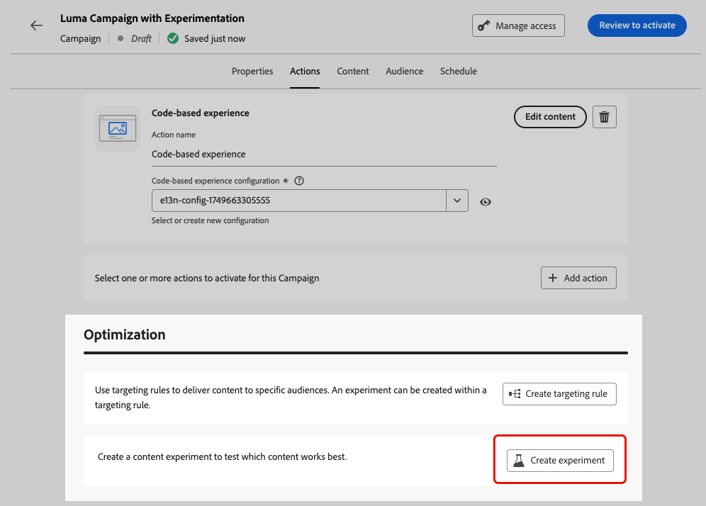

# Optimización en campañas y recorridos {#message-optimization}

La optimización le ofrece las herramientas necesarias para ofrecer contenido personalizado y optimizado a su audiencia, <!--based on marketer-defined advanced decision configurations. This ensures that the right message reaches the right audience at the right time in order to maximize the effectiveness of your campaigns. (Removed for now as Decisioning is not yet supported)-->lo que garantiza la máxima participación y éxito a la hora de crear recorridos y campañas con un alto nivel de eficacia.<!--customized and -->

Con Optimization, puede:

* Aprovechar [reglas de segmentación](#targeting)
* Ejecutar [experimentos de contenido](#experimentation)
* Use [combinaciones avanzadas](#combination) de experimentación y direccionamiento dentro de una sola campaña

Una vez que el recorrido o la campaña están activos, los perfiles se evalúan según los criterios definidos y, según los criterios coincidentes, se envían con la experiencia o el contenido adecuados del recorrido o la campaña.

La diferencia entre los experimentos y la segmentación se puede resaltar de la siguiente manera:

* La experimentación consiste en una división aleatoria en la entrega de contenido en función de la asignación de tráfico&#x200B;.
* La segmentación utiliza técnicas deterministas para entregar contenido en función del perfil del usuario, la pertenencia a audiencias o las reglas basadas en el contexto.

{width="110%" zoomable="yes"}

➡️ [Obtenga más información acerca de la optimización de una campaña en este vídeo](#video)

## Aproveche la segmentación {#targeting}

>[!CONTEXTUALHELP]
>id="ajo_content_targeting_fallback"
>title="¿Qué es el contenido de reserva?"
>abstract="El contenido de reserva permite que su audiencia reciba un contenido predeterminado cuando no se cumple ninguna regla de segmentación. Si no selecciona esta opción, las audiencias que no cumplan los requisitos para una regla de segmentación definida arriba no recibirán contenido."

La segmentación ofrece contenido personalizado a segmentos de audiencia específicos en función de atributos de perfil de usuario o atributos contextuales.

A diferencia de la experimentación, que es una asignación aleatoria del contenido de un mensaje, la segmentación es determinista en términos de enviar el contenido a la audiencia correcta.

Con la segmentación, se pueden definir reglas específicas basadas en lo siguiente:

* **Atributos de perfil de usuario** como la ubicación (p. ej. targeting geográfico), edad o preferencias. Por ejemplo, los usuarios de EE. UU. ven una promoción &quot;Golden Gate&quot;, mientras que los de Francia ven una promoción &quot;Torre Eiffel&quot;.

* **Datos contextuales** como el tipo de dispositivo (p. ej. device-targeting), hora del día o detalles de la sesión. Por ejemplo, los usuarios de escritorio reciben contenido optimizado para escritorio, mientras que los usuarios móviles reciben contenido optimizado para móvil.

* **Audiencias** que se pueden usar para incluir o excluir perfiles que tengan un abono a audiencia en particular.

Para configurar la segmentación, siga los pasos a continuación.

1. Crear un [recorrido](../building-journeys/journey-gs.md#jo-build) o una [campaña](../campaigns/create-campaign.md).

   >[!NOTE]
   >
   >Si está en un recorrido, agregue una actividad **[!UICONTROL Action]**, elija una actividad de canal y seleccione **[!UICONTROL Configure action]**. [Más información](../building-journeys/journey-action.md#add-action)

1. En la ficha **[!UICONTROL Acciones]**, seleccione al menos una acción.

1. En la sección **[!UICONTROL Optimización]**, seleccione **[!UICONTROL Crear regla de segmentación]**.

   {width=85%}

1. Utilice el generador de reglas para definir los criterios. Por ejemplo, defina una regla para residentes de EE. UU., una regla para residentes de Francia y una regla para residentes de India.

   {width=85%}

1. Seleccione la opción **[!UICONTROL Habilitar contenido de reserva]** según sea necesario. El contenido de reserva permite que su audiencia reciba un contenido predeterminado cuando no se cumplen las reglas de segmentación.

   >[!NOTE]
   >
   >Si no selecciona esta opción, las audiencias que no cumplan los requisitos para una regla de segmentación definida arriba no recibirán contenido.

1. Guarde la configuración de reglas de segmentación.

1. En la ficha **[!UICONTROL Acciones]**, seleccione **[!UICONTROL Editar contenido]**.

1. Diseñe el contenido adecuado para cada grupo definido por la configuración de reglas de segmentación.

   {width=85%}

   En este ejemplo, diseñe un contenido específico para residentes de EE. UU., un contenido diferente para residentes franceses y otro contenido para residentes de la India.

1. [Activar](review-activate-campaign.md) tu recorrido o campaña.

Una vez que el recorrido/campaña está activo, se envía contenido personalizado para cada objetivo para que los residentes de EE. UU. reciban un mensaje específico, los residentes de Francia un mensaje diferente, etc.

<!--Default content:

* If no targeting rules match, default content can be delivered.

* If default content is not enabled, passthrough behavior ensures lower-priority campaigns are evaluated.-->

## Usar experimentación {#experimentation}

La experimentación le permite probar varias versiones de contenido para determinar cuál tiene el mejor rendimiento en función de las métricas de éxito predefinidas.

Para configurar la experimentación, siga los pasos a continuación.

Supongamos que desea probar los siguientes mensajes promocionales en una campaña:

* **Tratamiento A**: &quot;20% de descuento en tu próxima compra&quot;
* **Tratamiento B**: &quot;Envío gratuito en pedidos superiores a $50&quot;
* **Tratamiento C**: &quot;Recibe tu tarjeta de regalo de $10&quot;

Para configurar la experimentación y determinar qué mensaje genera la mayor cantidad de compras, siga los pasos a continuación.

1. Crear un [recorrido](../building-journeys/journey-gs.md#jo-build) o una [campaña](../campaigns/create-campaign.md).

   >[!NOTE]
   >
   >Si está en un recorrido, agregue una actividad **[!UICONTROL Action]**, elija una actividad de canal y seleccione **[!UICONTROL Configure action]**. [Más información](../building-journeys/journey-action.md#add-action)

1. En la ficha **[!UICONTROL Acciones]**, seleccione dos acciones entrantes, por ejemplo [experiencia basada en código](../code-based/get-started-code-based.md) y [En la aplicación](../../rp_landing_pages/in-app-landing-page.md).

1. En la sección **[!UICONTROL Optimización]**, seleccione **[!UICONTROL Crear experimento]**.

   {width=85%}

1. Diseñe y configure el experimento de contenido como desee. [Descubra cómo](../content-management/content-experiment.md)

   {width=85%}

   Una vez definido el experimento, se aplica a todas las acciones insertadas en esa campaña o a través de la actividad de recorrido **[!UICONTROL Action]**, lo que significa que los mismos clientes ven las mismas ofertas en todas las superficies.

   >[!NOTE]
   >
   >Puede seleccionar otras acciones: la experimentación se aplica a todas las acciones agregadas a la campaña o a la acción de recorrido.

1. [Activar](review-activate-campaign.md) tu recorrido o campaña.

Una vez que el recorrido/campaña está activo, los usuarios tienen asignadas aleatoriamente las diferentes variaciones de contenido. [!DNL Journey Optimizer] hace un seguimiento de qué variación genera más compras y proporciona perspectivas procesables.

Sigue el éxito de tu campaña con los informes [recorrido](../reports/journey-global-report-cja.md) y [campaña](../reports/campaign-global-report-cja-experimentation.md). <!--Link to Experimentation journey reportis missing-->

## Combinación de direccionamiento y experimentación {#combination}

Journey Optimizer también permite combinar objetivos y experimentos dentro de un solo recorrido o campaña para crear estrategias más sofisticadas.

De hecho, puede utilizar la segmentación para crear varias variantes y, para cada variante, utilizar la experimentación para optimizar aún más cada contenido. Esto garantiza que los experimentos sean específicos para cada regla de segmentación y no se extiendan entre variantes.

Por ejemplo, puede probar una &quot;promoción con un descuento del 50 %&quot; en comparación con una &quot;tarjeta de regalo de 50 dólares&quot; para clientes de Estados Unidos y realizar una prueba diferente para clientes de Europa, como &quot;envío gratuito en pedidos de más de 50 euros&quot; en comparación con &quot;20 % de descuento en su próxima compra&quot;.

Para combinar objetivos y experimentos en un recorrido o campaña, siga los pasos a continuación.

1. Cree un recorrido o una campaña donde defina varias reglas de segmentación. [Descubra cómo](#targeting)

   {width=85%}

1. Cree un experimento para la primera regla de segmentación.

1. Diseñe y configure el experimento de contenido como desee. [Descubra cómo](../content-management/content-experiment.md)

   {width=85%}

   Una vez definida la experimentación, solo se aplica a la primera regla de segmentación.

1. En la ficha **[!UICONTROL Acciones]**, seleccione **[!UICONTROL Editar contenido]**.

1. Para el grupo definido por la primera regla de segmentación, puede definir un contenido específico para cada variante del experimento.

   Si agregó más de una acción entrante al recorrido o a la campaña, se aplica la misma combinación de direccionamiento y experimento a cada acción. Sin embargo, debe definir un contenido específico para cada variante de cada acción.

   {width=85%}

1. Continúe de forma similar para las demás reglas de segmentación y diseñe el contenido correspondiente para cada variante.

1. Guarde los cambios y [active](review-activate-campaign.md) su recorrido o campaña.

Una vez que el recorrido/campaña está activo, a los usuarios de cada grupo objetivo se les asignan aleatoriamente las diferentes variaciones de contenido definidas para el grupo al que pertenecen.

<!--
## Reporting on Message optimization

E.g. explaining how a marketer can look at the report to determine which treatment (e.g. which message content) is performing the best for the targeting audience
-->

## Vídeo práctico{#video}

Aprenda a aprovechar la optimización de mensajes en campañas activadas por acciones o API. Descubra cómo dirigirse a subpúblicos, crear variaciones de mensajes por ubicación, habilitar contenido de reserva y ejecutar varios experimentos dentro de una sola campaña. Este tutorial también explica cómo administrar campañas multicanal y, al mismo tiempo, mantener la coherencia del mensaje.

>[!VIDEO](https://video.tv.adobe.com/v/3470368?quality=12)