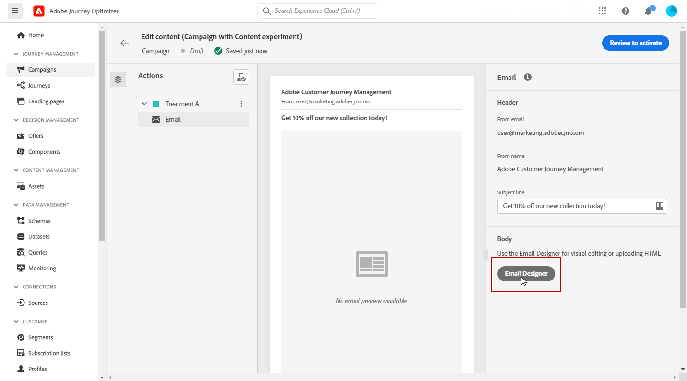

# Creación de un experimento de contenido {#content-experiment}

>[!AVAILABILITY]
>
>Actualmente, la función de experimento de contenido solo está disponible para un conjunto de organizaciones (disponibilidad limitada). Para obtener más información, contacte con su representante de Adobe.

La función de experimento de contenido le permite definir varios tratamientos de envío. La audiencia de interés se asigna aleatoriamente a cada tratamiento para determinar cuál tiene mejor rendimiento con respecto a la métrica de interés. Puede elegir entre variar el contenido, el asunto o el remitente del correo electrónico.

En el siguiente ejemplo, el objetivo de la entrega se ha dividido en dos grupos, cada uno de los cuales representa el 45 % de la población de destino, y un grupo de exclusión del 10 %, que no recibe la entrega.

Cada persona de la audiencia de destino recibirá una versión del correo electrónico, con una línea de asunto que es una de las dos siguientes:

* una que promociona directamente una oferta del 10 % sobre la nueva colección y una imagen.
* el otro solo anuncia una oferta especial sin especificar el 10 % de descuento sin ninguna imagen.

El objetivo aquí es ver si los destinatarios interactuarán con el correo electrónico según el experimento recibido. Por lo tanto, elegiremos **[!UICONTROL Email Opens]** como métrica objetivo principal en este experimento de contenido.

## Creación de la campaña {#campaign-experiment}

1. En el **[!UICONTROL Campaigns]** página, haga clic en **[!UICONTROL Create Campaign]**.

   

1. Select **[!UICONTROL Email]** a continuación, la variable **[!UICONTROL Surface]** desea utilizar para este envío. Para obtener más información, consulte [Superficies de canal](../configuration/channel-surfaces.md) página.

   

1. Haga clic en **[!UICONTROL Create]**.

1. Configure el **[!UICONTROL Properties]** del envío:
   * **[!UICONTROL Title]**
   * **[!UICONTROL Description]**
   * **[!UICONTROL Category]**: **[!UICONTROL Marketing]** / **[!UICONTROL Transactional]**

1. Para iniciar el experimento de contenido, active la opción **[!UICONTROL Content experiment]** . La variable **[!UICONTROL Content experiment]** aparecerá.

   

1. Configure el **[!UICONTROL Audience]** y **[!UICONTROL Schedule]** parámetros para las entregas. [Más información](create-campaign.md)

1. Haga clic en **[!UICONTROL Edit content]** para comenzar a personalizar los diferentes **[!UICONTROL Treatments]**.

   

## Cree sus tratamientos {#treatment-experiment}

1. En el **[!UICONTROL Edit content]** , añada la variable **[!UICONTROL Subject line]** para su tratamiento Correo electrónico y haga clic en **[!UICONTROL Save]**.

   Para este tratamiento, especificamos la oferta directamente en la línea de asunto.

   

1. Haga clic en **[!UICONTROL Email designer]** para comenzar a personalizar los envíos.

   

1. Después de diseñar el correo electrónico, haga clic en **[!UICONTROL Save]** y vuelva a la **[!UICONTROL Edit content]** para crear el Tratamiento B.

1. En el **[!UICONTROL More actions]** botón, haga clic en **[!UICONTROL Duplicate]**.

   También puede elegir iniciar un nuevo tratamiento desde cero haciendo clic en el botón **[!UICONTROL Content experiment]** para acceder a las opciones avanzadas y, a continuación, **[!UICONTROL Add treatment]**.

   

1. Cambie el **[!UICONTROL Title]** de su tratamiento para diferenciarlos mejor.

   

1. Seleccione la entrega de correo electrónico vinculada al recién creado **[!UICONTROL Treatment]**.

1. Agregue la variable **[!UICONTROL Subject line]** para su envío.

   Para este tratamiento, elegimos no especificar la oferta en la variable **[!UICONTROL Subject line]**.

   

1. Haga clic en **[!UICONTROL Email designer]** para personalizar aún más la entrega de Tratamiento B si es necesario.

Una vez personalizados los tratamientos, puede empezar a configurar el experimento de contenido.

## Configurar el experimento de contenido {#configure-experiment}

1. Cuando ambos envíos están personalizados, desde la **[!UICONTROL Edit content]** ventana, seleccione **[!UICONTROL Configure content experiment]**.

   

1. Seleccione los objetivos que desee configurar para el experimento.

   Para nuestro experimento, seleccionamos **[!UICONTROL Email open]** para comprobar si los destinatarios abrirán sus correos electrónicos si el código de promoción está en la línea de asunto.

   

1. Elija agregar una **[!UICONTROL Holdout]** a su envío. Este grupo no recibirá ningún contenido de esta campaña.

   Si activa la barra de alternancia, se tomará automáticamente el 10 % de la población; puede ajustar este porcentaje si es necesario.

   

1. A continuación, puede elegir asignar un porcentaje preciso a cada **[!UICONTROL Treatment]** o simplemente encienda el **[!UICONTROL Distribute evenly]** barra de herramientas.

   

1. Haga clic en **[!UICONTROL Save]** cuando la configuración esté configurada.

1. Cuando el experimento de contenido esté listo, puede hacer clic en **[!UICONTROL Review to activate]** para mostrar un resumen de la campaña. Las alertas se muestran si algún parámetro es incorrecto o falta.

   

1. Compruebe que la campaña esté correctamente configurada y haga clic en **[!UICONTROL Activate]** para iniciarlo.

   

Después de configurar la experimentación y la campaña, puede seguir el éxito de la entrega con el informe de campaña.

## Informe Objetivos {#objectives-global}

>[!AVAILABILITY]
>
>Actualmente, la función de experimento de contenido solo está disponible para un conjunto de organizaciones (disponibilidad limitada). Para obtener más información, contacte con su representante de Adobe.

La variable **[!UICONTROL Objectives]** del informe de Campaign le permite ajustar mejor los informes de las entregas mediante la segmentación de una métrica específica.

La variable **[!UICONTROL Objectives]** están vinculados a **[!UICONTROL Datasets]** que definen una conexión con un sistema para recuperar información adicional. Una lista de elementos integrados **[!UICONTROL Objectives]** está disponible, pero puede agregar el suyo propio añadiendo **[!UICONTROL Dataset]**. Para ver el procedimiento detallado, consulte esta [sección](reporting-configuration.md).

Después de seleccionar los objetivos sobre los que desea establecer el objetivo, los dos **[!UICONTROL Performance overview]** y **[!UICONTROL Campaign objective]** Las utilidades proporcionan un resumen detallado del rendimiento de su envío.

Con la variable **[!UICONTROL Campaign objective]** , también puede elegir comparar su objetivo principal con otra métrica.

Tenga en cuenta que cada utilidad se puede cambiar de tamaño y eliminar si es necesario. Para obtener más información, consulte [sección](../reports/global-report.md#modify-dashboard).

## Informe de experimentación {#experimentation-global}

>[!AVAILABILITY]
>
>Actualmente, la función de experimento de contenido solo está disponible para un conjunto de organizaciones (disponibilidad limitada). Para obtener más información, contacte con su representante de Adobe.

Desde la campaña **[!UICONTROL Global report]**, el **[!UICONTROL Experimentation]** La pestaña detalla la información principal en relación con el rendimiento de cada variante y si hay un mejor rendimiento.

Tenga en cuenta que la definición del mejor ejecutante puede tardar algún tiempo, y que se representará con este icono .

La variable **[!UICONTROL Experiment result]** widget detalla el rendimiento de cada variante. Puede cambiar su línea base seleccionando uno de los tratamientos de la **[!UICONTROL Baseline]** la lista desplegable . El mejor tratamiento se representará con un icono de estrella.

La tabla presenta las siguientes métricas:

* **[!UICONTROL Profiles]**: Número de perfiles objetivo para este tratamiento.

* **[!UICONTROL Unique outbound clicks]**: Recuento total de clics en los canales salientes.

* **[!UICONTROL Count per profile]**: Valor total de la métrica de objetivo Experimento dividido por el número de perfiles.

* **[!UICONTROL Confidence interval]**: Diferencia porcentual en el rendimiento entre el valor basal y el tratamiento de mejor rendimiento. [Más información](../campaigns/experiment-calculations.md#confidence-intervals).

* **[!UICONTROL Average lift]**: Mejora porcentual en la tasa de conversión de un tratamiento determinado respecto al valor basal. [Más información](../campaigns/experiment-calculations.md#understand-lift)

* **[!UICONTROL Confidence]**: Evidencia de que un tratamiento determinado es el mismo que el tratamiento basal. [Más información](../campaigns/experiment-calculations.md#understand-confidence)

Para profundizar en estos resultados y cómo interpretarlos, consulte [esta página](../campaigns/get-started-experiment.md#interpret-results).
