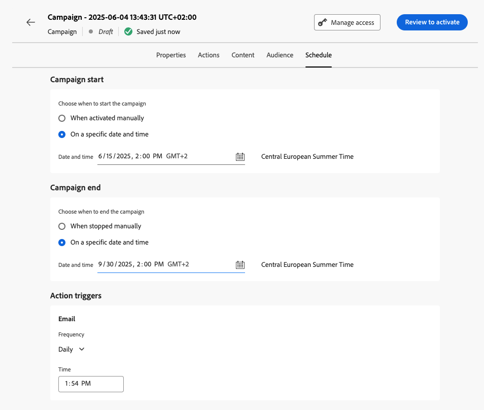

# Creación de una campaña {#create-campaign}

Para crear una nueva campaña, vaya al menú **[!UICONTROL Campañas]** en el carril izquierdo y luego haga clic en **[!UICONTROL Crear campaña]**. También puede duplicar una campaña en directo existente para crear una nueva. [Más información](modify-stop-campaign.md#duplicate).

Antes de empezar, lea los requisitos previos de la campaña en [esta página](get-started-with-campaigns.md#before-starting-campaign-prerequisites).

## Selección del tipo de campaña {#campaigntype}

>[!CONTEXTUALHELP]
>id="ajo_campaigns_campaign_type"
>title="Tipo de campaña"
>abstract="**Campañas programadas** se ejecutan inmediatamente o en una fecha especificada y están pensadas para enviar mensajes de tipo marketing. Las campañas **activadas por API** se ejecutan mediante el uso de una llamada de API. Están destinados a enviar mensajes de marketing (mensajes promocionales que requieren el consentimiento del usuario) o mensajes transaccionales (mensajes no comerciales, que también se pueden enviar a perfiles no suscritos en contextos específicos)."

Al crear una nueva campaña, primero debe seleccionar el tipo de campaña. Hay tres tipos de campañas disponibles:

1. **[!UICONTROL Programado - Marketing]**: estas campañas se ejecutan inmediatamente o en una fecha especificada. Las campañas programadas están destinadas a enviar **marketing** mensajes o crear acciones entrantes. Se configuran y ejecutan desde la interfaz de usuario de.

1. **[!UICONTROL Marketing activado por API]**: estas campañas se ejecutan mediante una llamada de API. Seleccione este tipo de campaña para enviar comunicaciones de marketing personalizadas a audiencias de destino.  [Aprenda a almacenar en déclencheur una campaña mediante API](api-triggered-campaigns.md)

1. **[!UICONTROL Activado por API - Transaccional]** - Igual que para las campañas de marketing activadas por API, estas campañas se ejecutan mediante una llamada de API. Las campañas transaccionales activadas por API están destinadas a enviar **mensajes transaccionales**, es decir, mensajes enviados después de una acción realizada por un individuo: solicitud de restablecimiento de contraseña, compra en el carro de compras, etc.  [Aprenda a almacenar en déclencheur una campaña mediante API](api-triggered-campaigns.md)

   

## Definición de las propiedades de la campaña {#create}

Una vez creada la campaña, debe definir sus propiedades. Siga estos pasos:

1. En la sección **[!UICONTROL Propiedades]**, escriba el nombre y una descripción para la campaña.

   <!--To test the content of your message, toggle the **[!UICONTROL Content experiment]** option on. This allows you to test multiple variables of a delivery on populations samples, in order to define which treatment has the biggest impact on the targeted population.[Learn more about content experiment](../content-management/content-experiment.md).-->

1. (Opcional) Utilice el campo **Etiquetas** para asignar etiquetas unificadas de Adobe Experience Platform a su campaña. Esto le permite clasificarlos fácilmente y mejorar la búsqueda desde la lista de campañas. [Aprenda a trabajar con etiquetas](../start/search-filter-categorize.md#tags).

1. (opcional) Puede limitar el acceso a esta campaña en función de las etiquetas de acceso. Para añadir una limitación de acceso, vaya al botón **[!UICONTROL Administrar acceso]** en la parte superior de esta página. Asegúrese de seleccionar solo las etiquetas para las que tenga permiso. [Más información acerca del Control de acceso de nivel de objeto](../administration/object-based-access.md).

## Definición de la audiencia de campaña {#audience}

Ahora puede seleccionar la audiencia de su campaña. Una audiencia es un conjunto de personas que comparten comportamientos o características similares.

>[!IMPORTANT]
>
>* El uso de audiencias y atributos de [composición de audiencias](../audience/get-started-audience-orchestration.md) no está disponible actualmente para su uso con Healthcare Shield o Privacy and Security Shield.
>
>* Para las campañas activadas por API, la audiencia debe configurarse mediante una llamada de API.

Para definir la población objetivo de una campaña de marketing programada, siga estos pasos:

1. En la sección **Audiencia**, haga clic en el botón **[!UICONTROL Seleccionar audiencia]** para mostrar la lista de audiencias de Adobe Experience Platform disponibles. Obtenga más información acerca de las audiencias en [esta sección](../audience/about-audiences.md).

1. En el campo **[!UICONTROL Tipo de identidad]**, elija el tipo de clave que desea usar para identificar a los individuos de la audiencia seleccionada. Puede utilizar un tipo de identidad existente o crear uno nuevo mediante el servicio de identidad de Adobe Experience Platform. Las áreas de nombres de identidad estándar se enumeran en [esta página](https://experienceleague.adobe.com/es/docs/experience-platform/identity/features/namespaces#standard){target="_blank"}.

   Solo se permite un tipo de identidad por campaña. La campaña no puede dirigirse a las personas que pertenezcan a un segmento que no tenga el tipo de identidad seleccionado entre sus diferentes identidades.

   

   Obtenga más información acerca de tipos de identidad y áreas de nombres en la [documentación de Adobe Experience Platform](https://experienceleague.adobe.com/docs/experience-platform/identity/home.html?lang=es){target="_blank"}.

   <!--If you are are creating an API-triggered campaign, the **[!UICONTROL cURL request]** section allows you to retrieve the **[!UICONTROL Campaign ID]** to use in the API call. [Learn more](api-triggered-campaigns.md)-->

## Seleccione el canal {#channel}

Ahora puede seleccionar el canal y su configuración. Siga estos pasos:

1. En la sección **[!UICONTROL Acción]**, seleccione el canal de comunicación.

   La lista de canales disponibles depende del modelo de licencias y de los complementos. Para las campañas activadas por API, solo están disponibles los canales de correo electrónico, SMS y notificaciones push.

1. Seleccione la configuración de canal.

   Un [administrador del sistema](../start/path/administrator.md) define una configuración. Contiene todos los parámetros técnicos para enviar el mensaje, como parámetros de encabezado, subdominio, aplicaciones móviles, etc. [Más información](../configuration/channel-surfaces.md).

   En la lista desplegable solo se muestran las configuraciones de canal compatibles con el tipo de campaña de marketing.

   

   >[!NOTE]
   >
   >Si está creando una campaña de notificaciones push, puede habilitar el **[!UICONTROL modo de envío rápido]**, que es un complemento de Journey Optimizer que permite enviar mensajes push muy rápidamente en grandes volúmenes. [Más información](../push/create-push.md#rapid-delivery)

## Edición del contenido {#content}

Ahora puede definir el contenido del mensaje, desde el botón **[!UICONTROL Editar contenido]**. El proceso de creación de contenido depende del canal seleccionado.

Conozca los pasos detallados para crear el contenido del mensaje en las siguientes páginas:

<table style="table-layout:fixed"><tr style="border: 0;">
<td>

<a href="../email/create-email.md"><strong>Correo electrónico</strong></a>
</td>
<td>

<a href="../sms/create-sms.md"><strong>SMS</strong></a>
</td>
<td>

<a href="../push/create-push.md"><strong>Notificación push</strong></a>
</td>
<td>

<a href="../direct-mail/create-direct-mail.md"><strong>Correo directo</strong></a>
</td>
</tr></table>

<table style="table-layout:fixed"><tr style="border: 0;">
<td>

<a href="../in-app/create-in-app.md"><strong>En la aplicación</strong></a>
</td>
<td>

<a href="../web/create-web.md"><strong>Web</strong></a>
</td>
<td>

<a href="../code-based/create-code-based.md"><strong>Experiencia basada en código</strong></a>
</td>
<td>

<a href="../content-card/create-content-card.md"><strong>Tarjetas de contenido</strong></a>
</td>
</tr></table>

Una vez definido el contenido, utilice el botón **[!UICONTROL Simular contenido]** para previsualizar y probar el contenido con perfiles de prueba o datos de entrada de muestra cargados desde un archivo CSV/JSON, o añadidos manualmente. [Más información](../content-management/preview-test.md). Para volver a la pantalla de creación de campañas, haga clic en la flecha izquierda.

Además del contenido del mensaje, puede configurar las siguientes opciones:

1. (opcional) En la sección **[!UICONTROL Experimento de contenido]**, puede usar el botón **[!UICONTROL Crear experimento]** para probar qué contenido funciona mejor. Las capacidades de experimentación de contenido se detallan en [esta sección](../content-management/content-experiment.md).

1. En la sección **[!UICONTROL Seguimiento de acciones]**, especifique si desea rastrear cómo reaccionan los destinatarios a su envío: puede rastrear clics o aperturas.

   Se puede acceder a los resultados de seguimiento desde el informe de campaña una vez que se ha ejecutado la campaña. [Más información sobre los informes de campaña](../reports/campaign-global-report-cja.md)

## Programación de la campaña {#schedule}

>[!CONTEXTUALHELP]
>id="ajo_campaigns_schedule"
>title="Programación de campañas"
>abstract="De forma predeterminada, las campañas se inician tras la activación manual y finalizan inmediatamente después de enviar el mensaje una vez. Sin embargo, tiene la flexibilidad de establecer una fecha y hora específicas para que se envíe el mensaje. Además, puede especificar una fecha de finalización para campañas recurrentes o activadas por API. En los Activadores de acción, también puede configurar la frecuencia de envío de mensajes para adaptarla a sus preferencias."

>[!CONTEXTUALHELP]
>id="ajo_campaigns_schedule_start"
>title="Inicio de campaña"
>abstract="Especifique la fecha y la hora a las que se debe enviar el mensaje."

>[!CONTEXTUALHELP]
>id="ajo_campaigns_schedule_end"
>title="Fin de campaña"
>abstract="Especifique cuándo se debe detener la ejecución de una campaña recurrente."

>[!CONTEXTUALHELP]
>id="ajo_campaigns_schedule_triggers"
>title="Activadores de acciones de campaña"
>abstract="Defina una frecuencia a la que se debe enviar el mensaje de la campaña."

De forma predeterminada, las campañas programadas se inician una vez que se activan manualmente y finalizan en cuanto se envía el mensaje una vez.

Si no desea ejecutar la campaña justo después de su activación, puede especificar una fecha y una hora a las que se debe enviar el mensaje mediante la opción **[!UICONTROL Inicio de campaña]**. La opción **[!UICONTROL Fin de campaña]** le permite especificar cuándo debe dejar de ejecutarse una campaña.

Para las campañas de correo electrónico, SMS y notificaciones push, puede definir una frecuencia a la que se debe enviar el mensaje de la campaña. Para ello, usa las opciones **[!UICONTROL déclencheur de acción]** en la pantalla de creación de campañas para especificar si la campaña se debe ejecutar diaria, semanal o mensualmente.

>[!NOTE]
>
>Al programar campañas en [!DNL Adobe Journey Optimizer], asegúrese de que la fecha y la hora de inicio se ajusten a la primera entrega deseada. En el caso de las campañas recurrentes, si ya ha pasado la hora programada inicial, las campañas se transferirán a la siguiente franja horaria disponible según sus reglas de periodicidad.

## Otra configuración {#settings}

Algunas configuraciones son específicas del canal de comunicación seleccionado para la campaña o se utilizan para casos de uso específicos. Se encuentran detalladas a continuación.

* Para los correos electrónicos, puede crear campañas de activación de planes de calentamiento de IP específicas. Obtenga más información en [esta sección](../configuration/ip-warmup-campaign.md).
* En el caso de los canales web, en la aplicación y basados en código, puede asignar una puntuación de prioridad a la campaña. Obtenga más información en [esta sección](../conflict-prioritization/priority-scores.md).
* Para las campañas de tarjeta de contenido, puede habilitar reglas de entrega adicionales para elegir los eventos y criterios que almacenan el mensaje en déclencheur. Obtenga más información en [esta sección](../content-card/create-content-card.md).
* Para los mensajes en la aplicación, puedes usar el botón **[!UICONTROL Editar déclencheur]** para elegir los eventos y los criterios que almacenan el mensaje en déclencheur. Obtenga más información en [esta sección](../in-app/create-in-app.md).

## Pasos siguientes {#next}

Una vez que la configuración y el contenido de su campaña estén listos, puede revisarlos y activarlos. [Más información](review-activate-campaign.md)
