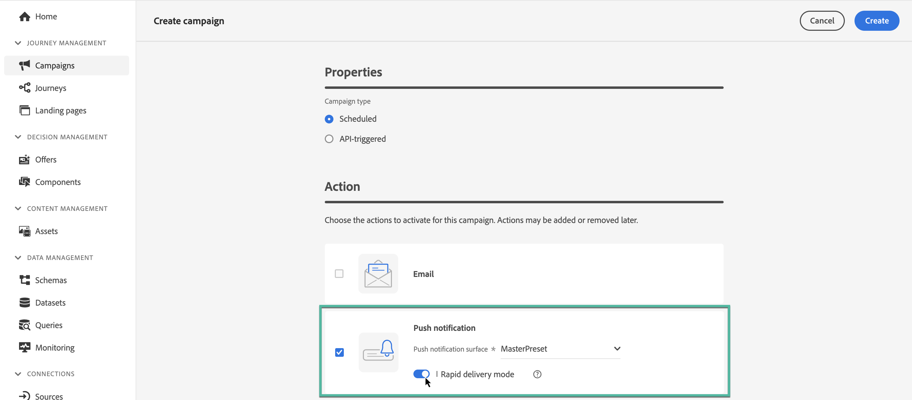

# Creación de una campaña {#create-campaign}

>[!NOTE]
>
>Antes de crear una nueva campaña, asegúrese de que tiene un canal superficial (es decir, un mensaje preestablecido) y un segmento de Adobe Experience Platform listo para usar. Obtenga más información en estas secciones:
>
>* [Creación de superficies de canal](../configuration/channel-surfaces.md)
>* [Introducción a los segmentos](../segment/about-segments.md)

## Crear la primera campaña {#create}

1. Acceda a la **[!UICONTROL Campañas]** a continuación, haga clic en **[!UICONTROL Crear campaña]**.

   >[!NOTE]
   >
   >También puede duplicar una campaña en vivo existente para crear una nueva. [Más información](modify-stop-campaign.md#duplicate)

   

1. En el **[!UICONTROL Propiedades]** , especifique cuándo desea ejecutar la campaña:

   * **[!UICONTROL Programado]**: ejecutar la campaña inmediatamente o en una fecha especificada. Las campañas programadas tienen como objetivo enviar **marketing** escriba mensajes.
   * **[!UICONTROL Activado por API]**: ejecute la campaña utilizando una llamada de API. Las campañas activadas por API están destinadas a enviar **transaccional** mensajes, es decir, mensajes enviados siguiendo una acción realizada por un individuo: restablecimiento de contraseña, abandono de tarjeta, etc. [Obtenga información sobre cómo almacenar en déclencheur una campaña mediante API](api-triggered-campaigns.md)

1. En el **[!UICONTROL Acciones]** , seleccione el canal y la superficie del canal que desea utilizar para enviar el mensaje y, a continuación, haga clic en **[!UICONTROL Crear]**.

   Una superficie es una configuración que ha definido un [Administrador del sistema](../start/path/administrator.md). Contiene todos los parámetros técnicos para enviar el mensaje, como parámetros de encabezado, subdominio, aplicaciones móviles, etc. [Más información](../configuration/channel-surfaces.md).

   

   >[!NOTE]
   >
   >En la lista desplegable solo se muestran las superficies de canal compatibles con el tipo de campaña de marketing.

1. Especifique un título y una descripción para la campaña.

   <!--To test the content of your message, toggle the **[!UICONTROL Content experiment]** option on. This allows you to test multiple variables of a delivery on populations samples, in order to define which treatment has the biggest impact on the targeted population.[Learn more about content experiment](../campaigns/content-experiment.md).-->

1. En el **[!UICONTROL Acciones]** configure el mensaje que desea enviar con la campaña:

   1. Haga clic en el **[!UICONTROL Editar contenido]** y, a continuación, configure y diseñe el contenido del mensaje. [Más información sobre los mensajes](../messages/get-started-content.md).

      Conozca los pasos detallados para crear el contenido del mensaje en la siguiente página:

      * [Crear un correo electrónico](../messages/create-email.md)
      * [Crear notificaciones push](../messages/create-push.md)
      * [Creación de un mensaje SMS](../messages/create-sms.md)
   1. Una vez definido el contenido, utilice la variable **[!UICONTROL Simular contenido]** para previsualizar y probar el contenido con perfiles de prueba. [Más información](../design/preview.md).

   1. Haga clic en la flecha para volver a la pantalla de creación de la campaña.

      

   1. En el **[!UICONTROL Seguimiento de acciones]** , especifique si desea rastrear cómo reaccionan los destinatarios a su envío: puede rastrear clics o aperturas.

      Una vez ejecutada la campaña, se podrá acceder a los resultados de seguimiento desde el informe de campaña. [Más información sobre los informes de campaña](../reports/campaign-global-report.md)

1. Defina la audiencia objetivo. Para ello, haga clic en el botón **[!UICONTROL Seleccionar la audiencia]** para mostrar la lista de segmentos de Adobe Experience Platform disponibles. [Más información sobre los segmentos](../segment/about-segments.md)

   >[!NOTE]
   >
   >Para las campañas activadas por API, la audiencia debe configurarse mediante una llamada a la API. [Más información](api-triggered-campaigns.md)

   En el **[!UICONTROL Área de nombres de identidad]** , elija el área de nombres que desea utilizar para identificar a las personas del segmento seleccionado. [Más información sobre áreas de nombres](../event/about-creating.md#select-the-namespace)

   

   >[!NOTE]
   >
   >Las personas que pertenezcan a un segmento que no tenga la identidad seleccionada (área de nombres) entre sus diferentes identidades no serán el objetivo de la campaña.

   <!--If you are are creating an API-triggered campaign, the **[!UICONTROL cURL request]** section allows you to retrieve the **[!UICONTROL Campaign ID]** to use in the API call. [Learn more](api-triggered-campaigns.md)-->

1. Para ejecutar la campaña en una fecha específica o con una frecuencia recurrente, configure la variable **[!UICONTROL Programación]** para obtener más información. [Aprenda a programar campañas](#schedule)

1. Para asignar etiquetas de uso de datos principales o personalizadas a la campaña, haga clic en el botón **[!UICONTROL Administrar acceso]** botón. [Obtenga más información sobre Control de acceso a nivel de objeto (OLA)](../administration/object-based-access.md)

Una vez preparada la campaña, puede revisarla y publicarla. [Más información](#review-activate)

## Programar una campaña {#schedule}

De forma predeterminada, las campañas se inician una vez activadas manualmente y finalizan en cuanto se envía una vez el mensaje.

Puede definir una frecuencia a la que se debe enviar el mensaje de la campaña. Para ello, utilice el **[!UICONTROL Déclencheur de acción]** en la pantalla de creación de la campaña para especificar si la campaña debe ejecutarse diariamente, semanalmente o mensualmente.

Si no desea ejecutar la campaña justo después de su activación, puede especificar la fecha y la hora a la que se debe enviar el mensaje mediante la variable **[!UICONTROL Inicio de la campaña]** . La variable  **[!UICONTROL Fin de la campaña]** permite especificar cuándo se debe detener la ejecución de una campaña recurrente.

## Modo de entrega rápido {#rapid-delivery}

>[!CONTEXTUALHELP]
>id="ajo_campaigns_rapid_delivery"
>title="Modo de entrega rápido"
>abstract="El modo de entrega rápida permite realizar envíos de mensajes a alta velocidad en el canal push a un tamaño de audiencia inferior a 30 M."

El modo de entrega rápida, anteriormente conocido como modo de ráfaga en recorridos, es un [!DNL Journey Optimizer] complemento que permite enviar mensajes push muy rápidamente a grandes volúmenes mediante campañas.

La entrega rápida se utiliza cuando el retraso en la entrega de mensajes es crítico para el negocio, cuando desea enviar una alerta push urgente en teléfonos móviles, por ejemplo una noticia de último minuto para los usuarios que han instalado la aplicación de canal de noticias.

Para obtener más información sobre el rendimiento al utilizar el modo de entrega rápida, consulte [Descripción del producto de Adobe Journey Optimizer](https://helpx.adobe.com/legal/product-descriptions/adobe-journey-optimizer.html?lang=es).

### Requisitos previos {#prerequisites}

La mensajería de envío rápido incluye los siguientes requisitos:

* La entrega rápida está disponible para **[!UICONTROL Programado]** solo campañas y no está disponible para campañas activadas por API,
* No se permite ninguna personalización en el mensaje push,
* La audiencia de destino debe contener menos de 30 millones de perfiles,
* Puede ejecutar hasta 5 campañas simultáneamente mediante el modo de envío rápido.

### Activar el modo de entrega rápido

1. Cree una campaña de notificaciones push y active la opción **[!UICONTROL Entrega rápida]** .

1. Configure el contenido del mensaje y seleccione la audiencia a la que desea dirigirse. [Obtenga información sobre cómo crear una campaña](#create)

   >[!IMPORTANT]
   >
   >Asegúrese de que el contenido del mensaje no incluya ninguna personalización y de que la audiencia contenga menos de 30 millones de perfiles.

1. Revise y active la campaña como de costumbre. Tenga en cuenta que, en el modo de prueba, los mensajes no se envían mediante el modo de envío rápido. [Obtenga información sobre cómo revisar y activar una campaña](review-activate-campaign.md)
