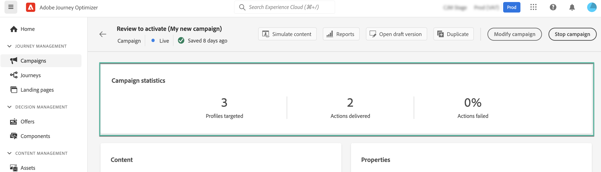

# Creación de una campaña {#create-campaign}

>[!NOTE]
>
>Antes de crear una nueva campaña, asegúrese de que tiene un canal superficial (es decir, un mensaje preestablecido) y un segmento de Adobe Experience Platform listo para usar. Obtenga más información en estas secciones:
>
>* [Creación de superficies de canal](../configuration/channel-surfaces.md)
>* [Introducción a los segmentos](../segment/about-segments.md)

## Configuración de una campaña {#configure}

Los pasos para crear una campaña son los siguientes:

1. Acceda a la **[!UICONTROL Campaigns]** a continuación, haga clic en **[!UICONTROL Create campaign]**.

   

   >[!NOTE]
   >
   >También puede duplicar una campaña en vivo existente para crear una nueva.[Más información](modify-stop-campaign.md#duplicate) <!-- check if only live campaigns-->

<!--1. In the **[!UICONTROL Properties]** section, specify when you want to execute the campaign:

    * **[!UICONTROL Scheduled]**: execute the campaign immediately or on a specified date. Scheduled campaigns are aimed at sending **marketing** type messages.
    * **[!UICONTROL API-triggered]**: execute the campaign using an API call. API-triggered campaigns are aimed at sending **transactional** messages, i.e. messages sent out following an action performed by an individual: password reset, card abandonment etc. [Learn how to trigger a campaign using APIs](api-triggered-campaigns.md)-->

1. En el **[!UICONTROL Actions]** , seleccione el canal y la superficie del canal que desea utilizar para enviar el mensaje y, a continuación, haga clic en **[!UICONTROL Create]**.

   

   >[!NOTE]
   >
   >En la lista desplegable solo se muestran las superficies de canal compatibles con el tipo de campaña (de marketing o transaccional).

1. Especifique un título y una descripción para la campaña.

   <!--To test the content of your message, toggle the **[!UICONTROL Content experiment]** option on. This allows you to test multiple variables of a delivery on populations samples, in order to define which treatment has the biggest impact on the targeted population.[Learn more about content experiment](../campaigns/content-experiment.md).-->

1. En el **[!UICONTROL Actions]** configure el mensaje que desea enviar con la campaña:

   1. Haga clic en el **[!UICONTROL Edit content]** y, a continuación, configure y diseñe el contenido del mensaje. [Más información sobre los mensajes](../messages/get-started-content.md)

      >[!NOTE]
      >
      >La variable **[!UICONTROL Simulate content]** permite utilizar perfiles de prueba para previsualizar y probar el contenido. [Más información](../design/preview.md)

   1. Una vez que el contenido esté listo, haga clic en la flecha para volver a la pantalla de creación de la campaña.

      

   1. En el **[!UICONTROL Actions tracking]** , especifique si desea rastrear cómo reaccionan los destinatarios a su envío.

      Una vez ejecutada la campaña, se podrá acceder a los resultados de seguimiento desde el informe de campaña. [Más información sobre los informes de campaña](../reports/campaign-global-report.md)

1. Defina la audiencia objetivo. Para ello, haga clic en el botón **[!UICONTROL Select audience]** para mostrar la lista de segmentos de Adobe Experience Platform disponibles. [Más información sobre los segmentos](../segment/about-segments.md)

   <!-- NOTE For API-triggered campaigns, the audience needs to be set via API call. [Learn more](api-triggered-campaigns.md)-->

   En el **[!UICONTROL Identity namespace]** , elija el área de nombres que desea utilizar para identificar a las personas del segmento seleccionado. [Más información sobre áreas de nombres](../event/about-creating.md#select-the-namespace)

   

   >[!NOTE]
   >
   >Las personas que pertenezcan a un segmento que no tenga la identidad seleccionada (área de nombres) entre sus diferentes identidades no serán el objetivo de la campaña.

1. Configure las fechas de inicio y finalización de la campaña. De forma predeterminada, las campañas están configuradas para iniciarse una vez activadas manualmente y para finalizar en cuanto el mensaje se haya enviado una vez.

1. Además, puede especificar una frecuencia para la ejecución de la acción configurada en la campaña.

   <!-- NOTE For API-triggered campaigns, scheduling at a specific date and time with recurrence is not available as action is triggered via API. However, start and end date are relevant to ensure that, if an API call is made prior of after the window, then those get errored.-->

   

<!--1. If you are are creating an API-triggered campaign, the **[!UICONTROL cURL request]** section allows you to retrieve the **[!UICONTROL Campaign ID]** to use in the API call. [Learn more](api-triggered-campaigns.md)-->

Una vez que la campaña esté lista, puede revisarla y publicarla (consulte [Revisar y activar una campaña](#review-activate)).

## Revisar y activar una campaña {#review-activate}

Una vez configurada la campaña, debe revisar su parámetro y contenido antes de activarlo. Para ello, siga estos pasos:

1. En la pantalla de configuración de la campaña, haga clic en **[!UICONTROL Review to activate]** para mostrar un resumen de la campaña.

   El resumen le permite modificar la campaña si es necesario y comprobar si algún parámetro es incorrecto o falta.

   >[!IMPORTANT]
   >
   >En caso de errores, no podrá activar la campaña. Resuelva los errores antes de continuar.

   

1. Compruebe que la campaña esté correctamente configurada y haga clic en **[!UICONTROL Activate]**.

   

1. La campaña ahora está activada y tiene el valor **[!UICONTROL Live]** estado (o **[!UICONTROL Scheduled]**  si ha especificado una fecha de inicio). [Obtenga más información sobre los estados de campañas](get-started-with-campaigns.md#statuses). El mensaje configurado en la campaña se ejecuta inmediatamente o en la fecha especificada.

   >[!NOTE]
   >
   >La variable **[!UICONTROL Completed]** se asigna automáticamente a una campaña 3 días después de activarse o en la fecha de finalización de la campaña si tiene una ejecución recurrente.
   >
   >Si no se ha especificado ninguna fecha de finalización, la campaña mantiene el estado &quot;Activo&quot;. Para cambiarlo, debe detener la campaña manualmente. [Obtenga información sobre cómo detener una campaña](modify-stop-campaign.md)

1. Una vez activada una campaña, puede comprobar en cualquier momento su información abriéndola. El resumen le permite obtener estadísticas sobre el número de perfiles objetivo y las acciones entregadas y fallidas.

   También puede obtener estadísticas adicionales en los informes dedicados haciendo clic en el botón **[!UICONTROL Reports]** botón. [Más información](../reports/campaign-global-report.md)

   
