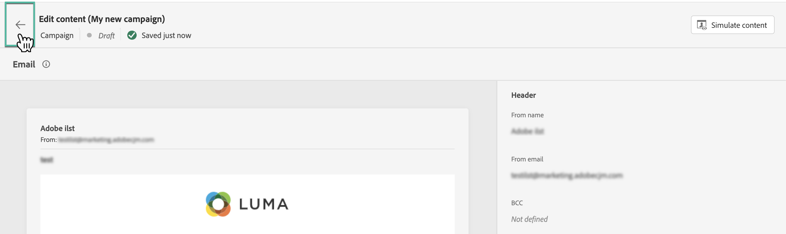

# Creación de una campaña {#create-campaign}

>[!NOTE]
>
>Antes de crear una nueva campaña, asegúrese de tener un mensaje preestablecido y un segmento de Adobe Experience Platform listos para usar. Obtenga más información en estas secciones:
>
>* [Creación de ajustes preestablecidos de mensaje](../configuration/message-presets.md)
>* [Introducción a los segmentos](../segment/about-segments.md)

## Configuración de una campaña {#configure}

Los pasos para crear una campaña son los siguientes:

1. Acceda a la **[!UICONTROL Campaigns]** a continuación, haga clic en **[!UICONTROL Create campaign]**.

   

1. En el **[!UICONTROL Properties]** , especifique cuándo desea ejecutar la campaña:

   * **[!UICONTROL Scheduled]**: ejecutar la campaña inmediatamente o en una fecha especificada. Las campañas programadas tienen como objetivo enviar **marketing** escriba mensajes.
   * **[!UICONTROL API-triggered]**: ejecute la campaña utilizando una llamada de API. Las campañas activadas por API están destinadas a enviar **transaccional** mensajes, es decir, mensajes enviados siguiendo una acción realizada por un individuo: restablecimiento de contraseña, abandono de tarjeta, etc. [Obtenga información sobre cómo almacenar en déclencheur una campaña mediante API](api-triggered-campaigns.md)

1. En el **[!UICONTROL Actions]** , seleccione el canal y la superficie del mensaje (es decir, el ajuste preestablecido de mensaje) que se utilizará para enviar el mensaje y, a continuación, haga clic en **[!UICONTROL Create]**.

   

   >[!NOTE]
   >
   >En la lista desplegable solo se muestran las superficies de mensaje compatibles con el tipo de campaña (de marketing o transaccional).

1. Especifique un título y una descripción para la campaña.

   <!--To test the content of your message, toggle the **[!UICONTROL Content experiment]** option on. This allows you to test multiple variables of a delivery on populations samples, in order to define which treatment has the biggest impact on the targeted population.[Learn more about content experiment](../campaigns/content-experiment.md).-->

1. En el **[!UICONTROL Actions]** configure el mensaje que desea enviar con la campaña:

   1. Haga clic en el **[!UICONTROL Edit content]** y, a continuación, configure y diseñe el mensaje. [Obtenga información sobre cómo configurar mensajes](../messages/get-started-content.md).

      Una vez que el contenido esté listo, haga clic en la flecha para volver a la pantalla de creación de la campaña.

      

   1. En el **[!UICONTROL Actions tracking]** , especifique si desea rastrear cómo reaccionan los destinatarios a su envío.

      Una vez ejecutada la campaña, se podrá acceder a los resultados de seguimiento desde el informe de campaña. [Más información sobre los informes de campaña](campaign-global-report.md)

1. Defina la audiencia objetivo. Para ello, haga clic en el botón **[!UICONTROL Select audience]** para mostrar la lista de segmentos de Adobe Experience Platform disponibles. [Más información sobre los segmentos](../segment/about-segments.md)

   >[!NOTE]
   >
   >Para las campañas activadas por API, la audiencia debe configurarse mediante una llamada a la API. [Más información](api-triggered-campaigns.md)

   En el **[!UICONTROL Identity namespace]** , elija el área de nombres que desea utilizar para identificar a las personas del segmento seleccionado. [Más información sobre áreas de nombres](../event/about-creating.md#select-the-namespace)

   

   >[!NOTE]
   >
   >Las personas que pertenezcan a un segmento que no tenga la identidad seleccionada (área de nombres) entre sus diferentes identidades no serán el objetivo de la campaña.

1. Configure las fechas de inicio y finalización de la campaña. De forma predeterminada, las campañas están configuradas para iniciarse una vez activadas manualmente y para finalizar en cuanto el mensaje se haya enviado una vez.

1. Además, puede especificar una frecuencia para la ejecución de la acción configurada en la campaña.

   >[!NOTE]
   >
   >En el caso de las campañas activadas por API, la programación en una fecha y hora específicas con periodicidad no está disponible, ya que la acción se activa mediante API. Sin embargo, las fechas de inicio y finalización son relevantes para garantizar que, si se realiza una llamada a la API antes de después de la ventana, estos se borren.

   

1. Si está creando una campaña activada por API, la variable **[!UICONTROL cURL request]** le permite recuperar el **[!UICONTROL Campaign ID]** para usar en la llamada de API. [Más información](api-triggered-campaigns.md)

Una vez que la campaña esté lista, puede revisarla y publicarla (consulte [Revisar y activar una campaña](#review-activate)).

## Revisar y activar una campaña {#review-activate}

Una vez configurada la campaña, debe revisar su parámetro y contenido antes de activarlo. Para ello, siga estos pasos:

1. En la pantalla de configuración de la campaña, haga clic en **[!UICONTROL Review to activate]** para mostrar un resumen de la campaña.

   El resumen le permite modificar la campaña si es necesario y comprobar si algún parámetro es incorrecto o falta.

   >[!IMPORTANT]
   >
   >En caso de errores, no podrá activar la campaña. Resuelva los errores antes de continuar.

   

1. Compruebe que la campaña esté correctamente configurada y haga clic en **[!UICONTROL Activate]**.

   

1. La campaña ahora está activada y tiene el valor **[!UICONTROL Live]** estado (o **[!UICONTROL Scheduled]**  si ha especificado una fecha de inicio). [Obtenga más información sobre los estados de campañas](get-started-with-campaigns.md#statuses)

   El mensaje configurado en la campaña se ejecuta inmediatamente o en la fecha especificada.

   >[!NOTE]
   >
   >Una vez activada una campaña, mantiene el estado &quot;Activo&quot; incluso después de ejecutar el mensaje. Para cambiar su estado, debe detenerlo manualmente. [Obtenga información sobre cómo detener una campaña](modify-stop-campaign.md)

1. Una vez activada una campaña, puede comprobar en cualquier momento su información abriéndola. El resumen le permite obtener estadísticas sobre el número de perfiles objetivo y las acciones entregadas y fallidas.

   También puede obtener estadísticas adicionales en los informes dedicados haciendo clic en el botón **[!UICONTROL Reports]** botón. [Más información](campaign-global-report.md)

   

   >[!IMPORTANT]
   >
   >Los mensajes creados en campañas son específicos de [!DNL Journey Optimizer] capacidades de campaign. Una vez creadas, solo se podrá acceder a ellas desde las campañas y no se mostrarán en la variable **[!UICONTROL Messages]** para abrir el Navegador.

## Recursos adicionales

* [Introducción a las campañas](get-started-with-campaigns.md)
* [Creación de campañas activadas por API](api-triggered-campaigns.md)
* [Modificación o detención de una campaña](modify-stop-campaign.md)
* [Informe en directo de la campaña](campaign-live-report.md)
* [Informe global de la campaña](campaign-global-report.md)
