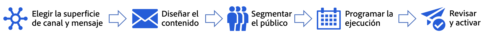

# Introducción a las campañas {#get-started-campaigns}

>[!CONTEXTUALHELP]
>id="ajo_homepage_card3"
>title="Creación de campañas"
>abstract="Uso **Adobe Journey Optimizer** para enviar contenido de una sola vez a una audiencia específica mediante varios canales. Cuando se utilizan recorridos, las acciones se ejecutan en secuencia. Con las campañas, las acciones se realizan simultáneamente, ya sea de forma inmediata o en función de una programación especificada."

>[!CONTEXTUALHELP]
>id="campaigns_list"
>title="Campañas"
>abstract="Cree campañas para ofrecer contenido de una sola vez a una audiencia específica en varios canales. Antes de crear la campaña, asegúrese de tener una superficie de canal (es decir, un ajuste prestablecido de mensajes) y una audiencia de Adobe Experience Platform listos para usar."

Utilice las campañas de Journey Optimizer para ofrecer contenido único a una audiencia específica mediante varios canales. Cuando se utilizan recorridos, las acciones se ejecutan en secuencia. Con las campañas, las acciones se realizan simultáneamente, ya sea de forma inmediata o en función de una programación especificada.

Puede crear dos tipos de campañas:

* **Campañas programadas** le permite comunicaciones por lotes ad-hoc sencillas para casos de uso de marketing, como ofertas promocionales, campañas de participación, anuncios, avisos legales o actualizaciones de políticas.
* Las **campañas activadas por API** permiten que las comunicaciones de marketing lleguen a un público en el momento adecuado o que los mensajes transaccionales/operativos lleguen a una persona individual, como un restablecimiento de contraseña. Este acto puede implicar una personalización no solo mediante el uso del atributo de perfil, sino también mediante los datos de contexto en tiempo real en el activador, que es una carga útil de API de REST.

Los pasos principales para crear una regla de tipología son los siguientes:

➡️ [Descubra esta función en vídeo](#video)

## Antes de empezar {#campaign-prerequisites}

Compruebe los siguientes requisitos previos antes de empezar a crear la primera campaña en Journey Optimizer:

1. **Necesita los permisos adecuados**. Esta función solo está disponible para usuarios con acceso a un **[!UICONTROL Perfil de producto]** relacionado con Campaign, como administrador de Campaign, aprobador de Campaign, administrador de Campaign y/o visualizador de Campaign.

   Si no puede acceder a las campañas, sus permisos deben ampliarse. Si tiene acceso a [Adobe Admin Console](https://adminconsole.adobe.com/){target="_blank"} para su organización, siga los pasos siguientes. De lo contrario, póngase en contacto con el administrador de Journey Optimizer.

   +++Obtenga información sobre cómo asignar permisos de campaña

   Para asignar el **[!UICONTROL Perfil del producto]** a sus usuarios:

   1. En [Adobe Admin Console](https://adminconsole.adobe.com/){target="_blank"}, seleccione el producto de [!DNL Adobe Experience Platform].

   1. Vaya a la pestaña **[!UICONTROL Perfil del producto]** , seleccione una de las campañas integradas relacionadas **[!UICONTROL Perfil del producto]**: Administrador de campañas, aprobador de campañas, administrador de campañas o visualizador de campañas.

      Para obtener más información sobre la campaña de Journey Optimizer **[!UICONTROL Perfiles de producto]** y **[!UICONTROL Permisos]**, [consulte esta página](../administration/ootb-product-profiles.md).

      

   1. Haga clic en **[!UICONTROL Agregar usuario]** para asignar al usuario el **[!UICONTROL Perfil del producto]**.

      

   1. Escriba el nombre del usuario, el grupo o la dirección de correo electrónico y haga clic en **[!UICONTROL Guardar]**.

   El usuario ahora puede acceder a **[!UICONTROL Campañas]**.

+++

1. **Necesita una audiencia**. Las audiencias deben estar disponibles antes de crear la campaña. Más información sobre las audiencias [en esta página](../audience/about-audiences.md).
1. **Necesita una superficie de canal**. Para poder seleccionar un canal, debe tener la superficie del canal correspondiente (es decir, preestablecida) creada y disponible. Más información sobre los segmentos de canal [en esta página](../configuration/channel-surfaces.md).

## Vídeo explicativo {#video}

Aprenda a crear su primera campaña.

>[!VIDEO](https://video.tv.adobe.com/v/346680?quality=12)
