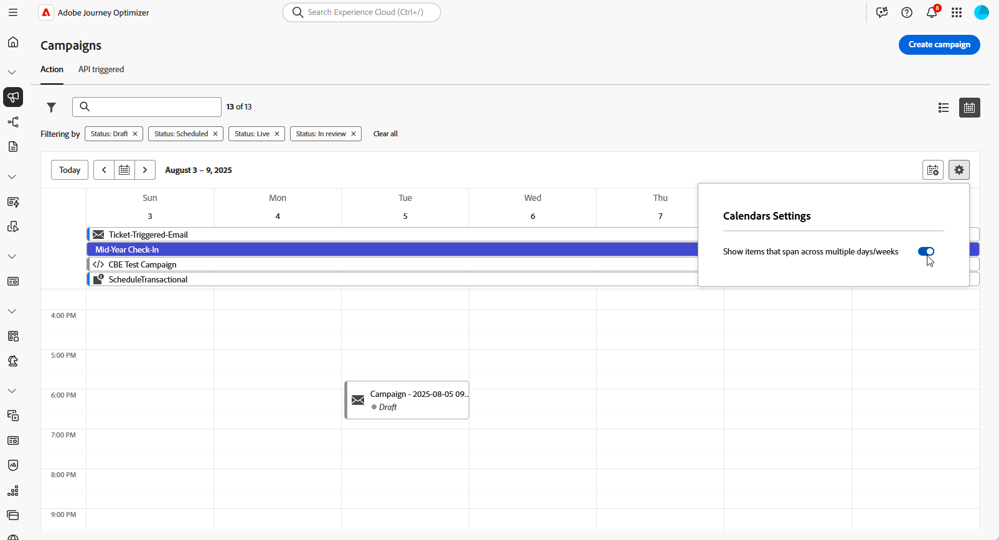
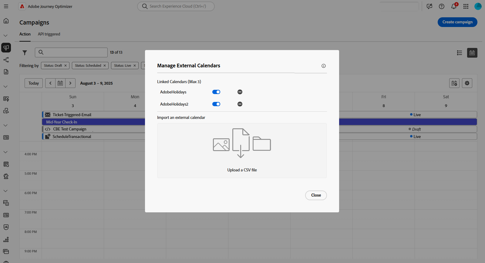

# Acceso y administración de campañas {#manage-campaigns}

>[!CONTEXTUALHELP]
>id="ajo_targeting_workflow_list"
>title="Inventario de campañas orquestadas"
>abstract="En esta pantalla, puede acceder a la lista completa de campañas orquestadas, comprobar su estado actual, las fechas de la última/próxima ejecución y crear una nueva campaña orquestada."

>[!CONTEXTUALHELP]
>id="ajo_orchestration_campaign_action"
>title="Acción"
>abstract="Esta sección enumera todas las acciones utilizadas dentro de la campaña orquestada."

Obtenga información sobre cómo acceder, organizar y administrar sus campañas en Adobe Journey Optimizer. Esta guía abarca desde la búsqueda de campañas hasta la comprensión de los estados, la realización de operaciones comunes y el mantenimiento del espacio de trabajo de la campaña.

## Inicio rápido: Tareas comunes {#quick-tasks}

Salta directamente a lo que necesites:

* **Crear una nueva campaña** → [Elija el tipo de campaña](get-started-with-campaigns.md#campaign-types)
   * [Crear campaña de acción](create-campaign.md)
   * [Creación de una campaña activada por API](api-triggered-campaigns.md)
   * [Crear una campaña organizada](../orchestrated/gs-orchestrated-campaigns.md)
* **Buscar campañas existentes** → [Buscar y filtrar](#access)
* **Ver el rendimiento de la campaña** → [Informes de campaña](../reports/campaign-global-report-cja.md)
* **Programar campañas** → [Usar el calendario](#calendar)
* **Administrar conflictos** → [Guía de administración de conflictos](../conflict-prioritization/gs-conflict-prioritization.md)

## Acceso y exploración de campañas {#access}

Se puede acceder a las campañas desde el menú **[!UICONTROL Campañas]**. Utilice las fichas para examinar las campañas por tipo: **Campañas de acción**, **campañas activadas por API** y **orquestadas**. Más información sobre los [tipos de campañas](get-started-with-campaigns.md#campaign-types). Los tipos disponibles dependen del acuerdo de licencia y de los permisos.

>[!BEGINTABS]

>[!TAB Campañas de acción]

Seleccione la pestaña **[!UICONTROL Action]** para acceder a la lista de campañas de acción.

De manera predeterminada, la lista muestra todas las campañas con los estados **[!UICONTROL Borrador]**, **[!UICONTROL Programado]** y **[!UICONTROL Activo]**. Para mostrar las campañas detenidas, completadas y archivadas, debe borrar el filtro.

>[!TAB Campañas activadas mediante API]

Seleccione la pestaña **[!UICONTROL API activada]** para acceder a la lista de campañas activadas por API.

De manera predeterminada, la lista muestra todas las campañas con los estados **[!UICONTROL Borrador]**, **[!UICONTROL Programado]** y **[!UICONTROL Activo]**. Para mostrar las campañas detenidas, completadas y archivadas, debe borrar el filtro.

>[!TAB Campañas orquestadas]

Seleccione la pestaña **[!UICONTROL Orchestration]** para acceder a la lista de campañas orquestadas.

{zoomable="yes"}

Cada campaña orquestada de la lista muestra información como el [estado](#statuses) actual de la campaña, el canal asociado y las etiquetas, o la última vez que se modificó. Puede personalizar las columnas mostradas haciendo clic en el botón .

>[!ENDTABS]

### Búsqueda y filtrado de campañas {#search-filter}

Además, hay una barra de búsqueda y filtros disponibles para facilitar la búsqueda dentro de la lista. Por ejemplo, puede filtrar las campañas para mostrar solo las asociadas a un canal o etiqueta determinados, o las creadas durante un intervalo de fechas específico.

## Operaciones de campaña {#operations}

La imagen  en el inventario de campañas le permite realizar varias operaciones.

### Acciones disponibles

**Para todos los tipos de campaña:**

* **[!UICONTROL Ver informe de todos los tiempos]** / **[!UICONTROL Ver informe de las últimas 24 horas]**: acceda a informes para medir y visualizar el impacto y el rendimiento de sus campañas. [Más información sobre los informes de campaña →](../reports/campaign-global-report-cja.md)
* **[!UICONTROL Editar etiquetas]**: edite las etiquetas asociadas a la campaña. [Aprenda a utilizar etiquetas →](../start/search-filter-categorize.md#add-tags)
* **[!UICONTROL Duplicate]**: utilice esta opción para duplicar una campaña, por ejemplo, para ejecutar una campaña orquestada que se haya detenido. [Más información sobre cómo duplicar →](#duplicate-a-campaign)
* **[!UICONTROL Eliminar]** - Utilice esta opción para eliminar una campaña. [Más información sobre cómo eliminar →](#delete-a-campaign)
* **[!UICONTROL Archivar]**: archive la campaña. Todas las campañas archivadas se eliminan según una programación móvil 30 días después de su última fecha de modificación. Esta acción está disponible para todas las campañas excepto para **[!UICONTROL Borrador]**. [Más información sobre cómo archivar →](#archive-a-campaign)

**Solo para campañas activadas por acción y API:**

* **[!UICONTROL Agregar al paquete]**: agregue la campaña a un paquete para exportarla a otra zona protegida. [Obtenga información sobre cómo exportar objetos →](../configuration/copy-objects-to-sandbox.md)
* **[!UICONTROL Abrir versión de borrador]**: si se ha creado una nueva versión de la campaña y aún no se ha activado, puede acceder a su versión de borrador mediante esta acción.

## Explicación del estado de campaña {#statuses}

Cada campaña se desplaza por un ciclo de vida que se refleja en su estado en la interfaz. Comprender estos estados le ayuda a saber qué acciones están disponibles y qué hacer a continuación.

| Estado | Campañas de acción | Campañas activadas por API | Campañas orquestadas | Lo que significa | Acciones siguientes |
|--------|:----------------:|:-----------------------:|:----------------------:|---------------|--------------|
| **[!UICONTROL Borrador]** | ✅ | ✅ | ✅ | Se está editando, no activando | Continuar editando o [activar campaña](review-activate-campaign.md) |
| **[!UICONTROL Programado]** | ✅ | ✅ | ✅ | Configurado para una fecha de inicio específica | Esperar al lanzamiento, [modificar si es necesario](#modify) o [ver en el calendario](#calendar) |
| **[!UICONTROL Activo]** | ✅ | ✅ | ✅ | Activado y en ejecución | [Supervisar el rendimiento](../reports/campaign-global-report-cja.md), [crear nueva versión](#modify) si es necesario |
| **[!UICONTROL En revisión]** | ✅ | ✅ | — | Enviado para aprobación | Esperar [aprobación](../test-approve/gs-approval.md) o modificar |
| **[!UICONTROL Detenido]** | ✅ | ✅ | ✅ | Detenido manualmente, no se puede reactivar | [Duplicado para reutilizar](#duplicate-a-campaign) |
| **[!UICONTROL Completado]** | ✅ | ✅ | ✅ | Ejecución finalizada (asignada automáticamente 3 días después de la activación o en la fecha de finalización para la recurrente) | [Ver informes](../reports/campaign-global-report-cja.md), [archivar](#archive-a-campaign) o [duplicado](#duplicate-a-campaign) |
| **[!UICONTROL Fallido]** | ✅ | ✅ | — | Error de ejecución | Comprobar registros, solucionar problemas, [duplicar para reintentar](#duplicate-a-campaign) |
| **[!UICONTROL Archivado]** | ✅ | ✅ | ✅ | Archivado (se elimina automáticamente pasados 30 días) | [Recuperar mediante el filtro](#access) si es necesario |
| **[!UICONTROL Cerrado]** | — | — | ✅ | Campaña recurrente cerrada, no se permiten nuevas entradas (continúa hasta que se completen todas las actividades) | Esperar a que se complete |
| **[!UICONTROL Publicación]** | — | — | ✅ | En publicación | Esperar a que se complete la publicación |

>[!NOTE]
>
>Para las campañas activadas por la acción y la API, el icono &quot;Abrir versión de borrador&quot; junto a un estado **[!UICONTROL Activo]** o **[!UICONTROL Programado]** indica que se ha creado una nueva versión y que aún no se ha activado.

### Indicadores de error

Cuando se produce un error en una de las campañas, aparece un icono de advertencia junto al estado de la campaña. Haga clic en ella para mostrar información sobre la alerta. Estas alertas pueden producirse en varias situaciones, como cuando el mensaje de la campaña no se ha publicado o si la configuración elegida es incorrecta.

>[!NOTE]
>
>Se puede acceder a las imágenes o Assets en el contenido enviado durante un máximo de 2 años (730 días) desde su primera publicación en cualquier fragmento o mensaje en línea. Se requiere volver a publicar después de este período de caducidad (en cualquier momento después de 730 días) para mantenerlos accesibles durante otros 2 años. Cualquier republicación realizada dentro de los 730 días posteriores a la primera publicación no extenderá la caducidad de los activos/imágenes a los próximos 730 días.

## Calendario de campañas {#calendar}

>[!CONTEXTUALHELP]
>id="ajo_campaigns_view"
>title="Vistas de lista y calendario de campañas"
>abstract="Además de la lista de campañas, [!DNL Journey Optimizer] proporciona una vista de calendario de sus campañas, lo que ofrece una representación visual clara de sus programaciones. Puede cambiar entre las vistas de lista y calendario en cualquier momento con estos botones."

Además de la lista de campañas, [!DNL Journey Optimizer] proporciona una vista de calendario de sus campañas, lo que ofrece una representación visual clara de sus programaciones.

### Funcionamiento del calendario

Representación de las campañas:

* De forma predeterminada, la cuadrícula del calendario muestra todas las campañas en directo y programadas de la semana seleccionada. Las opciones de filtro adicionales pueden mostrar activaciones o activaciones completadas, detenidas y finalizadas de un tipo o canal determinado.
* No se muestran los borradores de campañas.
* Las campañas que abarcan varios días aparecen en la parte superior de la cuadrícula del calendario.
* Si no se especifica ninguna hora de inicio, se utiliza la hora de activación manual más cercana para colocarla en el calendario.
* Las campañas se muestran como intervalos de tiempo de 1 hora, pero esto no refleja la hora de envío o finalización real.

### Navegar por el calendario

1. Haga clic en el icono  para acceder a su calendario de campañas.

1. Utilice los botones de flecha o el selector de fecha situado encima del calendario para desplazarse entre semanas.

   El calendario muestra todas las campañas programadas para la semana actual.

   

1. Haga clic en el icono  para alternar la visualización de elementos que abarcan varios días o semanas.

   

1. Haga clic en el icono  para administrar y agregar hasta tres calendarios externos.

   

1. Arrastre y suelte los archivos CSV que contienen nombres de evento, fechas de inicio y fechas de finalización.

   Los eventos cargados aparecen para todos los usuarios de la organización y se muestran en los calendarios de Recorrido y de campaña.

   +++El formato CSV debe ser el siguiente:

   | Columna1 | Columna2 | Columna3 |
   |-|-|-|
   | Nombre del evento | Fecha de inicio en formato mm/dd/aa | Fecha de finalización en formato mm/dd/aa |

   +++

1. Si es necesario, puede ocultar, mostrar o quitar los calendarios externos agregados.

   

1. Para obtener más información sobre una campaña, haga clic en su bloque visual para abrir los detalles. Se abrirá un panel de información con información diversa sobre la campaña, como su tipo, el acceso a los informes o las etiquetas asignadas.

   

## Modificación y detención de campañas de acción recurrentes {#modify}

### Modificación de una campaña de acción

Para modificar y crear una nueva versión de una campaña de acción recurrente, siga estos pasos:

1. Abra la campaña Acción y haga clic en el botón **[!UICONTROL Modificar campaña]**.

1. Se crea una nueva versión de la campaña. Para comprobar la versión activa, haga clic en **[!UICONTROL Abrir versión activa]**.

   

   En la lista de campañas, las campañas activadas con una versión de borrador en curso se mostrarán con un icono específico en la columna **[!UICONTROL Estado]**. Haga clic en este icono para abrir la versión de borrador de la campaña.

   

1. Una vez que los cambios estén listos, puede activar la nueva versión de la campaña (consulte [Revisar y activar una campaña](review-activate-campaign.md)).

   >[!IMPORTANT]
   >
   >Al activar el borrador, se reemplazará la versión activa de la campaña.

**Temas relacionados:**
* [Propiedades de campaña](campaign-properties.md)
* [Acciones de campaña](campaign-action.md)
* [Contenido de campaña](campaign-content.md)
* [Audiencia de campaña](campaign-audience.md)
* [Programación de campañas](campaign-schedule.md)

### Detener una campaña de acción {#stop}

Para detener una campaña recurrente, ábrala y haga clic en el botón **[!UICONTROL Detener campaña]**.

>[!IMPORTANT]
>
>Al detener una campaña, no se detiene un envío en curso, sino que se detiene un envío programado o las siguientes ocurrencias si el envío ya está en curso.

## Archivado de una campaña {#archive-a-campaign}

Con el tiempo, la lista de campañas sigue creciendo y, finalmente, dificulta la exploración de campañas completadas y detenidas.

Para evitarlo, puede archivar las campañas completadas y detenidas que ya no necesite. Para ello, haga clic en el botón de los tres puntos y seleccione **[!UICONTROL Archivo]**.

Las campañas archivadas se pueden recuperar utilizando el filtro dedicado de la lista.

## Eliminación de una campaña {#delete-a-campaign}

Para eliminar una campaña, usa los puntos suspensivos  y selecciona **[!UICONTROL Eliminar]**.

{width="70%" align="left"}

>[!IMPORTANT]
>
>Esta opción solo está disponible para **[!UICONTROL Borrador]** campañas.

## Duplicación de una campaña {#duplicate-a-campaign}

Para duplicar una campaña, por ejemplo, si se ha detenido, use los puntos suspensivos  y seleccione **[!UICONTROL Duplicar]**.

Introduzca el nombre de la campaña y confirme.

La campaña se crea y se añade a la lista de campañas.

## Recursos adicionales

* **Introducción** - [Introducción a las campañas](get-started-with-campaigns.md) | [Cree su primera campaña de acción](create-campaign.md) | [Guía de campañas activadas por API](api-triggered-campaigns.md) | [Guía de campañas organizadas](../orchestrated/gs-orchestrated-campaigns.md)

* **Configuración de campaña** - [Propiedades de la campaña](campaign-properties.md) | [Acciones y canales de campaña](campaign-action.md) | [Diseño de contenido de campaña](campaign-content.md) | [Selección de audiencia de campaña](campaign-audience.md) | [Programación de campañas](campaign-schedule.md)

* **Funciones avanzadas** - [Flujos de trabajo de aprobación](../test-approve/gs-approval.md) | [Administración de conflictos y priorización](../conflict-prioritization/gs-conflict-prioritization.md) | [Límite de frecuencia por canal](../conflict-prioritization/channel-capping.md) | [Puntuaciones de prioridad](../conflict-prioritization/priority-scores.md) | [Exportar campañas a otras zonas protegidas](../configuration/copy-objects-to-sandbox.md)

* **Supervisión y optimización** - [Informes de campaña (CJA)](../reports/campaign-global-report-cja.md) | [Configurar alertas](../reports/alerts.md)

* **Organización** - [Trabajar con etiquetas](../start/search-filter-categorize.md) | [Administrar permisos](../administration/ootb-product-profiles.md)
