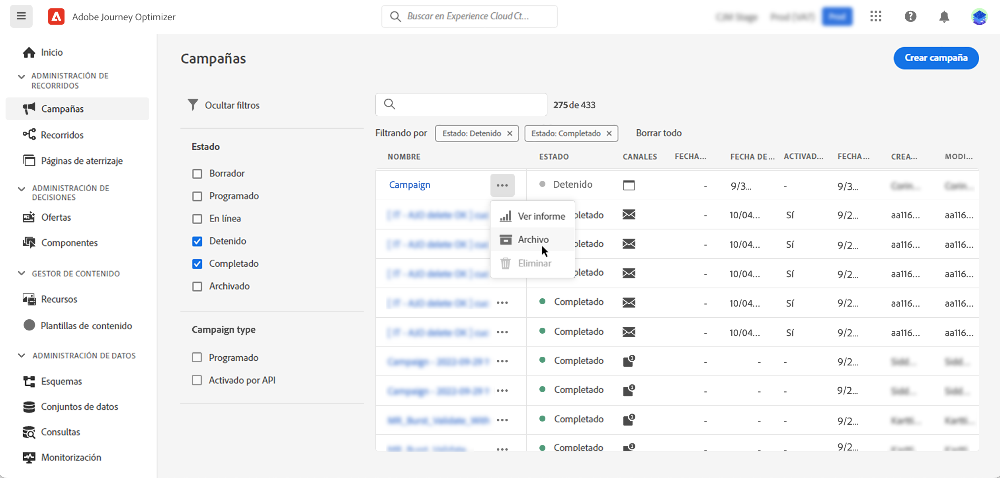

# Acceso y administración de campañas {#modify-stop-campaign}

## Acceso a campañas {#access}

>[!CONTEXTUALHELP]
>id="ajo_campaigns_view"
>title="Vistas de lista y calendario de campañas"
>abstract="Además de la lista de campañas, [!DNL Journey Optimizer] proporciona una vista de calendario de sus campañas, lo que ofrece una representación visual clara de sus programaciones. Puede cambiar entre las vistas de lista y calendario en cualquier momento con estos botones."

Se puede acceder a las campañas desde el menú **[!UICONTROL Campañas]**.

>[!BEGINTABS]

>[!TAB Campañas de acción]

Seleccione la pestaña **[!UICONTROL Action]** para acceder a la lista de campañas de acción.

De manera predeterminada, la lista muestra todas las campañas con los estados **[!UICONTROL Borrador]**, **[!UICONTROL Programado]** y **[!UICONTROL Activo]**. Para mostrar las campañas detenidas, completadas y archivadas, debe borrar el filtro.

>[!TAB Campañas activadas por API]

Seleccione la pestaña **[!UICONTROL API activada]** para acceder a la lista de campañas activadas por API.

De manera predeterminada, la lista muestra todas las campañas con los estados **[!UICONTROL Borrador]**, **[!UICONTROL Programado]** y **[!UICONTROL Activo]**. Para mostrar las campañas detenidas, completadas y archivadas, debe borrar el filtro.

>[!ENDTABS]

También puede filtrar la lista en función del tipo de campaña y canal, o de las etiquetas que se hayan asignado a las campañas al crearlas.

## Calendario de campañas {#calendar}

Además de la lista de campañas, [!DNL Journey Optimizer] proporciona una vista de calendario de sus campañas, lo que ofrece una representación visual clara de sus programaciones.

>[!AVAILABILITY]
>
>Actualmente, la vista de calendario solo está disponible para un conjunto de organizaciones (disponibilidad limitada). Para solicitar acceso, utilice [este formulario](https://forms.cloud.microsoft/r/FC49afuJVi){target=”_blank”}.
>
>Esta función está en desarrollo activo. Agradecemos sus comentarios y solicitudes con el botón **[!UICONTROL Comentarios de Beta]** del menú superior.

El calendario muestra todas las campañas programadas para la semana actual. Utilice los botones de flecha encima del calendario para desplazarse entre semanas.

Representación de las campañas:

* De forma predeterminada, la cuadrícula del calendario muestra todas las campañas en directo y programadas de la semana seleccionada. Las opciones de filtro adicionales pueden mostrar activaciones o activaciones completadas, detenidas y finalizadas de un tipo o canal determinado.
* No se muestran los borradores de campañas.
* Las campañas que abarcan varios días aparecen en la parte superior de la cuadrícula del calendario.
* Si no se especifica ninguna hora de inicio, se utiliza la hora de activación manual más cercana para colocarla en el calendario.
* Las campañas se muestran como intervalos de tiempo de 1 hora, pero esto no refleja la hora de envío o finalización real.

Para obtener más información sobre una campaña, haga clic en su bloque visual para abrir los detalles.

Para ver los detalles de una campaña específica, selecciónela en la lista. Se abrirá un panel de información con información diversa sobre la campaña, como su tipo, el acceso a los informes o las etiquetas asignadas.

## Estados de campaña y alertas {#statuses}

Las campañas pueden tener varios estados:

* **[!UICONTROL Borrador]**: la campaña se está editando y no se ha activado.
* **[!UICONTROL Programada]**: la campaña está configurada para activarse en una fecha de inicio específica.
* **[!UICONTROL Activo]**: la campaña se ha activado.
* **[!UICONTROL En revisión]**: la campaña se ha enviado para su aprobación con el fin de publicarse. [Aprenda a trabajar con aprobaciones](../test-approve/gs-approval.md)
* **[!UICONTROL Detenida]**: la campaña se detuvo manualmente. Ya no puede activarlo ni reutilizarlo. [Aprenda a detener una campaña](modify-stop-campaign.md#stop)
* **[!UICONTROL Completada]**: la campaña se ha completado. Este estado se asigna automáticamente 3 días después de activar una campaña o en la fecha de finalización de la campaña si tiene una ejecución recurrente.
* **[!UICONTROL Error]**: Error en la ejecución de la campaña. Compruebe los registros para identificar el problema.
* **[!UICONTROL Archivada]**: se archivó la campaña. [Aprenda a archivar campañas](modify-stop-campaign.md#archive)

>[!NOTE]
>
>El icono &quot;Abrir versión de borrador&quot; junto a un estado **[!UICONTROL Activo]** o **[!UICONTROL Programado]** indica que se ha creado una nueva versión de la campaña y que aún no se ha activado. [Más información](modify-stop-campaign.md#modify).

Cuando se produce un error en una de las campañas, aparece un icono de advertencia junto al estado de la campaña. Haga clic en ella para mostrar información sobre la alerta. Estas alertas pueden producirse en varias situaciones, como cuando el mensaje de la campaña no se ha publicado o si la configuración elegida es incorrecta.

## Modificar y detener campañas de acción recurrentes {#modify}

### Modificación de una campaña de acción

Para modificar y crear una nueva versión de una campaña de acción recurrente, siga estos pasos:

1. Abra la campaña de acción y haga clic en el botón **[!UICONTROL Modificar campaña]**.

1. Se crea una nueva versión de la campaña. Para comprobar la versión activa, haga clic en **[!UICONTROL Abrir versión activa]**.

   

   En la lista de campañas, las campañas activadas con una versión de borrador en curso se mostrarán con un icono específico en la columna **[!UICONTROL Estado]**. Haga clic en este icono para abrir la versión de borrador de la campaña.

   

1. Una vez que los cambios estén listos, puede activar la nueva versión de la campaña (consulte [Revisar y activar una campaña](create-campaign.md#review-activate)).

   >[!IMPORTANT]
   >
   >Al activar el borrador, se reemplazará la versión activa de la campaña.

### Detener una campaña de acción {#stop}

Para detener una campaña recurrente, ábrala y haga clic en el botón **[!UICONTROL Detener campaña]**.

>[!IMPORTANT]
>
>Al detener una campaña, no se detiene un envío en curso, sino que se detiene un envío programado o las siguientes ocurrencias si el envío ya está en marcha.

## Duplicación de una campaña {#duplicate}

Puede duplicar una campaña para crear una nueva. Para ello, abra la campaña y haga clic en **[!UICONTROL Duplicate]**.

## Archivado de una campaña {#archive}

Con el tiempo, la lista de campañas sigue creciendo y, finalmente, dificulta la exploración de campañas completadas y detenidas.

Para evitarlo, puede archivar las campañas completadas y detenidas que ya no necesite. Para ello, haga clic en el botón de los tres puntos y seleccione **[!UICONTROL Archivo]**.

Las campañas archivadas se pueden recuperar utilizando el filtro dedicado de la lista.
