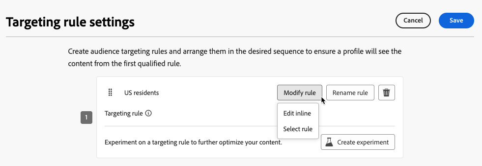

# Usar segmentación {#targeting}

>[!CONTEXTUALHELP]
>id="ajo_content_targeting_fallback"
>title="¿Qué es el contenido de reserva?"
>abstract="El contenido de reserva permite que su público reciba un contenido predeterminado cuando no se cumple ninguna regla de segmentación. Si no selecciona esta opción, los públicos que no cumplan los requisitos para una regla de segmentación definida arriba no recibirán contenido."

La segmentación ofrece contenido personalizado a segmentos de audiencia específicos en función de atributos de perfil de usuario o atributos contextuales.

A diferencia de la experimentación, que es una asignación aleatoria del contenido de un mensaje, la segmentación es determinista en términos de enviar el contenido a la audiencia correcta.

Con la segmentación, se pueden definir reglas específicas basadas en lo siguiente:

* **Atributos de perfil de usuario** como la ubicación (p. ej. targeting geográfico), edad o preferencias. Por ejemplo, los usuarios de EE. UU. ven una promoción &quot;Golden Gate&quot;, mientras que los de Francia ven una promoción &quot;Torre Eiffel&quot;.

* **Datos contextuales** como el tipo de dispositivo (p. ej. device-targeting), hora del día o detalles de la sesión. Por ejemplo, los usuarios de escritorio reciben contenido optimizado para escritorio, mientras que los usuarios móviles reciben contenido optimizado para móvil.

* **Audiencias** que se pueden usar para incluir o excluir perfiles que tengan un abono a audiencia en particular.

Para configurar la segmentación, siga los pasos a continuación.

1. Crear un [recorrido](../building-journeys/journey-gs.md#jo-build) o una [campaña](../campaigns/create-campaign.md).

   >[!NOTE]
   >
   >Si está en un recorrido, agregue una actividad **[!UICONTROL Action]**, elija una actividad de canal y seleccione **[!UICONTROL Configure action]**. [Más información](../building-journeys/journey-action.md#add-action)

1. En la ficha **[!UICONTROL Acciones]**, seleccione al menos una acción.

1. En la sección **[!UICONTROL Optimización]**, seleccione **[!UICONTROL Crear regla de segmentación]**.

   {width=85%}

1. Haga clic en **[!UICONTROL Crear regla]** > **[!UICONTROL Crear nuevo]** y use el generador de reglas para definir los criterios en sus desplazamientos.

   {width=100%}

   Por ejemplo, defina una regla para residentes de EE. UU., una regla para residentes de Francia y una regla para residentes de India.

   {width=85%}

1. También puede hacer clic en **[!UICONTROL Crear regla]** > **[!UICONTROL Seleccionar regla]** para seleccionar una regla de segmentación existente creada desde el menú **[!UICONTROL Reglas]**. [Más información](../experience-decisioning/rules.md)

   {width=70%}

   En este caso, la fórmula que compone la regla simplemente se copia en el recorrido o la campaña. Cualquier cambio posterior a esa regla desde el menú **[!UICONTROL Reglas]** no afectará el recorrido ni la copia de la campaña.

   >[!AVAILABILITY]
   >
   >[La creación de reglas de segmentación](../experience-decisioning/rules.md#create) desde el menú [!DNL Journey Optimizer] dedicado está disponible actualmente para las organizaciones que han adquirido la oferta del complemento Decisioning y están disponibles bajo demanda para las demás organizaciones (disponibilidad limitada).
   >
   >Esta capacidad se implementará progresivamente para todos los clientes. Mientras tanto, póngase en contacto con su representante de Adobe para obtener acceso.

1. Después de agregar una regla, aún puede modificarla. Elija **[!UICONTROL Editar en línea]** para actualizarla sobre la marcha usando el generador de reglas o **[!UICONTROL Seleccionar regla]** para recoger otra regla existente.

   {width=100%}

   >[!NOTE]
   >
   >La edición de una regla en línea no afecta a la regla existente desde la que se origina.

1. Seleccione la opción **[!UICONTROL Habilitar contenido de reserva]** según sea necesario. El contenido de reserva permite que su audiencia reciba un contenido predeterminado cuando no se cumplen las reglas de segmentación.

   >[!NOTE]
   >
   >Si no selecciona esta opción, las audiencias que no cumplan los requisitos para una regla de segmentación definida arriba no recibirán contenido.

1. Guarde la configuración de reglas de segmentación.

1. En la ficha **[!UICONTROL Acciones]**, seleccione **[!UICONTROL Editar contenido]**.

1. Diseñe el contenido adecuado para cada grupo definido por la configuración de reglas de segmentación.

   {width=85%}

   En este ejemplo, diseñe un contenido específico para residentes de EE. UU., un contenido diferente para residentes franceses y otro contenido para residentes de la India.

1. [Activar](review-activate-campaign.md) tu recorrido o campaña.

Una vez que el recorrido/campaña está activo, se envía contenido personalizado para cada destinatario para que los residentes de EE. UU. reciban un mensaje específico, los residentes de Francia un mensaje diferente, etc.

<!--Default content:

* If no targeting rules match, default content can be delivered.

* If default content is not enabled, passthrough behavior ensures lower-priority campaigns are evaluated.-->

