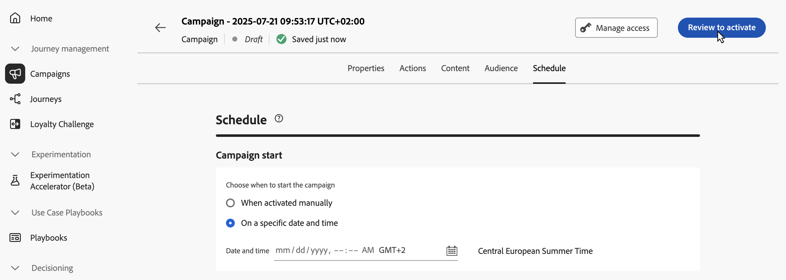

# Revise y active la campaña activada por API {#api-review}

Una vez configurada la campaña activada por la API, debe revisar su parámetro y contenido antes de activarla. Para ello, siga estos pasos:

>[!IMPORTANT]
>
> Si la campaña está sujeta a una directiva de aprobación, debe solicitar la aprobación para poder enviar la campaña. [Más información](../test-approve/gs-approval.md)

1. En la pantalla de configuración de la campaña, haga clic en **[!UICONTROL Revisar para activar]** y mostrar un resumen de la campaña.

   

1. Se muestra un resumen de la configuración de la campaña, que le permite comprobar si algún parámetro es incorrecto o falta y modificar la campaña si es necesario.

   En caso de errores, no puede activar la campaña. Resuelva los errores antes de continuar.

   

1. Compruebe que la campaña esté configurada correctamente y luego haga clic en **[!UICONTROL Activar]**.

1. La campaña se activa. Su estado es **[!UICONTROL Activo]** o **[!UICONTROL Programado]** si ha especificado una fecha de inicio.

   El estado **[!UICONTROL Completado]** se asigna automáticamente a la campaña 3 días después de activarse o en la fecha de finalización de la campaña si esta tiene una ejecución recurrente. [Más información sobre los estados de las campañas](manage-campaigns.md#statuses).

   Si no se ha especificado una fecha de finalización, la campaña mantiene el estado **[!UICONTROL Activo]**. Para cambiarlo, debe detener la campaña manualmente. [Aprenda a detener una campaña](manage-campaigns.md)

1. Una vez activada una campaña, puede comprobar en cualquier momento su información abriéndola. El resumen le permite obtener estadísticas sobre el número de perfiles objetivo y las acciones enviadas y fallidas.

   También puede obtener estadísticas adicionales en informes dedicados si hace clic en el botón **[!UICONTROL Informes]**. [Más información](../reports/campaign-global-report-cja.md)

   

## Próximos pasos {#next}

Una vez que la campaña activada por la API esté lista, puede almacenar en déclencheur su ejecución mediante las API. [Más información](trigger-campaigns.md)
