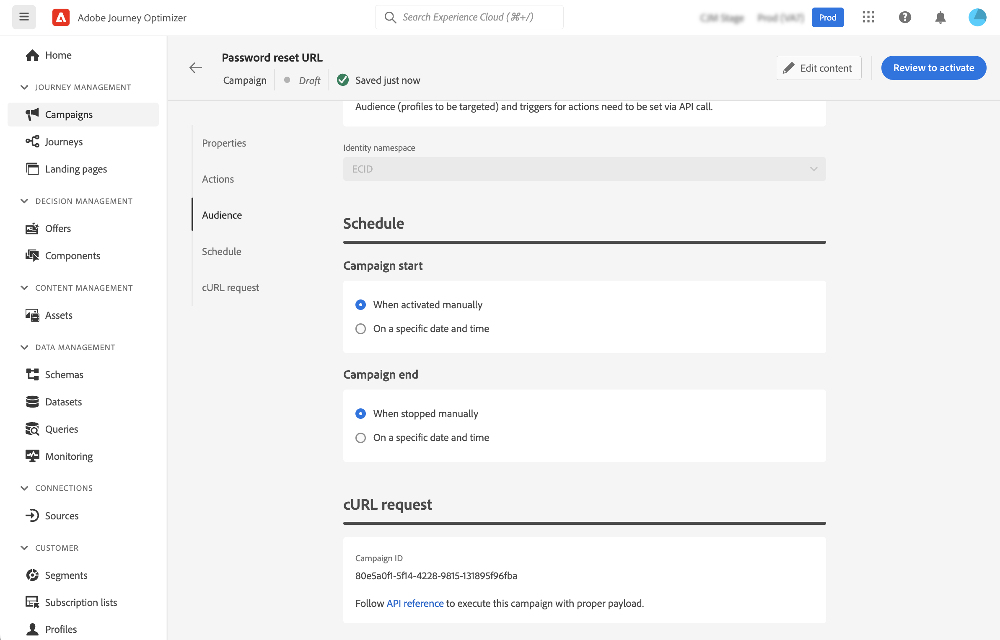

# Ejecución de una campaña activada por API {#execute}

>[!BEGINSHADEBOX]

**En esta página:** Recupere la solicitud cURL generada y úsela para almacenar en déclencheur su campaña activada por la API activa a través de las API, con instrucciones para solucionar problemas para que pueda resolver los retrasos de entrega y los errores de autenticación.

>[!ENDSHADEBOX]

Una vez activada la campaña, debe recuperar la solicitud cURL de muestra generada y utilizarla en la API para crear la carga útil y almacenar la campaña en déclencheur.

## Lectura obligatoria {#must-read}

* **Fechas de inicio y finalización de la campaña**: si ha configurado una fecha específica de inicio o finalización al crear la campaña, esta no se ejecutará fuera de estas fechas y las llamadas a la API fallarán.

* **Tiempo de espera de llamada**: la llamada a la API de REST de ejecución de mensaje interactivo tiene un tiempo de espera de 60 segundos. Sin embargo, hay reintentos internos en caso de tiempos de espera inesperados para garantizar el envío.

## Déclencheur de la campaña {#trigger}

1. Abra la campaña y copie y pegue la solicitud de carga útil de la sección **[!UICONTROL cURL request]**. Esta carga útil incluye todas las variables de personalización (perfil y contexto) utilizadas en el mensaje. Está disponible una vez que la campaña está activa.

   

   >[!IMPORTANT]
   >
   >Los extremos de la sección cURL difieren entre las campañas estándar y [de alto rendimiento](../campaigns/api-triggered-high-throughput.md).

1. Utilice esta solicitud de cURL en las API para crear la carga útil y almacenar en déclencheur la campaña. Para obtener más información, consulte la [documentación de la API de ejecución de mensajes interactiva](https://developer.adobe.com/journey-optimizer-apis/references/messaging#tag/execution), donde se enumeran todos los extremos de las campañas de rendimiento estándar y alto.

   También hay ejemplos de llamadas API disponibles en [esta página](https://developer.adobe.com/journey-optimizer-apis/references/messaging-samples).

## Resolución de problemas {#troubleshooting}

### Retrasos de envío de correo electrónico {#delivery-delays}

Si los tiempos de entrega de correos electrónicos superan las expectativas, investigue las posibles interrupciones o problemas de rendimiento con servicios externos, como proveedores de infraestructura en la nube o proveedores de servicios de correo electrónico. Los registros de Journey Optimizer registran las marcas de hora de salida de los mensajes, lo que puede ayudar a determinar si se produjeron retrasos en la fase posterior de la canalización de envíos.

### Errores de autenticación de Azure cosmos DB (error de servidor interno 500) {#cosmosdb-auth-errors}

Si encuentra **500 errores internos del servidor** al activar campañas activadas por API, y los registros del sistema muestran un error **403 prohibido** de Azure Cosmos DB con un mensaje como:

_&quot;El acceso a su cuenta está revocado actualmente porque el servicio Azure Cosmos DB no puede obtener el token de autenticación AAD para la identidad predeterminada de la cuenta&quot;_

Este error suele producirse cuando la entidad de seguridad de servicio de Azure necesaria para la autenticación de Cosmos DB se ha deshabilitado, eliminado o configurado incorrectamente.

+++Cómo resolver este problema

1. **Compruebe la entidad de seguridad del servicio Azure**. Asegúrese de que la identidad administrada o la entidad de seguridad del servicio Azure esté habilitada y de que no se haya deshabilitado ni eliminado en Azure Active Directory.

1. **Comprobar permisos**: confirme que la entidad de seguridad de servicio tiene los permisos necesarios para acceder a los recursos de Azure Key Vault y Cosmos DB. El principal de servicio debe tener asignaciones de funciones adecuadas para autenticarse con Azure Cosmos DB.

1. **Revisar la configuración de Azure Cosmos DB CMK**: si utiliza claves administradas por el cliente (CMK), consulte la [guía de solución de problemas de Azure Cosmos DB CMK](https://learn.microsoft.com/en-us/azure/cosmos-db/cmk-troubleshooting-guide#azure-active-directory-token-acquisition-error){target="_blank"} para ver los pasos detallados para restaurar la adquisición de tokens AAD.

1. **Volver a habilitar y probar**: después de corregir la configuración, vuelva a habilitar la entidad de seguridad de servicio si estaba deshabilitada y vuelva a probar las llamadas a la API de campaña transaccional para confirmar que la autenticación se realice correctamente y que los mensajes se entreguen.

>[!NOTE]
>
>Este problema suele deberse a una configuración incorrecta o a la desactivación accidental de la entidad de seguridad del servicio de Azure necesaria para la autenticación de Cosmos DB. Si mantiene la entidad de seguridad de servicio habilitada y configurada correctamente, se evitará este error en el futuro.

+++
