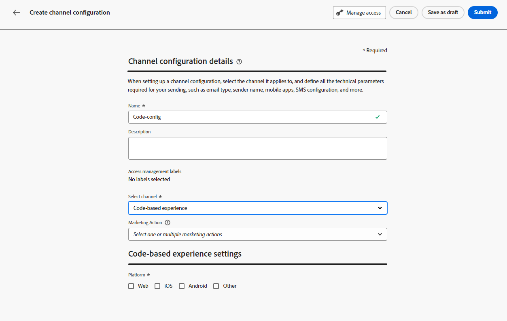
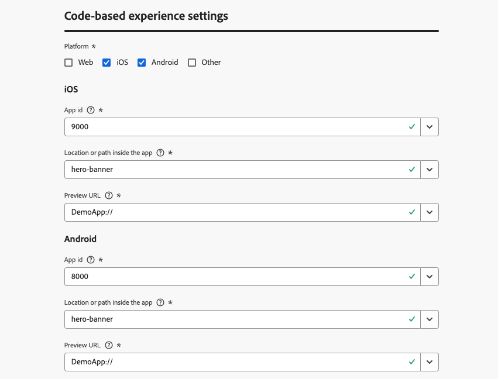

# Configuración de la experiencia basada en código {#code-based-configuration}

>[!CONTEXTUALHELP]
>id="ajo_code_based_surface"
>title="Definición de una configuración de experiencia basada en código"
>abstract="Una configuración basada en código define la ruta y la ubicación dentro de la aplicación, identificada de forma exclusiva por un URI en la implementación de la aplicación, donde se enviará y consumirá el contenido."

Antes de [crear su experiencia](create-code-based.md), debe crear una configuración de experiencia basada en código en la que defina dónde se enviará y consumirá el contenido dentro de su aplicación.

Una configuración de experiencia basada en código debe hacer referencia a la superficie, que es básicamente la ubicación donde desea procesar los cambios. Según la plataforma seleccionada, se debe introducir una ubicación/ruta o el URI de superficie completo. [Más información](code-based-surface.md)

>[!NOTE]
>
>Cuando tiene varias acciones de experiencia basadas en código que utilizan la misma configuración de canal (y, por lo tanto, se ejecutan en la misma superficie), la **[!UICONTROL puntuación de prioridad]** de la campaña o el recorrido determina qué se envía al usuario final si cumple los requisitos para más de una acción. [Más información sobre las puntuaciones de prioridad](../conflict-prioritization/priority-scores.md)

## Cree una configuración de experiencia basada en código {#create-code-based-configuration}

>[!CONTEXTUALHELP]
>id="ajo_admin_location"
>title="Indica la ubicación específica dentro de la página o aplicación"
>abstract="Este campo especifica el destino exacto en la página o dentro de la aplicación a la que deseas que accedan los usuarios. Puede ser una sección en particular dentro de una página web o una página profunda dentro de la estructura de navegación de la aplicación."

>[!CONTEXTUALHELP]
>id="ajo_admin_default_mobile_url"
>title="Defina una URL para la creación de contenido y previsualización"
>abstract="Este campo garantiza que las páginas generadas o que coincidan con la regla tengan una URL designada, esencial para crear y previsualizar contenido de forma eficaz."

Para crear una configuración de canal de experiencia basada en código, siga estos pasos:

1. Acceda al menú **[!UICONTROL Canales]** > **[!UICONTROL Configuración general]** > **[!UICONTROL Configuraciones de canal]** y luego haga clic en **[!UICONTROL Crear configuración de canal]**.

   

1. Introduzca un nombre y una descripción (opcional) para la configuración.

   >[!NOTE]
   >
   > Los nombres deben comenzar por una letra (A-Z). Solo puede contener caracteres alfanuméricos. También puede utilizar caracteres de guion bajo `_`, punto `.` y guion `-`.

1. Para asignar etiquetas de uso de datos principales o personalizadas a la configuración, puedes seleccionar **[!UICONTROL Administrar acceso]**. [Más información acerca del Control de acceso de nivel de objeto (OLAC)](../administration/object-based-access.md)

1. Seleccione **[!UICONTROL Acciones de marketing]** para asociar directivas de consentimiento a los mensajes que usan esta configuración. Todas las políticas de consentimiento asociadas con la acción de marketing se aprovechan para respetar las preferencias de los clientes. [Más información](../action/consent.md#surface-marketing-actions)

1. Seleccione el canal **Experiencia basada en código**.

   

1. Seleccione la plataforma para la que se aplicará la experiencia basada en código:

   * [Web](#web)
   * [IOS o ANDROID](#mobile)
   * [Otras](#other)

   >[!NOTE]
   >
   >Puede seleccionar varias plataformas. Al elegir varias plataformas, el contenido se envía a todas las páginas o aplicaciones seleccionadas.

1. Elija el formato que espera la aplicación para esta ubicación en particular. Se utilizará al crear la experiencia basada en código en campañas y recorridos.

   

1. Haga clic en **[!UICONTROL Enviar]** para guardar los cambios.

Ahora puede seleccionar esta configuración al [crear una experiencia basada en código](create-code-based.md) en sus campañas y recorridos.

>[!NOTE]
>
>El equipo de implementación de la aplicación es responsable de realizar llamadas explícitas de API o SDK para recuperar contenido para las superficies definidas en la configuración de experiencia basada en código seleccionada. Obtenga más información acerca de las diferentes implementaciones de clientes en [esta sección](code-based-implementation-samples.md).

### Plataformas web {#web}

>[!CONTEXTUALHELP]
>id="ajo_admin_default_web_url"
>title="Defina una URL para la creación de contenido y previsualización"
>abstract="Este campo garantiza que las páginas generadas o que coincidan con la regla tengan una URL designada, esencial para crear y previsualizar contenido de forma eficaz."

Para definir los ajustes de configuración de la experiencia basada en código para las plataformas web, siga los pasos a continuación.

1. Seleccione una de las siguientes opciones:

   * **[!UICONTROL Página individual]**: si desea aplicar los cambios a una sola página exclusivamente, escriba una **[!UICONTROL URL de página]**.

     

   * **[!UICONTROL Regla de coincidencia de páginas]**: para segmentar varias direcciones URL que coincidan con la misma regla, genere una o más reglas. [Más información](../web/web-configuration.md#web-page-matching-rule)

     <!--This could be used to apply changes universally across a website, such as updating a hero banner across all pages or adding a top image to display on every product page.-->

     Por ejemplo, si desea editar elementos que se muestran en todas las páginas de productos femeninas del sitio web de Luma, seleccione **[!UICONTROL Dominio]** > **[!UICONTROL Comienza con]** > `luma` y **[!UICONTROL Página]** > **[!UICONTROL Contiene]** > `women`.

     

1. Lo siguiente se aplica a la URL de vista previa:

   * Si se introduce una dirección URL de una sola página, se utilizará para la vista previa; no es necesario introducir otra dirección URL.
   * Si se selecciona [páginas que coinciden con la regla](../web/web-configuration.md#web-page-matching-rule), debe introducir una **[!UICONTROL URL de creación y vista previa predeterminada]** que se utilizará para obtener una vista previa de la experiencia en un explorador. [Más información](test-code-based.md#preview-on-device)

     

1. El campo **[!UICONTROL Ubicación en la página]** especifica el destino exacto dentro de la página a la que desea que accedan los usuarios. Puede ser una sección en particular de una página dentro de la estructura de navegación del sitio, como &quot;banner a pantalla completa&quot; o &quot;carril del producto&quot;.

   >[!CAUTION]
   >
   >La cadena o ruta introducida en este campo debe coincidir con la declarada en la implementación de la aplicación o página. Esto garantiza que el contenido se envíe a la ubicación deseada dentro de la aplicación o página especificada. [Más información](code-based-surface.md#uri-composition)

   

### Plataformas móviles (iOS y Android) {#mobile}

>[!CONTEXTUALHELP]
>id="ajo_admin_app_id"
>title="Proporcione la ID de la aplicación"
>abstract="Introduzca el ID de la aplicación para una identificación y configuración precisas dentro del entorno operativo de la aplicación, lo que garantiza una integración y funcionalidad optimizadas."

>[!CONTEXTUALHELP]
>id="ajo_admin_mobile_url_preview"
>title="Introduzca la URL para previsualizar el contenido"
>abstract="Este campo es esencial para habilitar la simulación y la previsualización del contenido directamente en el dispositivo dentro de la aplicación."

Para definir los ajustes de configuración de la experiencia basada en código para las plataformas móviles, siga los pasos a continuación.

1. Escriba su **[!UICONTROL ID de aplicación]**. Esto permite una identificación y configuración precisas dentro del entorno operativo de la aplicación y garantiza una integración y funcionalidad sin problemas.

1. Proporcione la **[!UICONTROL ubicación o ruta de acceso dentro de la aplicación]**. Este campo especifica el destino exacto dentro de la aplicación a la que desea que accedan los usuarios. Puede ser una sección en particular o una página en la estructura de navegación de la aplicación, como un banner a pantalla completa o un carril del producto.

   

1. Rellene el campo **[!UICONTROL URL de vista previa]** para habilitar las vistas previas en el dispositivo. Esta dirección URL informa al servicio de vista previa de la dirección URL específica que se debe utilizar al activar la vista previa en el dispositivo. [Más información](test-code-based.md#preview-on-device)

   La URL de vista previa es un vínculo profundo configurado por el desarrollador de la aplicación dentro de la aplicación. Esto garantiza que cualquier dirección URL que coincida con el esquema de vínculos profundos se abra en la aplicación en lugar de en un explorador web móvil. Póngase en contacto con el desarrollador de su aplicación para obtener el esquema de vínculos profundos configurado para su aplicación.

+++  Los siguientes recursos pueden ayudarle a configurar vínculos profundos para la implementación de su aplicación

   * Para Android:

      * [Creación de vínculos profundos al contexto de la aplicación](https://developer.android.com/training/app-links/deep-linking)

   * Para iOS:

      * [Definición de un esquema de URL personalizado para la aplicación](https://developer.apple.com/documentation/xcode/defining-a-custom-url-scheme-for-your-app)

      * [Compatibilidad con vínculos universales en la aplicación](https://developer.apple.com/documentation/xcode/supporting-universal-links-in-your-app)

+++

   >[!NOTE]
   >
   >Si encuentra problemas al obtener una vista previa de la experiencia, consulte [esta documentación](https://experienceleague.adobe.com/es/docs/experience-platform/assurance/troubleshooting#app-does-not-open-link).

### Otras plataformas {#other}

Para definir los ajustes de configuración de experiencias basadas en código para otras plataformas (como consolas de vídeo, dispositivos conectados a TV, televisores inteligentes, quioscos, cajeros automáticos, asistentes de voz, dispositivos IoT, etc.), siga los pasos a continuación.

1. Seleccione **[!UICONTROL Other]** como plataforma si la implementación no es para web, iOS o Android, o si necesita direccionar URI específicos.

1. Escriba el **[!UICONTROL URI de superficie]**. Un URI de superficie es un identificador único correspondiente a la entidad en la que desea ofrecer su experiencia. [Más información](code-based-surface.md#surface-uri)

   

   >[!CAUTION]
   >
   >Asegúrese de introducir un URI de superficie que coincida con el utilizado en su propia implementación. De lo contrario, no se podrán entregar los cambios. [Más información](code-based-surface.md#uri-composition)

1. **[!UICONTROL Agregue otro URI de superficie]** si es necesario. Se pueden añadir hasta 10 URI.

   >[!NOTE]
   >
   >Al añadir varios URI, el contenido se envía a todos los componentes enumerados.
