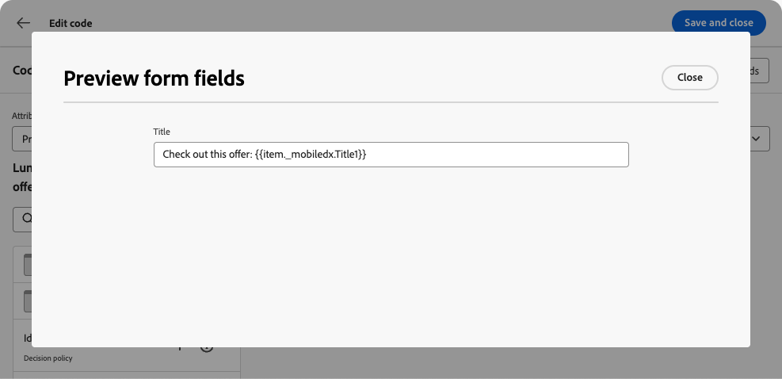

# Uso de campos de formulario editables en experiencias basadas en código {#code-based-form-fields}

Para obtener más flexibilidad y control sobre las experiencias basadas en código, [!DNL Journey Optimizer] permite que su equipo de desarrollo cree plantillas de contenido JSON o HTML que contengan campos editables predefinidos específicos.

Al crear una experiencia basada en código, los especialistas en marketing no técnicos pueden editar directamente estos campos en la interfaz, sin necesidad de abrir el editor de personalización o de tocar cualquier otro elemento de código en su recorrido o campaña.

Esta capacidad ofrece una experiencia simplificada para los usuarios de marketing, a la vez que permite a los desarrolladores un mayor control sobre el contenido del código, lo que reduce el espacio para errores.

## Comprender la sintaxis del campo de formulario {#form-field-syntax}

Para poder editar partes de una carga útil de código HTML o JSON, debe utilizar una sintaxis específica en el editor de expresiones. Esto implica declarar una **variable** con un valor predeterminado que los usuarios pueden invalidar después de aplicar la plantilla de contenido a su experiencia basada en código.

Por ejemplo, supongamos que desea crear una plantilla de contenido para aplicarla a las experiencias basadas en código y permitir a los usuarios personalizar un color específico utilizado en diferentes ubicaciones, como marcos o colores de fondo de botones.

Al crear la plantilla de contenido, debe declarar una variable con un **identificador único**, por ejemplo &quot;*color*&quot;, y llamarla a las ubicaciones deseadas en el contenido donde desee aplicar este color.

Al aplicar la plantilla de contenido a su contenido, los usuarios pueden personalizar el color utilizado siempre que se haga referencia a la variable.

## Añadir campos editables a plantillas de contenido HTML o JSON {#add-editable-fields}

>[!CONTEXTUALHELP]
>id="ajo_cbe_preview_form_fields"
>title="Compruebe la renderización de los campos del formulario"
>abstract="En las plantillas de contenido JSON o HTML, puede definir campos editables específicos que permitirán a los usuarios no técnicos editar fácilmente el contenido en experiencias basadas en código sin necesidad de manipular el código. Cree esos campos con la sintaxis dedicada y previsualícelos con este botón."

Para poder editar parte de su código JSON o HTML, comience creando una experiencia basada en código [plantilla de contenido](../content-management/content-templates.md) en la que puede definir campos de formulario específicos.

>[!NOTE]
>
>Este paso lo suele realizar un desarrollador.

➡️ [Aprenda a agregar campos editables a plantillas de experiencia basadas en código en este vídeo](#video)

1. Cree una plantilla de contenido y seleccione el canal **[!UICONTROL Experiencia basada en código]**. [Aprenda a crear plantillas](../content-management/create-content-templates.md)

1. Seleccione el modo de creación: HTML o JSON.

   >[!CAUTION]
   >
   >Si cambia el modo de creación, se perderá todo el código actual. Las experiencias basadas en código y basadas en esta plantilla deben utilizar el mismo modo de creación.

1. Abra [editor de personalización](../personalization/personalization-build-expressions.md) para editar el contenido del código.

1. Para definir un campo de formulario editable <!--To declare the variable you want users to edit-->, vaya al menú **[!UICONTROL Funciones de ayuda]** en el panel de navegación izquierdo y agregue el atributo **inline**. La sintaxis para declarar y llamar a la variable se agrega automáticamente al contenido.

   {width="85%"}

1. Reemplace `"name"` con un identificador único para identificar el campo editable. Por ejemplo, introduzca &quot;imgURL&quot;.

   >[!NOTE]
   >
   >El ID de campo debe ser único y no puede contener espacios. Este ID debe utilizarse en cualquier lugar del contenido donde desee mostrar el valor de la variable.

1. Adapte la sintaxis para adaptarla a sus necesidades añadiendo parámetros detallados en la siguiente tabla:

   | Acción | Parámetro | Ejemplo |
   | ------- | ------- | ------- |
   | Declarar un campo editable con un **valor predeterminado**. Al añadir la plantilla al contenido, se utiliza este valor predeterminado si no se personaliza. | Agregue el valor predeterminado entre las etiquetas en línea. | `{{#inline "editableFieldID"}}default_value{{/inline}}` |
   | Defina una **etiqueta** para el campo editable. Esta etiqueta se muestra en el editor de código al editar los campos de la plantilla. | `name="title"` | `{{#inline "editableFieldID" name="title"}}default_value{{/inline}}` |

   <!--
    | Action | Parameter| Example |
    | ------- | ------- | ------- |
    |Declare an editable field containing an **image source** that needs to be published.|`assetType="image"`|`{{#inline "editableFieldID" assetType="image"}}default_value{{/inline}}`|
    |Declare an editable field containing an **URL** that needs to be tracked.br/>Note that out-of-the-box "Mirror page URL" and "Unsubscribe link" predefined blocks cannot become editable fields.>|`assetType="url"`|`{{#inline "editableFieldID" assetType="url"}}default_value{{/inline}}`|
    -->

1. Haga clic en **[!UICONTROL Vista previa de campos de formulario]** para comprobar cómo se mostrarán los campos de formulario editables en las experiencias basadas en código que apliquen esta plantilla.

   {width="85%"}

1. Utilice la sintaxis `{{{name}}}` en su código en cada lugar donde desee mostrar el valor del campo editable. Reemplazar `name` por el ID único del campo definido anteriormente.

   {width="85%"}

1. Continúe de forma similar para agregar otros campos editables, ajustando cada uno de ellos con las etiquetas `{{#inline}}` y `{{/inline}}`.

1. Edite el resto del código según sea necesario, incluidos los ID correspondientes a los campos editables definidos. [Descubra cómo](create-code-based.md#edit-code)

   

1. Guarde la plantilla.

### Usar directivas de decisión en formularios de campo editables {#decision-policy-in-form-fields}

Al crear una plantilla de contenido de experiencia basada en código, puede utilizar una política de decisión para aprovechar las ofertas en los campos de formulario editables.

1. Cree una plantilla de experiencia basada en código como se describe [arriba](#add-editable-fields).

1. Haga clic en **[!UICONTROL Agregar directiva de decisión]** mediante el icono **[!UICONTROL Mostrar decisión]** del carril derecho de la pantalla de edición o en el editor de expresiones desde la sección **[!UICONTROL Directiva de decisión]** del menú de la izquierda.

   Aprenda a crear una directiva de decisión en [esta sección](../experience-decisioning/create-decision.md#add-decision).

1. Haga clic en el botón **[!UICONTROL Insertar directiva]**. Se agrega el código correspondiente a la política de decisión.

   

1. Después de la etiqueta `{{#each}}`, inserte el código correspondiente a los campos de formulario editables que desee agregar mediante la sintaxis **inline** descrita [anteriormente](#add-editable-fields). Reemplace `"name"` con un identificador único para identificar su campo editable. En este ejemplo, utilice &quot;title&quot;.

   {width="90%"}

1. Haga clic en **[!UICONTROL Vista previa de campos de formulario]** para comprobar cómo se mostrarán los campos de formulario editables en las experiencias basadas en código que apliquen esta plantilla.

   {width="70%"}

1. Inserte el resto del código encima de la etiqueta `{{/each}}`. Utilice la sintaxis `{{{name}}}` en su código en cada lugar donde desee mostrar el valor de su campo editable. En este ejemplo, reemplace `name` por &quot;title&quot;.

   {width="85%"}

1. Guarde la plantilla.

### Ejemplos de código {#code-examples}

A continuación se muestran algunos ejemplos de plantillas JSON y HTML, algunas de las cuales incluyen políticas de decisión.

**Plantilla JSON:**

```
{{#inline "title" name="Title"}}Best gear for winter is here for you!{{/inline}} 
{{#inline "description" name="Description"}}Add description{{/inline}} 
{{#inline "imgURL" name="Image Link"}}Add link{{/inline}} 
{{#inline "number_of_items" name="Number of items"}}23{{/inline}}

{
  "title": "{{{title}}}",
  "description": "{{{description}}}",
  "imageUrl": "{{{imgURL}}}",
  "number_of_items": {{{number_of_items}}}, 
  "code": "DEFAULT"
}
```

>[!NOTE]
>
>Al hacer referencia a los campos en línea en la carga útil JSON:
>
>   * Los campos de tipo cadena deben estar entre comillas dobles.
>   * Los números enteros o booleanos NO deben incluirse entre comillas dobles. (Consulte el campo `number_of_items` en el ejemplo anterior).

**Plantilla JSON con toma de decisiones:**

```
{ 
"offer": [ 
{{#each decisionPolicy.fff709b7-7fef-4e4e-83d7-594fbcf196c1.items as |item|}} 
{{#inline "title" name="Title"}}{{item._mobiledx.Title1}}{{/inline}} {{#inline "description" name="Description"}}{{item._mobiledx.Title2}}{{/inline}} {{#inline "imgURL" name="Image Link"}}https://luma.enablementadobe.com/content/luma/us/en/experience/warming-up/_jcr_content/root/hero_image.coreimg.jpeg{{/inline}} 

{ 
"title": "{{{title}}}", 
"description": "{{{description}}}", 
"imageUrl": "{{{imgURL}}}", 
"link": "https://lumaenablement.adobe.com/web/luma/home", "code": "DEFAULT" 
}, 
{{/each}}
] 
}
```

>[!NOTE]
>
>Los campos en línea para los que desee utilizar elementos de toma de decisiones deben colocarse dentro del bloque de directivas de decisión, entre las etiquetas `{{#each}}` y `{{/each}}`s.

**Plantilla de HTML:**

```
{{#inline "title" name="Title"}}Please enter title here{{/inline}} 
{{#inline "imgSrc" name="Image link"}}{{/inline}} 

<div class="TopRibbon__content">{{{title}}}</div> 
<style> .theme-luma .TopRibbon { background-color: #200098; }</style>
```

**Plantilla de HTML con toma de decisiones:**

```
{{#each decisionPolicy.f112884a-5654-43ad-9d6d-dbd32ae23ee6.items as |item|}} 
{{#inline "title" name="Title"}}Title is: {{item._mobiledx.Title1}}{{/inline}} 

<div class="TopRibbon__content">{{{title}}}</div> 
<style> .theme-luma .TopRibbon { background-color: #200098; }</style> 

{{/each}}
```

## Editar campos de formulario en una experiencia basada en código {#edit-form-fields}

>[!CONTEXTUALHELP]
>id="ajo_code_based_form_fields"
>title="¿Qué son los campos de formulario?"
>abstract="Esta experiencia basada en código contiene campos de formulario que se pueden editar fácilmente sin necesidad de manipular el código en el editor de personalización."

Ahora que se ha creado la plantilla de contenido que contiene campos de formulario editables predefinidos, puede crear una experiencia basada en código mediante esta plantilla de contenido.

Podrá editar fácilmente los campos de formulario desde un recorrido de experiencia o una campaña basados en código, sin abrir el editor de personalización.

>[!NOTE]
>
>Este paso lo suele realizar un experto en marketing.

1. En la actividad de recorrido o en la pantalla de edición de la campaña, seleccione la plantilla de contenido que contiene los campos de formulario editables. [Aprenda a utilizar las plantillas de contenido](../content-management/use-content-templates.md)

   {width="60%"}

   >[!CAUTION]
   >
   >Las plantillas disponibles para elegir están enfocadas a HTML o JSON según la configuración de canal seleccionada previamente. Solo se muestran las plantillas compatibles.

1. Los campos predefinidos en la plantilla de contenido seleccionada están disponibles en el panel derecho. <!--The code preview is displayed with the rest of the code.-->

   

1. Desde la sección **[!UICONTROL Campos de formulario editables]**, puede:

   * Edite cada valor directamente dentro de los campos editables, sin abrir el editor de código.

   {width="60%"}

   * Haga clic en el icono de personalización para editar cada campo con el [editor de código](../personalization/personalization-build-expressions.md).

   {width="70%"}

   >[!NOTE]
   >
   >En ambos casos, solo se puede editar un campo a la vez y no se puede editar el resto del contenido de la experiencia basado en código.

1. Si se agregó [una directiva de decisión](#decision-policy-in-form-fields) a la plantilla de contenido, viene con todos los atributos disponibles en el esquema [catálogo de ofertas](../experience-decisioning/catalogs.md). Puede editar el elemento de decisión en línea o mediante el editor de expresiones.

1. Para editar el resto del código, haga clic en el botón **[!UICONTROL Editar código]** y actualice el contenido completo de la experiencia basado en código, incluidos los campos de formulario editables. [Más información](create-code-based.md#edit-code)

## Vídeo explicativo {#video}

Aprenda a añadir campos editables a plantillas de contenido de canal de experiencia basadas en código.

>[!VIDEO](https://video.tv.adobe.com/v/3463990/?learn=on&#x26;enablevpops)

