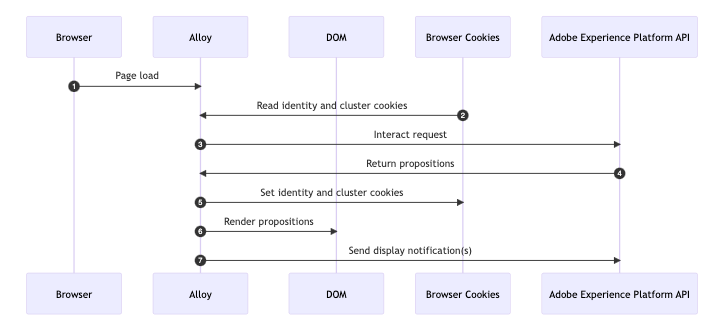
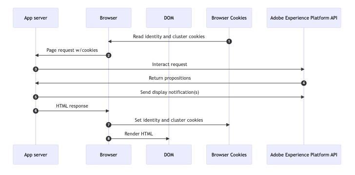

# Code-based implementation methods samples {#implementation-samples}

Code-based experience supports any type of customer implementation. On this page you can find samples for each implementation method:

* [Lado del cliente](#client-side-implementation)
* [Lado del servidor](#server-side-implementation)
* [Hybrid](#hybrid-implementation)

>[!IMPORTANT]
>
>Follow [this link](https://github.com/adobe/alloy-samples/tree/main/ajo){target="_blank"} to find sample implementations for different personalization and experimentation use cases. Check them out and run them in order to better understand what are the implementation steps needed and how the end-to-end personalization flow works.

➡️ Learn more about configuring the Web SDK for code-based experiences and decisioning in [these tutorials](code-based-decisioning-implementations.md#tutorials)

## Client-side implementation {#client-side-implementation}

If you have a client-side implementation, you can use one of the AEP client SDKs: AEP Web SDK or AEP Mobile SDK.

* The steps [below](#client-side-how) describe the process of fetching the content published on the edge by the code-based experience journeys and campaigns in a sample **Web SDK** implementation and displaying the personalized content.

* The steps to implement code-based channel using **Mobile SDK** are described in [this tutorial](https://developer.adobe.com/client-sdks/edge/adobe-journey-optimizer/code-based/tutorial){target="_blank"}.

  >[!NOTE]
  >
  >Sample implementations for mobile use cases are available for [iOS app](https://github.com/adobe/aepsdk-messaging-ios/tree/main/TestApps/MessagingDemoAppSwiftUI){target="_blank"} and [Android app](https://github.com/adobe/aepsdk-messaging-android/tree/main/code/testapp){target="_blank"}.

### How it works - Web SDK {#client-side-how}

1. [Web SDK](https://experienceleague.adobe.com/docs/experience-platform/edge/home.html?lang=es){target="_blank"} is included on the page.

1. You need to use the `sendEvent` command and specify the [surface URI](code-based-surface.md)<!--( or location/path)--> to fetch personalization content.

   ```javascript
   alloy("sendEvent", {
   renderDecisions: true,
   personalization: {
       surfaces: ["#sample-json-content"],
   },
   }).then(applyPersonalization("#sample-json-content"));
   ```

1. Code-based experience items should be manually applied by the implementation code (using the [`applyPersonalization`](https://github.com/adobe/alloy-samples/blob/ac83b6927d007dc456caad2c6ce0b324c99c26c9/ajo/personalization-client-side/public/script.js){target="_blank"} method) to update the DOM based on the decision.

1. For code-based experience journeys and campaigns, display events must manually be sent to indicate when the content has been displayed. This is done via the `sendEvent` command.

   ```javascript
   function sendDisplayEvent(decision) {
     const { id, scope, scopeDetails = {} } = decision;
   
     alloy("sendEvent", {
   
       xdm: {
         eventType: "decisioning.propositionDisplay",
         _experience: {
           decisioning: {
             propositions: [
               {
                 id: id,
                 scope: scope,
                 scopeDetails: scopeDetails,
               },
             ],
           },
         },
       },
     });
   }
   ```

1. For code-based experience journeys and campaigns, interaction events must manually be sent to indicate when a user has interacted with the content. Esto se realiza mediante el comando `sendEvent`.

   ```javascript
   function sendInteractEvent(label, proposition) {
     const { id, scope, scopeDetails = {} } = proposition;
   
     alloy("sendEvent", {
   
       xdm: {
         eventType: "decisioning.propositionInteract",
         _experience: {
           decisioning: {
             propositions: [
               {
                 id: id,
                 scope: scope,
                 scopeDetails: scopeDetails,
               },
             ],
             propositionEventType: {
               interact: 1
             },
             propositionAction: {
               id: label,
               label: label,
               tokens: proposition.items?.[0]?.characteristics?.tokens || []
             },
           },
         },
       },
     });
   }
   ```

   >[!IMPORTANT]
   >
   >El campo `tokens` en `propositionAction` es crítico para un seguimiento y una atribución precisos en Adobe Journey Optimizer Decisioning. Estos tokens permiten:
   >* Atribución de clic adecuada para las actividades de toma de decisiones
   >* Creación de informes precisos de interacciones del usuario con contenido de decisión
   >* Optimización del rendimiento de la oferta en función de la participación del usuario
   >
   >Los tokens generalmente se encuentran en `proposition.items[0].characteristics.tokens` y siempre se deben incluir al rastrear las interacciones del usuario con contenido de decisión.

### Observaciones clave

**Cookies**

Las cookies se utilizan para mantener la identidad del usuario y la información de clúster. Al utilizar una implementación del lado del cliente, Web SDK gestiona el almacenamiento y el envío de estas cookies automáticamente durante el ciclo vital de la solicitud.

| Cookie | Objetivo | Almacenado por | Enviado por |
| ------------------------ | -------------------------------------------------------------------------- | --------- | ------- |
| kndctr_AdobeOrg_identity | Contiene detalles de identidad del usuario | SDK web | SDK web |
| kndctr_AdobeOrg_cluster | Indica qué clúster de Experience Edge se debe usar para cumplir las solicitudes | SDK web | SDK web |

**Solicitar ubicación**

Las solicitudes a la API de Adobe Experience Platform son necesarias para obtener propuestas y enviar una notificación de visualización. Al utilizar una implementación del lado del cliente, Web SDK realiza estas solicitudes cuando se utiliza el comando `sendEvent`.

| Solicitud | Realizado por |
| ---------------------------------------------- | ----------------------------------- |
| interactuar solicitud para obtener propuestas | Web SDK con el comando sendEvent |
| interactuar solicitud para enviar notificaciones de visualización | Web SDK con el comando sendEvent |

**Diagrama de flujo**



## Implementación del lado del servidor {#server-side-implementation}

Si tiene una implementación del lado del servidor, puede utilizar una de la API de AEP Edge Network.

Los pasos siguientes describen el proceso de recuperar el contenido publicado en Edge por los recorridos de experiencia basados en código y las campañas en una implementación de API de Edge Network de ejemplo para una página web y mostrar el contenido personalizado.

### Funcionamiento

1. Se solicita la página web y se incluyen todas las cookies almacenadas anteriormente por el explorador con el prefijo `kndctr_`.
1. Cuando se solicita la página desde el servidor de aplicaciones, se envía un evento al [extremo interactivo de recopilación de datos](https://experienceleague.adobe.com/docs/experience-platform/edge-network-server-api/data-collection/interactive-data-collection.html?lang=es) para recuperar el contenido de personalización. Esta aplicación de ejemplo utiliza algunos métodos de ayuda para simplificar la generación y el envío de solicitudes a la API (consulte [aepEdgeClient.js](https://github.com/adobe/alloy-samples/blob/ac83b6927d007dc456caad2c6ce0b324c99c26c9/common/aepEdgeClient.js){target="_blank"}). Pero la solicitud es simplemente un `POST` con una carga útil que contiene un evento y una consulta. Las cookies (si están disponibles) del paso anterior se incluyen con la solicitud en la matriz `meta>state>entries`.

   ```javascript
   fetch(
     "https://edge.adobedc.net/ee/v2/interact?dataStreamId=abc&requestId=123",
     {
       headers: {
         accept: "*/*",
         "accept-language": "en-US,en;q=0.9",
         "cache-control": "no-cache",
         "content-type": "text/plain; charset=UTF-8",
         pragma: "no-cache",
         "sec-fetch-dest": "empty",
         "sec-fetch-mode": "cors",
         "sec-fetch-site": "cross-site",
         "sec-gpc": "1",
         "Referrer-Policy": "strict-origin-when-cross-origin",
         Referer: "https://localhost/",
       },
       body: JSON.stringify({
         event: {
           xdm: {
             eventType: "decisioning.propositionFetch",
             web: {
               webPageDetails: {
                 URL: "https://localhost/",
               },
               webReferrer: {
                 URL: "",
               },
             },
             identityMap: {
               FPID: [
                 {
                   id: "xyz",
                   authenticatedState: "ambiguous",
                   primary: true,
                 },
               ],
             },
             timestamp: "2022-06-23T22:21:00.878Z",
           },
           data: {},
         },
         query: {
           identity: {
             fetch: ["ECID"],
           },
           personalization: {
             schemas: [
               "https://ns.adobe.com/personalization/default-content-item",
               "https://ns.adobe.com/personalization/html-content-item",
               "https://ns.adobe.com/personalization/json-content-item",
               "https://ns.adobe.com/personalization/redirect-item",
               "https://ns.adobe.com/personalization/dom-action",
             ],
             surfaces: ["web://localhost/","web://localhost/#sample-json-content"],
           },
         },
         meta: {
           state: {
             domain: "localhost",
             cookiesEnabled: true,
             entries: [
               {
                 key: "kndctr_XXX_AdobeOrg_identity",
                 value: "abc123",
               },
               {
                 key: "kndctr_XXX_AdobeOrg_cluster",
                 value: "or2",
               },
             ],
           },
         },
       }),
       method: "POST",
     }
   ).then((res) => res.json());
   ```

1. La experiencia JSON de los recorridos de experiencia basados en código y la campaña se lee desde la respuesta y se utiliza al producir la respuesta de HTML.

1. Para las campañas y los recorridos de experiencias basados en código, los eventos de visualización deben enviarse manualmente en la implementación para indicar cuándo se ha mostrado el recorrido o el contenido de la campaña. En este ejemplo, la notificación se envía del lado del servidor durante el ciclo de vida de la solicitud.

   ```javascript
   function sendDisplayEvent(aepEdgeClient, req, propositions, cookieEntries) {
     const address = getAddress(req);
   
     aepEdgeClient.interact(
       {
         event: {
           xdm: {
             web: {
               webPageDetails: { URL: address },
               webReferrer: { URL: "" },
             },
             timestamp: new Date().toISOString(),
             eventType: "decisioning.propositionDisplay",
             _experience: {
               decisioning: {
                 propositions: propositions.map((proposition) => {
                   const { id, scope, scopeDetails } = proposition;
   
                   return {
                     id,
                     scope,
                     scopeDetails,
                   };
                 }),
               },
             },
           },
         },
         query: { identity: { fetch: ["ECID"] } },
         meta: {
           state: {
             domain: "",
             cookiesEnabled: true,
             entries: [...cookieEntries],
           },
         },
       },
       {
         Referer: address,
       }
     );
   }
   ```

1. Cuando se devuelve la respuesta de HTML, el servidor de aplicaciones establece las cookies de identidad y de clúster en la respuesta.

### Observaciones clave

**Cookies**

Las cookies se utilizan para mantener la identidad del usuario y la información de clúster. Al utilizar una implementación del lado del servidor, el servidor de aplicaciones debe gestionar el almacenamiento y el envío de estas cookies durante el ciclo vital de la solicitud.

| Cookie | Objetivo | Almacenado por | Enviado por |
| ------------------------ | -------------------------------------------------------------------------- | ------------------ | ------------------ |
| kndctr_AdobeOrg_identity | Contiene detalles de identidad del usuario | servidor de aplicaciones | servidor de aplicaciones |
| kndctr_AdobeOrg_cluster | Indica qué clúster de Experience Edge se debe usar para cumplir las solicitudes | servidor de aplicaciones | servidor de aplicaciones |

**Solicitar ubicación**

Las solicitudes a la API de Adobe Experience Platform son necesarias para obtener propuestas y enviar una notificación de visualización. Al utilizar una implementación del lado del cliente, Web SDK realiza estas solicitudes cuando se utiliza el comando `sendEvent`.

| Solicitud | Realizado por |
| ---------------------------------------------- | ------------------------------------------------------------ |
| interactuar solicitud para obtener propuestas | servidor de aplicaciones llamando a la API de Adobe Experience Platform |
| interactuar solicitud para enviar notificaciones de visualización | servidor de aplicaciones llamando a la API de Adobe Experience Platform |

**Diagrama de flujo**



## Implementación híbrida {#hybrid-implementation}

Si tiene una implementación híbrida, consulte los vínculos siguientes.

* Blog técnico de Adobe: [Personalization híbrido en Adobe Experience Platform Web SDK](https://blog.developer.adobe.com/hybrid-personalization-in-the-adobe-experience-platform-web-sdk-6a1bb674bf41){target="_blank"}
* Documentación de SDK: [Personalización híbrida mediante Web SDK y la API de servidor de Edge Network](https://experienceleague.adobe.com/docs/experience-platform/edge/personalization/hybrid-personalization.html?lang=es){target="_blank"}

## Depurar llamadas a la API de red perimetral con garantía de Adobe Experience Platform {#debugging-edge-api-assurance}

Cuando utiliza directamente la API de Edge Network para experiencias basadas en código (no utiliza Web SDK ni Mobile SDK), puede depurar las llamadas a la API con Adobe Experience Platform Assurance incluyendo el ID de sesión de Assurance como encabezado de token de validación.

1. Obtenga su ID de sesión de Assurance de una sesión activa de Adobe Experience Platform Assurance o cree uno con la API de Assurance.

1. Agregue el encabezado `x-adobe-aep-validation-token` con el ID de sesión de Assurance para enrutar las solicitudes de la API de Edge Network a través de la sesión de Assurance.

   **Ejemplo:**

   ```bash
   curl -v 'https://edge.adobedc.net/ee/v1/interact?configId={DATASTREAM_ID}&requestId={REQUEST_ID}' \
   --header 'Content-Type: application/json' \
   --header 'x-adobe-aep-validation-token: {ASSURANCE_SESSION_ID}' \
   --data-raw '{
       "xdm": {
         "identityMap": {
               "ECID": [
                   {
                       "id": "{ECID_VALUE}"
                   }
               ]
           }
       },
       "events": [
           {
               "xdm": {
                   "eventType": "test",
                   "timestamp": "{TIMESTAMP}"
               }
           }
       ]
   }'
   ```

1. Una vez configurada, abra su sesión de Assurance y seleccione la vista **[!UICONTROL Edge Delivery]** para ver las solicitudes y respuestas de la API de Edge Network en tiempo real, incluidas las cargas útiles de solicitudes, el contenido de respuestas, las propuestas de personalización y los mensajes de error.


<!--
## Implementation guides and tutorials {#implementation-guides}

To help you get started with implementing code-based experiences, refer to the comprehensive step-by-step tutorials below:

* **Mobile SDK implementation**: Follow [this tutorial](https://developer.adobe.com/client-sdks/edge/adobe-journey-optimizer/code-based/tutorial){target="_blank"} to learn how to set up code-based experiences on mobile apps using the Adobe Experience Platform Mobile SDK.

* **Web SDK implementation**: Learn how to configure the Web SDK for decisioning and code-based experiences in [these tutorials](code-based-decisioning-implementations.md#tutorials).

* **Decisioning implementation**: To learn how to implement decisioning capabilities on a code-based campaign, follow [this use case tutorial](https://experienceleague.adobe.com/es/docs/journey-optimizer/using/decisioning/experience-decisioning/experience-decisioning-uc){target="_blank"}.
-->
