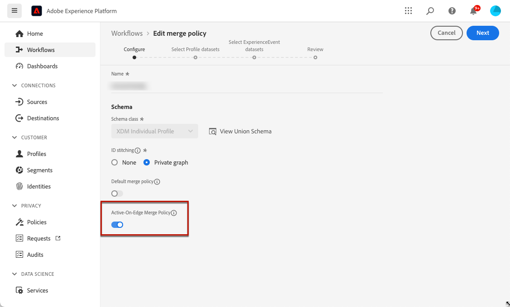

# Requisitos previos de la experiencia basada en código {#code-based-prerequisites}

Para poder usar acciones de experiencia basadas en código en [!DNL Journey Optimizer] y entregar carga útil de contenido de código que puedan usar las aplicaciones, siga los requisitos previos siguientes:

* Para agregar modificaciones a las aplicaciones, debe tener una implementación específica. [Más información](#implementation-prerequisites)

* Para que las experiencias basadas en código se entreguen correctamente, asegúrese de definir la configuración de Adobe Experience Platform detallada [aquí](#delivery-prerequisites).

* Para permitir que los datos se muestren en los informes de experiencias basadas en código, asegúrese de seguir estos [requisitos previos de informes](#reporting-prerequisites).

* Al crear una [configuración de canal de experiencia basada en código](code-based-configuration.md), asegúrese de introducir una cadena/ruta o un URI de superficie que coincida con el declarado en su propia implementación. Esto garantiza que el contenido se envíe a la ubicación deseada dentro de la aplicación o página especificada. De lo contrario, no se podrán entregar los cambios. [Más información](code-based-surface.md)

## Requisitos previos de implementación {#implementation-prerequisites}

La experiencia basada en código admite cualquier tipo de implementación del cliente, como se muestra en las opciones siguientes. Puede utilizar un método de implementación del lado del cliente, del lado del servidor o híbrido para sus propiedades:

* Solo del lado del cliente: para agregar modificaciones a sus páginas web o aplicaciones móviles, debe implementar [Adobe Experience Platform Web SDK](https://experienceleague.adobe.com/docs/platform-learn/implement-web-sdk/overview.html?lang=es){target="_blank"} en su sitio web o [Adobe Experience Platform Mobile SDK](https://developer.adobe.com/client-sdks/documentation/){target="_blank"} en sus aplicaciones móviles.

* Modo híbrido: puede utilizar la [API de servidor de AEP Edge Network](https://experienceleague.adobe.com/docs/experience-platform/edge-network-server-api/data-collection/interactive-data-collection.html?lang=es){target="_blank"} para solicitar la personalización del lado del servidor; la respuesta se proporciona al SDK web de Adobe Experience Platform para procesar las modificaciones del lado del cliente. Obtenga más información en la [Documentación de la API de Edge Network Server de Adobe Experience Platform](https://experienceleague.adobe.com/docs/experience-platform/edge-network-server-api/overview.html){target="_blank"}. Puede obtener más información sobre el modo híbrido y ver algunos ejemplos de implementación en [esta publicación de blog](https://blog.developer.adobe.com/hybrid-personalization-in-the-adobe-experience-platform-web-sdk-6a1bb674bf41){target="_blank"}.

* Del lado del servidor: puede usar la [API de servidor de AEP Edge Network](https://experienceleague.adobe.com/docs/experience-platform/edge-network-server-api/data-collection/interactive-data-collection.html?lang=es){target="_blank"} para solicitar personalización del lado del servidor. El equipo de desarrollo debe gestionar la respuesta y procesar las modificaciones del lado del cliente en la implementación de la aplicación.

Puede encontrar ejemplos para cada uno de los métodos de implementación en [esta sección](code-based-implementation-samples.md).

## Requisitos previos de envío {#delivery-prerequisites}

Para que las experiencias basadas en código se entreguen correctamente, se debe definir la siguiente configuración:

* En la [recopilación de datos de Adobe Experience Platform](https://experienceleague.adobe.com/docs/experience-platform/edge/datastreams/overview.html?lang=es){target="_blank"}, asegúrese de que tiene un conjunto de datos definido como en el servicio **[!UICONTROL Adobe Experience Platform]** para el que tiene habilitada la opción **[!UICONTROL Adobe Journey Optimizer]**.

  Esto garantiza que Adobe Experience Platform Edge gestione correctamente los eventos entrantes de Journey Optimizer. [Más información](https://experienceleague.adobe.com/docs/experience-platform/edge/datastreams/configure.html){target="_blank"}

  

* En [Adobe Experience Platform](https://experienceleague.adobe.com/docs/experience-platform/profile/home.html?lang=es){target="_blank"}, asegúrese de tener habilitada una política de combinación con la opción **[!UICONTROL Política de combinación activa en Edge]**. Para ello, seleccione una directiva en el menú de Experience Platform **[!UICONTROL Cliente]** > **[!UICONTROL Perfiles]** > **[!UICONTROL Políticas de combinación]**. [Más información](https://experienceleague.adobe.com/docs/experience-platform/profile/merge-policies/ui-guide.html#configure){target="_blank"}

  [!DNL Journey Optimizer] canales entrantes utilizan esta política de combinación para activar y publicar correctamente campañas entrantes en el perímetro de. [Más información](https://experienceleague.adobe.com/docs/experience-platform/profile/merge-policies/ui-guide.html?lang=es){target="_blank"}

  

* Para solucionar problemas del envío de experiencias web de Journey Optimizer, puedes usar la vista de **Edge Delivery** en **Adobe Experience Platform Assurance**. Este complemento le permite inspeccionar en detalle las llamadas de solicitud, comprobar si las llamadas perimetrales esperadas se producen según lo previsto y examinar los datos de perfil, incluidos los mapas de identidad, las suscripciones a segmentos y la configuración de consentimiento. Además, puede revisar las actividades para las que la solicitud cumple los requisitos e identificar las que no.

  El uso del complemento **Edge Delivery** le ayuda a obtener la información necesaria para comprender y solucionar problemas de las implementaciones entrantes de forma eficaz.

  [Más información sobre la vista Edge Delivery](https://experienceleague.adobe.com/es/docs/experience-platform/assurance/view/edge-delivery){target="_blank"}

## Requisitos previos de informes {#reporting-prerequisites}

Para habilitar la creación de informes para el canal basado en código, debe asegurarse de que el [conjunto de datos](../data/get-started-datasets.md) utilizado en la implementación de la aplicación [secuencia de datos](https://experienceleague.adobe.com/docs/experience-platform/datastreams/overview.html){target="_blank"} también esté incluido en la configuración de la creación de informes.

Es decir, al configurar los informes, si agrega un conjunto de datos que no está presente en el conjunto de datos de la aplicación, los datos de la aplicación no se mostrarán en los informes.

Aprenda a agregar conjuntos de datos para informes en [esta sección](../reports/reporting-configuration.md#add-datasets).

>[!NOTE]
>
>El sistema de informes [!DNL Journey Optimizer] utiliza el conjunto de datos como de solo lectura y no afecta a la recopilación ni al consumo de datos.
