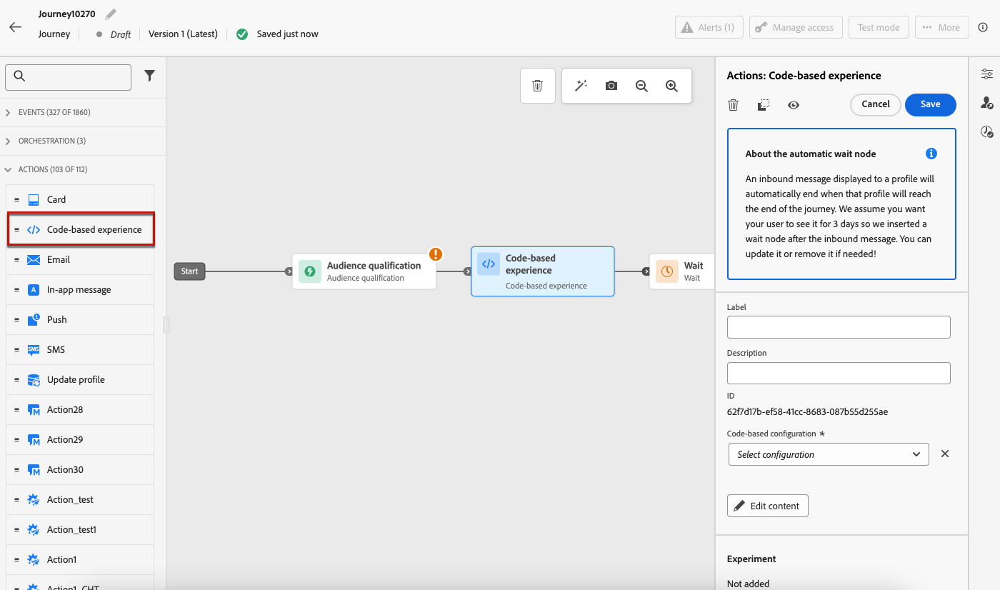
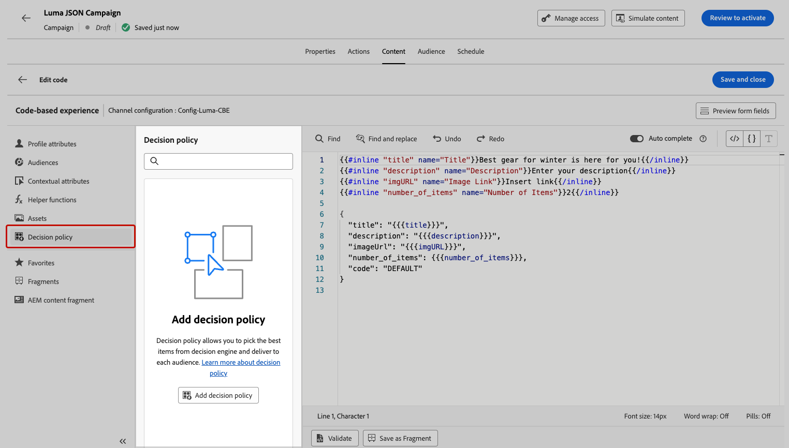

# Creación de experiencias basadas en código {#create-code-based}

En [!DNL Journey Optimizer], puede crear experiencias basadas en código en un recorrido o una campaña.

## Añadir una experiencia basada en código mediante un recorrido o una campaña {#create-code-based-experience}

Para empezar a crear una experiencia basada en código a través de un recorrido o una campaña, siga los pasos a continuación.

>[!BEGINTABS]

>[!TAB Agregar una experiencia basada en código a un recorrido]

Para agregar una actividad de **experiencia basada en código** a un recorrido, siga estos pasos:

1. [Crear un recorrido](../building-journeys/journey-gs.md).

1. Inicie el recorrido con una actividad [Event](../building-journeys/general-events.md) o [Read Audience](../building-journeys/read-audience.md).

1. Arrastre y suelte una actividad **[!UICONTROL Action]** desde la sección **[!UICONTROL Actions]** de la paleta. Más información sobre la [actividad de acción](../building-journeys/journey-action.md).

   >[!IMPORTANT]
   >
   >Dado que ahora se puede acceder a todos los canales nativos a través de la actividad de acción, las actividades de canal nativo heredadas quedarán obsoletas con la versión de marzo. Los recorridos existentes que incluyen acciones heredadas seguirán funcionando tal cual; no se requiere ninguna migración.

1. Seleccione **[!UICONTROL experiencia basada en código]** como tipo de acción.

   

   >[!NOTE]
   >
   >Como **experiencia basada en código** es una actividad de experiencia entrante, viene con una actividad de **espera** de 3 días. [Más información](../building-journeys/wait-activity.md#auto-wait-node)

1. Escriba una **[!UICONTROL etiqueta]** para identificar la acción en el lienzo de recorrido.

1. Haga clic en el botón **[!UICONTROL Configurar acción]**.

1. Se le dirigirá a la ficha **[!UICONTROL Acciones]**. A partir de ahí, seleccione o cree la configuración de experiencia basada en código que desee utilizar. [Más información](code-based-configuration.md)

   

   >[!NOTE]
   >
   >Cuando tiene varias acciones de experiencia basadas en código que utilizan la misma configuración de canal, la **[!UICONTROL puntuación de prioridad]** del recorrido determina qué se envía al usuario final si cumple los requisitos para más de una acción. [Más información sobre las puntuaciones de prioridad](../conflict-prioritization/priority-scores.md)

1. Seleccione el botón **[!UICONTROL Editar contenido]** y edite el contenido como desee con el editor de personalización. [Más información](#edit-code)

   También puede utilizar una plantilla de contenido existente como base para el contenido de código. Tenga en cuenta que las plantillas disponibles para elegir están enfocadas a HTML o JSON en función de la configuración de canal que se haya elegido previamente. [Aprenda a utilizar las plantillas de contenido](../content-management/use-content-templates.md)

1. Puede agregar una o más acciones entrantes a su experiencia basada en código haciendo clic en el botón **[!UICONTROL Agregar acción]**. [Más información](../building-journeys/journey-action.md#multi-action)

1. Volver al lienzo de recorrido. Si es necesario, complete el flujo de recorrido arrastrando y soltando acciones o eventos adicionales. [Más información](../building-journeys/about-journey-activities.md)

Para obtener más información sobre cómo crear, configurar y publicar un recorrido, consulte [esta página](../building-journeys/journey-gs.md).

>[!TAB Creación de una campaña de experiencias basadas en código]

Para empezar a crear tu **experiencia basada en código** a través de una campaña, sigue los pasos a continuación.

1. Cree una campaña. [Más información](../campaigns/create-campaign.md)

1. Seleccione el tipo de campaña **Programada - Marketing**.

1. Complete los pasos para crear una campaña, como las propiedades de la campaña, [audiencia](../audience/about-audiences.md) y [programación](../campaigns/create-campaign.md#schedule). Para obtener más información sobre cómo configurar una campaña, consulte [esta página](../campaigns/get-started-with-campaigns.md).

1. Seleccione la acción **[!UICONTROL Experiencia basada en código]**.

1. Seleccione o cree la configuración de experiencia basada en código que desee utilizar. [Más información](code-based-configuration.md)

   

   >[!NOTE]
   >
   >Cuando tiene varias acciones de experiencia basadas en código que utilizan la misma configuración de canal, la **[!UICONTROL puntuación de prioridad]** de la campaña determina qué se envía al usuario final si cumple los requisitos para más de una acción. [Más información sobre las puntuaciones de prioridad](../conflict-prioritization/priority-scores.md)

1. Edite el contenido como desee mediante el editor de personalización. [Más información](#edit-code)

   También puede utilizar una plantilla de contenido existente como base para el contenido de código. Tenga en cuenta que las plantillas disponibles para elegir están enfocadas a HTML o JSON en función de la configuración de canal que se haya elegido previamente. [Aprenda a utilizar las plantillas de contenido](../content-management/use-content-templates.md)

   <!---->

Para obtener más información sobre cómo crear, configurar y activar una campaña, consulte [esta página](../campaigns/get-started-with-campaigns.md).

➡️ [Aprenda a crear una campaña de experiencia basada en código en este vídeo](#video)

>[!ENDTABS]

## Edición del contenido del código {#edit-code}

>[!CONTEXTUALHELP]
>id="ajo_code_based_experience"
>title="Utilice el editor de personalización"
>abstract="Inserte y edite el código que desea enviar como parte de esta acción de experiencia basada en código."
>additional-url="https://experienceleague.adobe.com/es/docs/journey-optimizer/using/content-management/personalization/personalization-build-expressions" text="Uso del editor de personalización "

Para editar el contenido de su experiencia basada en código, siga los pasos a continuación.

1. En la actividad de recorrido o en la pantalla de edición de la campaña, seleccione **[!UICONTROL Editar código]**.

   

   >[!NOTE]
   >
   >Si utiliza una plantilla de contenido de experiencia basada en código con campos de formulario editables predefinidos, puede administrar el contenido de estos campos sin abrir el editor de personalización. [Más información](code-based-form-fields.md)

1. Se abre [editor de personalización](../personalization/personalization-build-expressions.md). Es una interfaz de creación de experiencias no visual que le permite crear su código.

1. Puede cambiar el modo de creación de HTML a JSON y viceversa.

   

   >[!CAUTION]
   >
   >Cambiar el modo de creación resultará en la pérdida de todo el código actual, por lo que asegúrese de cambiar de modo antes de comenzar la creación.

1. Introduzca el código según sea necesario. Puede aprovechar el editor de personalización [!DNL Journey Optimizer] con todas sus capacidades de personalización y creación. [Más información](../personalization/personalization-build-expressions.md)

1. Puede agregar fragmentos de expresiones HTML o JSON si es necesario. [Descubra cómo](../personalization/use-expression-fragments.md)

   También puede guardar parte del contenido del código como fragmento. [Descubra cómo](../content-management/fragments.md#visual-expression)

1. Con las experiencias basadas en código, puede utilizar la función Decisioning. Seleccione el icono **[!UICONTROL Directiva de decisión]** en la barra izquierda y haga clic en **[!UICONTROL Agregar directiva de decisión]**. [Más información](../experience-decisioning/create-decision.md#create-decision)

   

   <!---->

   Desde la pantalla de edición de recorrido o campaña, también puede añadir directamente una política de decisión sin abrir el editor de personalización. Utilice el icono dedicado en el carril derecho para mostrar la sección **[!UICONTROL Decisioning]**.

   <!---->

   Los pasos detallados para crear una directiva de decisión se presentan en [esta sección](../experience-decisioning/create-decision.md#create-decision).

1. Haga clic en **[!UICONTROL Guardar y cerrar]** para confirmar los cambios.

Ahora, tan pronto como el desarrollador realice una API o una llamada de SDK para recuperar contenido para la superficie definida en la configuración de canal, los cambios se aplicarán a su página web o aplicación.

## Vídeo práctico{#video}

El siguiente vídeo muestra cómo crear una campaña de experiencia basada en código, configurar sus propiedades, probarla y publicarla.

>[!VIDEO](https://video.tv.adobe.com/v/3449456/?captions=spa&quality=12&learn=on)
