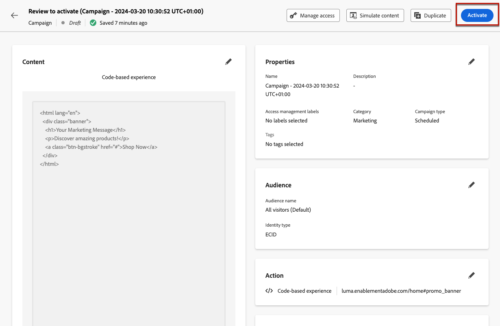

# Creación de experiencias basadas en código {#create-code-based}

Actualmente en [!DNL Journey Optimizer] solo puede crear experiencias basadas en código en **campañas**.

Las protecciones específicas y las recomendaciones para experiencias basadas en código se detallan en [esta página](code-based-prerequisites.md).

## Creación de una campaña basada en código {#create-code-based-campaign}

Para empezar a crear una experiencia basada en código a través de una campaña, siga los pasos a continuación.

1. Acceda al menú **[!UICONTROL Campañas]** y haga clic en **[!UICONTROL Crear campaña]**. [Más información](../campaigns/create-campaign.md)

1. Seleccione el tipo de campaña que desea ejecutar

   * **Programado - Marketing**: ejecute la campaña inmediatamente o en una fecha especificada. Las campañas programadas están destinadas a enviar mensajes de marketing. Se configuran y ejecutan desde la interfaz de usuario de.

   * **Activado por API - Marketing/Transaccional**: ejecute la campaña mediante una llamada de API. Las campañas activadas por API están destinadas a enviar mensajes de marketing o transaccionales, es decir, mensajes enviados después de una acción realizada por un individuo: restablecimiento de contraseña, compra en el carro de compras, etc.

1. Complete los pasos para crear una campaña, como las propiedades de la campaña, [audiencia](../audience/about-audiences.md) y [programación](../campaigns/create-campaign.md#schedule). Para obtener más información sobre cómo configurar una campaña, consulte [esta página](../campaigns/get-started-with-campaigns.md).

1. Seleccione la acción **[!UICONTROL Experiencia basada en código]**.

1. Seleccione o cree la configuración de experiencia basada en código. [Más información](code-based-configuration.md)

   

1. Edite el contenido como desee mediante el editor de personalización. [Más información](#edit-code)

   

## Edición del contenido del código {#edit-code}

>[!CONTEXTUALHELP]
>id="ajo_code_based_experience"
>title="Utilice el editor de personalización"
>abstract="Inserte y edite el código que desea enviar como parte de esta acción de experiencia basada en código."
>additional-url="https://experienceleague.adobe.com/docs/journey-optimizer/using/content-management/personalization/expression-editor/personalization-build-expressions.html?lang=es" text="Introducción al editor de personalización"

1. En la pantalla de edición de campaña, seleccione **[!UICONTROL Editar código]**.

   

1. Se abre [editor de personalización](../personalization/personalization-build-expressions.md). Es una interfaz de creación de experiencias no visual que le permite crear su código.

1. Puede cambiar el modo de creación de HTML a JSON y viceversa.

   

   >[!CAUTION]
   >
   >Cambiar el modo de creación resultará en la pérdida de todo el código actual, por lo que asegúrese de cambiar de modo antes de comenzar la creación.

1. Introduzca el código según sea necesario. Puede aprovechar el editor de personalización [!DNL Journey Optimizer] con todas sus capacidades de personalización y creación. [Más información](../personalization/personalization-build-expressions.md)

1. Puede agregar fragmentos de expresiones JSON o HTML si es necesario. [Descubra cómo](../personalization/use-expression-fragments.md)

   También puede guardar parte del contenido del código como fragmento. [Descubra cómo](../content-management/fragments.md#save-as-expression-fragment)

1. En campañas basadas en código, puede utilizar la función de Experience Decisioning. Seleccione el icono **[!UICONTROL Decisiones]** de la barra izquierda y haga clic en **[!UICONTROL Crear decisión]**. [Más información](../experience-decisioning/create-decision.md)

   

   >[!NOTE]
   >
   >Ahora mismo, la toma de decisiones sobre experiencias solo está disponible para un conjunto de organizaciones (disponibilidad limitada). Para obtener acceso, póngase en contacto con su representante de Adobe.

1. Haga clic en **[!UICONTROL Guardar y cerrar]** para confirmar los cambios.

Ahora, tan pronto como el desarrollador realice una llamada de API o SDK para recuperar contenido para la superficie definida en la configuración de canal, los cambios se aplicarán a su página web o aplicación.

## Prueba de la campaña basada en código {#test-code-based-campaign}

>[!CONTEXTUALHELP]
>id="ajo_code_based_preview"
>title="Previsualización de la experiencia basada en código"
>abstract="Obtenga una simulación del aspecto que tendrá su experiencia basada en código."

Para mostrar una previsualización de la experiencia basada en código modificada, siga los pasos a continuación. Encontrará información detallada sobre cómo seleccionar perfiles de prueba y obtener una vista previa del contenido en [Vista previa y prueba de la página de contenido](../content-management/preview-test.md).

>[!CAUTION]
>
>Debe tener perfiles de prueba disponibles para simular qué ofertas se les enviarán. Aprenda a [crear perfiles de prueba](../audience/creating-test-profiles.md).

1. En el editor de personalización o en la pantalla de edición de contenido, seleccione **[!UICONTROL Simular contenido]**.

   

1. Haga clic en **[!UICONTROL Administrar perfiles de prueba]** para seleccionar uno o más perfiles de prueba.

1. Se muestra una previsualización de la experiencia modificada basada en código.

<!--
    

    You can also open it in the default browser, or copy the test URI to paste it in any browser. This allows you to share the link with your team and stakeholders who will be able to preview the new web experience in any browser before the campaign goes live.

    When copying the test URI, the content displayed is the one personalized for the test profile used when the content simulation was generated in [!DNL Journey Optimizer].-->

## Activar la campaña basada en código {#activate-code-based-campaign}

Una vez que haya definido la campaña basada en código y editado el contenido como desee con el [editor basado en código](#edit-code), puede revisarlo y activarlo. Siga los pasos a continuación.

>[!NOTE]
>
>También puede previsualizar el contenido de la campaña antes de activarlo. [Más información](#test-code-based-campaign)

1. En su campaña basada en código, seleccione **[!UICONTROL Revisar para activar]**.

   

1. Compruebe y edite si es necesario el contenido, las propiedades, la configuración, la audiencia y la programación.

1. Seleccione **[!UICONTROL Activar]**.

   

   >[!NOTE]
   >
   >Después de hacer clic en **[!UICONTROL Activar]**, los cambios en las campañas basadas en código pueden tardar hasta 1 minuto en estar disponibles en tu ubicación.

Su campaña basada en código obtiene el estado **[!UICONTROL Live]** y ahora es visible para la audiencia seleccionada. Cada destinatario de la campaña puede ver las modificaciones.

>[!NOTE]
>
>Si ha definido una programación para su campaña basada en código, tiene el estado **[!UICONTROL Programado]** hasta que se alcance la fecha y la hora de inicio.
>
>Si activa una campaña basada en código que afecte a las mismas ubicaciones que otra campaña que ya está activa, todos los cambios se aplicarán a las ubicaciones.

Más información sobre cómo activar campañas en [esta sección](../campaigns/review-activate-campaign.md).

## Detener una campaña basada en código {#stop-code-based-campaign}

Cuando una campaña basada en código está activa, puede detenerla para evitar que la audiencia vea las modificaciones. Siga los pasos a continuación.

1. Seleccione una campaña en directo en la lista.

1. En el menú superior, seleccione **[!UICONTROL Detener campaña]**.

   

1. Las modificaciones que ha añadido ya no serán visibles para la audiencia que ha definido.

>[!NOTE]
>
>Una vez que se detiene una campaña basada en código, no se puede editar ni volver a activarla. Solo puede duplicarla y activar la campaña duplicada.

## Informes de campaña basados en código

Puede acceder a los informes de campaña basados en código desde la pantalla de resumen de la campaña.

Los informes globales muestran los eventos que se produjeron hace al menos dos horas y cubren los eventos que se produjeron durante un periodo de tiempo seleccionado. En comparación, los informes en directo se centran en los eventos que han tenido lugar en las últimas 24 horas, con un intervalo de tiempo mínimo de dos minutos desde que se produjo el evento.

### Informe en vivo basado en código {#live-report-code-based}

Desde tu **[!UICONTROL informe en vivo]** de campaña, la pestaña de la **[!UICONTROL experiencia basada en código]** detalla la información principal relativa a tus aplicaciones o páginas web. [Más información sobre el informe en vivo](../reports/campaign-live-report.md)

+++Obtenga más información sobre las distintas métricas y widgets disponibles para el informe de experiencia basada en código.

Los KPI de **[!UICONTROL rendimiento de experiencia basado en código]** detallan la información principal relacionada con la participación de los visitantes en sus experiencias basadas en código, como:

* **[!UICONTROL Impresiones]**: número total de experiencias entregadas a todos los usuarios.

* **[!UICONTROL Interacciones]**: número total de interacciones con su aplicación/página. Esto incluye cualquier acción realizada por los usuarios, como clics o cualquier otra interacción.

El gráfico de **[!UICONTROL Resumen de experiencias basado en código]** muestra la evolución de sus experiencias (impresiones, impresiones únicas e interacciones) durante las últimas 24 horas.

<!--The **[!UICONTROL Interactions by element]** table details the main information relative to your visitors' engagement with the various elements on your app/pages.-->
+++

### Informe global basado en código {#global-report-code-based}

Se puede acceder directamente al informe global de campaña basado en código desde la campaña con el botón **[!UICONTROL Ver informe]**. [Más información sobre el informe global](../reports/campaign-global-report.md)

Desde su **[!UICONTROL informe global]** de Campaign, la ficha **[!UICONTROL Experiencia basada en código]** detalla la información principal relativa a sus aplicaciones o páginas web.

<!--image-->

+++Obtenga más información sobre las distintas métricas y widgets disponibles para el informe de experiencia basada en código.

Los KPI de **[!UICONTROL rendimiento de experiencia basado en código]** detallan la información principal relacionada con la participación de los visitantes en sus experiencias, como:

* **[!UICONTROL Impresiones únicas]**: número de usuarios únicos a los que se les entregó la experiencia.

* **[!UICONTROL Impresiones]**: número total de experiencias entregadas a todos los usuarios.

* **[!UICONTROL Interacciones]**: porcentaje de interacciones con su aplicación/página. Esto incluye cualquier acción realizada por los usuarios, como clics o cualquier otra interacción.

El gráfico de **[!UICONTROL Resumen de experiencias basado en código]** muestra la evolución de sus experiencias (impresiones, impresiones e interacciones únicas) durante el período correspondiente.

<!--The **[!UICONTROL Interactions by element]** table details the main information relative to your visitors' engagement with the various elements on your apps/pages.-->
+++

<!--
## How-to video{#video}

The video below shows how to create a code-based campaign, configure its properties, review, and publish it.

>[!VIDEO]()

-->
