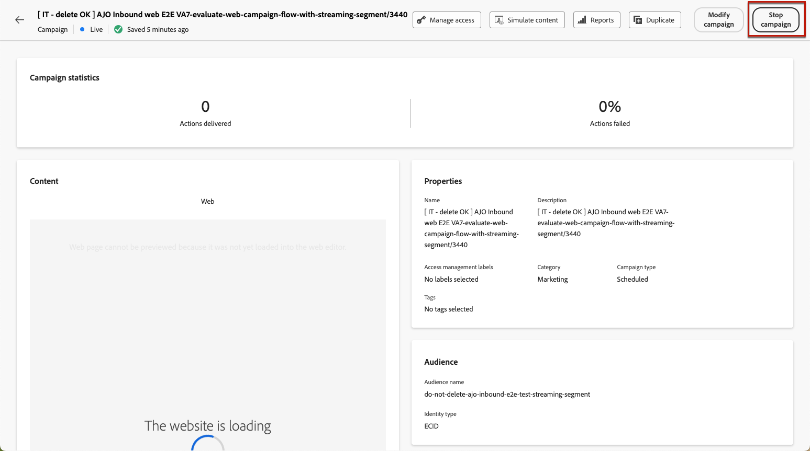

# Administración de experiencias basadas en código {#publish-code-based}

## Publique su experiencia basada en código {#code-based-experience-live}

>[!IMPORTANT]
>
> Si la campaña está sujeta a una directiva de aprobación, deberá solicitar la aprobación para poder activar las experiencias basadas en código. [Más información](../test-approve/gs-approval.md)

Una vez que haya definido la experiencia basada en código y editado el contenido como desee con el [editor basado en código](create-code-based.md#edit-code), puede activar el recorrido o la campaña para que los cambios sean visibles a la audiencia.

También puede obtener una vista previa del contenido de la experiencia basado en código antes de publicarlo. [Más información](test-code-based.md)

>[!NOTE]
>
>Si activa un recorrido o una campaña basada en código que afecte a las mismas páginas que otro recorrido o campaña que ya está activo, todos los cambios se aplicarán al contenido.
>
>Si varios recorridos o campañas basados en código actualizan los mismos elementos del contenido, la campaña o el recorrido de mayor prioridad tiene prioridad. [Más información sobre las puntuaciones de prioridad](../conflict-prioritization/priority-scores.md)

Una vez que el recorrido o la campaña basados en código estén activos, el equipo de implementación de la aplicación será responsable de realizar llamadas explícitas de API o SDK para recuperar contenido para las superficies definidas en la [configuración de experiencia basada en código](code-based-configuration.md) seleccionada. Obtenga más información acerca de las diferentes implementaciones de clientes en [esta sección](code-based-implementation-samples.md).

### Publicación de un recorrido basado en código {#publish-code-based-journey}

Para que la experiencia basada en código esté activa desde un recorrido, siga los pasos a continuación.

1. Compruebe que el recorrido sea válido y que no haya ningún error. [Más información](../building-journeys/troubleshooting.md#checking-for-errors-before-testing)

1. En el recorrido, seleccione la opción **[!UICONTROL Publicar]**, que se encuentra en el menú desplegable superior derecho.

   

   >[!NOTE]
   >
   >Obtenga más información sobre cómo publicar recorridos en [esta sección](../building-journeys/publish-journey.md).

El recorrido basado en código toma el estado **[!UICONTROL Activo]** y ahora es visible para la audiencia seleccionada. Cada destinatario del recorrido puede ver las modificaciones.

>[!NOTE]
>
>Después de hacer clic en **[!UICONTROL Publicar]**, los cambios pueden tardar hasta 15 minutos en estar disponibles.

### Activación de una campaña basada en código {#activate-code-based-campaign}

1. En su campaña basada en código, seleccione **[!UICONTROL Revisar para activar]**.

   

1. Compruebe y edite si es necesario el contenido, las propiedades, la configuración, la audiencia y la programación.

1. Seleccione **[!UICONTROL Activar]**.

   

   >[!NOTE]
   >
   >Obtenga más información acerca de la activación de campañas en [esta sección](../campaigns/review-activate-campaign.md).

Su campaña basada en código obtiene el estado **[!UICONTROL Live]** y ahora es visible para la audiencia seleccionada. Cada destinatario de la campaña puede ver las modificaciones agregadas al contenido.

>[!NOTE]
>
>Después de hacer clic en **[!UICONTROL Activar]**, los cambios pueden tardar hasta 15 minutos en estar disponibles.
>
>Si ha definido una programación para su campaña basada en código, tiene el estado **[!UICONTROL Programado]** hasta que se alcance la fecha y la hora de inicio.

## Detener un recorrido o una campaña basados en código {#stop-code-based-experience}

Cuando una experiencia basada en código está activa, puede detenerla para evitar que la audiencia vea las modificaciones. Siga los pasos a continuación.

1. Seleccione un recorrido o una campaña en directo en la lista correspondiente.

1. Realice la acción correspondiente según su caso:

   * En el menú superior de la campaña, seleccione **[!UICONTROL Detener campaña]**.

     

   * En el menú superior del recorrido, haga clic en el botón **[!UICONTROL Más]** y seleccione **[!UICONTROL Detener]**.

     

1. Las modificaciones que ha añadido ya no serán visibles para la audiencia que ha definido.

>[!NOTE]
>
>Una vez que se detiene un recorrido o una campaña basados en código, no se puede editar ni activar de nuevo. Solo puede duplicarlo y activar la campaña o el recorrido duplicados.

<!--Reporting TBC

## Check the code-based experience reports {#check-code-based-reports}

Once your code-based experience is live, you can check the **[!UICONTROL Code-based]** tab of the  [Journey report](../reports/journey-global-report-cja.md#web-cja) and [Campaign report](../reports/campaign-global-report-cja.md#web) to compare elements such as the number of experiences delivered to your audience, and the number of engagements with your content.-->

<!--## Code-based reports

You can access code-based journey or campaign reports from the summary screen.

Global reports display events that occurred at least two hours ago and cover events over a selected time period. In comparison, Live reports focus on events that took place within the past 24 hours, with a minimum time interval of two minutes from the event occurrence.

### Code-based live report {#live-report-code-based}

From your campaign **[!UICONTROL Live report]**, the **[!UICONTROL Code-based experience]** tab details the main information relative to your apps or web pages. [Learn more about live report](../reports/campaign-live-report.md)

+++Learn more about the different metrics and widgets available for the Code-based experience report.

The **[!UICONTROL Code-based experience performance]** KPIs detail the main information relative to your visitors' engagement with your code-based experiences, such as:

* **[!UICONTROL Impressions]**: total number of experiences delivered to all users.

* **[!UICONTROL Interactions]**:  total number of engagements with your app/page. This includes any actions taken by the users, such as clicks or any other interactions.

The **[!UICONTROL Code-based experience summary]** graph shows the evolution of your experiences (impressions, unique impressions and interactions) for the last 24 hours.

TBC: The **[!UICONTROL Interactions by element]** table details the main information relative to your visitors' engagement with the various elements on your app/pages.
+++

### Code-based global report {#global-report-code-based}

Code-based campaign global report can be accessed directly from your journey or campaign with the **[!UICONTROL View report]** button. [Learn more about global report](../reports/campaign-global-report-cja.md)

From your Campaign **[!UICONTROL Global report]**, the **[!UICONTROL Code-based experience]** tab details the main information relative to your apps or web pages.

Add image TBC

+++Learn more about the different metrics and widgets available for the Code-based experience report.

The **[!UICONTROL Code-based experience performance]** KPIs detail the main information relative to your visitors' engagement with your experiences, such as:

* **[!UICONTROL Unique impressions]**: number of unique users to whom the experience was delivered.

* **[!UICONTROL Impressions]**: total number of experiences delivered to all users.

* **[!UICONTROL Interactions]**: percentage of engagements with your app/page. This includes any actions taken by the users, such as clicks or any other interactions.

The **[!UICONTROL Code-based experience summary]** graph shows the evolution of your experiences (unique impressions, impressions and interactions) for the concerned period.

TBC: The **[!UICONTROL Interactions by element]** table details the main information relative to your visitors' engagement with the various elements on your apps/pages.
+++

-->
