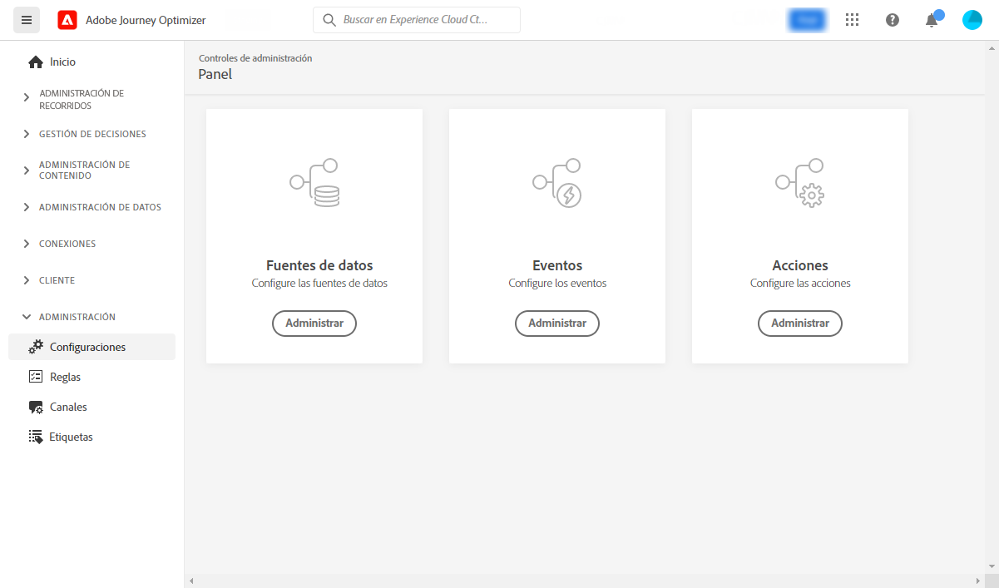

# Introducción a la configuración de recorridos {#configure-journeys}

>[!CONTEXTUALHELP]
>id="ajo_journey_configuration_dashboard"
>title="Acerca de la configuración de recorrido"
>abstract="Para enviar mensajes con recorridos, debe configurar fuentes de datos, eventos y acciones. Las fuentes de datos permiten definir una conexión a un sistema para recuperar información adicional que se utilizará en los recorridos como, por ejemplo, en las condiciones. Los eventos permiten activar sus recorridos cuando se recibe un evento. Las acciones personalizadas permiten conectarse a un sistema de terceros para enviar sus mensajes. Si utiliza las funciones de mensajería integradas de Journey Optimizer, no es necesario configurar una acción."

Para enviar mensajes con recorridos, es necesario configurar **[!UICONTROL Fuentes de datos]**, **[!UICONTROL Eventos]** y **[!UICONTROL Acciones]**. Las fuentes de datos permiten definir una conexión a un sistema para recuperar información adicional que se utilizará en los recorridos como, por ejemplo, en las condiciones. Los eventos permiten activar sus recorridos cuando se recibe un evento. Las acciones personalizadas permiten conectarse a un sistema de terceros para enviar sus mensajes. Si utiliza las funciones de mensajería integradas de Journey Optimizer, no es necesario configurar una acción.

También puede configurar conexiones a sistemas externos mediante fuentes de datos y acciones personalizadas. Esto le permite, por ejemplo, enriquecer sus recorridos con datos procedentes de un sistema de reservas externo o enviar mensajes mediante un sistema de terceros como Epsilon o Facebook. Aprenda a [integrar Journey Optimizer con sistemas externos](external-systems.md).

## Fuentes de datos {#data-sources}

La configuración de Data Source le permite definir una conexión con un sistema para recuperar información adicional que se utilizará en los recorridos. [Más información](../../using/datasource/about-data-sources.md)

## Eventos {#events}

Los eventos le permiten almacenar en déclencheur sus recorridos de forma unitaria para enviar mensajes, en tiempo real, a la persona que entra en el recorrido.

En la configuración de eventos, se configuran los eventos esperados en los recorridos. Los datos entrantes de los eventos se normalizan siguiendo el modelo de datos de Experience de Adobe (XDM). Los eventos provienen de las API de ingesta de transmisión para eventos autenticados y no autenticados (como eventos del SDK de Adobe Mobile). [Más información](../../using/event/about-events.md)

## Acciones {#actions}

Las funciones de los mensajes de Journey Optimizer están integradas: solo necesita añadir una actividad de acción del canal al recorrido. Si utiliza un sistema de terceros para enviar mensajes, puede crear una acción personalizada. [Más información](../../using/action/action.md)

## Examinar los campos de Adobe Experience Platform {#friendly-names-display}

Al definir la [carga útil de evento](../event/about-creating.md#define-the-payload-fields), la [carga útil de grupo de campos](../datasource/configure-data-sources.md#define-field-groups) y seleccionar los campos en el [editor de expresiones](../building-journeys/expression/expressionadvanced.md), se muestra el nombre para mostrar además del nombre del campo. Esta información se recupera de la definición de esquema del Modelo de datos de experiencia.

Si se proporcionan descriptores como &quot;xdm:alternateDisplayInfo&quot; al configurar esquemas, los nombres descriptivos reemplazarán los nombres para mostrar. Resulta especialmente útil cuando se trabaja con eVars y campos genéricos. Puede configurar descriptores de nombres descriptivos mediante una llamada a API. Para obtener más información, consulte la [Guía para desarrolladores de Schema Registry](https://experienceleague.adobe.com/docs/experience-platform/xdm/api/getting-started.html?lang=es){target="_blank"}.

Si hay un nombre descriptivo disponible, el campo se mostrará como `<friendly-name>(<name>)`. Si no hay ningún nombre descriptivo disponible, aparecerá el nombre para mostrar, por ejemplo `<display-name>(<name>)`. Si no se define ninguno de ellos, solo se mostrará el nombre técnico del campo `<name>`.

>[!NOTE]
>
>Los nombres descriptivos no se recuperan al seleccionar campos de una unión de esquemas.
