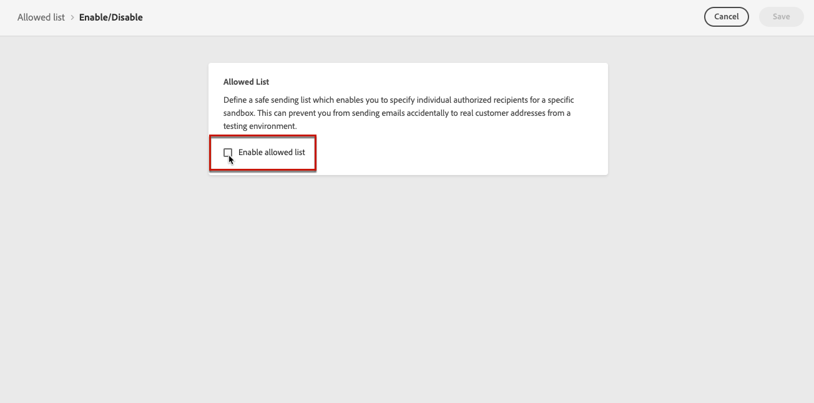
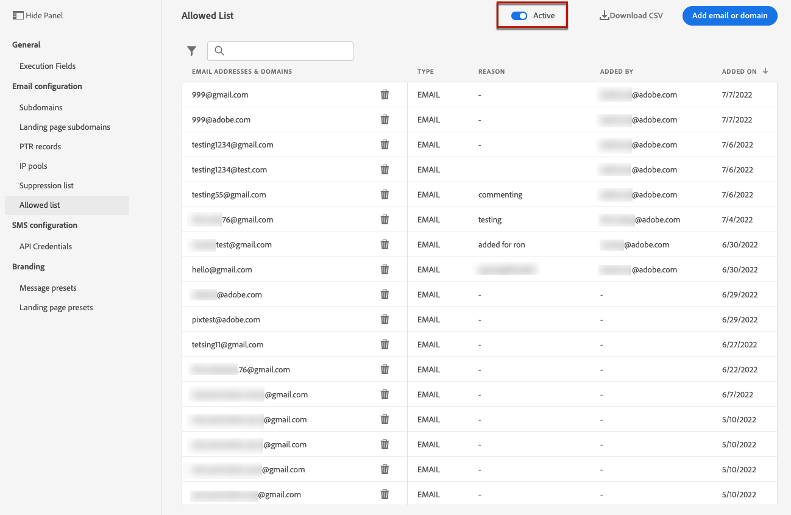

# Set up an allowed list {#allow-list}

The allowed list is a sending-safe list you can define at the [sandbox](../administration/sandboxes.md) level. It restricts email sending to specific addresses or domains, ensuring that only explicitly listed recipients can receive messages from a given sandbox.

>[!CAUTION]
>
>This feature only applies to the email channel. It is available on production and non-production sandboxes.

On non-production sandboxes, where accidental sends can occur, the allowed list prevents unwanted messages from reaching real customer addresses, providing a secure environment for testing purposes.

When the allowed list is active but empty, no emails are sent. This makes it a useful emergency brake: if a critical issue arises, you can activate an empty allowed list to halt all outgoing communications from [!DNL Journey Optimizer] until the problem is resolved. Learn more about the [allowed list logic](#logic).

You can also use the Journey Optimizer **Suppression REST API** to manage outgoing messages programmatically through suppression and allow lists. [Obtenga información sobre cómo trabajar con la API de REST de supresión](https://developer.adobe.com/journey-optimizer-apis/references/suppression){target="_blank"}

## Access the allowed list {#access-allowed-list}

To access the detailed list of allowed email addresses and domains, go to **[!UICONTROL Administration]** > **[!UICONTROL Channels]** > **[!UICONTROL Email settings]**, and select **[!UICONTROL Allowed list]**.


>[!CAUTION]
>
>Permissions to view, export and manage the allowed list are restricted to [Journey Administrators](../administration/ootb-product-profiles.md#journey-administrator). Learn more about managing [!DNL Journey Optimizer] users&#39; access rights in [this section](../administration/permissions-overview.md).

To export the allowed list as a CSV file, select the **[!UICONTROL Download CSV]** button.

Use the **[!UICONTROL Delete]** button to permanently remove an entry.

You can search on the email addresses or domains, and filter on the **[!UICONTROL Address type]**. Una vez seleccionado, puede borrar el filtro mostrado en la parte superior de la lista.


## Activar la lista de permitidos {#enable-allow-list}

Para activar la lista de permitidos, siga los pasos a continuación.

1. Acceda al menú **[!UICONTROL Canales]** > **[!UICONTROL Configuración de correo electrónico]** > **[!UICONTROL Lista de permitidos]**.

1. Seleccione el botón de alternancia.

   

1. Seleccione **[!UICONTROL Activar lista de permitidos]**. La lista de permitidos está activa.

   

   >[!NOTE]
   >
   >* Después de la activación, se producen 10 minutos de retraso antes de que la lista de permitidos entre en vigor en recorridos y campañas. Las actualizaciones tanto de la lista de lista de permitidos como de la lista de supresión también pueden tardar hasta 10 minutos en reflejarse.
   >* Cuando está activa, la lista de permitidos se aplica no solo en recorridos activos, sino también al probar mensajes con [pruebas](../content-management/proofs.md) y recorridos en [modo de prueba](../building-journeys/testing-the-journey.md).

La lógica de lista de permitidos se aplica cuando la función está activa. Obtenga más información en [esta sección](#logic).

## Desactivar la lista de permitidos {#deactivate-allow-list}

Para desactivar la lista de permitidos, siga los pasos a continuación.

1. Acceda al menú **[!UICONTROL Canales]** > **[!UICONTROL Configuración de correo electrónico]** > **[!UICONTROL Lista de permitidos]**.

1. Seleccione el botón de alternancia.

   

1. Seleccione **[!UICONTROL Desactivar lista de permitidos]**. La lista de permitidos ya no está activa.

   

   >[!NOTE]
   >
   >Después de desactivar la lista de permitidos, deben pasar 10 minutos antes de que surta efecto en los recorridos y campañas. Del mismo modo, las actualizaciones de la lista de lista de permitidos y supresión pueden tardar hasta 10 minutos en mostrarse.

La lógica de lista de permitidos no se aplica cuando la función está desactivada. Obtenga más información en [esta sección](#logic).

## Añadir entidades a la lista de permitidos {#add-entities}

Para agregar nuevas direcciones de correo electrónico o dominios a la lista de permitidos para una zona protegida específica, puede [rellenar manualmente la lista](#manually-populate-list) o usar una [llamada de API](#api-call-allowed-list).

>[!NOTE]
>
>La lista de permitidos puede contener hasta 1000 entradas.

### Rellenado manual de la lista de permitidos {#manually-populate-list}

>[!CONTEXTUALHELP]
>id="ajo_admin_allowed_list_add_header"
>title="Añadir direcciones o dominios a la lista de permitidos"
>abstract="Puede añadir manualmente nuevas direcciones de correo electrónico o dominios a la lista de permitidos seleccionándolos uno a uno."

>[!CONTEXTUALHELP]
>id="ajo_admin_allowed_list_add"
>title="Añadir direcciones o dominios a la lista de permitidos"
>abstract="Puede añadir manualmente nuevas direcciones de correo electrónico o dominios a la lista de permitidos seleccionándolos uno a uno."

Puede rellenar manualmente la lista de permitidos [!DNL Journey Optimizer] agregando una dirección de correo electrónico o un dominio a través de la interfaz de usuario.

>[!NOTE]
>
>Solo se puede agregar una dirección de correo electrónico o un dominio a la vez.

Para realizar esto, siga los pasos a continuación.

1. Seleccione el botón **[!UICONTROL Agregar correo electrónico o dominio]**.

   

1. Elija el tipo de dirección: **[!UICONTROL Dirección de correo electrónico]** o **[!UICONTROL Dirección del dominio]**.

1. Introduzca la dirección de correo electrónico o el dominio al que desea enviar los correos electrónicos.

   >[!NOTE]
   >
   >Asegúrese de introducir una dirección de correo electrónico válida (como abc@compañía.com) o un dominio (como abc.compañía.com).

1. Especifique una razón, si es necesario.

   

   >[!NOTE]
   >
   >Todos los caracteres ASCII del intervalo de 32 a 126 se permiten en el campo **[!UICONTROL Motivo]**. La lista completa se puede encontrar en [esta página](https://en.wikipedia.org/wiki/ASCII#Printable_characters){target="_blank"}, por ejemplo.

1. Haga clic en **[!UICONTROL Enviar]**.

### Añadir entidades mediante una llamada de API {#api-call-allowed-list}

Para rellenar la lista de permitidos, también puede llamar a la API de supresión con el valor `ALLOWED` para el atributo `listType`. Por ejemplo:


Puede realizar las operaciones **Agregar**, **Eliminar** y **Obtener**.

Obtenga más información sobre cómo realizar llamadas de API en la [documentación de referencia de las API de Adobe Experience Platform](https://experienceleague.adobe.com/docs/experience-platform/landing/platform-apis/api-guide.html?lang=es){target="_blank"}.

## Descargar la lista de permitidos {#download-allowed-list}

Para exportar la lista de permitidos como archivo CSV, siga los pasos a continuación:

1. Seleccione el botón **[!UICONTROL Descargar CSV]**.

   

1. Espere hasta que se genere el archivo.

   

   >[!NOTE]
   >
   >El tiempo de descarga depende del tamaño del archivo, es decir, del número de direcciones que hay en la lista de permitidos.
   >
   >Se puede procesar una solicitud de descarga a la vez para una zona protegida determinada.

1. Una vez generado el archivo, recibirá una notificación. Haga clic en el icono de campana en la parte superior derecha de la pantalla para mostrarlo.

1. Haga clic en la propia notificación para descargar el archivo.

   

   >[!NOTE]
   >
   >El vínculo es válido durante 24 horas.

## Lógica de lista de permitidos {#logic}

>[!CONTEXTUALHELP]
>id="ajo_admin_allowed_list_logic"
>title="Administrar la lista de permitidos"
>abstract="Cuando la lista de permitidos está activada, solo los destinatarios incluidos en la lista de permitidos reciben mensajes de correo electrónico de esta zona protegida. Cuando está desactivado, todos los destinatarios reciben correos electrónicos."

Cuando la lista de permitidos está [activa](#enable-allow-list), se aplica la siguiente lógica:

* Si la lista de permitidos está **vacía**, no se enviará ningún correo electrónico.

* Si una entidad está **en la lista de permitidos**, y no en la lista de supresión, el correo electrónico se envía a los destinatarios correspondientes. Sin embargo, si la entidad también está en la [lista de supresión](../reports/suppression-list.md), los destinatarios correspondientes no recibirán el mensaje de correo electrónico, por lo que se debe a **[!UICONTROL Suprimido]**.

* Si una entidad es **no está en la lista de permitidos** (y no está en la lista de supresión), los destinatarios correspondientes no recibirán el correo electrónico, por lo que **[!UICONTROL no se permite]**.

>[!NOTE]
>
>Los perfiles con el estado **[!UICONTROL No permitido]** se excluyen durante el proceso de envío de mensajes. Por lo tanto, aunque los **informes de Recorrido** mostrarán que estos perfiles se han movido a través del recorrido ([Leer audiencia](../building-journeys/read-audience.md) y [actividades de mensajes](../building-journeys/journey-action.md)), los **informes de correo electrónico** no los incluirán en las métricas de **[!UICONTROL Enviados]**, ya que se filtran antes del envío de correo electrónico.
>
>Obtenga más información sobre [el informe en vivo](../reports/live-report.md) y [el informe de Customer Journey Analytics](../reports/report-gs-cja.md).

Cuando la lista de permitidos está [desactivada](#deactivate-allow-list), todos los correos electrónicos que envía desde la zona protegida actual se envían a todos los destinatarios (siempre que no estén en la lista de supresión), incluidas las direcciones de clientes reales.

## Informes de exclusión {#reporting}

Cuando la lista de permitidos esté activa, puede recuperar direcciones de correo electrónico o dominios que se excluyeron de un envío porque no estaban en la lista de permitidos. Para ello, puede usar el [Servicio de consultas de Adobe Experience Platform](https://experienceleague.adobe.com/docs/experience-platform/query/api/getting-started.html?lang=es){target="_blank"} para realizar las llamadas a la API que se indican a continuación.

Para obtener el **número de correos electrónicos** que no se enviaron porque los destinatarios no estaban en la lista de permitidos, use la siguiente consulta:

```sql
SELECT count(distinct _id) from cjm_message_feedback_event_dataset WHERE
_experience.customerJourneyManagement.messageExecution.messageExecutionID = '<MESSAGE_EXECUTION_ID>' AND
_experience.customerJourneyManagement.messageDeliveryfeedback.feedbackStatus = 'exclude' AND
_experience.customerJourneyManagement.messageDeliveryfeedback.messageExclusion.reason = 'EmailNotAllowed'
```

Para obtener la **lista de direcciones de correo electrónico** que no se enviaron porque los destinatarios no estaban en la lista de permitidos, use la siguiente consulta:

```sql
SELECT distinct(_experience.customerJourneyManagement.emailChannelContext.address) from cjm_message_feedback_event_dataset WHERE
_experience.customerJourneyManagement.messageExecution.messageExecutionID IS NOT NULL AND
_experience.customerJourneyManagement.messageDeliveryfeedback.feedbackStatus = 'exclude' AND
_experience.customerJourneyManagement.messageDeliveryfeedback.messageExclusion.reason = 'EmailNotAllowed'
```
