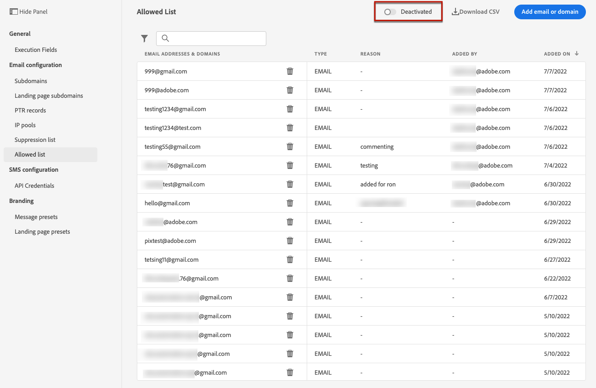

# Lista de permitidos {#allow-list}

Es posible definir una lista específica de seguridad de envío en el nivel [sandbox](../administration/sandboxes.md).

Esta lista de permitidos le permite especificar direcciones de correo electrónico o dominios individuales que serán los únicos destinatarios o dominios autorizados para recibir los correos electrónicos que envía desde una zona protegida específica.

>[!CAUTION]
>
>Esta función solo se aplica al canal de correo electrónico. Está disponible en entornos limitados de producción y sin producción.

Por ejemplo, en una instancia que no es de producción, donde pueden producirse errores, la lista de permitidos garantiza que no tendrá riesgo de enviar mensajes no deseados a direcciones de clientes reales y, por lo tanto, proporciona un entorno seguro para realizar pruebas.

Además, cuando la lista de permitidos está activa pero vacía, no se envía ningún correo. Por lo tanto, si se produce algún problema importante, puede utilizar esta característica para detener todas las comunicaciones salientes de [!DNL Journey Optimizer] hasta que solucione el problema. Más información sobre la [lógica de lista de permitidos](#logic).

Además, puede aprovechar la **API de REST de supresión** de Journey Optimizer para controlar los mensajes salientes mediante supresión y listas de permitidos. [Obtenga información sobre cómo trabajar con la API de REST de supresión](https://developer.adobe.com/journey-optimizer-apis/references/suppression/){target="_blank"}

## Acceso a la lista de permitidos {#access-allowed-list}

Para acceder a la lista detallada de dominios y direcciones de correo electrónico permitidos, ve a **[!UICONTROL Administración]** > **[!UICONTROL Canales]** > **[!UICONTROL Configuración de correo electrónico]** y selecciona **[!UICONTROL Lista de permitidos]**.


>[!CAUTION]
>
>Los permisos para ver, exportar y administrar la lista de permitidos están restringidos a [Administradores de Recorrido](../administration/ootb-product-profiles.md#journey-administrator). Obtenga más información acerca de la administración de los derechos de acceso de los usuarios de [!DNL Journey Optimizer] en [esta sección](../administration/permissions-overview.md).

Para exportar la lista de permitidos como archivo CSV, seleccione el botón **[!UICONTROL Descargar CSV]**.

Use el botón **[!UICONTROL Eliminar]** para quitar una entrada de forma permanente.

Puede buscar las direcciones de correo electrónico o los dominios y filtrar por el **[!UICONTROL tipo de dirección]**. Una vez seleccionado, puede borrar el filtro mostrado en la parte superior de la lista.


## Activar la lista de permitidos {#enable-allow-list}

Para activar la lista de permitidos, siga los pasos a continuación.

1. Acceda al menú **[!UICONTROL Canales]** > **[!UICONTROL Configuración de correo electrónico]** > **[!UICONTROL Lista de permitidos]**.

1. Seleccione el botón de alternancia.

   

1. Seleccione **[!UICONTROL Activar lista de permitidos]**. La lista de permitidos está activa.

   

   >[!NOTE]
   >
   >Después de activar la lista de permitidos, deben pasar 10 minutos antes de que surta efecto en los recorridos y campañas. Del mismo modo, las actualizaciones de la lista de lista de permitidos y supresión pueden tardar hasta 10 minutos en mostrarse.

La lógica de lista de permitidos se aplica cuando la función está activa. Obtenga más información en [esta sección](#logic).

>[!NOTE]
>
>Cuando se activa, la característica de lista de permitidos se cumple al ejecutar recorridos, pero también al probar mensajes con [pruebas](../content-management/proofs.md) y probar recorridos usando el [modo de prueba](../building-journeys/testing-the-journey.md).

## Desactivar la lista de permitidos {#deactivate-allow-list}

Para desactivar la lista de permitidos, siga los pasos a continuación.

1. Acceda al menú **[!UICONTROL Canales]** > **[!UICONTROL Configuración de correo electrónico]** > **[!UICONTROL Lista de permitidos]**.

1. Seleccione el botón de alternancia.

   

1. Seleccione **[!UICONTROL Desactivar lista de permitidos]**. La lista de permitidos ya no está activa.

   

   >[!NOTE]
   >
   >Después de desactivar la lista de permitidos, deben pasar 10 minutos antes de que surta efecto en los recorridos y campañas. Del mismo modo, las actualizaciones de la lista de lista de permitidos y supresión pueden tardar hasta 10 minutos en mostrarse.

La lógica de lista de permitidos no se aplica cuando la función está desactivada. Obtenga más información en [esta sección](#logic).

## Añadir entidades a la lista de permitidos {#add-entities}

Para agregar nuevas direcciones de correo electrónico o dominios a la lista de permitidos para una zona protegida específica, puede [rellenar manualmente la lista](#manually-populate-list) o usar una [llamada de API](#api-call-allowed-list).

>[!NOTE]
>
>La lista de permitidos puede contener hasta 1000 entradas.

### Rellenado manual de la lista de permitidos {#manually-populate-list}

>[!CONTEXTUALHELP]
>id="ajo_admin_allowed_list_add_header"
>title="Añadir direcciones o dominios a la lista de permitidos"
>abstract="Puede añadir manualmente nuevas direcciones de correo electrónico o dominios a la lista de permitidos seleccionándolos uno a uno."

>[!CONTEXTUALHELP]
>id="ajo_admin_allowed_list_add"
>title="Añadir direcciones o dominios a la lista de permitidos"
>abstract="Puede añadir manualmente nuevas direcciones de correo electrónico o dominios a la lista de permitidos seleccionándolos uno a uno."

Puede rellenar manualmente la lista de permitidos [!DNL Journey Optimizer] agregando una dirección de correo electrónico o un dominio a través de la interfaz de usuario.

>[!NOTE]
>
>Solo se puede agregar una dirección de correo electrónico o un dominio a la vez.

Para realizar esto, siga los pasos a continuación.

1. Seleccione el botón **[!UICONTROL Agregar correo electrónico o dominio]**.

   

1. Elija el tipo de dirección: **[!UICONTROL Dirección de correo electrónico]** o **[!UICONTROL Dirección del dominio]**.

1. Introduzca la dirección de correo electrónico o el dominio al que desea enviar los correos electrónicos.

   >[!NOTE]
   >
   >Asegúrese de introducir una dirección de correo electrónico válida (como abc@compañía.com) o un dominio (como abc.compañía.com).

1. Especifique una razón, si es necesario.

   

   >[!NOTE]
   >
   >Todos los caracteres ASCII comprendidos entre 32 y 126 están permitidos en el campo **[!UICONTROL Motivo]**. La lista completa se puede encontrar en [esta página](https://en.wikipedia.org/wiki/ASCII#Printable_characters){target="_blank"}, por ejemplo.

1. Haga clic en **[!UICONTROL Enviar]**.

### Añadir entidades mediante una llamada de API {#api-call-allowed-list}

Para rellenar la lista de permitidos, también puede llamar a la API de supresión con el valor `ALLOWED` para el atributo `listType`. Por ejemplo:


Puede realizar las operaciones **Agregar**, **Eliminar** y **Obtener**.

Obtenga más información sobre cómo realizar llamadas de API en la [documentación de referencia de las API de Adobe Experience Platform](https://experienceleague.adobe.com/docs/experience-platform/landing/platform-apis/api-guide.html?lang=es){target="_blank"}.

## Descargar la lista de permitidos {#download-allowed-list}

Para exportar la lista de permitidos como archivo CSV, siga los pasos a continuación:

1. Seleccione el botón **[!UICONTROL Descargar CSV]**.

   

1. Espere hasta que se genere el archivo.

   

   >[!NOTE]
   >
   >El tiempo de descarga depende del tamaño del archivo, es decir, del número de direcciones que hay en la lista de permitidos.
   >
   >Se puede procesar una solicitud de descarga a la vez para una zona protegida determinada.

1. Una vez generado el archivo, recibirá una notificación. Haga clic en el icono de campana en la parte superior derecha de la pantalla para mostrarlo.

1. Haga clic en la propia notificación para descargar el archivo.

   

   >[!NOTE]
   >
   >El vínculo es válido durante 24 horas.

## Lógica de lista de permitidos {#logic}

>[!CONTEXTUALHELP]
>id="ajo_admin_allowed_list_logic"
>title="Administrar la lista de permitidos"
>abstract="Cuando la lista de permitidos está activada, solo los destinatarios incluidos en la lista de permitidos reciben mensajes de correo electrónico de esta zona protegida. Cuando está desactivado, todos los destinatarios reciben correos electrónicos."

Cuando la lista de permitidos está [activa](#enable-allow-list), se aplica la siguiente lógica:

* Si la lista de permitidos está **vacía**, no se enviará ningún correo electrónico.

* Si una entidad está **en la lista de permitidos**, y no en la lista de supresión, el correo electrónico se envía a los destinatarios correspondientes. Sin embargo, si la entidad también está en la [lista de supresión](../reports/suppression-list.md), los destinatarios correspondientes no recibirán el mensaje de correo electrónico, por lo que se debe a **[!UICONTROL Suprimido]**.

* Si una entidad es **no está en la lista de permitidos** (y no está en la lista de supresión), los destinatarios correspondientes no recibirán el correo electrónico, por lo que **[!UICONTROL no se permite]**.

>[!NOTE]
>
>Los perfiles con el estado **[!UICONTROL No permitido]** se excluyen durante el proceso de envío de mensajes. Por lo tanto, aunque los **informes de Recorrido** mostrarán que estos perfiles se han movido a través del recorrido ([Leer audiencia](../building-journeys/read-audience.md) y [actividades de mensajes](../building-journeys/journeys-message.md)), los **informes de correo electrónico** no los incluirán en las métricas de **[!UICONTROL Enviados]**, ya que se filtran antes del envío de correo electrónico.
>
>Obtenga más información sobre [el informe en vivo](../reports/live-report.md) y [el informe de Customer Journey Analytics](../reports/report-gs-cja.md).

Cuando la lista de permitidos está [desactivada](#deactivate-allow-list), todos los correos electrónicos que envía desde la zona protegida actual se envían a todos los destinatarios (siempre que no estén en la lista de supresión), incluidas las direcciones de clientes reales.

## Informes de exclusión {#reporting}

Cuando la lista de permitidos esté activa, puede recuperar direcciones de correo electrónico o dominios que se excluyeron de un envío porque no estaban en la lista de permitidos. Para ello, puede usar el [Servicio de consultas de Adobe Experience Platform](https://experienceleague.adobe.com/docs/experience-platform/query/api/getting-started.html?lang=es){target="_blank"} para realizar las llamadas a la API que se indican a continuación.

Para obtener el **número de correos electrónicos** que no se enviaron porque los destinatarios no estaban en la lista de permitidos, use la siguiente consulta:

```sql
SELECT count(distinct _id) from cjm_message_feedback_event_dataset WHERE
_experience.customerJourneyManagement.messageExecution.messageExecutionID = '<MESSAGE_EXECUTION_ID>' AND
_experience.customerJourneyManagement.messageDeliveryfeedback.feedbackStatus = 'exclude' AND
_experience.customerJourneyManagement.messageDeliveryfeedback.messageExclusion.reason = 'EmailNotAllowed'
```

Para obtener la **lista de direcciones de correo electrónico** que no se enviaron porque los destinatarios no estaban en la lista de permitidos, use la siguiente consulta:

```sql
SELECT distinct(_experience.customerJourneyManagement.emailChannelContext.address) from cjm_message_feedback_event_dataset WHERE
_experience.customerJourneyManagement.messageExecution.messageExecutionID IS NOT NULL AND
_experience.customerJourneyManagement.messageDeliveryfeedback.feedbackStatus = 'exclude' AND
_experience.customerJourneyManagement.messageDeliveryfeedback.messageExclusion.reason = 'EmailNotAllowed'
```
