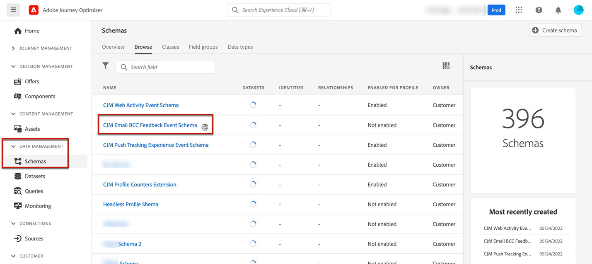

# Correo electrónico CCO {#bcc-email}

>[!CONTEXTUALHELP]
>id="ajo_admin_preset_bcc"
>title="Definir una dirección de correo electrónico CCO"
>abstract="Puede conservar una copia de los correos electrónicos enviados enviándolos a una bandeja de entrada BCC. Escriba la dirección de correo electrónico que desee para que cada correo electrónico enviado se copie de forma ciega a esta dirección de CCO. Tenga en cuenta que el dominio de dirección de CCO no debe ser el mismo que cualquier subdominio delegado a Adobe. Esta función es opcional."

Puede enviar una copia idéntica (o una copia ciega de un correo electrónico enviado por [!DNL Journey Optimizer] a una bandeja de entrada BCC. Esta función opcional le permite conservar copias de las comunicaciones por correo electrónico que envía a sus usuarios para que cumplan con las normas o las archiven. Esto es invisible para los destinatarios de la entrega.

## Habilitar correo electrónico CCO {#enable-bcc}

Para habilitar la variable **[!UICONTROL BCC email]** , introduzca la dirección de correo electrónico que desee en el campo dedicado del [superficie del canal](channel-surfaces.md) (es decir, el ajuste preestablecido de mensaje). Puede especificar cualquier dirección externa en el formato correcto, excepto una dirección de correo electrónico definida en un subdominio delegado a Adobe. Por ejemplo, si delegó el *marketing.luma.com* subdominio a Adobe, cualquier dirección como *abc@marketing.luma.com* está prohibido.

>[!NOTE]
>
>Solo puede definir una dirección de correo electrónico CCO. Asegúrese de que la dirección de CCO tenga suficiente capacidad de recepción para almacenar todos los correos electrónicos enviados mediante la superficie de canal actual.
>
>Más recomendaciones se enumeran en [esta sección](#bcc-recommendations-limitations).


Todos los mensajes de correo electrónico que utilicen esta superficie se copiarán de forma ciega en la dirección de correo electrónico CCO que haya introducido. Desde allí, se pueden procesar y archivar utilizando un sistema externo.

>[!CAUTION]
>
>El uso de la función de CCO se contará con la cantidad de mensajes para los que tenga licencia. Por lo tanto, sólo lo habilite en las superficies utilizadas para comunicaciones críticas que desee archivar. Compruebe si hay volúmenes con licencia en su contrato.

La configuración de la dirección de correo electrónico CCO se guarda inmediatamente y se procesa en el nivel de superficie. Cuando [crear un nuevo mensaje](../messages/get-started-content.md#create-new-message) con esta superficie, se muestra automáticamente la dirección de correo electrónico CCO.


Sin embargo, la dirección de CCO se selecciona para enviar comunicaciones siguiendo la lógica siguiente:

* Para los recorridos por lotes y de ráfagas, no se aplica a la ejecución por lotes o de ráfagas que ya se había iniciado antes de que se realice la configuración de CCO. El cambio se recogerá en la siguiente repetición o en la nueva ejecución.

* En los mensajes transaccionales, el cambio se recoge inmediatamente para la siguiente comunicación (con un retraso de hasta un minuto).

>[!NOTE]
>
>No es necesario que vuelva a publicar el recorrido para que se recoja la configuración de CCO.

## Recommendations y limitaciones {#bcc-recommendations-limitations}

* Para garantizar el cumplimiento de la privacidad, los correos electrónicos CCO deben ser procesados por un sistema de archiving capaz de almacenar información personal (PII) de forma segura.

* Como los mensajes pueden contener datos confidenciales o privados, como información de identificación personal (PII), asegúrese de que la dirección de CCO sea correcta y asegure el acceso a los mensajes.

* La bandeja de entrada utilizada para CCO debe administrarse correctamente para el espacio y la entrega. Si la bandeja de entrada devuelve devoluciones, es posible que algunos correos electrónicos no se reciban y, por lo tanto, no se archiven.

* Los mensajes se pueden enviar a la dirección de correo electrónico de CCO antes de los destinatarios objetivo. Los mensajes CCO también se pueden enviar aunque los mensajes originales hayan [rechazado](../reports/suppression-list.md#delivery-failures).

   <!--OR: Only successfully sent emails are taken in account. [Bounces](../reports/suppression-list.md#delivery-failures) are not. TO CHECK -->

* No abra ni haga clic en los correos electrónicos enviados a la dirección de CCO, ya que se tienen en cuenta en el total de aperturas y clics del análisis de envío, lo que podría provocar algunos cálculos erróneos en [informes](../reports/global-report.md).

* No marque los mensajes como correo no deseado en la bandeja de entrada BCC, ya que esto afectará a todos los demás correos electrónicos enviados a esta dirección.


>[!CAUTION]
>
>No haga clic en el vínculo unsubscribe de los correos electrónicos enviados a la dirección de CCO, ya que inmediatamente cancelará la suscripción de los destinatarios correspondientes.

## Cumplimiento del RGPD {#gdpr-compliance}

Las regulaciones como el RGPD establecen que los sujetos de datos deben poder modificar su consentimiento en cualquier momento. Dado que los correos electrónicos CCO que envía con Journey Optimizer incluyen información de identificación personal (PII) segura, debe editar la variable **[!UICONTROL CJM Email BCC Feedback Event Schema]** poder gestionar estos PII de conformidad con el RGPD y regulaciones similares.

Para realizar esto, siga los pasos a continuación.

1. Vaya a **[!UICONTROL Data management]** > **[!UICONTROL Schemas]** > **[!UICONTROL Browse]** y seleccione **[!UICONTROL CJM Email BCC Feedback Event Schema]**.

   

1. Haga clic para expandir **[!UICONTROL _experience]**, **[!UICONTROL customerJourneyManagment]** then **[!UICONTROL secondaryRecipientDetail]**.

1. Seleccione **[!UICONTROL originalRecipientAddress]**.

1. En el **[!UICONTROL Field properties]** a la derecha, desplácese hacia abajo hasta el **[!UICONTROL Identity]** casilla de verificación.

1. Selecciónelo y también seleccione **[!UICONTROL Primary identity]**.

1. Seleccione un área de nombres en la lista desplegable.

   

1. Haga clic en **[!UICONTROL Apply]**.

>[!NOTE]
>
>Obtenga más información sobre la administración de la privacidad y las regulaciones aplicables en la [Documentación de Experience Platform](https://experienceleague.adobe.com/docs/experience-platform/privacy/home.html?lang=es){target=&quot;_blank&quot;}.

## Datos de informes de CCO {#bcc-reporting}

Los informes como tales sobre CCO no están disponibles en los informes de recorrido y mensajes. Sin embargo, la información se almacena en un conjunto de datos del sistema llamado **[!UICONTROL AJO BCC Feedback Event Dataset]**. Puede ejecutar consultas con este conjunto de datos para encontrar información útil para la depuración, por ejemplo.

Puede acceder a este conjunto de datos a través de la interfaz de usuario. Select **[!UICONTROL Data management]** > **[!UICONTROL Datasets]** > **[!UICONTROL Browse]** y habilite **[!UICONTROL Show system datasets]** cambie desde el filtro para mostrar los conjuntos de datos generados por el sistema. Obtenga más información sobre cómo acceder a los conjuntos de datos en [esta sección](../start/get-started-datasets.md#access-datasets).


Para ejecutar consultas con este conjunto de datos, puede utilizar el Editor de consultas proporcionado por el [Servicio de consultas de Adobe Experience Platform](https://experienceleague.adobe.com/docs/experience-platform/query/api/getting-started.html){target=&quot;_blank&quot;}. Para acceder a él, seleccione **[!UICONTROL Data management]** > **[!UICONTROL Queries]** y haga clic en **[!UICONTROL Create query]**. [Más información](../start/get-started-queries.md)


Según la información que busque, puede ejecutar las siguientes consultas.

1. Para todas las demás consultas a continuación, necesitará el ID de acción de recorrido. Ejecute esta consulta para recuperar todos los ID de acción asociados con un ID de versión de recorrido concreto en los últimos 2 días:

       &quot;
       SELECT
       DISTINCT
       CAST(TIMESTAMP AS DATE) COMO EventTime,
       _experience.journeyOrchestration.stepEvents.journeyVersionID,
       _experience.journeyOrchestration.stepEvents.actionName,
       _experience.journeyOrchestration.stepEvents.actionID
       FROM recorrido_step_events
       WHERE
       _experience.journeyOrchestration.stepEvents.journeyVersionID = &#39;&lt;journey version=&quot;&quot; id=&quot;&quot;>&#39; AND
       _experience.journeyOrchestration.stepEvents.actionID no es NULO Y
       MARCA DE HORA > AHORA(): INTERVALO DE &quot;2&quot; DÍA
       ORDER BY EventTime DESC;
       &quot;
   
   >[!NOTE]
   >
   >Para obtener la variable `<journey version id>`seleccione el parámetro [Versión de recorrido](../building-journeys/journey-versions.md) de la variable **[!UICONTROL Journey management]** > **[!UICONTROL Journeys]** para abrir el Navegador. El ID de versión de recorrido se muestra al final de la URL que se muestra en el explorador web.
   >
   >

1. Ejecute esta consulta para recuperar todos los eventos de comentarios de mensajes (especialmente el estado de los comentarios) generados para un mensaje determinado dirigido a un usuario específico en los últimos 2 días:

       &quot;
       SELECT
       _experience.customerJourneyManagement.messageExecution.journeyVersionID AS JourneyVersionID,
       _experience.customerJourneyManagement.messageExecution.journeyActionID AS JourneyActionID,
       timestamp AS EventTime,
       _experience.customerJourneyManagement.emailChannelContext.address AS RecipientAddress,
       _experience.customerjourneymanagement.messagedeliveryfeedback.feedbackStatus AS FeedbackStatus,
       CASE _experience.customerjourneymanagement.messagedeliveryfeedback.feedbackStatus
       CUANDO &#39;enviado&#39; ENTONCES &#39;Enviado&#39;
       CUANDO &#39;delay&#39; ENTONCES &#39;Retry&#39;
       CUANDO &#39;out_of_band&#39; ENTONCES &#39;Bounce&#39;
       CUANDO &quot;devolución&quot; ENTONCES &quot;devolución&quot;
       END AS FeedbackStatusCategory
       FROM cjm_message_feedback_event_dataset
       WHERE
       timestamp > now() - INTERVALO &quot;2&quot; día Y
       _experience.customerJourneyManagement.messageExecution.journeyVersionID = &#39;&lt;journey version=&quot;&quot; id=&quot;&quot;>&#39; AND
       _experience.customerJourneyManagement.messageExecution.journeyActionID = &#39;&lt;journey action=&quot;&quot; id=&quot;&quot;>&#39; AND
       _experience.customerJourneyManagement.emailChannelContext.address = &#39;&lt;recipient email=&quot;&quot; address=&quot;&quot;>&#39;
       ORDER BY EventTime DESC;
       &quot;
   
   >[!NOTE]
   >
   >Para obtener la variable `<journey action id>` ejecute la primera consulta descrita anteriormente utilizando el id de versión de recorrido. La variable `<recipient email address>` es la dirección de correo electrónico del destinatario objetivo o real.

1. Ejecute esta consulta para recuperar todos los eventos de comentarios de mensajes BCC generados para un mensaje en particular dirigido a un usuario específico en los últimos 2 días:

   ```
   SELECT   
   _experience.customerJourneyManagement.messageExecution.journeyVersionID AS JourneyVersionID, 
   _experience.customerJourneyManagement.messageExecution.journeyActionID AS JourneyActionID, 
   _experience.customerJourneyManagement.emailChannelContext.address AS BccEmailAddress,
   timestamp AS EventTime, 
   _experience.customerJourneyManagement.secondaryRecipientDetail.originalRecipientAddress AS RecipientAddress, 
   _experience.customerjourneymanagement.messagedeliveryfeedback.feedbackStatus AS FeedbackStatus,
   CASE _experience.customerjourneymanagement.messagedeliveryfeedback.feedbackStatus
               WHEN 'sent' THEN 'Sent'
               WHEN 'delay' THEN 'Retry'
               WHEN 'out_of_band' THEN 'Bounce' 
               WHEN 'bounce' THEN 'Bounce'
           END AS FeedbackStatusCategory 
   FROM ajo_bcc_feedback_event_dataset  
   WHERE  
   timestamp > now() - INTERVAL '2' day  AND
   _experience.customerJourneyManagement.messageExecution.journeyVersionID = '<journey version id>' AND 
   _experience.customerJourneyManagement.messageExecution.journeyActionID = '<journeyaction id>' AND 
   _experience.customerJourneyManagement.secondaryRecipientDetail.originalRecipientAddress = '<recipient email address>'
   ORDER BY EventTime DESC;
   ```

1. Ejecute esta consulta para recuperar todas las direcciones de destinatario que no hayan recibido el mensaje, mientras que su entrada de CCO existe en los últimos 30 días:

   ```
   SELECT
       DISTINCT 
   bcc._experience.customerJourneyManagement.secondaryRecipientDetail.originalRecipientAddress AS RecipientAddressesNotRecievedMessage
   FROM ajo_bcc_feedback_event_dataset bcc
   LEFT JOIN cjm_message_feedback_event_dataset mfe
   ON 
   bcc._experience.customerJourneyManagement.messageExecution.journeyVersionID =
           mfe._experience.customerJourneyManagement.messageExecution.journeyVersionID AND    bcc._experience.customerJourneyManagement.messageExecution.journeyActionID = mfe._experience.customerJourneyManagement.messageExecution.journeyActionID AND 
   bcc._experience.customerJourneyManagement.secondaryRecipientDetail.originalRecipientAddress = mfe._experience.customerJourneyManagement.emailChannelContext.address AND
   mfe._experience.customerJourneyManagement.messageExecution.journeyVersionID = '<journey version id>' AND 
   mfe._experience.customerJourneyManagement.messageExecution.journeyActionID = '<journey action id>' AND
   mfe.timestamp > now() - INTERVAL '30' DAY AND
   mfe._experience.customerjourneymanagement.messagedeliveryfeedback.feedbackstatus IN ('bounce', 'out_of_band') 
   WHERE bcc.timestamp > now() - INTERVAL '30' DAY;
   ```
