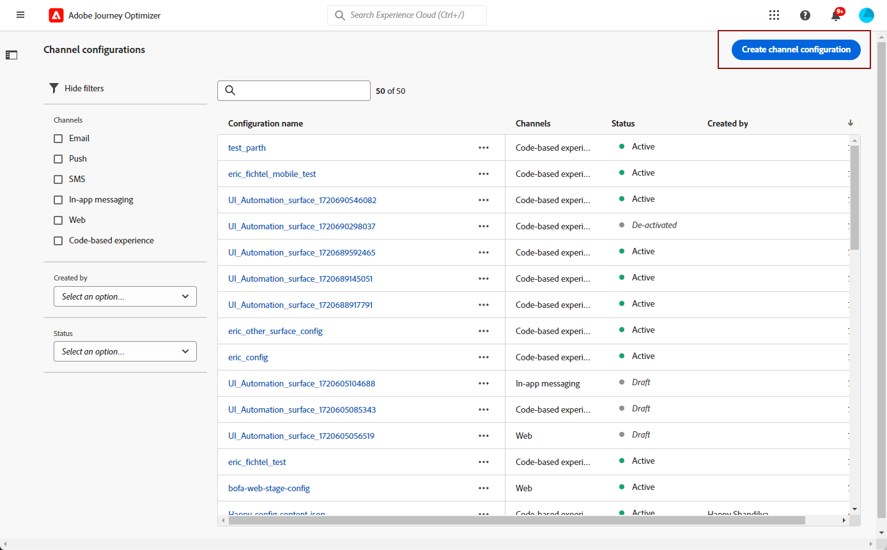
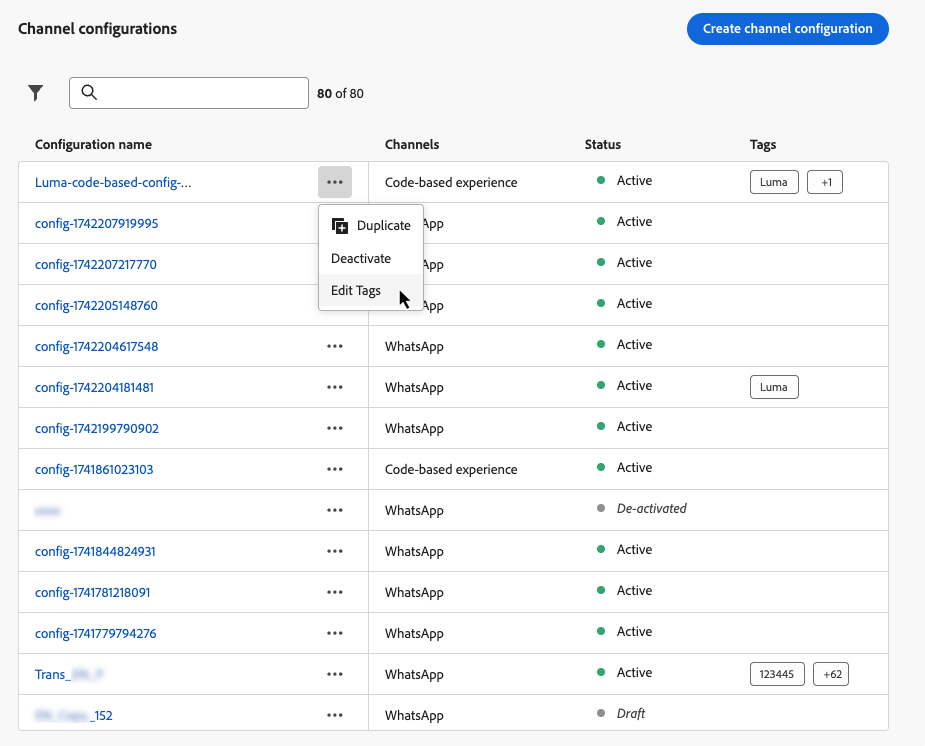

# Creación de configuraciones de canal {#set-up-channel-surfaces}

>[!CONTEXTUALHELP]
>id="ajo_admin_channel_surfaces"
>title="Configuración de canal"
>abstract="Una configuración de canal es una configuración que ha definido un administrador del sistema. Contiene todos los parámetros técnicos para enviar el mensaje, como parámetros de encabezado, subdominio, aplicaciones móviles, etc."

>[!CONTEXTUALHELP]
>id="ajo_admin_marketing_action"
>title="Acción de marketing"
>abstract="Elija las acciones de marketing para vincular las políticas de consentimiento a los mensajes con esta configuración. Todas las políticas de consentimiento conectadas a la acción de marketing se utilizan para satisfacer las preferencias de los clientes."

Con [!DNL Journey Optimizer], puede establecer configuraciones de canal (es decir, ajustes preestablecidos de mensaje) que definan todos los parámetros técnicos necesarios para sus mensajes: tipo de correo electrónico, nombre y correo electrónico del remitente, aplicaciones móviles, configuración de SMS, etc.

>[!CAUTION]
>
> * Para crear, editar y eliminar configuraciones de canal, debes tener el permiso [Administrar mensajes preestablecidos](../administration/high-low-permissions.md#administration-permissions).
>
> * Debe realizar los pasos de [Configuración de correo electrónico](../email/get-started-email-config.md), [Configuración push](../push/push-configuration.md), [Configuración de SMS](../sms/sms-configuration.md), [Configuración en la aplicación](../in-app/inapp-configuration.md), [Configuración basada en código](../code-based/code-based-configuration.md), [Configuración web](../web/web-configuration.md) y [Configuración de correo directo](../direct-mail/direct-mail-configuration.md) antes de crear las configuraciones de canal.

Una vez configuradas las configuraciones de canal, podrá seleccionarlas al crear mensajes desde un recorrido o una campaña.

También puede utilizar la configuración de canal guiada para automatizar y validar la configuración de canal en una experiencia unificada, lo que acelera el proceso de introducción a Journey Optimizer. [Más información](set-mobile-config.md)

<!--
➡️ [Learn how to create and use email configurations in this video](#video-presets)
-->

## Creación de una configuración de canal {#create-channel-surface}

>[!CONTEXTUALHELP]
>id="ajo_admin_message_presets_header"
>title="Ajustes de la configuración de canal"
>abstract="Al establecer la configuración de canal, seleccione el canal al que se aplica y defina todos los parámetros técnicos necesarios para el envío, como el tipo de correo electrónico, el nombre del remitente, las aplicaciones móviles, la configuración de SMS, etc."

>[!CONTEXTUALHELP]
>id="ajo_admin_message_presets"
>title="Ajustes de la configuración de canal"
>abstract="Para poder crear acciones como correos electrónicos desde un recorrido o una campaña, primero debe crear una configuración de canal que defina toda la configuración técnica necesaria para los mensajes. Debe tener el permiso Administrar ajustes prestablecidos de mensajes para crear, editar y eliminar configuraciones de canal."

>[!CONTEXTUALHELP]
>id="ajo_surface_marketing_action"
>title="Selección de una acción de marketing"
>abstract="Elija una acción de marketing en la configuración para asociar una política de consentimiento con el mensaje."

Para crear una configuración de canal, siga estos pasos:

1. Acceda al menú **[!UICONTROL Canales]** > **[!UICONTROL Configuración general]** > **[!UICONTROL Configuraciones de canal]** y luego haga clic en **[!UICONTROL Crear configuración de canal]**.

   

1. Introduzca un nombre y una descripción (opcional) para la configuración y, a continuación, seleccione el canal que desea configurar.

   

   >[!NOTE]
   >
   > Los nombres deben comenzar por una letra (A-Z). Solo puede contener caracteres alfanuméricos. También puede utilizar caracteres de guion bajo `_`, punto `.` y guion `-`.

1. Para asignar etiquetas de uso de datos principales o personalizadas a la configuración, puedes seleccionar **[!UICONTROL Administrar acceso]**. [Obtenga más información acerca del Control de acceso de nivel de objeto (OLAC)](../administration/object-based-access.md).

1. Seleccione el canal.

1. Seleccione **[!UICONTROL Acciones de marketing]** para asociar directivas de consentimiento a los mensajes que usan esta configuración. Todas las políticas de consentimiento asociadas con la acción de marketing se aprovechan para respetar las preferencias de los clientes. [Más información](../action/consent.md#surface-marketing-actions)

   >[!NOTE]
   >
   >Actualmente, las directivas de consentimiento solo están disponibles para las organizaciones que han adquirido las ofertas de complementos de **Healthcare Shield** y **Privacy and Security Shield**.

   

1. Una vez configurados todos los parámetros, haga clic en **[!UICONTROL Enviar]** para confirmar. También puede guardar la configuración de canal como borrador y reanudarla más adelante.

   

   >[!NOTE]
   >
   >No puede continuar con la creación de la configuración de correo electrónico mientras el grupo de IP seleccionado esté en [edición](ip-pools.md#edit-ip-pool) (**[!UICONTROL Procesando]** estado) y nunca se haya asociado con el subdominio seleccionado. [Más información](#subdomains-and-ip-pools)
   >
   >Guarde la configuración como borrador y espere hasta que el grupo de IP tenga el estado **[!UICONTROL Correcto]** para reanudar la creación de la configuración.

1. Una vez creada la configuración del canal, se muestra en la lista con el estado **[!UICONTROL Procesando]**.

   Durante este paso, se realizarán varias comprobaciones para comprobar que se ha configurado correctamente. <!--The processing time is around **48h-72h**, and can take up to **7-10 business days**.-->

   >[!NOTE]
   > Al crear una configuración de correo electrónico para un subdominio, el tiempo de procesamiento varía según se detalla a continuación:
   >
   > * Para **nuevos subdominios**, el proceso de creación de la primera configuración de canal puede tardar de **10 min a 10 días**.
   > * Para **zonas protegidas sin producción**, o si el subdominio seleccionado es **ya se está usando** en otra configuración de canal aprobada, el proceso solo toma **3 horas**.

   Estas comprobaciones incluyen pruebas técnicas y de configuración que realiza el equipo de Adobe:

   * Validación de SPF
   * Validación de DKIM
   * Validación de registro MX
   * Comprobar la IPs inclusión en la lista de bloqueados
   * Comprobación del host HELO
   * Verificación del grupo de IP
   * Registro A/PTR, verificación del subdominio t/m/res
   * Registro FBL (esta comprobación se realizará solo la primera vez que se cree una configuración de correo electrónico para un subdominio determinado)

   >[!NOTE]
   >
   >Si las comprobaciones no se realizan correctamente, obtenga más información sobre los posibles motivos de error en [esta sección](#monitor-channel-surfaces).

1. Una vez que las comprobaciones son correctas, la configuración del canal obtiene el estado **[!UICONTROL Activo]**. Está listo para utilizarse para enviar mensajes.

   

## Monitorización de configuraciones de canal {#monitor-channel-surfaces}

Todas las configuraciones de canal se muestran en el menú **[!UICONTROL Canales]** > **[!UICONTROL Configuraciones de canal]**. Los filtros están disponibles para ayudarle a examinar la lista (canal, usuario, estado).

Una vez creadas, las configuraciones de canal pueden tener los siguientes estados:

* **[!UICONTROL Borrador]**: la configuración del canal se ha guardado como borrador y aún no se ha enviado. Ábralo para reanudar la configuración.
* **[!UICONTROL Procesando]**: la configuración del canal se ha enviado y está pasando por varios pasos de verificación.
* **[!UICONTROL Activo]**: la configuración del canal se ha verificado y se puede seleccionar para crear mensajes.
* **[!UICONTROL Error]**: una o varias comprobaciones han fallado durante la verificación de la configuración del canal.
* **[!UICONTROL Desactivado]**: La configuración del canal está desactivada. No se puede usar para crear mensajes nuevos.

### Motivos del error de configuración del canal {#channel-config-failure}

En caso de que falle la creación de una configuración de canal, a continuación se describen los detalles de cada posible motivo de error.

Si se produce uno de estos errores, comuníquese con el [Servicio de atención al cliente de Adobe](https://helpx.adobe.com/es/enterprise/admin-guide.html/enterprise/using/support-for-experience-cloud.ug.html){target="_blank"} para obtener ayuda.

* **Error de validación de SPF**: SPF (Marco de Política del Remitente) es un protocolo de autenticación de correo electrónico que permite especificar direcciones IP autorizadas que pueden enviar correos electrónicos desde un subdominio determinado. Un error de validación de SPF significa que las direcciones IP del registro SPF no coinciden con las direcciones IP utilizadas para enviar correos electrónicos a los proveedores de buzones de correo.

* **Error de validación de DKIM**: DKIM (DomainKeys Identified Mail) permite al servidor de destinatarios comprobar que el mensaje recibido fue enviado por el remitente original del dominio asociado y que el contenido del mensaje original no se alteró en su camino. Un error de validación de DKIM significa que los servidores de correo receptores no pueden comprobar la autenticidad del contenido del mensaje y su asociación con el dominio de envío.:

* **Error de validación de registro MX**: El error de validación de registro MX (Mail eXchange) significa que los servidores de correo responsables de aceptar correos electrónicos entrantes en nombre de un subdominio determinado no están correctamente configurados.

* **Error en las configuraciones de entrega**: El error en las configuraciones de entrega puede deberse a cualquiera de las siguientes razones:
   * Inclusión en la lista de bloqueados de las direcciones IP asignadas
   * Nombre de `helo` no válido
   * Correos electrónicos enviados desde direcciones IP distintas de las especificadas en el grupo de IP de la configuración correspondiente
   * No se pueden enviar correos electrónicos a las bandejas de entrada de los principales ISP

## Editar una configuración de canal {#edit-channel-surface}

Para editar una configuración de canal, siga los pasos a continuación.

>[!NOTE]
>
>No puede editar la **[!UICONTROL configuración de notificaciones push]**. Si una configuración de canal solo está configurada para el canal de notificaciones push, no se puede editar.

1. En la lista, haga clic en el nombre de una configuración de canal para abrirla.

   

1. Edite sus propiedades según desee.

   >[!NOTE]
   >
   >Si una configuración de canal tiene el estado **[!UICONTROL Activo]**, los campos **[!UICONTROL Nombre]**, **[!UICONTROL Seleccionar canal]** y **[!UICONTROL Subdominio]** aparecen atenuados y no se pueden editar.

1. Haga clic en **[!UICONTROL Enviar]** para confirmar los cambios.

   >[!NOTE]
   >
   >También puede guardar la configuración de canal como borrador y reanudar la actualización más adelante.

Una vez enviados los cambios, la configuración del canal pasará por un ciclo de validación similar al que se utilizó al [crear una configuración de canal](#create-channel-surface). El tiempo de procesamiento de la edición puede llevar **3 horas**.

>[!NOTE]
>
>Si solo edita los campos **[!UICONTROL Descripción]**, **[!UICONTROL Tipo de correo electrónico]** o **[!UICONTROL Parámetros de reintento de correo electrónico]**, la actualización es instantánea.

### Actualizar detalles {#update-details}

Para las configuraciones de canal que tienen el estado **[!UICONTROL Activo]**, puede comprobar los detalles de la actualización. Para ello:

Haga clic en el icono **[!UICONTROL Actualización reciente]** que se muestra junto al nombre de la configuración activa.

<!--You can also access the update details from an active channel configuration while update is in progress.-->

En la pantalla **[!UICONTROL Actualización reciente]**, puede ver información como el estado de la actualización y la lista de cambios solicitados.

<!---->

### Actualizar estados {#update-statuses}

Una actualización de la configuración del canal puede tener los siguientes estados:

* **[!UICONTROL Procesando]**: la actualización de la configuración del canal se ha enviado y está pasando por varios pasos de verificación.
* **[!UICONTROL Éxito]**: la configuración de canal actualizada se ha verificado y se puede seleccionar para crear mensajes.
* **[!UICONTROL Error]**: una o varias comprobaciones han fallado durante la verificación de la actualización de la configuración del canal.

A continuación se detalla cada estado.

#### Procesamiento {#surface-processing}

Se realizarán varias comprobaciones de entrega para comprobar que la configuración se ha actualizado correctamente.

>[!NOTE]
>
>Si solo edita los campos **[!UICONTROL Descripción]**, **[!UICONTROL Tipo de correo electrónico]** o **[!UICONTROL Parámetros de reintento de correo electrónico]**, la actualización es instantánea.

El tiempo de procesamiento puede ser de **3 horas**. Obtenga más información acerca de las comprobaciones realizadas durante el ciclo de validación en [esta sección](#create-channel-surface).

Si edita una configuración que ya estaba activa:

* Su estado permanece **[!UICONTROL Activo]** mientras el proceso de validación está en curso.

* El icono **[!UICONTROL Actualización reciente]** aparece junto al nombre de la configuración en la lista de configuraciones de canal.

* Durante el proceso de validación, los mensajes configurados con esta configuración siguen utilizando la versión anterior de la configuración.

>[!NOTE]
>
>No se puede modificar una configuración de canal mientras la actualización esté en curso. Puede seguir haciendo clic en su nombre, pero todos los campos aparecen atenuados. Los cambios no se reflejarán hasta que la actualización se realice correctamente.

#### Correcto {#success}

Una vez que el proceso de validación se realiza correctamente, la nueva versión de la configuración se utiliza automáticamente en todos los mensajes que utilizan esta configuración. Sin embargo, es posible que tenga que esperar:

* unos minutos antes de que los mensajes unitarios lo consuman,
* hasta el siguiente lote para que la configuración entre en vigor en los mensajes por lotes.

#### Error {#failed}

Si el proceso de validación falla, se seguirá utilizando la versión anterior de la configuración.

Obtenga más información acerca de los posibles motivos de error en [esta sección](#monitor-channel-surfaces).

Si la actualización falla, la configuración vuelve a poder editarse. Puede hacer clic en su nombre y actualizar la configuración que debe corregirse.

## Desactivar una configuración de canal {#deactivate-a-surface}

Para que una configuración de canal **[!UICONTROL Active]** no esté disponible para crear mensajes nuevos, puedes desactivarla. <!--However, journeys' messages currently using this configuration will not be affected and will continue working.-->

No puede desactivar una configuración de canal en los siguientes casos:

* Si hay algún recorrido activo que haga referencia a él. Si se intenta desactivar una configuración que un recorrido activo sigue usando, se producirá un error. Para desactivar una configuración de canal, asegúrese de que todas las recorridos activas que utilizan esta configuración estén cerradas o detenidas. [Más información sobre cómo finalizar un recorrido](../building-journeys/end-journey.md)

* Mientras se procesa una actualización de la configuración de canal. Debe esperar hasta que la actualización se haya realizado correctamente o haya fallado. Obtenga más información sobre [editar configuraciones de canal](#edit-channel-surface) y sobre los [estados de actualización](#update-statuses).

Para desactivar una configuración de canal, siga los pasos a continuación.

1. Acceda a la lista de configuraciones de canal.

1. Para la configuración activa que elija, haga clic en el botón **[!UICONTROL Más acciones]**.

1. Seleccione **[!UICONTROL Desactivar]**.

   

>[!NOTE]
>
>Las configuraciones de canal desactivadas no se pueden eliminar para evitar cualquier problema en los recorridos que utilizan estas configuraciones para enviar mensajes.

No puede editar directamente una configuración de canal desactivada. Sin embargo, puede duplicarla y editar la copia para crear una nueva versión que utilizará para crear mensajes nuevos. También puede volver a activarla y esperar hasta que la actualización se haya realizado correctamente para editarla.

## Añadir etiquetas a una configuración de canal {#channel-config-tags}

1. Acceda a la lista de configuraciones de canal.

1. Para la configuración activa que elija, haga clic en el botón **[!UICONTROL Más acciones]**.

1. Haga clic en **[!UICONTROL Editar etiquetas]**.

1. Seleccione Adobe Experience Platform tags de la lista para categorizar la configuración del canal y mejorar la búsqueda. [Aprenda a trabajar con etiquetas unificadas](../start/search-filter-categorize.md#tags)

   

1. Una vez que haya asignado etiquetas a las configuraciones de canal, puede [filtrarlas](../start/search-filter-categorize.md#filter-on-tags) en las etiquetas.

## Vídeo práctico{#video-presets}

Descubra qué son las configuraciones de canales y cómo se utilizan en Adobe Journey Optimizer.

>[!VIDEO](https://video.tv.adobe.com/v/3433124/?learn=on)
