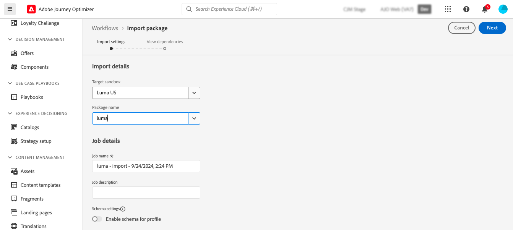

# Exportación de objetos a otra zona protegida {#copy-to-sandbox}

Puede copiar objetos, como recorridos, campañas, acciones personalizadas, plantillas de contenido o fragmentos, en varios entornos limitados mediante las funciones de exportación e importación de paquetes. Un paquete puede constar de un único objeto o de varios objetos. Los objetos incluidos en un paquete deben pertenecer a la misma zona protegida.

En esta página se describe el caso de uso de las herramientas de entorno limitado en el contexto de Journey Optimizer. Para obtener más información sobre la característica en sí, consulte la [Guía de herramientas de espacio aislado](https://experienceleague.adobe.com/docs/experience-platform/sandbox/ui/sandbox-tooling.html#abobe-journey-optimizer-objects){target="_blank"} de Adobe Experience Platform.

>[!NOTE]
>
>Esta característica requiere los siguientes permisos de la funcionalidad **Administración de espacio aislado**: Administrar espacios aislados (o Ver espacios aislados) y Administrar paquetes. [Más información](../administration/ootb-permissions.md)

El proceso de copia se lleva a cabo mediante una exportación de paquetes y una importación entre las zonas protegidas de origen y destino. Estos son los pasos generales para copiar un recorrido de una zona protegida a otra:

1. [Agregue el objeto que desea exportar como paquete en la zona protegida de origen](#export)
1. [Publicación del paquete](#publish)
1. [Importe el paquete en la zona protegida de Target](#import)

>[!NOTE]
>
>Para migrar objetos de Administración de decisiones a Decisioning, use la [API de migración de decisiones](../experience-decisioning/decisioning-migration-api.md) que proporciona capacidades automatizadas de resolución de dependencias y reversión diseñadas específicamente para la migración de entidades de decisiones.

## Objetos exportados y prácticas recomendadas {#objects}

Journey Optimizer permite exportar recorridos, campañas (de acción, activadas por API y orquestadas), acciones personalizadas, plantillas de contenido, fragmentos y otros objetos a otro entorno limitado. Las secciones siguientes proporcionan información y prácticas recomendadas para cada tipo de objeto.

### Prácticas recomendadas generales {#global}

* Al copiar un objeto, cualquier dependencia (como fragmentos anidados, audiencias de recorrido o acciones) se actualiza correctamente en el objeto principal, lo que garantiza una asignación adecuada en la zona protegida de destino.

* Si un objeto exportado contiene personalización de perfiles, asegúrese de que el esquema adecuado existe en la zona protegida de Target para evitar cualquier problema de personalización.

* Actualmente, no se admiten páginas de aterrizaje para la migración entre zonas protegidas. Al copiar un recorrido en otra zona protegida, cualquier referencia a páginas de aterrizaje en el contenido del recorrido o del correo electrónico seguirá apuntando a los ID de página de aterrizaje de la zona protegida original (fuente). Después de la migración, debe actualizar manualmente todas las referencias de páginas de aterrizaje en el contenido de recorrido y correo electrónico para utilizar los ID de página de aterrizaje correctos desde la zona protegida de destino. Ver [Crear y publicar páginas de aterrizaje](../landing-pages/create-lp.md).

+++ Recorridos

* **Dependencias copiadas**: al exportar un recorrido, además del propio recorrido, Journey Optimizer también copia la mayoría de los objetos de los que depende el recorrido: audiencias, acciones personalizadas, esquemas, eventos y acciones. Para obtener más información sobre los objetos copiados, consulte la [Guía de herramientas de espacio aislado de Adobe Experience Platform](https://experienceleague.adobe.com/docs/experience-platform/sandbox/ui/sandbox-tooling.html#abobe-journey-optimizer-objects){target="_blank"}.

* **Validación manual recomendada**: no garantizamos que todos los elementos vinculados se copien en la zona protegida de destino. Le recomendamos encarecidamente que realice una comprobación exhaustiva, por ejemplo, antes de publicar un recorrido. Esto le permite identificar cualquier posible objeto que falte.

* **Modo de borrador y exclusividad**: los objetos copiados en la zona protegida de destino son únicos y no hay riesgo de sobrescribir elementos existentes. Tanto el recorrido como los mensajes dentro del recorrido se transfieren en modo de borrador. Esto le permite realizar una validación completa antes de la publicación en la zona protegida de destino.

* **Metadatos**: el proceso de copia solo copia los metadatos sobre el recorrido y los objetos de ese Recorrido. No se están copiando datos de perfil o conjunto de datos como parte de este proceso.

* **Acciones personalizadas**

   * Al exportar acciones personalizadas, la configuración de URL y los parámetros de carga útil se copian. Sin embargo, por motivos de seguridad, los parámetros de autenticación no se copian y, en su lugar, se sustituyen por &quot;INSERTAR SECRETO AQUÍ&quot;. Los valores de encabezado de solicitud constante y parámetro de consulta también se sustituyen por &quot;INSERTAR SECRETO AQUÍ&quot;.

     Esto incluye las acciones personalizadas de propósito especial ([!DNL Adobe Campaign Standard], [!DNL Campaign Classic], [!DNL Marketo Engage]).

   * Al copiar un recorrido en otra zona protegida, si selecciona &quot;Usar existente&quot; para una acción personalizada durante el proceso de importación, la acción personalizada existente que seleccione debe ser la misma que la acción personalizada de origen (es decir, la misma configuración, parámetros, etc.). De lo contrario, la nueva copia de recorrido tendrá errores que no se podrán resolver en el lienzo.

* **Fuentes de datos, grupos de campos y eventos**: al copiar un recorrido que usa eventos, fuentes de datos o grupos de campos, el proceso de importación comprueba automáticamente si ya existen componentes con el mismo nombre y tipo en la zona protegida de destino. Por ejemplo, un evento unitario se reemplazará con un evento unitario en la zona protegida de destino con el mismo nombre. Lo mismo se aplica a los eventos empresariales, las fuentes de datos personalizadas y los grupos de campos basados en API y en esquema utilizados en recorrido. Si un evento unitario de la zona protegida de origen tiene el mismo nombre que una zona protegida de destino de evento empresarial, no se copia ni se crea, esto se aplica también a todos los demás componentes.

+++

+++ Campañas activadas por acción y API

Puede copiar campañas **Action**, **activadas por API** entre zonas protegidas mediante la exportación e importación de paquetes.

Estos tipos de campañas se copian junto con todos los elementos relacionados con el perfil, la audiencia, el esquema, los mensajes en línea y los objetos dependientes.

Sin embargo, no se copian los siguientes elementos:

* Variantes multilingües y configuración de idioma,
* Reglas empresariales,
* Etiquetas,
* Etiquetado y aplicación del uso de datos (Data Usage Labeling and Enforcement, DULE).

Al copiar **Campañas de acción** o **activadas por API**, asegúrese de que los objetos enumerados a continuación estén validados en la zona protegida de destino para evitar configuraciones incorrectas:

* **Configuraciones de canal**: las configuraciones de canal se copian junto con las campañas. Una vez copiadas las campañas, las configuraciones de canal deben seleccionarse manualmente en la zona protegida de Target.
* **Variantes y configuración de experimento**: las variantes y la configuración de experimento se incluyen en el proceso de copia de campaña. Valide esta configuración en la zona protegida de destino después de la importación.
* **Toma de decisiones unificada**: se admiten directivas de decisión y elementos de decisión para la exportación e importación. Asegúrese de que las dependencias relacionadas con la toma de decisiones se asignan correctamente en la zona protegida de destino.

+++

+++Campañas orquestadas

Puede copiar campañas orquestadas entre entornos limitados mediante la exportación e importación de paquetes. Las campañas organizadas siguen el mismo patrón general que otros objetos, pero lo que se incluye en el paquete y lo que debe preparar en la zona protegida de destinatario difiere de las campañas activadas por la acción o la API.

Para exportar una campaña orquestada, [agréguela a un paquete de zona protegida](#add-objects-as-a-package-export) en la zona protegida de origen (independientemente de su estado), [publique el paquete](#publish) e [importe el paquete](#import) en la zona protegida de destino.

Antes de importar en producción, tenga en cuenta los siguientes comportamientos y limitaciones:

* **Copia de borrador**: la campaña orquestada importada siempre se crea en borrador en la zona protegida de destino, independientemente del estado de la campaña orquestada de origen.

* **Nuevo objeto en cada importación**: al importar un paquete de nuevo, se crea una nueva campaña organizada. No sobrescribe ni actualiza una campaña que haya importado anteriormente.

* **No se admite la reexportación del mismo paquete**. La publicación del mismo paquete una segunda vez después de exportarlo provoca que las actividades dentro de la campaña importada entren en un estado de error. Si esto sucede, debe eliminar las actividades afectadas y volver a crearlas manualmente. Esta limitación se solucionará en una versión futura.

* **No todas las dependencias se copian automáticamente**. Al agregar solo la campaña orquestada a un paquete, no se incluye una cadena de dependencias completa por sí sola. Las configuraciones de canal, los esquemas de tiendas relacionales, los conjuntos de datos y las reglas empresariales no se incluyen a menos que las aborde explícitamente (consulte la siguiente viñeta para obtener más detalles).

  Durante la [importación de paquetes](#import), Journey Optimizer enumera los objetos que se deben resolver en la zona protegida de destino. Las siguientes reglas se aplican a los objetos más comunes:

   * **Campaign** — Seleccione siempre **Crear nuevo**.
   * **Audiencias**: para las audiencias de Adobe Experience Platform, puede seleccionar **Crear nuevo** o **Usar existente**. Para las audiencias de campaña orquestadas, debe seleccionar **Usar existentes** y asignarlo a la audiencia correspondiente en la zona protegida de destino.
   * **Políticas de combinación** — Seleccione **Usar las políticas existentes** y asígnelas a la política de combinación adecuada, o use la predeterminada en la zona protegida de destino.

  Después de la importación, utilice alertas en la campaña orquestada para encontrar los huecos restantes (por ejemplo, un perfil o recurso de segmentación que aún no existe en la zona protegida de destinatario puede dejar una actividad con un destinatario vacío hasta que lo corrija).

* **Lo que debe agregar o alinear por separado**: lo siguiente no se incluye en la exportación de la campaña orquestada:

   * **Configuraciones de canal**: no se exportan ni importan con el paquete. Para que el correo electrónico y otras actividades de canal funcionen sin correcciones manuales, la zona protegida de destino ya debe tener una configuración de canal cuyo nombre coincida exactamente con el origen (con distinción de mayúsculas y minúsculas) y que utilice el mismo canal. De lo contrario, verá alertas en las actividades después de la importación. Abra cada actividad afectada y seleccione o cree la configuración de canal correcta.

   * **Esquemas y conjuntos de datos de almacén relacional**: si su campaña depende de un modelo de datos determinado, planifique el esquema y el orden de exportación/importación del conjunto de datos para que existan dependencias cuando las necesite (la exportación de un conjunto de datos generalmente extrae las necesidades de esquema relacionadas, la exportación de un esquema por sí solo no incluye su conjunto de datos). Tenga en cuenta que los conjuntos de datos importados no se activan automáticamente para las campañas orquestadas; debe activarlos manualmente en la zona protegida de destino después de la importación.

   * **Reglas de negocio y objetos de directiva similares**: no se incluyen dentro de la exportación de campaña orquestada. Si la campaña depende de ellos, confirme que existen en la zona protegida de Target o vuelva a crearlos allí.

   * **Dimensión de destino del perfil**: La dimensión de destino del perfil no se incluye en la exportación. Si no existe en la zona protegida de Target, las actividades correspondientes de la campaña orquestada importada estarán vacías hasta que la configure manualmente.

+++

+++ Toma de decisiones

* Los objetos siguientes deben estar presentes en la zona protegida de destino antes de copiar los objetos de Decisioning:

   * Atributos de perfil utilizados en objetos de Decisioning,
   * El grupo de campos de atributos de oferta personalizados,
   * Los esquemas de flujos de datos utilizados para atributos de contexto en reglas, clasificación o límite.

* Actualmente no se admite la copia de zona protegida para fórmulas de clasificación con modelos de IA.

* Al copiar una campaña, los elementos de decisión (elementos de oferta) no se copian automáticamente. Asegúrese de copiarlos individualmente utilizando la opción &quot;Agregar al paquete&quot;.

* Si una política de decisión tiene una estrategia de selección, los elementos de decisión deben agregarse por separado. Si tiene elementos de decisión manuales/de reserva, se añaden automáticamente como dependencias directas.

* Al copiar entidades de Decisioning, asegúrese de copiar los elementos de decisión **antes de** cualquier otro objeto. Por ejemplo, si copia una colección primero y no hay ofertas en la nueva zona protegida, la nueva colección permanecerá vacía.

* Al copiar entidades con dependencias (por ejemplo, esquema, segmentos), haga clic en &quot;Crear nuevo&quot; en la entidad para anular la selección y mostrar la opción &quot;Usar existente&quot; para artefactos dependientes. Las dependencias adicionales pueden requerir la repetición de este paso más adelante en la jerarquía.

  Ejemplo: Al importar una campaña, para reutilizar un esquema de secuencia de datos en una regla, haga clic en &quot;Crear nuevo&quot; con DECISIONING_STRATEGY y, a continuación, de nuevo en DECISIONING_RULES, para mostrar la opción &quot;Usar existente&quot; para el esquema de secuencia de datos.

* Para las entidades dependientes de un esquema de contexto de secuencia de datos, asegúrese de que la secuencia de datos se haya creado de antemano y seleccione un esquema existente para esa secuencia de datos.

* Si hace clic directamente en &quot;Finalizar&quot; mientras realiza la importación, todas las dependencias se crearán de nuevo.

+++

+++ Plantillas de contenido

* Al exportar una plantilla de contenido, todos los fragmentos anidados también se copian junto con ella.

* La exportación de plantillas de contenido a veces puede provocar la duplicación de fragmentos. Por ejemplo, si dos plantillas comparten el mismo fragmento y se copian en paquetes separados, ambas plantillas deberán reutilizar el mismo fragmento en la zona protegida de destino. Para evitar duplicaciones, seleccione la opción &quot;Usar existente&quot; durante el proceso de importación. [Obtenga información sobre cómo importar un paquete](#import)

* Para evitar duplicaciones, se recomienda exportar las plantillas de contenido en un solo paquete. Esto garantiza que el sistema gestione la deduplicación de forma eficaz.

+++

+++ Fragmentos

* Los fragmentos pueden tener varios estados, como Activo, Borrador y Activo con el borrador en curso. Al exportar un fragmento, su último estado de Borrador se copia en la zona protegida de destino.

* Al exportar un fragmento, todos los fragmentos anidados también se copian junto con él.

+++

## Adición de objetos como paquete {#export}

Para copiar objetos en otra zona protegida, primero debe añadirlos como paquete en la zona protegida de origen. Siga estos pasos:

1. Vaya al inventario donde está almacenado el primer objeto que desea copiar, como la lista recorridos. Haga clic en el icono **Más acciones** (los tres puntos junto al nombre del objeto) y haga clic en **Agregar al paquete**.

   

1. En la ventana **Agregar al paquete**, elija si desea agregar el objeto a un paquete existente o crear un nuevo paquete:

   

   * **Paquete existente**: seleccione el paquete en el menú desplegable.
   * **Crear nuevo paquete**: escriba el nombre del paquete. También puede añadir una descripción.

1. Repita estos pasos para añadir todos los objetos que desee exportar con el paquete.

## Publicación del paquete para exportar {#publish}

Una vez que el paquete esté listo para exportarse, siga estos pasos para publicarlo:

1. Vaya al menú **[!UICONTROL Administración]** > **[!UICONTROL Zonas protegidas]** y seleccione la pestaña **Paquetes**.

1. Abra el paquete que desea exportar, seleccione los objetos que desea exportar y haga clic en **Publicar**.

   En este ejemplo, deseamos exportar un recorrido, una plantilla de contenido y un fragmento.

   

1. Para realizar un seguimiento del estado de la publicación del paquete desde la ficha **[!UICONTROL Trabajos]**. Para obtener más información sobre un trabajo, selecciónelo en la lista y haga clic en el botón **[!UICONTROL Ver detalles de importación]**.

   

## Importe el paquete en la zona protegida de Target {#import}

Una vez publicado el paquete, debe importarlo en la zona protegida de destino. Siga estos pasos:

1. Vaya al menú **[!UICONTROL Zonas protegidas]** y seleccione la pestaña **[!UICONTROL Examinar]**.

1. Busque la zona protegida en la que desea importar el paquete y, a continuación, haga clic en el icono + junto a su nombre.

   

   >[!NOTE]
   >
   >Solo están disponibles las zonas protegidas de su organización.

1. En el campo **Entorno aislado de destino**, compruebe que esté seleccionada la zona protegida de destino correcta y seleccione el paquete que desea importar de la lista desplegable **[!UICONTROL Nombre del paquete]**. Haga clic en **Next**.

   

1. Revise los objetos de paquete y las dependencias. Esta es la lista de objetos que se han añadido al paquete, junto con otros objetos de los que dependen los recorridos, como audiencias, esquemas, eventos o acciones.

   Para cada objeto, puede elegir crear uno nuevo o utilizar uno existente en la zona protegida de destino. Esto le permite, por ejemplo, evitar la duplicación de fragmentos que puede ocurrir al importar plantillas de contenido utilizando fragmentos comunes.

   

1. Haga clic en el botón **Finalizar**, en la esquina superior derecha, para comenzar a copiar el paquete en la zona protegida de destino. El proceso de copia varía según la complejidad de los objetos y la cantidad de objetos que deben copiarse.

1. Haga clic en el trabajo de importación para revisar el resultado de la copia:

   * Haga clic en el botón **Ver objetos importados** para mostrar cada objeto individual copiado.
   * Haga clic en el botón **Ver detalles de importación** para comprobar los resultados de importación de cada objeto.

   

1. Acceda a la zona protegida de destino y realice una comprobación exhaustiva de todos los objetos copiados.
