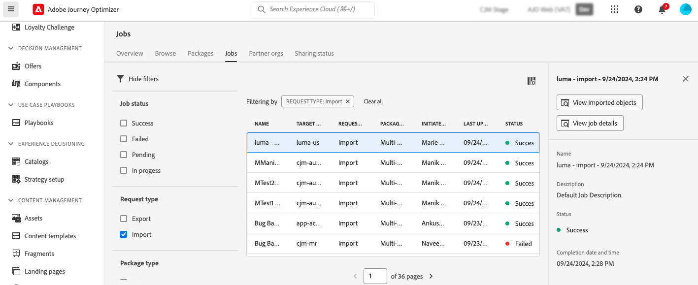

# Exportación de objetos a otra zona protegida {#copy-to-sandbox}

Puede copiar objetos, como recorridos, plantillas de contenido o fragmentos, en varios entornos limitados mediante las funciones de exportación e importación de paquetes. Un paquete puede constar de un único objeto o de varios objetos. Los objetos incluidos en un paquete deben pertenecer a la misma zona protegida.

En esta página se describe el caso de uso de las herramientas de entorno limitado en el contexto de Journey Optimizer. Para obtener más información sobre la característica en sí, consulte la [documentación de Experience Platform](https://experienceleague.adobe.com/docs/experience-platform/sandbox/ui/sandbox-tooling.html).

>[!NOTE]
>
>Esta característica requiere los siguientes permisos de la funcionalidad **Administración de espacio aislado**: Administrar espacios aislados (o Ver espacios aislados) y Administrar paquetes. [Más información](../administration/ootb-permissions.md)

The copy process is carried via a package export and import between the source and target sandboxes. Here are the general steps to copy a journey from one sandbox to another:

1. Add the object to export as a package in the source sandbox.
1. Export the package to the target sandbox.

## Objetos exportados y prácticas recomendadas {#objects}

Journey Optimizer permite exportar recorridos, plantillas de contenido y fragmentos a otra zona protegida. Las secciones siguientes proporcionan información y prácticas recomendadas para cada tipo de objeto.

### Prácticas recomendadas generales {#global}

* Al copiar un objeto, cualquier dependencia (como fragmentos anidados, audiencias de recorrido o acciones) se actualiza correctamente en el objeto principal, lo que garantiza una asignación adecuada en la zona protegida de destino.

* If an exported object contains profile personalization, make sure that the appropriate schema exists in the target sandbox to avoid any personalization issue.

### Recorridos {#journeys}

* Al exportar un recorrido, además del propio recorrido, Journey Optimizer también copia la mayoría de los objetos de los que depende el recorrido: audiencias, esquemas, eventos y acciones. Para obtener más información sobre los objetos copiados, consulte esta [sección](https://experienceleague.adobe.com/docs/experience-platform/sandbox/ui/sandbox-tooling.html#abobe-journey-optimizer-objects).

* No garantizamos que todos los elementos vinculados se copien en la zona protegida de destino. Le recomendamos encarecidamente que realice una comprobación exhaustiva, por ejemplo, antes de publicar un recorrido. Esto le permite identificar cualquier posible objeto que falte.

* Los objetos copiados en la zona protegida de destino son únicos y no hay riesgo de sobrescribir elementos existentes. Tanto el recorrido como los mensajes dentro del recorrido se transfieren en modo de borrador. Esto le permite realizar una validación completa antes de la publicación en la zona protegida de destino.

* El proceso de copia solo copia los metadatos sobre el recorrido y los objetos de ese Recorrido. No se están copiando datos de perfil o conjunto de datos como parte de este proceso.

### Campañas {#campaigns}

Las campañas se copian junto con todos los elementos relacionados con el perfil, la audiencia, el esquema, los mensajes en línea y los objetos dependientes.

Sin embargo, los siguientes elementos se **no** copiaron:

* Variantes multilingües y configuración de idioma
* Experiment variants
* Decision policies and decision items
* Reglas empresariales
* Etiquetas
* Data Usage Labelling and Enforcement(DULE) labels

After campaigns are copied, channel configurations must be selected manually.

### Plantillas de contenido {#content-templates}

* Al exportar una plantilla de contenido, todos los fragmentos anidados también se copian junto con ella.

* Exporting content templates can sometimes result in fragment duplication. For example, if two templates share the same fragment and are copied in separate packages, both templates will need to reuse the same fragment in the target sandbox. To avoid duplication, select the &quot;Use existing&quot; option during the import process. [Learn how to import a package](#import)

* To further avoid duplication, it is recommended to export content templates in a single package. Esto garantiza que el sistema gestione la deduplicación de forma eficaz.

### Fragmentos {#fragments}

* Los fragmentos pueden tener varios estados, como Activo, Borrador y Activo con el borrador en curso. Al exportar un fragmento, su último estado de Borrador se copia en la zona protegida de destino.

* Al exportar un fragmento, todos los fragmentos anidados también se copian junto con él.

## Adición de objetos como paquete{#export}

Para copiar objetos en otra zona protegida, primero debe añadirlos como paquete en la zona protegida de origen. Siga estos pasos:

1. Navigate to the inventory where the first object you want to copy is stored, such as the journeys list. Click the **More actions** icon (the three dots next to the object name) and click **Add to package**.

   

1. In the **Add to package** window, choose if you want to add the object to an existing package or create a new package:

   

   * **Existing package**: select the package from the drop-down menu.
   * **Create a new package**: type the package name. También puede añadir una descripción.

1. Repita estos pasos para añadir todos los objetos que desee exportar con el paquete.

>[!NOTE]
>
>Para la exportación de recorridos, además del propio recorrido, Journey Optimizer también copia la mayoría de los objetos de los que depende el recorrido: audiencias, esquemas, eventos y acciones. Para obtener más información sobre la exportación de recorridos, consulte [esta sección](../building-journeys/copy-to-sandbox.md).

## Publicación del paquete para exportar {#publish}

Una vez que el paquete esté listo para exportarse, siga estos pasos para publicarlo:

1. Vaya al menú **[!UICONTROL Administración]** > **[!UICONTROL Zonas protegidas]** y seleccione la pestaña **Paquetes**.

1. Abra el paquete que desea exportar, seleccione los objetos que desea exportar y haga clic en **Publicar**.

   En este ejemplo, deseamos exportar un recorrido, una plantilla de contenido y un fragmento.

   

1. Para realizar un seguimiento del estado de la publicación del paquete desde la ficha **[!UICONTROL Trabajos]**. Para obtener más información sobre un trabajo, selecciónelo en la lista y haga clic en el botón **[!UICONTROL Ver detalles de importación]**.

   

## Importe el paquete en la zona protegida de Target {#import}

Una vez publicado el paquete, debe importarlo en la zona protegida de destino. Siga estos pasos:

1. Vaya al menú **[!UICONTROL Zonas protegidas]** y seleccione la pestaña **[!UICONTROL Examinar]**.

1. Busque la zona protegida en la que desea importar el paquete y, a continuación, haga clic en el icono + junto a su nombre.

   

   >[!NOTE]
   >
   >Solo están disponibles las zonas protegidas de su organización.

1. En el campo **Entorno aislado de destino**, compruebe que esté seleccionada la zona protegida de destino correcta y seleccione el paquete que desea importar de la lista desplegable **[!UICONTROL Nombre del paquete]**. Haga clic en **Next**.

   

1. Review the package objects and dependencies. This is the list of objects that have been added to the package, along with other objects journeys depend on such as audiences, schemas, events or actions.

   For each object, you can choose to create a new one or use an existing one in the target sandbox. This allows you, for example, to avoid fragment duplication which may happen when importing content templates using common fragments.

   

1. Click the **Finish** button, in the top-right corner to start copying the package to the target sandbox. The copying process varies based on the complexity of the objects and how many objects need to be copied over.

1. Haga clic en el trabajo de importación para revisar el resultado de la copia:

   * Haga clic en el botón **Ver objetos importados** para mostrar cada objeto individual copiado.
   * Haga clic en el botón **Ver detalles de importación** para comprobar los resultados de importación de cada objeto.

   

1. Acceda a la zona protegida de destino y realice una comprobación exhaustiva de todos los objetos copiados.
