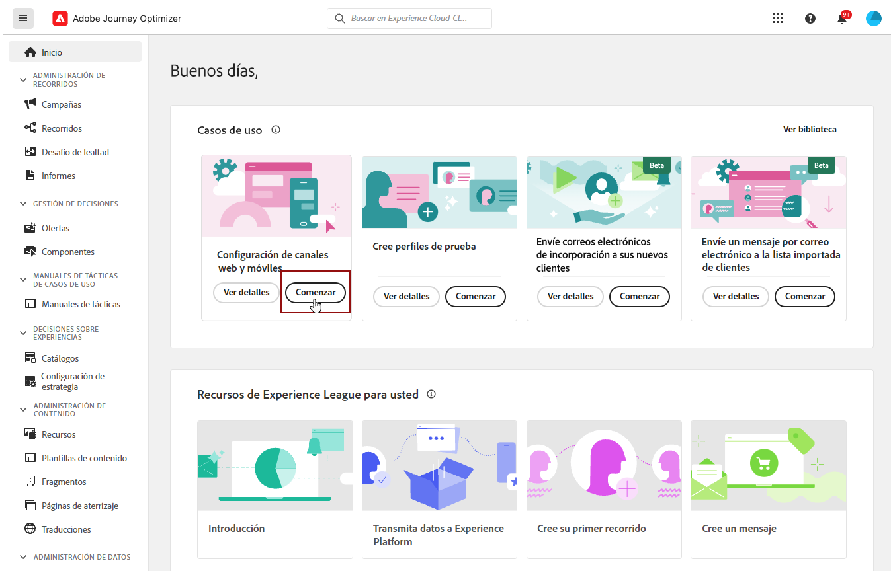
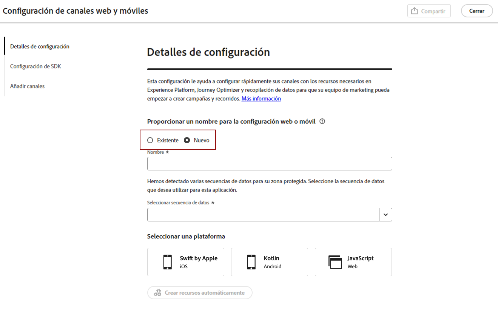
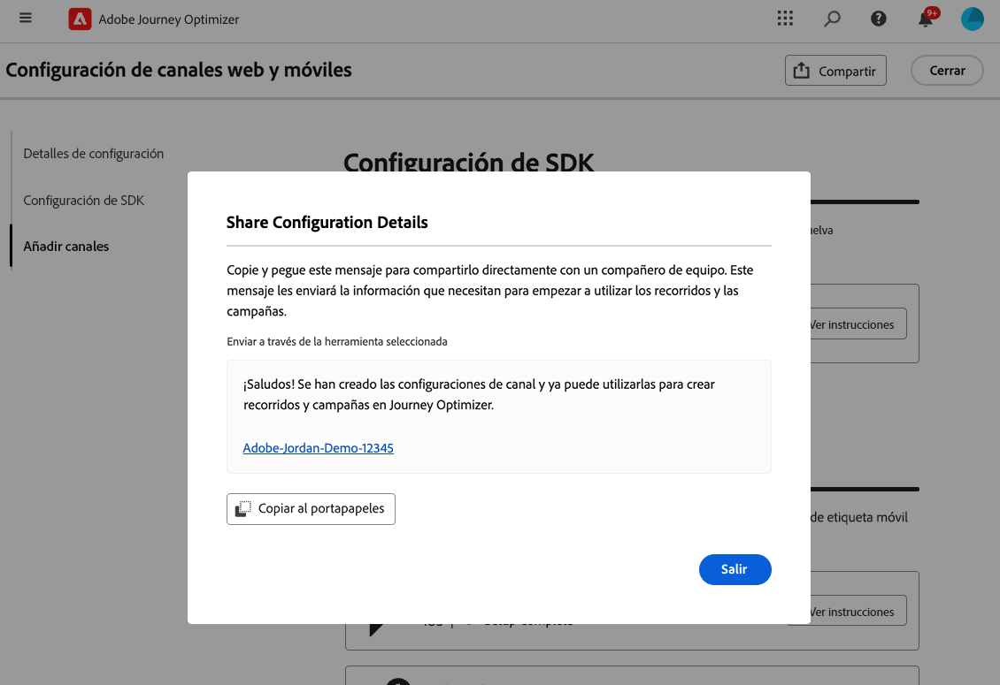
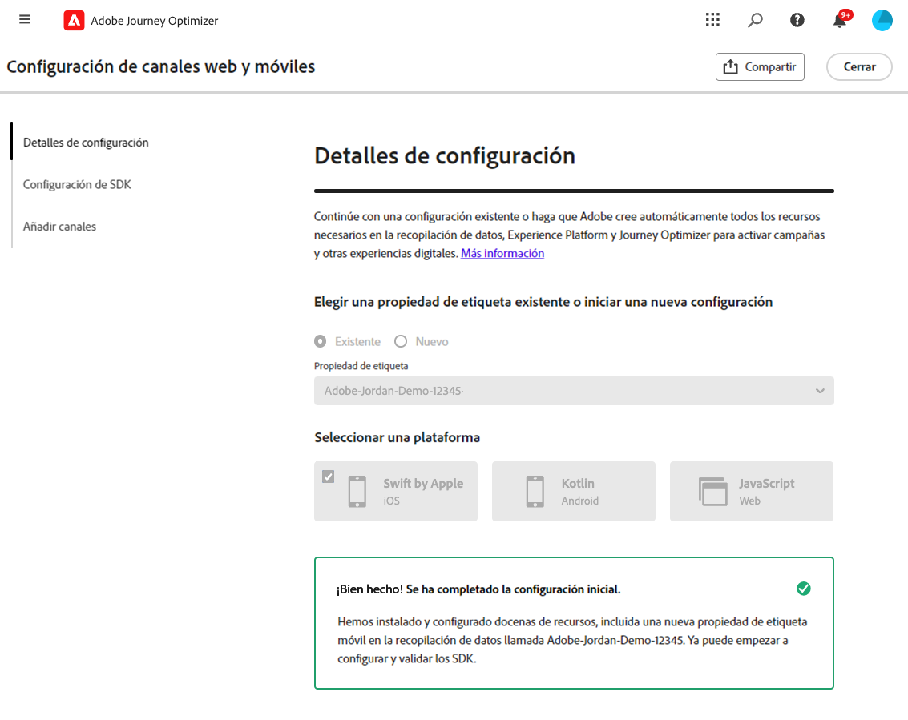
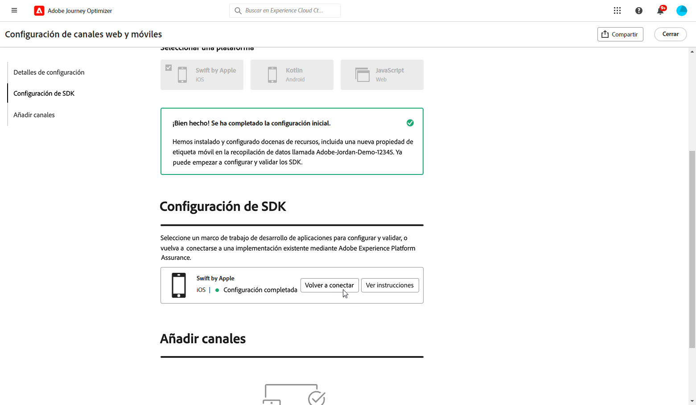

# Creación de una configuración de canal {#set-mobile-ios}

>[!CONTEXTUALHELP]
>id="ajo_mobile_web_setup_javascript_code"
>title="Código JavaScript "
>abstract="La etiqueta del encabezado contiene metadatos y recursos esenciales que se cargan antes del contenido principal de la página web. Colocar el código en esta sección garantiza que se inicialice y ejecute correctamente antes de tiempo, lo que permite que la página web se cargue y funcione de forma eficaz. Al agregar código a la sección del encabezado, ayuda a mejorar la estructura, el rendimiento y la experiencia general del usuario en el sitio."

>[!CONTEXTUALHELP]
>id="ajo_mobile_web_setup_push_token"
>title="Recuperar el token del dispositivo"
>abstract="Para asegurarse de que el token push del dispositivo esté correctamente sincronizado con su perfil de Adobe Experience Platform, debe incorporar el siguiente código en la aplicación. Esta integración es esencial para mantener las capacidades de comunicación actualizadas y garantizar una experiencia de usuario optimizada."

>[!CONTEXTUALHELP]
>id="ajo_mobile_web_setup_push_xcode"
>title="Iniciar la aplicación desde Xcode"
>abstract="Para obtener el token push, en primer lugar, inicie la aplicación con Xcode. Una vez iniciada la aplicación, reiníciela para asegurarse de que se ha completado el proceso de validación. Adobe proporcionará el token push como parte de los resultados de validación. Este token es esencial para habilitar las notificaciones push y se mostrará una vez que la configuración se haya validado correctamente."

>[!CONTEXTUALHELP]
>id="ajo_mobile_web_push_certificate_fcm"
>title="Aportación de un certificado push"
>abstract="Arrastre y suelte el archivo de clave privada .json. Este archivo contiene la información de autenticación necesaria para la integración segura y la comunicación entre la aplicación y el servidor."

>[!CONTEXTUALHELP]
>id="ajo_mobile_web_setup_push_certificate"
>title="Aportación de un certificado push"
>abstract="El archivo de clave .p8 contiene una clave privada que se utiliza para autenticar la aplicación con los servidores de Apple para notificaciones push seguras. Puede adquirir esta clave desde la página Certificados, identificadores y perfiles de su cuenta de desarrollador."

>[!CONTEXTUALHELP]
>id="ajo_mobile_web_setup_push_key_id"
>title="ID de clave"
>abstract="El ID de clave, una cadena de 10 caracteres asignada durante la creación de la clave de autenticación p8, se encuentra en la ficha **Claves** de la página Certificados, identificadores y perfiles de su cuenta de desarrollador."

>[!CONTEXTUALHELP]
>id="ajo_mobile_web_setup_push_team_id"
>title="ID de equipo"
>abstract="El ID de equipo, un valor de cadena usado para identificar a tu equipo, se encuentra en la ficha **Pertenencia** de tu cuenta de desarrollador."

Esta configuración simplifica la configuración rápida de los canales de marketing, lo que facilita la disponibilidad de todos los recursos esenciales en las aplicaciones de Experience Platform, Journey Optimizer y de recopilación de datos. Esto permite a su equipo de marketing empezar a crear campañas y recorridos con rapidez.

1. En la página de inicio de Journey Optimizer, haga clic en **[!UICONTROL Comenzar]** en la tarjeta **[!UICONTROL Configuración de canales web y móviles]**.

   

1. Creación de una **[!UICONTROL Nueva]** configuración.

   Si ya tiene configuraciones existentes, puede elegir seleccionar una o crear una nueva configuración.

   

1. Escriba un **[!UICONTROL Nombre]** para la nueva configuración y seleccione o cree su **[!UICONTROL Secuencia de datos]**. Este **[!UICONTROL Nombre]** se usará para cada recurso creado automáticamente.

1. Si su organización tiene varias secuencias de datos, seleccione una de las opciones existentes. Si no tiene una secuencia de datos, se creará una automáticamente.

1. Seleccione su plataforma y haga clic en **[!UICONTROL Crear recursos automáticamente]**.

1. Para optimizar el proceso de configuración, se crean de forma automática los recursos necesarios para ayudarle a empezar. Esto incluye la creación de una nueva **[!UICONTROL propiedad de etiquetas móviles]** y la instalación de extensiones.

[Más información sobre los recursos generados automáticamente](set-mobile-config.md#auto-create-resources)

1. Una vez completada la generación de recursos, siga las instrucciones de la interfaz de usuario para configurar y validar los SDK y los canales.

1. Después de completar la configuración, comparta la **[!UICONTROL configuración de canal]** generada automáticamente con los integrantes del equipo responsables de crear recorridos y campañas.

   {zoomable="yes"}

1. Ahora puede hacer referencia a la **[!UICONTROL Configuración de canal]** en la interfaz de Campañas o Recorridos, lo que permite una conexión perfecta entre la configuración y la ejecución de recorridos y campañas de destino para su público.

## Modificación de una configuración móvil existente {#reconnect}

Después de crear la configuración, puede revisarla con facilidad en cualquier momento para añadir canales adicionales o hacer más ajustes que se adapten a sus necesidades

1. En la página de inicio de Journey Optimizer, haga clic en **[!UICONTROL Comenzar]** en la tarjeta **[!UICONTROL Configuración de canales web y móviles]**.

   

1. Seleccione **[!UICONTROL Existente]** y elija su **[!UICONTROL Propiedad de etiqueta]** existente en la lista desplegable.

   

1. Al acceder a la configuración existente, debe volver a conectarse con Adobe Assurance. En el menú Configuración del SDK, haga clic en **[!UICONTROL Volver a conectar]**.

   

1. Seleccione su dispositivo en la lista desplegable **[!UICONTROL Dispositivos disponibles]** y haga clic en **[!UICONTROL Conectar]**.

   {zoomable="yes"}

1. Ahora puede actualizar la configuración según sea necesario.
