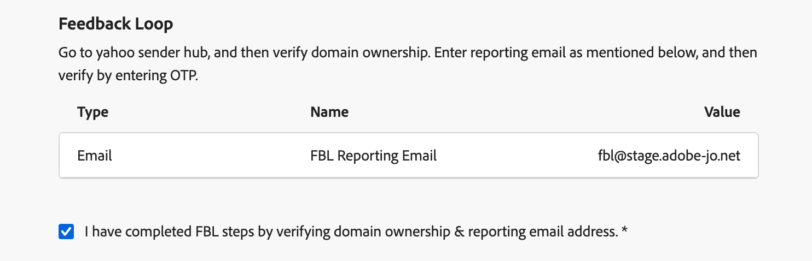

# Configuración de un subdominio personalizado {#delegate-custom-subdomain}

>[!AVAILABILITY]
>
>Esta capacidad tiene disponibilidad limitada. Póngase en contacto con su representante de Adobe para obtener acceso.

Como alternativa a los métodos [Totalmente delegados](about-subdomain-delegation.md#full-subdomain-delegation) y [CNAME configurados](about-subdomain-delegation.md#cname-subdomain-delegation), el método **Delegación personalizada** le permite tomar la propiedad de sus subdominios dentro de Journey Optimizer y tener control total sobre los certificados generados.

Como parte de este proceso, Adobe debe asegurarse de que el DNS esté configurado correctamente para enviar, procesar y rastrear mensajes. Por este motivo, se le pedirá que [cargue el certificado SSL](#upload-ssl-certificate) obtenido de la entidad emisora de certificados y que complete los [pasos del bucle de comentarios](#feedback-loop-steps) comprobando la propiedad del dominio y la dirección de correo electrónico del informe.

Para configurar un subdominio personalizado, siga los pasos a continuación.

1. Acceda al menú **[!UICONTROL Administración]** > **[!UICONTROL Canales]** > **[!UICONTROL Configuración de correo electrónico]** > **[!UICONTROL Subdominios]**.

1. Haga clic en **[!UICONTROL Configurar subdominio]**.

1. En la sección **[!UICONTROL Configurar método]**, seleccione **[!UICONTROL Delegación personalizada]**.

   {width=90%}

1. Especifique el nombre del subdominio que desea delegar.

   >[!CAUTION]
   >
   >No puede usar el mismo dominio de envío para enviar mensajes desde [!DNL Adobe Journey Optimizer] y desde otro producto, como [!DNL Adobe Campaign] o [!DNL Adobe Marketo Engage].

## Crear los registros DNS {#create-dns-records}

>[!CONTEXTUALHELP]
>id="ajo_admin_subdomain_custom_dns"
>title="Generar los registros DNS coincidentes"
>abstract="Para delegar completamente un subdominio personalizado a Adobe, debe copiar y pegar la información del servidor de nombres de Adobe que se muestra en la interfaz de Journey Optimizer en la solución de alojamiento de dominios para generar los registros DNS coincidentes."

1. Se muestra la lista de registros que se van a colocar en los servidores DNS. Copie estos registros, uno por uno o descargando un archivo CSV.

1. Vaya a la solución de alojamiento de dominios para generar los registros DNS coincidentes.

1. Asegúrese de que todos los registros DNS se hayan generado en la solución de alojamiento de dominios.

1. Si todo está configurado correctamente, marque la casilla &quot;Confirmo...&quot;.

   {width="75%"}

## Cargar el certificado SSL {#upload-ssl-certificate}

>[!CONTEXTUALHELP]
>id="ajo_admin_subdomain_custom-ssl"
>title="Generar la solicitud de firma de certificado"
>abstract="Al configurar un nuevo subdominio personalizado, debe generar la solicitud de firma de certificado (CSR), rellenarla y enviarla a la autoridad de certificación para obtener el certificado SSL que necesita cargar en Journey Optimizer."

>[!CONTEXTUALHELP]
>id="ajo_admin_subdomain_key_length"
>title="Seleccionar una longitud de clave"
>abstract="La longitud de la clave puede ser de 2048 o 4096 bits únicamente. No se puede cambiar después de enviar el subdominio."

1. En la sección **[!UICONTROL Certificado SSL]**, haga clic en **[!UICONTROL Generar CSR]**.

   {width="85%"}

   >[!NOTE]
   >
   >Se muestra la fecha de caducidad del certificado SSL. Una vez que llegue la fecha, debe cargar un nuevo certificado.

1. Rellene el formulario que se muestra y genere la solicitud de firma de certificado (CSR).

   {width="70%"}

   >[!NOTE]
   >
   >La longitud de la clave puede ser de 2048 o 4096 bits únicamente. No se puede cambiar después de enviar el subdominio.

1. Haga clic en **[!UICONTROL Descargar CSR]** y guarde el formulario en el equipo local.

1. Envíelo a la autoridad de certificación (CA) para obtener su certificado SSL. Antes de enviar esta CSR a su CA para su firma, hay que tener en cuenta algunos puntos importantes:

   * La CSR descargada del paso 3 solo es para data.subdomain.com.

   * Sin embargo, el certificado debe cubrir tanto data.subdomain.com como cdn.subdomain.com como entradas de nombres alternativos del sujeto (SAN) dentro de un solo certificado. Por ejemplo, si delega example.adobe.com, data.subdomain.com corresponde a data.example.adobe.com y cdn.subdomain.com a cdn.example.adobe.com.

   * Los subdominios Data (data.example.adobe.com) y CDN (cdn.example.adobe.com) deben agregarse como entradas del mismo nivel en el mismo certificado.

   * La mayoría de las CA le permiten agregar SAN adicionales (como el subdominio CDN) durante el proceso de firma

      * A través del portal de CA (recomendado, si está disponible), o
      * Solicitándola manualmente con su equipo de asistencia si la opción del portal no está disponible.

   * Una vez firmada, la CA emitirá un único certificado que abarcará tanto el dominio de datos como el subdominio de CDN.

1. Una vez recuperado, haga clic en **[!UICONTROL Cargar certificado SSL]** y cargue el certificado en [!DNL Journey Optimizer] en formato .pem con la cadena de certificados completa. Este es un ejemplo de formato de archivo .pem:

   ```
   -----BEGIN CERTIFICATE-----
   MIIDXTCCAkWgAwIBAgIJALc3... (base64 encoded data)
   -----END CERTIFICATE-----
   ```

   <!--
    >[!CAUTION]
    >
    >Both Data and CDN subdomains must be included in the same certificate.-->

## Complete los pasos del bucle de retroalimentación {#feedback-loop-steps}

>[!CONTEXTUALHELP]
>id="ajo_admin_subdomain_feedback-loop"
>title="Complete los pasos del bucle de retroalimentación"
>abstract="Vaya a Yahoo! Sender Hub y rellene el formulario para comprobar la propiedad del dominio. Introduzca la dirección de correo electrónico del sistema de informes de FBL que se indica a continuación y utilice la contraseña de un solo uso (OTP) que recibirá para verificar la propiedad en Yahoo! Sender Hub."

1. Vaya a [Yahoo! Sitio web del concentrador de remitentes ](https://senders.yahooinc.com/) y rellene el formulario necesario para comprobar la propiedad del dominio.

1. Para verificar la propiedad del dominio, Yahoo! Sender Hub necesitará que proporcione una dirección de correo electrónico. Escriba la dirección de correo electrónico de informe FBL en **[!UICONTROL Valor]**. Es una dirección de correo electrónico propiedad de Adobe.

1. Cuando Yahoo! Sender Hub genera una contraseña única (OTP), que se envía a esta dirección de Adobe.

1. Póngase en contacto con el equipo de entrega de Adobe que le proporcionará este OTP. <!--Specify how to reach out + any information that customer should share in the request to deliverability team to get access to the right OTP-->

   >[!CAUTION]
   >
   >El OTP solo es válido durante 24 horas, por lo que debe ponerse en contacto con Adobe en cuanto se genere el OTP. <!--TBC?-->
   >
   >La solicitud OTP solo se puede realizar en días laborables. No hay soporte los fines de semana. <!--Add times + timezone-->

1. Introduzca el OTP en Yahoo! Sender Hub.

1. Asegúrese de haber completado todos los pasos del Bucle de comentarios.

1. Si todo está configurado correctamente, marque la casilla &quot;He completado...&quot;.

   {width="85%"}

1. Haga clic en **[!UICONTROL Continuar]** y espere hasta que Adobe compruebe que los registros se generan sin errores en la solución de alojamiento. Este proceso puede tardar hasta 2 minutos.

   >[!NOTE]
   >
   >Asegúrese de que todos los registros se hayan creado correctamente antes de continuar.

1. Adobe genera un registro de validación de URL de CDN SSL. Copie este registro de validación en la plataforma de alojamiento. Si ha creado correctamente este registro en su solución de alojamiento, marque la casilla &quot;Confirmo...&quot;.

1. Haga clic en **[!UICONTROL Enviar]** para que Adobe realice las comprobaciones necesarias. [Más información](delegate-subdomain.md#submit-subdomain)

## Lista de comprobación de resolución de problemas {#check-list}

Si se producen errores al intentar enviar el subdominio personalizado, realice las acciones de solución de problemas que se enumeran a continuación.

* Compruebe que todos los registros DNS se hayan propagado correctamente mediante las herramientas de búsqueda DNS.

* Compruebe que el certificado cumple todos los requisitos técnicos antes de cargarlo.

* Asegúrese de que el certificado se ha cargado en el formato correcto.
