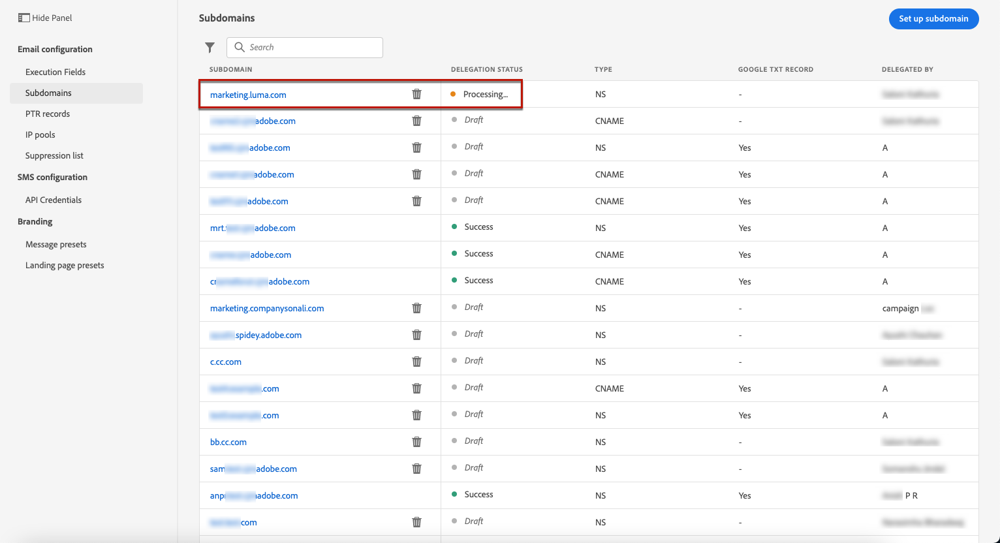

# Delegar un subdominio

La delegación de nombres de dominio es un método que permite al propietario de un nombre de dominio (técnicamente: una zona DNS) para delegar una subdivisión de ella (técnicamente: una zona DNS bajo ella, que puede llamarse subzona) a otra entidad. Básicamente, si un cliente está manejando la zona &quot;example.com&quot;, puede delegar la subzona &quot;marketing.example.com&quot; a Adobe.

Al delegar un subdominio para utilizarlo con [!DNL Journey Optimizer], los clientes pueden confiar en el Adobe para mantener la infraestructura DNS necesaria para cumplir los requisitos de envío estándar del sector para sus dominios de envío de marketing por correo electrónico, a la vez que continúan manteniendo y controlando DNS para sus dominios de correo electrónico internos.

[!DNL Journey Optimizer] le permite delegar completamente los subdominios a Adobes directamente desde la interfaz de producto. Al hacerlo, Adobe podrá enviar mensajes como un servicio administrado controlando y manteniendo todos los aspectos de DNS necesarios para la entrega, el procesamiento y el seguimiento de campañas de correo electrónico.

>[!NOTE]
>
>De forma predeterminada, el contrato de licencia [!DNL Journey Optimizer] permite delegar hasta 10 subdominios. Póngase en contacto con el Adobe si desea aumentar esta limitación.
>
>Journey Optimizer no admite actualmente el uso de CNAME para la delegación de subdominios.

Para delegar un nuevo subdominio, siga los pasos a continuación:

1. Acceda al menú **[!UICONTROL Channels]** / **[!UICONTROL Subdomains]** y haga clic en **[!UICONTROL Delegate subdomain]**.

   

1. Especifique el nombre del subdominio que desea delegar.

   

   >[!CAUTION]
   >
   >No se permite delegar un subdominio no válido al Adobe. Asegúrese de introducir un subdominio válido que sea propiedad de su organización, como marketing.yourcompany.com.
   >
   >Tenga en cuenta que los subdominios de varios niveles, como email.marketing.yourcompany.com , no son compatibles actualmente.

1. Se muestra la lista de registros que se van a colocar en los servidores DNS. Copie estos registros, uno por uno o descargando un archivo CSV, y luego vaya a la solución de alojamiento de dominios para generar los registros DNS coincidentes.

1. Asegúrese de que todos los registros DNS se hayan generado en la solución de alojamiento de dominios. Si todo está configurado correctamente, marque la casilla &quot;I confirm...&quot; y luego haga clic en **[!UICONTROL Submit]**.

   

   >[!NOTE]
   >
   >Puede crear los registros y enviar la configuración del subdominio más adelante con el botón **[!UICONTROL Save as draft]**. A continuación, podrá reanudar la delegación de subdominios abriéndola en la lista de subdominios.

1. Una vez enviada la delegación de subdominios, el subdominio se muestra en la lista con el estado **[!UICONTROL Processing]**. Para obtener más información sobre los estados de los subdominios, consulte [esta sección](access-subdomains.md).

   

   Antes de poder utilizar ese subdominio para enviar mensajes, debe esperar hasta que el Adobe realice las comprobaciones necesarias, que pueden tardar hasta tres horas. Obtenga más información en [esta sección](#subdomain-validation).

1. Una vez realizadas las comprobaciones correctamente, el subdominio recibe el estado **[!UICONTROL Success]**. Está listo para utilizarse para enviar mensajes.

   <!-- later on, users will be notified in Pulse -->

   

## Validación de subdominios {#subdomain-validation}

Las comprobaciones y acciones siguientes se realizarán hasta que se verifique el subdominio y se puedan utilizar para enviar mensajes.

>[!NOTE]
>
>Estos pasos se realizan por Adobe y pueden tardar hasta 3 horas.

1. **Validación previa**: Adobe comprueba si el subdominio se ha delegado a DNS de Adobe (registro NS, registro SOA, configuración de zona, registro de propiedad). Si el paso de prevalidación falla, se devuelve un error junto con el motivo correspondiente; de lo contrario, el Adobe pasa al siguiente paso.

1. **Configurar DNS para el dominio**:

   * **Registro** MX: Registro eXchange de correo: registro del servidor de correo que procesa los correos electrónicos entrantes enviados al subdominio.
   * **Registro** SPF: Registro del marco de políticas del remitente : enumera las direcciones IP de los servidores de correo que pueden enviar correos electrónicos desde el subdominio.
   * **Registro** DKIM: Registro estándar de Correo identificado de DomainKeys : Utiliza el cifrado de clave pública y privada para autenticar el mensaje y evitar la suplantación.
   * **A**: Asignación de IP predeterminada.

1. **Cree direcciones URL de seguimiento y de reflejo**: si el dominio es email.example.com, el dominio tracking/mirror será data.email.example.com. Se asegura instalando el certificado SSL.

1. **Aprovisionar CDN CloudFront**: si CDN no está configurado, Adobe lo aprovisiona para la impresión.

1. **Crear dominio** de CDN: si el dominio es email.example.com, el dominio de CDN será cdn.email.example.com.

1. **Cree y adjunte un certificado** CDN SSL: Adobe crea el certificado de CDN para el dominio de CDN y adjunta el certificado al dominio de CDN.

1. **Crear DNS** de reenvío: si este es el primer subdominio que delega, Adobe creará el DNS de reenvío necesario para crear registros PTR, uno para cada una de sus IP.

1. **Crear registro** PTR: Los ISP requieren el registro PTR, también conocido como registro DNS inverso, para que no marquen los correos electrónicos como correo no deseado. Gmail también recomienda tener registros PTR para cada IP. Adobe crea registros PTR solo cuando delega el primer subdominio, uno para cada IP, todas las IP que apuntan al primer subdominio. Por ejemplo, si la IP es *192.1.2.1* y el subdominio es *email.example.com*, el registro PTR será: *192.1.2.1 PTR r1.email.example.com*. Puede actualizar el registro PTR posteriormente para que apunte al nuevo dominio delegado.