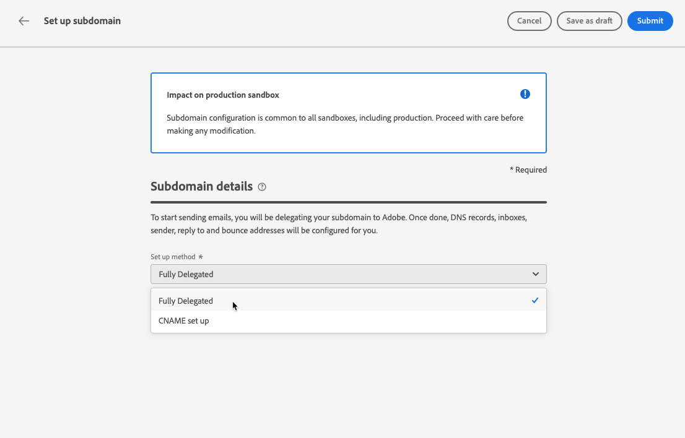

# Delegar un subdominio {#delegate-subdomain}

>[!CONTEXTUALHELP]
>id="ajo_admin_subdomainname"
>title="Delegación de subdominios"
>abstract="Journey Optimizer permite delegar los subdominios a Adobe. Puede delegar completamente un subdominio a Adobe, que es el método recomendado. También puede crear un subdominio utilizando CNAME para que apunten a registros específicos de Adobe, pero este método requiere que mantenga y administre los registros DNS por su cuenta."
>additional-url="https://experienceleague.adobe.com/es/docs/journey-optimizer/using/configuration/delegate-subdomains/about-subdomain-delegation#subdomain-delegation-methods" text="Métodos de configuración de subdominios"

>[!CONTEXTUALHELP]
>id="ajo_admin_subdomainname_header"
>title="Delegación de subdominios"
>abstract="Para empezar a enviar correos electrónicos, delegará el subdominio a Adobe. Una vez delegado, se configurarán los registros DNS, las bandejas de entrada, el remitente y las direcciones de respuesta y devolución."

## Introducción a los subdominios de correo electrónico {#gs-delegate-subdomain}

La delegación de nombres de dominio es un método que permite al propietario de un nombre de dominio (técnicamente: una zona DNS) delegar una subdivisión del mismo (técnicamente: una zona DNS debajo de ella, que se puede llamar subzona) a otra entidad. Básicamente, como cliente, si administra el área &quot;example.com&quot;, puede delegar la subzona &quot;marketing.example.com&quot; a Adobe. Más información sobre [delegación de subdominios](about-subdomain-delegation.md)

De manera predeterminada, [!DNL Journey Optimizer] le permite delegar **hasta 10 subdominios**. Sin embargo, según el contrato de licencia, puede delegar hasta 100 subdominios. Póngase en contacto con la persona de contacto de Adobe para obtener más información sobre el número de subdominios a los que tiene derecho.

Puede delegar completamente un subdominio o crear un subdominio mediante CNAME para que apunte a registros específicos de Adobe.

La delegación completa de subdominios es el método recomendado. Obtenga más información sobre las diferencias entre ambos [métodos de configuración de subdominios](about-subdomain-delegation.md#subdomain-delegation-methods).

La configuración del subdominio es **común a todos los entornos**. Por lo tanto, cualquier modificación en un subdominio también afecta a los entornos limitados de producción.

>[!CAUTION]
>
>No se admite el envío paralelo de subdominios en [!DNL Journey Optimizer]. Si intenta enviar un subdominio para delegación cuando otro está en estado **[!UICONTROL Procesando]**, recibirá un mensaje de error.

## Delegar completamente un subdominio a Adobe {#full-subdomain-delegation}

>[!CONTEXTUALHELP]
>id="ajo_admin_subdomain_dns"
>title="Generar los registros DNS coincidentes"
>abstract="Para delegar completamente un nuevo subdominio a Adobe, debe copiar y pegar la información del servidor de nombres de Adobe que se muestra en la interfaz de Journey Optimizer en la solución de alojamiento de dominios para generar los registros DNS coincidentes. Para delegar un subdominio mediante CNAME, también debe copiar y pegar el registro de validación de URL de CDN SSL. Una vez realizadas las comprobaciones correctamente, el subdominio está listo para utilizarse para enviar mensajes."
>additional-url="https://experienceleague.adobe.com/es/docs/journey-optimizer/using/configuration/delegate-subdomains/delegate-subdomain#cname-subdomain-delegation" text="Delegación de subdominios CNAME"

[!DNL Journey Optimizer] le permite delegar completamente sus subdominios a Adobe directamente desde la interfaz del producto. Al hacerlo, Adobe podrá entregar mensajes como servicio administrado controlando y manteniendo todos los aspectos de DNS necesarios para entregar, procesar y rastrear campañas de correo electrónico.

Puede confiar en Adobe para mantener la infraestructura DNS necesaria para satisfacer los requisitos de capacidad de entrega estándar del sector para sus dominios de envío de marketing por correo electrónico, a la vez que mantiene y controla el DNS para sus dominios de correo electrónico internos.

Para delegar completamente un nuevo subdominio a Adobe, siga los pasos a continuación:

1. Acceda al menú **[!UICONTROL Administración]** > **[!UICONTROL Canales]** > **[!UICONTROL Configuración de correo electrónico]** > **[!UICONTROL Subdominios]** y haga clic en **[!UICONTROL Configurar subdominio]**.

   

1. Seleccione **[!UICONTROL Totalmente delegado]** de la sección **[!UICONTROL Configurar método]**.

   

1. Especifique el nombre del subdominio que desea delegar.

   

   >[!CAUTION]
   >
   >No se permite delegar un subdominio no válido a Adobe. Asegúrese de introducir un subdominio válido que sea propiedad de su organización, como marketing.yourcompany.com.

   <!--Capital letters are not allowed in subdomains. TBC by PM-->

1. Se muestra la lista de registros que se van a colocar en los servidores DNS. Copie estos registros, uno por uno o descargando un archivo CSV, y luego vaya a la solución de alojamiento de dominios para generar los registros DNS coincidentes.

1. Asegúrese de que todos los registros DNS se hayan generado en la solución de alojamiento de dominios. Si todo está configurado correctamente, marque la casilla &quot;Confirmo...&quot;.

   

1. Configure el registro de DMARC. Si el subdominio tiene un registro DMARC existente y [!DNL Journey Optimizer] lo está recuperando, puede usar los mismos valores o cambiarlos según sea necesario. Si no añade ningún valor, se utilizarán los valores predeterminados. [Más información](dmarc-record.md)

   

1. Haga clic en **[!UICONTROL Enviar]**.

   Puede crear los registros y enviar la configuración del subdominio más adelante utilizando el botón **[!UICONTROL Guardar como borrador]**. A continuación, podrá reanudar la delegación de subdominios abriéndola desde la lista de subdominios.

1. El subdominio se muestra en la lista con el estado **[!UICONTROL Procesando]**. Para obtener más información sobre los estados de los subdominios, consulte [esta sección](about-subdomain-delegation.md#access-delegated-subdomains).

   

   Antes de poder utilizar ese subdominio para enviar mensajes, debe esperar hasta que Adobe realice las comprobaciones necesarias, que pueden tardar hasta tres horas. Obtenga más información en [esta sección](#subdomain-validation).

   >[!NOTE]
   >
   >Se enumerarán todos los registros que falten, es decir, los registros que aún no se hayan creado en la solución de alojamiento.

1. Una vez que las comprobaciones son correctas, el subdominio obtiene el estado **[!UICONTROL Success]**. Está listo para utilizarse para enviar mensajes.

   El subdominio se marcará como **[!UICONTROL Error]** si no se puede crear el registro de validación en la solución de alojamiento.

Una vez delegado un subdominio a Adobe en [!DNL Journey Optimizer], se crea automáticamente un registro PTR y se asocia a este subdominio. [Más información](ptr-records.md)

## Configurar un subdominio con CNAME {#cname-subdomain-delegation}

>[!CONTEXTUALHELP]
>id="ajo_admin_subdomain_dns_cname"
>title="Generar los registros de validación y DNS coincidentes"
>abstract="Para delegar un subdominio mediante CNAME, debe copiar y pegar la información del servidor de nombres de Adobe y el registro de validación de URL de CDN SSL que se muestra en la interfaz de Journey Optimizer en la plataforma de alojamiento. Una vez realizadas las comprobaciones correctamente, el subdominio está listo para utilizarse para enviar mensajes."

>[!CONTEXTUALHELP]
>id="ajo_admin_subdomain_cdn_cname"
>title="Copiar el registro de validación"
>abstract="Adobe genera un registro de validación. Debe crear el registro correspondiente en su plataforma de alojamiento para la validación de URL de CDN."

Si tiene políticas de restricción específicas del dominio y desea que Adobe tenga solo un control parcial sobre DNS, puede elegir llevar a cabo todas las actividades relacionadas con DNS de su parte.

La configuración del subdominio CNAME le permite crear un subdominio y utilizar CNAME para señalar registros específicos de Adobe. Con esta configuración, tanto usted como Adobe comparten la responsabilidad de mantener DNS para configurar el entorno de envío, procesamiento y seguimiento de correos electrónicos.

>[!CAUTION]
>
>Se recomienda el método CNAME si las políticas de su organización restringen el método de delegación de subdominios completo. Este enfoque requiere que mantenga y administre los registros DNS por su cuenta. Adobe no podrá ayudarle a cambiar, mantener o administrar DNS para un subdominio configurado mediante el método CNAME.

➡️ [Aprenda a crear un subdominio mediante CNAME para que apunte a registros específicos de Adobe en este vídeo](#video)

Para configurar un subdominio mediante CNAME, siga los pasos a continuación:

1. Acceda al menú **[!UICONTROL Administración]** > **[!UICONTROL Canales]** > **[!UICONTROL Configuración de correo electrónico]** > **[!UICONTROL Subdominios]** y haga clic en **[!UICONTROL Configurar subdominio]**.

1. Seleccione el método **[!UICONTROL CNAME configurado]**.

   

1. Especifique el nombre del subdominio que desea delegar.

   >[!CAUTION]
   >
   >No debe delegar un subdominio no válido a Adobe. Asegúrese de introducir un subdominio válido que sea **propiedad de su organización**, como marketing.yourcompany.com.

   <!--Capital letters are not allowed in subdomains. TBC by PM-->

1. Se muestra la lista de registros que se van a colocar en los servidores DNS. Copie estos registros, uno por uno o descargando un archivo CSV, y luego vaya a la solución de alojamiento de dominios para generar los registros DNS coincidentes.

1. Asegúrese de que todos los registros DNS se hayan generado en la solución de alojamiento de dominios. Si todo está configurado correctamente, marque la casilla &quot;Confirmo...&quot;.

   

1. Configúrelo en el registro de DMARC. Si el subdominio tiene un registro DMARC existente y [!DNL Journey Optimizer] lo está recuperando, puede usar los mismos valores o cambiarlos según sea necesario. Si no añade ningún valor, se utilizarán los valores predeterminados. [Más información](dmarc-record.md)

   

1. Haga clic en **[!UICONTROL Continuar]**.

   Puede crear los registros más adelante utilizando el botón **[!UICONTROL Guardar como borrador]**. En este momento, podrá reanudar la delegación de subdominios abriéndola desde la lista de subdominios.

1. Espere hasta que Adobe compruebe que los registros se generan sin errores en la solución de alojamiento. Este proceso puede tardar hasta 2 minutos.

   >[!NOTE]
   >
   >Se enumerarán todos los registros que falten, es decir, los registros que aún no se hayan creado en la solución de alojamiento.

1. Adobe genera un registro de validación de URL de CDN SSL. Copie este registro de validación en la plataforma de alojamiento. Si ha creado correctamente este registro en su solución de alojamiento, marque la casilla &quot;Confirmo...&quot; y luego haga clic en **[!UICONTROL Enviar]**.

   <!---->

1. Una vez enviada la delegación de subdominios CNAME, el subdominio se muestra en la lista con el estado **[!UICONTROL Procesando]**. Para obtener más información sobre los estados de los subdominios, consulte [esta sección](about-subdomain-delegation.md#access-delegated-subdomains).

   

   Antes de poder utilizar ese subdominio para enviar mensajes, debe esperar hasta que Adobe realice las comprobaciones necesarias, que generalmente tardan de 2 a 3 horas. Obtenga más información en [esta sección](#subdomain-validation).

1. Una vez que las comprobaciones son correctas<!--i.e Adobe validates the record you created and installs it-->, el subdominio obtiene el estado **[!UICONTROL Correcto]**. Está listo para utilizarse para enviar mensajes.

   El subdominio se marcará como **[!UICONTROL Error]** si no se puede crear el registro de validación en la solución de alojamiento.

Al validar el registro e instalar el certificado, Adobe crea automáticamente el registro PTR para el subdominio CNAME. [Más información](ptr-records.md)

## Validación de subdominios {#subdomain-validation}

Las comprobaciones y acciones siguientes se ejecutan hasta que se verifica el subdominio y se puede utilizar para enviar mensajes.

Estos pasos los realiza Adobe y pueden tomar **hasta tres horas**.

1. **Validación previa**: Adobe comprueba si el subdominio se ha delegado a Adobe DNS (registro NS, registro SOA, configuración de zona, registro de propiedad). Si el paso de prevalidación falla, se devuelve un error junto con el motivo correspondiente; de lo contrario, Adobe pasa al siguiente paso.

1. **Configurar DNS para el dominio**:

   * **registro MX**: registro de intercambio de correo: registro del servidor de correo que procesa los correos electrónicos entrantes enviados al subdominio.
   * **registro SPF**: registro Marco de directivas de remitente: enumera las direcciones IP de los servidores de correo que pueden enviar correos electrónicos desde el subdominio.
   * **Registro de DKIM**: Registro estándar de DomainKeys Identified Mail: utiliza el cifrado de clave pública y privada para autenticar el mensaje y evitar la suplantación de identidad.
   * **A**: asignación de IP predeterminada.
   * **CNAME**: un registro CNAME o de nombre canónico es un tipo de registro DNS que asigna un nombre de alias a un nombre de dominio verdadero o canónico.

1. **Crear direcciones URL de seguimiento y espejo**: si el dominio es email.example.com, el dominio de seguimiento o reflejo será data.email.example.com. Se protege instalando el certificado SSL.

1. **Aprovisionar CDN CloudFront**: si CDN no está ya configurado, Adobe lo aprovisiona para el ID de su organización.

1. **Crear dominio CDN**: si el dominio es email.example.com, el dominio CDN será cdn.email.example.com.

1. **Crear y adjuntar certificado SSL de CDN**: Adobe crea el certificado de CDN para el dominio de CDN y adjunta el certificado al dominio de CDN.

1. **Crear DNS de reenvío**: si este es el primer subdominio que delega, Adobe creará el DNS de reenvío necesario para crear registros PTR, uno para cada una de las direcciones IP.

1. **Crear registro PTR**: Los ISP requieren el registro PTR, también conocido como registro DNS inverso, para que no marquen los correos electrónicos como correo no deseado. Gmail también recomienda tener registros PTR para cada IP. Adobe crea registros PTR solo cuando se delega un subdominio por primera vez, uno para cada IP y todas las direcciones IP que apuntan a ese subdominio. Por ejemplo, si la dirección IP es *192.1.2.1* y el subdominio es *email.example.com*, el registro PTR será: *192.1.2.1PTR r1.email.example.com*. Puede actualizar el registro PTR posteriormente para que apunte al nuevo dominio delegado. [Más información sobre los registros PTR](ptr-records.md)

## Anular la delegación de un subdominio {#undelegate-subdomain}

Si desea desdelegar un subdominio, póngase en contacto con su representante de Adobe.

Sin embargo, debe realizar varios pasos en la interfaz de usuario antes de ponerse en contacto con Adobe.

>[!NOTE]
>
>Solo puede anular la delegación de subdominios con el estado **[!UICONTROL Correcto]**. Los subdominios con los estados **[!UICONTROL Borrador]** y **[!UICONTROL Error]** simplemente se pueden eliminar de la interfaz de usuario.

Primero, realice los siguientes pasos en [!DNL Journey Optimizer]:

1. Desactive todas las configuraciones de canal asociadas con el subdominio. [Descubra cómo](../configuration/channel-surfaces.md#deactivate-a-surface)

1. Anule la delegación de cualquier subdominio de página de aterrizaje, subdominio de SMS y subdominio web asociado a este subdominio.

   Debe generar una solicitud dedicada para cada [página de aterrizaje](../landing-pages/lp-subdomains.md#undelegate-subdomain), [SMS](../sms/sms-subdomains.md#undelegate-subdomain) o [subdominio web](../web/web-delegated-subdomains.md#undelegate-subdomain).

1. Detenga las campañas activas asociadas a los subdominios. [Descubra cómo](../campaigns/modify-stop-campaign.md#stop)

1. Detenga los recorridos activos asociados a los subdominios. [Descubra cómo](../building-journeys/end-journey.md#stop-journey)

1. Apunte los [registros PTR](ptr-records.md#edit-ptr-record) vinculados al subdominio a otro subdominio.

   Si este es el único subdominio delegado, puede omitir este paso.

Una vez finalizado, póngase en contacto con el representante de Adobe con el subdominio que desee desdelegar.

Una vez que Adobe administra la solicitud, el dominio no delegado ya no se muestra en la página de inventario de subdominios.

>[!CAUTION]
>
>Después de desdelegar un subdominio, se aplica lo siguiente:
>
>* No puede reactivar las configuraciones de canal que utilizaban ese subdominio.
>* No puede volver a delegar el mismo subdominio a través de la interfaz de usuario. Si desea hacerlo, póngase en contacto con su representante de Adobe.

## Vídeo práctico{#video}

Aprenda a crear un subdominio con CNAME para que apunte a registros específicos de Adobe.

>[!VIDEO](https://video.tv.adobe.com/v/339484?quality=12)
