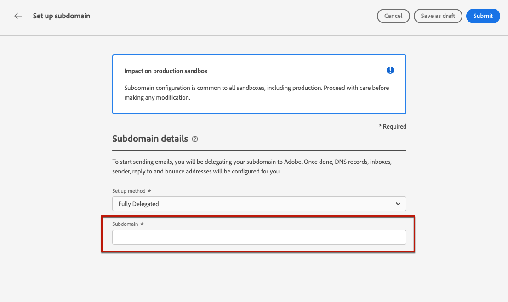

# Delegar un subdominio {#delegate-subdomain}

>[!CONTEXTUALHELP]
>id="ajo_admin_subdomainname"
>title="Acerca de la delegación de subdominios"
>abstract="Journey Optimizer le permite delegar completamente sus subdominios a Adobe. Adobe podrá enviar mensajes como un servicio administrado controlando y manteniendo todos los aspectos de DNS."

La delegación de nombres de dominio es un método que permite al propietario de un nombre de dominio (técnicamente: una zona DNS) para delegar una subdivisión de ella (técnicamente: una zona DNS bajo ella, que puede llamarse subzona) a otra entidad. Básicamente, como cliente, si está administrando la zona &quot;example.com&quot;, puede delegar la subzona &quot;marketing.example.com&quot; a Adobe.

Delegando un subdominio para usar con [!DNL Journey Optimizer], los clientes pueden confiar en el Adobe para mantener la infraestructura DNS necesaria para cumplir los requisitos de envío estándar del sector para sus dominios de envío de marketing por correo electrónico, a la vez que mantienen y controlan el DNS para sus dominios de correo electrónico internos.

>[!NOTE]
>
>De forma predeterminada, [!DNL Journey Optimizer] contrato de licencia le permite delegar hasta 10 subdominios. Póngase en contacto con el Adobe si desea aumentar esta limitación.

## Delegación completa de subdominios {#full-subdomain-delegation}

[!DNL Journey Optimizer] le permite delegar completamente los subdominios a Adobes directamente desde la interfaz de producto. Al hacerlo, Adobe podrá enviar mensajes como un servicio administrado controlando y manteniendo todos los aspectos de DNS necesarios para la entrega, el procesamiento y el seguimiento de campañas de correo electrónico.

Para delegar completamente un nuevo subdominio al Adobe, siga los pasos a continuación:

1. Acceda a la **[!UICONTROL Administration]** > **[!UICONTROL Channels]** > **[!UICONTROL Subdomains]** a continuación, haga clic en **[!UICONTROL Set up subdomain]**.

   

1. Select **[!UICONTROL Fully delegated]** de la variable **[!UICONTROL Set up method]** para obtener más información.

   

1. Especifique el nombre del subdominio que desea delegar.

   

   >[!CAUTION]
   >
   >No se permite delegar un subdominio no válido al Adobe. Asegúrese de introducir un subdominio válido que sea propiedad de su organización, como marketing.yourcompany.com.
   >
   >Tenga en cuenta que los subdominios de varios niveles, como email.marketing.yourcompany.com , no son compatibles actualmente.

1. Se muestra la lista de registros que se van a colocar en los servidores DNS. Copie estos registros, uno por uno o descargando un archivo CSV, y luego vaya a la solución de alojamiento de dominios para generar los registros DNS coincidentes.

1. Asegúrese de que todos los registros DNS se hayan generado en la solución de alojamiento de dominios. Si todo está configurado correctamente, marque la casilla &quot;Confirmo...&quot; y luego haga clic en **[!UICONTROL Submit]**.

   

   >[!NOTE]
   >
   >Puede crear los registros y enviar la configuración del subdominio más adelante utilizando la variable **[!UICONTROL Save as draft]** botón. A continuación, podrá reanudar la delegación de subdominios abriéndola en la lista de subdominios.

1. Una vez enviada la delegación de subdominios completa, el subdominio se muestra en la lista con la variable **[!UICONTROL Processing]** estado. Para obtener más información sobre los estados de los subdominios, consulte [esta sección](access-subdomains.md).

   

   Antes de poder usar ese subdominio para enviar mensajes, debe esperar hasta que el Adobe realice las comprobaciones necesarias, que pueden tardar hasta tres horas. Obtenga más información en [esta sección](#subdomain-validation).

   >[!NOTE]
   >
   >Se enumerarán todos los registros que falten, es decir, los registros que aún no se hayan creado en la solución de alojamiento.

1. Una vez realizadas las comprobaciones correctamente, el subdominio recibe la variable **[!UICONTROL Success]** estado. Está listo para utilizarse para enviar mensajes.

   >[!NOTE]
   >
   >El subdominio se marcará como **[!UICONTROL Failed]** si no puede crear el registro de validación en la solución de alojamiento.

   <!-- later on, users will be notified in Pulse -->

Una vez delegado un subdominio al Adobe en [!DNL Journey Optimizer], se crea automáticamente un registro PTR y se asocia a este subdominio. [Más información](ptr-records.md)

>[!CAUTION]
>
>Actualmente, la ejecución paralela de subdominios no es compatible con [!DNL Journey Optimizer]. Si intenta enviar un subdominio para la delegación cuando otra tiene la variable **[!UICONTROL Processing]** obtendrá un mensaje de error.

## Delegación de subdominios CNAME {#cname-subdomain-delegation}

Si tiene directivas de restricción específicas del dominio y desea que el Adobe solo tenga control parcial sobre DNS, puede elegir llevar a cabo todas las actividades relacionadas con DNS de su lado.

La delegación de subdominios CNAME le permite crear un subdominio y utilizar CNAME para señalar registros específicos de Adobe. Con esta configuración, tanto usted como Adobe comparten la responsabilidad de mantener DNS para configurar el entorno de envío, procesamiento y seguimiento de correos electrónicos.

>[!CAUTION]
>
>Se recomienda utilizar este método si las políticas de su organización restringen el método de delegación de subdominios completo. Este método requiere que mantenga y administre los registros DNS por su cuenta. Adobe no podrá ayudarle a cambiar, mantener o administrar DNS para un subdominio configurado mediante el método CNAME.

➡️ [Aprenda a crear un subdominio utilizando CNAME para señalar registros específicos de Adobe en este vídeo](#video)

Para delegar un subdominio mediante CNAME, siga los pasos a continuación:

1. Acceda a la **[!UICONTROL Administration]** > **[!UICONTROL Channels]** > **[!UICONTROL Subdomains]** a continuación, haga clic en **[!UICONTROL Set up subdomain]**.

1. Seleccione el **[!UICONTROL CNAME set up]** método.

   

1. Especifique el nombre del subdominio que desea delegar.

   >[!CAUTION]
   >
   >No se permite delegar un subdominio no válido al Adobe. Asegúrese de introducir un subdominio válido que sea propiedad de su organización, como marketing.yourcompany.com.
   >
   >Tenga en cuenta que los subdominios de varios niveles, como email.marketing.yourcompany.com , no son compatibles actualmente.

1. Se muestra la lista de registros que se van a colocar en los servidores DNS. Copie estos registros, uno por uno o descargando un archivo CSV, y luego vaya a la solución de alojamiento de dominios para generar los registros DNS coincidentes.

1. Asegúrese de que todos los registros DNS se hayan generado en la solución de alojamiento de dominios. Si todo está configurado correctamente, marque la casilla &quot;Confirmo...&quot;.

   

   >[!NOTE]
   >
   >Puede crear los registros más adelante utilizando la variable **[!UICONTROL Save as draft]** botón. A continuación, podrá reanudar la delegación de subdominios en esta fase abriéndola de la lista de subdominios.

1. Espere hasta que Adobe verifique que estos registros se generen sin errores en la solución de alojamiento. Este proceso puede tardar hasta 2 minutos.

   >[!NOTE]
   >
   >Se enumerarán todos los registros que falten, es decir, los registros que aún no se hayan creado en la solución de alojamiento.

1. Adobe genera un registro de validación de URL de la CDN SSL. Copie este registro de validación en la plataforma de alojamiento. Si ha creado correctamente este registro en su solución de alojamiento, marque la casilla &quot;I confirm...&quot; y, a continuación, haga clic en **[!UICONTROL Submit]**.

   

   >[!NOTE]
   >
   >También puede crear el registro de validación y enviar la configuración del subdominio más adelante utilizando la variable **[!UICONTROL Save as draft]** botón. A continuación, podrá reanudar la delegación de subdominios abriéndola en la lista de subdominios.

1. Una vez enviada la delegación de subdominios CNAME, el subdominio se muestra en la lista con la variable **[!UICONTROL Processing]** estado. Para obtener más información sobre los estados de los subdominios, consulte [esta sección](access-subdomains.md).

   Antes de poder utilizar ese subdominio para enviar mensajes, debe esperar hasta que el Adobe realice las comprobaciones necesarias, que suelen tardar entre 2 y 3 horas. Obtenga más información en [esta sección](#subdomain-validation).

1. Una vez realizadas las comprobaciones correctamente<!--i.e Adobe validates the record you created and installs it-->, el subdominio obtiene la variable **[!UICONTROL Success]** estado. Está listo para utilizarse para enviar mensajes.

   >[!NOTE]
   >
   >El subdominio se marcará como **[!UICONTROL Failed]** si no puede crear el registro de validación en la solución de alojamiento.

Al validar el registro e instalar el certificado, Adobe crea automáticamente el registro PTR para el subdominio CNAME. [Más información](ptr-records.md)

>[!CAUTION]
>
>Actualmente, la ejecución paralela de subdominios no es compatible con [!DNL Journey Optimizer]. Si intenta enviar un subdominio para la delegación cuando otra tiene la variable **[!UICONTROL Processing]** obtendrá un mensaje de error.

## Validación de subdominios {#subdomain-validation}

Las comprobaciones y acciones siguientes se realizarán hasta que se verifique el subdominio y se puedan utilizar para enviar mensajes.

>[!NOTE]
>
>Estos pasos se realizan por Adobe y pueden tardar hasta 3 horas.

1. **Validación previa**: Adobe comprueba si el subdominio se ha delegado a DNS de Adobe (registro NS, registro SOA, configuración de zona, registro de propiedad). Si el paso de prevalidación falla, se devuelve un error junto con el motivo correspondiente; de lo contrario, el Adobe pasa al siguiente paso.

1. **Configuración de DNS para el dominio**:

   * **Registro MX**: Registro eXchange de correo: registro del servidor de correo que procesa los correos electrónicos entrantes enviados al subdominio.
   * **Registro SPF**: Registro del marco de políticas del remitente : enumera las direcciones IP de los servidores de correo que pueden enviar correos electrónicos desde el subdominio.
   * **Registro DKIM**: Registro estándar de Correo identificado de DomainKeys : Utiliza el cifrado de clave pública y privada para autenticar el mensaje y evitar la suplantación.
   * **A**: Asignación de IP predeterminada.
   * **CNAME**: Un registro CNAME o de nombre canónico es un tipo de registro DNS que asigna un nombre de alias a un nombre de dominio verdadero o canónico.

1. **Creación de direcciones URL de seguimiento y de reflejo**: si el dominio es email.example.com, el dominio tracking/mirror será data.email.example.com. Se asegura instalando el certificado SSL.

1. **Aprovisionar CDN CloudFront**: si CDN no está configurado, Adobe lo aprovisiona para la impresión.

1. **Crear dominio de CDN**: si el dominio es email.example.com, el dominio de CDN será cdn.email.example.com.

1. **Crear y adjuntar un certificado SSL de CDN**: Adobe crea el certificado de CDN para el dominio de CDN y adjunta el certificado al dominio de CDN.

1. **Crear DNS de reenvío**: si este es el primer subdominio que delega, Adobe creará el DNS de reenvío necesario para crear registros PTR, uno para cada una de sus IP.

1. **Crear registro PTR**: Los ISP requieren el registro PTR, también conocido como registro DNS inverso, para que no marquen los correos electrónicos como correo no deseado. Gmail también recomienda tener registros PTR para cada IP. Adobe crea registros PTR solo cuando delega un subdominio por primera vez, uno por cada IP, todas las IP que apuntan a ese subdominio. Por ejemplo, si la IP es *192.1.2.1* y el subdominio es *email.example.com*, el registro PTR será: *192.1.2.1 PTR r1.email.example.com*. Puede actualizar el registro PTR posteriormente para que apunte al nuevo dominio delegado. [Más información sobre los registros PTR](ptr-records.md)

## Vídeo explicativo{#video}

Aprenda a crear un subdominio con CNAME para que apunte a registros específicos de Adobe.

>[!VIDEO](https://video.tv.adobe.com/v/339484?quality=12)
