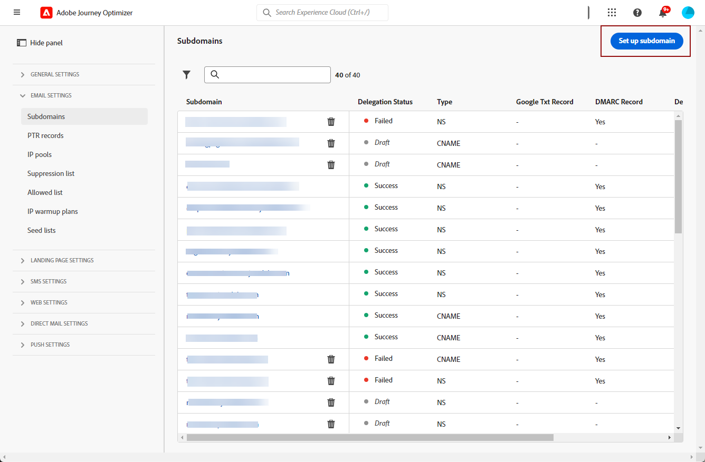

# Delegar un subdominio {#delegate-subdomain}

>[!CONTEXTUALHELP]
>id="ajo_admin_subdomainname"
>title="About subdomain delegation"
>abstract="Journey Optimizer allows you to fully delegate your subdomains to Adobe. Adobe will be able to deliver messages as a managed service by controlling and maintaining all aspects of DNS."

Domain name delegation is a method that allows the owner of a domain name (technically: a DNS zone) to delegate a subdivision of it (technically: a DNS zone under it, which can be called a sub-zone) to another entity. Basically, as a customer, if you are handling the “example.com” zone, you can delegate the sub-zone “marketing.example.com” to Adobe.

[!DNL Journey Optimizer]

>[!NOTE]
>
>[!DNL Journey Optimizer] Reach out to your Adobe contact if you want to increase this limitation.

## Delegación completa de subdominios {#full-subdomain-delegation}

[!DNL Journey Optimizer] By doing so, Adobe will be able to deliver messages as a managed service by controlling and maintaining all aspects of DNS that are required for delivering, rendering and tracking of email campaigns.

To fully delegate a new subdomain to Adobe, follow the steps below:

1. **[!UICONTROL Administration]****[!UICONTROL Channels]****[!UICONTROL Subdomains]****[!UICONTROL Set up subdomain]**

   

1. **[!UICONTROL Fully delegated]****[!UICONTROL Set up method]**

   

1. Specify the name of the subdomain to delegate.

   

   >[!CAUTION]
   >
   >Delegating an invalid subdomain to Adobe is not allowed. Make sure you enter a valid subdomain which is owned by your organization, such as marketing.yourcompany.com.
   >
   >Note that multi-level subdomains such as email.marketing.yourcompany.com are currently not supported.

1. Se muestra la lista de registros que se van a colocar en los servidores DNS. Copie estos registros, uno por uno o descargando un archivo CSV, y luego vaya a la solución de alojamiento de dominios para generar los registros DNS coincidentes.

1. Make sure that all the DNS records have been generated into your domain hosting solution. **[!UICONTROL Submit]**

   

   >[!NOTE]
   >
   >**[!UICONTROL Save as draft]** You will then be able to resume the subdomain delegation by opening it from the subdomains list.

1. **[!UICONTROL Processing]** 

   

   Before being able to use that subdomain to send messages, you need to wait until Adobe performs the required checks, which can take up to 3 hours. Obtenga más información en [esta sección](#subdomain-validation).

   >[!NOTE]
   >
   >Any missing records, meaning the records not yet created on your hosting solution, will be listed out.

1. **[!UICONTROL Success]** It is ready to be used to deliver messages.

   >[!NOTE]
   >
   >**[!UICONTROL Failed]**

   <!-- later on, users will be notified in Pulse -->

[!DNL Journey Optimizer] [Más información](ptr-records.md)

>[!CAUTION]
>
>[!DNL Journey Optimizer] **[!UICONTROL Processing]**

## Delegación de subdominios CNAME {#cname-subdomain-delegation}

If you have domain-specific restriction policies and you want Adobe to have only partial control over DNS, you can choose to carry out all DNS-related activities on your side.

La delegación de subdominios CNAME le permite crear un subdominio y utilizar CNAME para señalar registros específicos de Adobe. Con esta configuración, tanto usted como Adobe comparten la responsabilidad de mantener DNS para configurar el entorno de envío, procesamiento y seguimiento de correos electrónicos.

>[!CAUTION]
>
>Se recomienda utilizar este método si las políticas de su organización restringen el método de delegación de subdominios completo. This approach requires you to maintain and manage DNS records on your own. Adobe will not be able to assist in changing, maintaining or managing DNS for a subdomain configured through the CNAME method.

To delegate a subdomain using CNAMEs, follow the steps below:

1. **[!UICONTROL Administration]****[!UICONTROL Channels]****[!UICONTROL Subdomains]****[!UICONTROL Set up subdomain]**

1. **[!UICONTROL CNAME set up]**

   

1. Specify the name of the subdomain to delegate.

   >[!CAUTION]
   >
   >Delegating an invalid subdomain to Adobe is not allowed. Make sure you enter a valid subdomain which is owned by your organization, such as marketing.yourcompany.com.
   >
   >Note that multi-level subdomains such as email.marketing.yourcompany.com are currently not supported.

1. Se muestra la lista de registros que se van a colocar en los servidores DNS. Copie estos registros, uno por uno o descargando un archivo CSV, y luego vaya a la solución de alojamiento de dominios para generar los registros DNS coincidentes.

1. Make sure that all the DNS records have been generated into your domain hosting solution. If everything is configured properly, check the box &quot;I confirm...&quot;.

   

   >[!NOTE]
   >
   >**[!UICONTROL Save as draft]** You will then be able to resume the subdomain delegation at this stage by opening it from the subdomains list.

1. Wait until Adobe verifies that these records are generated without errors on your hosting solution. This process can take up to 2 minutes.

   >[!NOTE]
   >
   >Any missing records, meaning the records not yet created on your hosting solution, will be listed out.

1. Adobe generates an SSL CDN URL validation record. Copy this validation record into your hosting platform. **[!UICONTROL Submit]**

   

   >[!NOTE]
   >
   >**[!UICONTROL Save as draft]** You will then be able to resume the subdomain delegation by opening it from the subdomains list.

1. **[!UICONTROL Processing]** 

   Before being able to use that subdomain to send messages, you need to wait until Adobe performs the required checks, which usually takes 2 to 3 hours. Obtenga más información en [esta sección](#subdomain-validation).

1. <!--i.e Adobe validates the record you created and installs it-->**[!UICONTROL Success]** It is ready to be used to deliver messages.

   >[!NOTE]
   >
   >**[!UICONTROL Failed]**

Upon validating the record and installing the certificate, Adobe automatically creates the PTR record for the CNAME subdomain. [Más información](ptr-records.md)

>[!CAUTION]
>
>[!DNL Journey Optimizer] **[!UICONTROL Processing]**

## Subdomain validation {#subdomain-validation}

The checks and actions below will be performed until the subdomain is verified and can be used to send messages.

>[!NOTE]
>
>These steps are performed by Adobe and can take up to 3 hours.

1. **** If the pre-validation step fails, an error is returned along with the corresponding reason, otherwise Adobe proceeds to the next step.

1. ****

   * ****
   * ****
   * ****
   * ****
   * ****

1. **** It is secured by installing the SSL certificate.

1. ****

1. ****

1. ****

1. ****

1. **** Gmail also recommends having PTR records for each IP. Adobe creates PTR records only when you delegate a subdomain for the first time, one for each IP, all IPs pointing that subdomain. ****** You can update the PTR record afterwards to point to the new delegated domain. 
