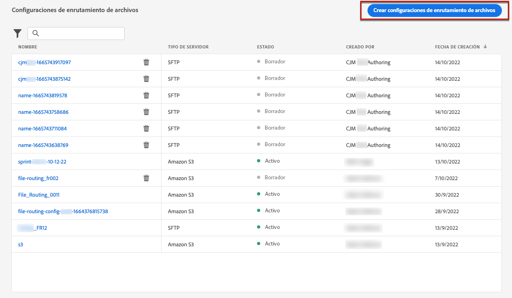
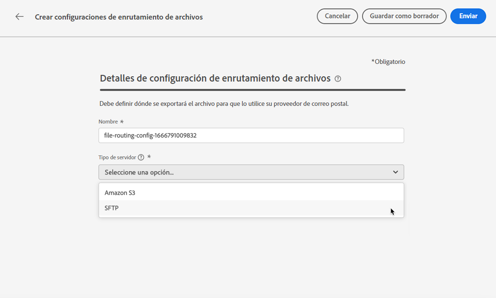
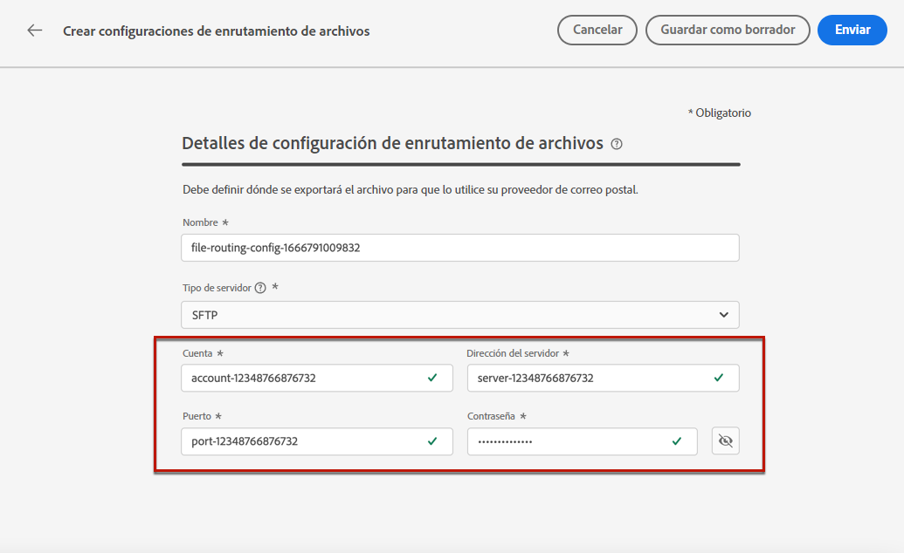
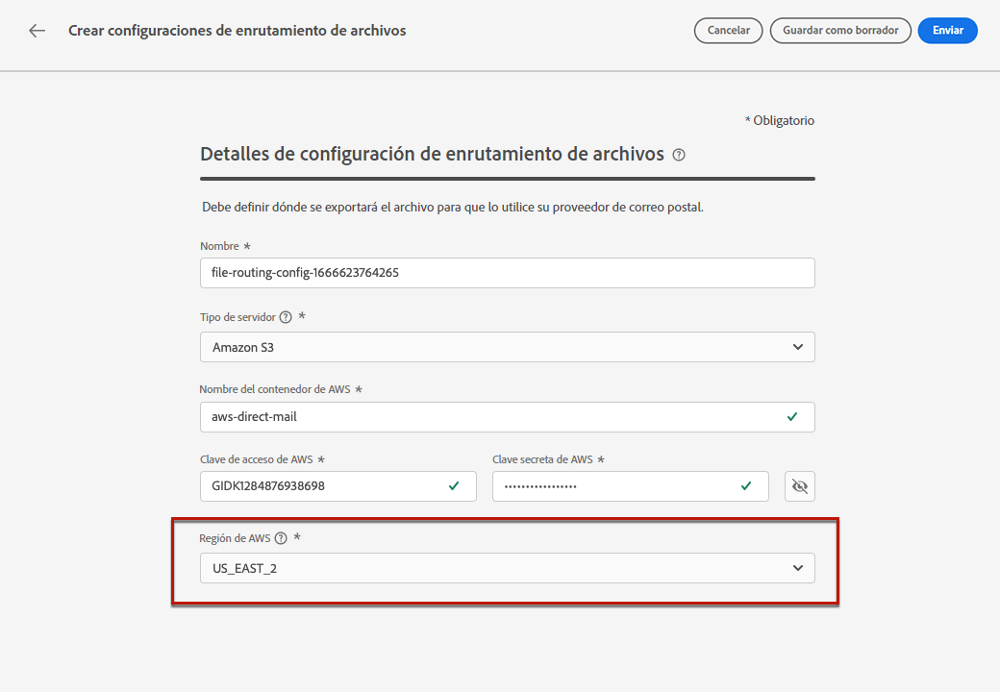
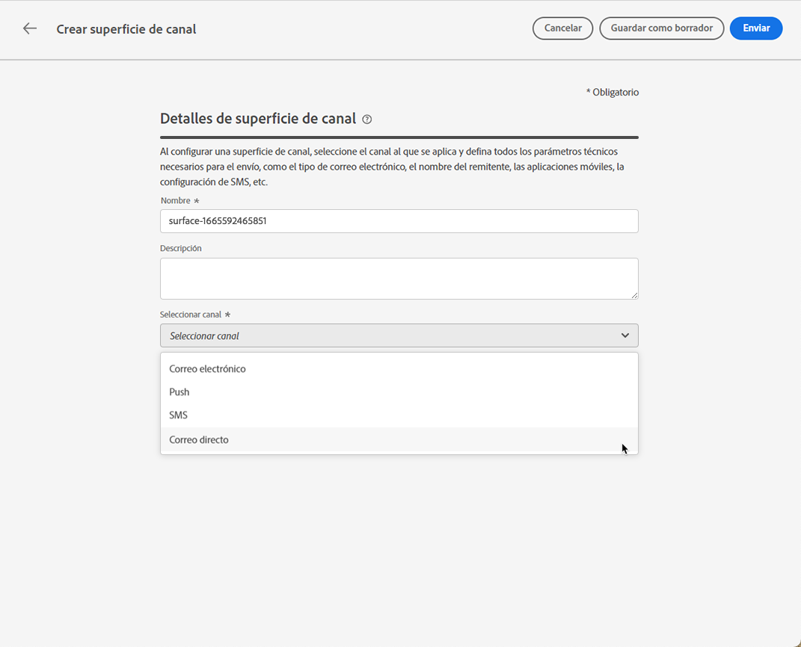
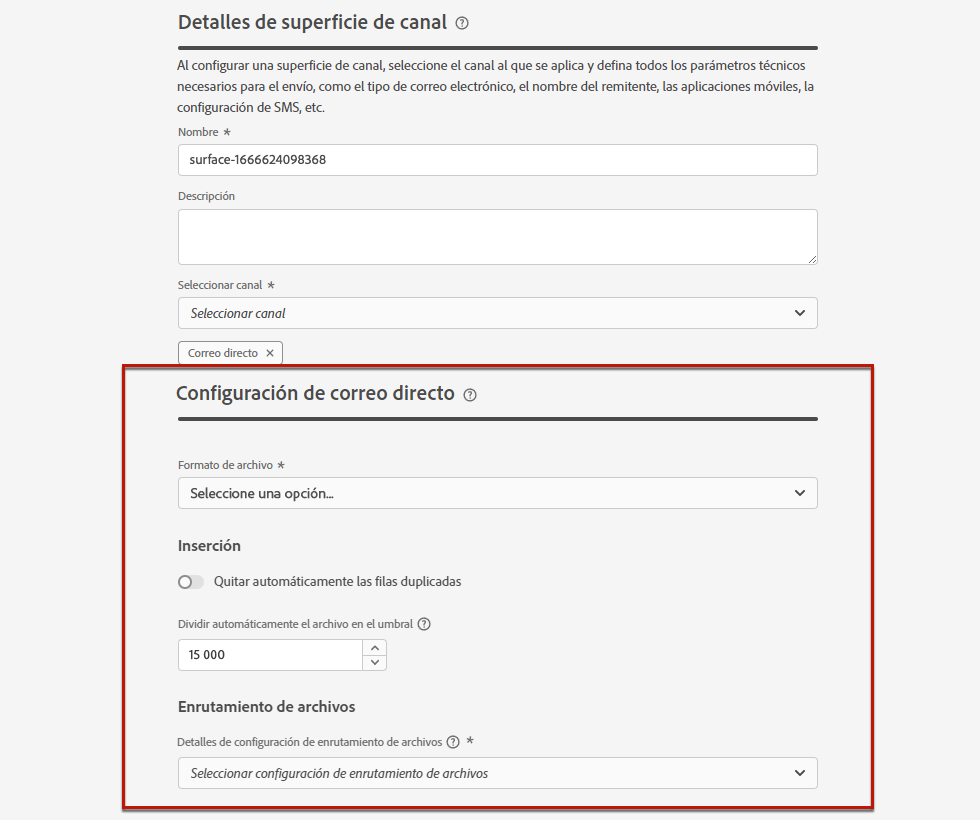
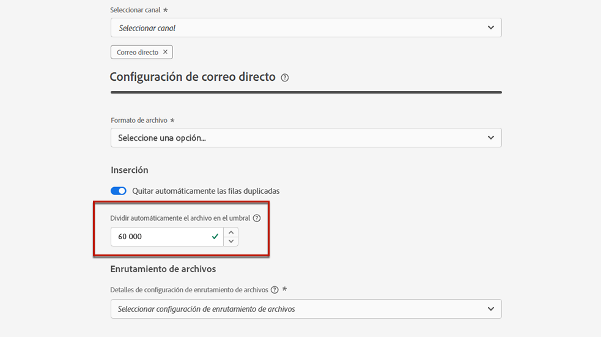
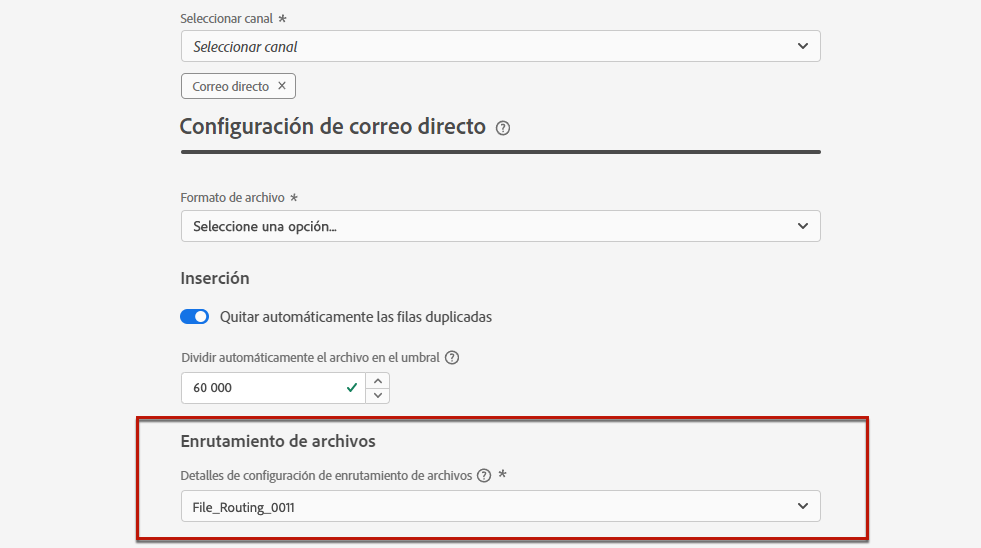

# Configuración de correo postal {#direct-mail-configuration}

[!DNL Journey Optimizer] le permite personalizar y generar los archivos requeridos por los proveedores de correo postal para enviar correos a sus clientes.

Al preparar una entrega de correo postal, [!DNL Journey Optimizer] genera un archivo que incluye todos los perfiles de destino y la información de contacto elegida (por ejemplo, la dirección postal). Después, puede enviar este archivo al proveedor de correo postal que se encarga de la entrega real.

Para enviar un mensaje de correo postal, debe crear un archivo y cargarlo en un servidor. Antes de poder hacerlo, debe crear una [configuración de enrutamiento de archivos](#file-routing-configuration) y [superficie de correo postal](#direct-mail-surface) que hará referencia a la configuración de enrutamiento del archivo.

## Configuración del enrutamiento de archivos {#file-routing-configuration}

>[!CONTEXTUALHELP]
>id="ajo_dm_file_routing_details"
>title="Defina la configuración de la configuración de enrutamiento del archivo"
>abstract="Al crear el mensaje de correo postal, generará el archivo que contiene toda la información de perfil necesaria. Este archivo debe exportarse y cargarse en un servidor para que su proveedor de correo postal pueda acceder y utilizar ese archivo para enviar correo postal."

>[!CONTEXTUALHELP]
>id="ajo_dm_file_routing_details_header"
>title="Defina la configuración de la configuración de enrutamiento del archivo"
>abstract="Debe definir dónde se exportará el archivo y se cargará para que lo utilice su proveedor de correo postal."

>[!CONTEXTUALHELP]
>id="ajo_dm_select_file_routing"
>title="Configuración de enrutamiento de archivos"
>abstract="Seleccione la configuración de enrutamiento de archivos que elija, que define dónde se exportará el archivo y se cargará para que lo utilice su proveedor de correo postal."

>[!CONTEXTUALHELP]
>id="ajo_dm_file_routing_type"
>title="Seleccione el tipo de servidor para el enrutamiento del archivo"
>abstract="Elija qué servidor desea utilizar para cargar y almacenar los archivos de correo postal. Actualmente solo se admiten Amazon S3 y SFTP."

>[!CONTEXTUALHELP]
>id="ajo_dm_file_routing_aws_region"
>title="Elija la región de AWS"
>abstract="Seleccione la región geográfica donde desea exportar y cargar los archivos de correo postal. Para obtener un uso óptimo, se recomienda elegir la región más cercana para alojar su infraestructura de nube."

1. Acceda a la **[!UICONTROL Administración]** > **[!UICONTROL Canales]** > **[!UICONTROL Configuración de enrutamiento de archivos]** > **[!UICONTROL Enrutamiento de archivos]** a continuación, haga clic en **[!UICONTROL Crear configuración de enrutamiento]**.

   

1. Establezca un nombre para la configuración.

1. Seleccione la configuración **[!UICONTROL Tipo de servidor]**, es decir, el servidor que desea utilizar para cargar y almacenar los archivos de correo postal.

   

   >[!NOTE]
   >
   >Actualmente solo están disponibles Amazon S3 y SFTP.

   Al crear el mensaje de correo postal, generará el archivo que contiene toda la información de perfil necesaria. Este archivo debe exportarse y cargarse en un servidor para que su proveedor de correo postal pueda acceder y utilizar ese archivo para enviar correo postal.

1. Rellene los detalles y las credenciales específicas del tipo de configuración seleccionado, como la dirección del servidor, la clave de acceso, etc.

   

1. Si ha seleccionado **[!UICONTROL Amazon S3]**, puede elegir la región de AWS donde desea exportar y cargar los archivos de correo postal.

   

   >[!NOTE]
   >
   >Las regiones de AWS son áreas geográficas separadas distribuidas por todo el mundo que AWS utiliza para alojar su infraestructura. Para obtener un uso óptimo, se recomienda elegir la región más cercana para alojar su infraestructura de nube.

1. Seleccione **[!UICONTROL Enviar]**. La configuración de enrutamiento de archivos se crea con la variable **[!UICONTROL Activo]** estado. Ahora está listo para utilizarse en una superficie de correo postal para enviar correo postal desde [!DNL Journey Optimizer].

   >[!NOTE]
   >
   >También puede seleccionar **[!UICONTROL Guardar como borrador]** para crear la configuración de enrutamiento del archivo, pero no podrá seleccionarla en una superficie hasta que **[!UICONTROL Activo]**.

## Crear una superficie de correo postal {#direct-mail-surface}

>[!CONTEXTUALHELP]
>id="ajo_dm_surface_settings"
>title="Definir la configuración de correo postal"
>abstract="Una superficie de correo postal contiene la configuración relacionada con el formato del archivo que contiene los datos de perfil para el correo postal. También debe definir dónde se exportará el archivo seleccionando la configuración de enrutamiento del archivo."

<!--
>[!CONTEXTUALHELP]
>id="ajo_dm_surface_sort"
>title="Define the sort order"
>abstract="If you select this option, the sort will be by profile ID, ascending or descending. If you unselect it, the sorting configuration defined when creating the direct mail message within a journey or a campaign."-->

>[!CONTEXTUALHELP]
>id="ajo_dm_surface_split"
>title="Definir el umbral de división del archivo"
>abstract="Debe establecer el número máximo de registros para cada archivo que contenga datos de perfil. Una vez alcanzado el umbral especificado, se creará otro archivo para los registros restantes."

Una vez configurado el enrutamiento del archivo, debe crear una superficie de canal desde la que poder enviar el correo postal [!DNL Journey Optimizer]. En cada superficie, deberá seleccionar una configuración de enrutamiento de archivos.

1. Cree una superficie de canal. [Más información](channel-surfaces.md)

1. Seleccione el **[!UICONTROL Correo postal]** canal.

   

1. Defina la configuración de correo postal en la sección dedicada de la configuración de la superficie del canal.

   

1. Seleccione el formato de archivo: **[!UICONTROL CSV]** o **[!UICONTROL Texto delimitado]**.

1. En el **[!UICONTROL Inserción]** , puede elegir quitar automáticamente las filas duplicadas.

1. Defina el número máximo de registros (es decir, filas) para cada archivo que contenga datos de perfil. Una vez alcanzado el umbral especificado, se creará otro archivo para los registros restantes.

   

   Por ejemplo, si hay 100 000 registros en el archivo y el límite de umbral se establece en 60 000, los registros se dividirán en dos archivos. El primer archivo contendrá 60 000 filas y el segundo archivo contendrá las 40 000 filas restantes.

   >[!NOTE]
   >
   >Puede establecer cualquier número entre 1 y 200 000 registros, lo que significa que cada archivo debe contener al menos 1 fila y no más de 200 000 filas.

1. Finalmente, seleccione la **[!UICONTROL Configuración de enrutamiento de archivos]** entre los que ha creado. Esto define dónde se exportará el archivo y se cargará para que lo utilice su proveedor de correo postal.

   >[!CAUTION]
   >
   >Si no ha configurado ninguna opción de enrutamiento de archivos, no podrá crear una superficie de correo postal. [Más información](#file-routing-configuration)

   