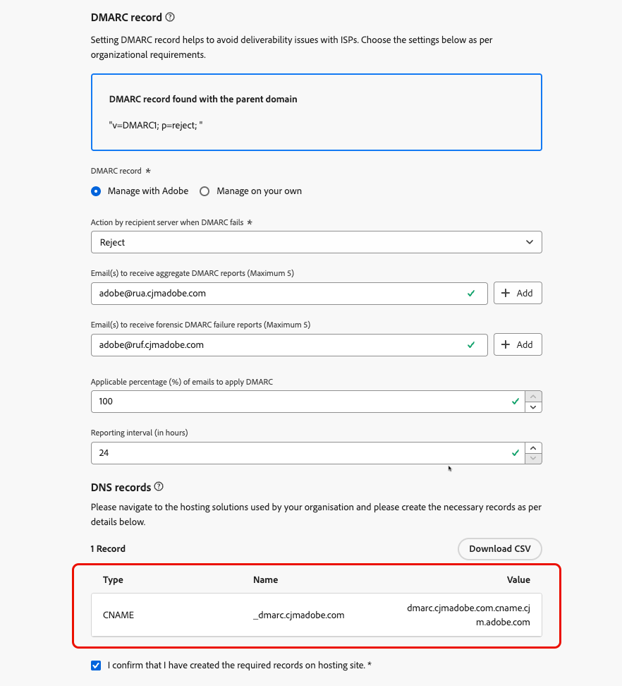
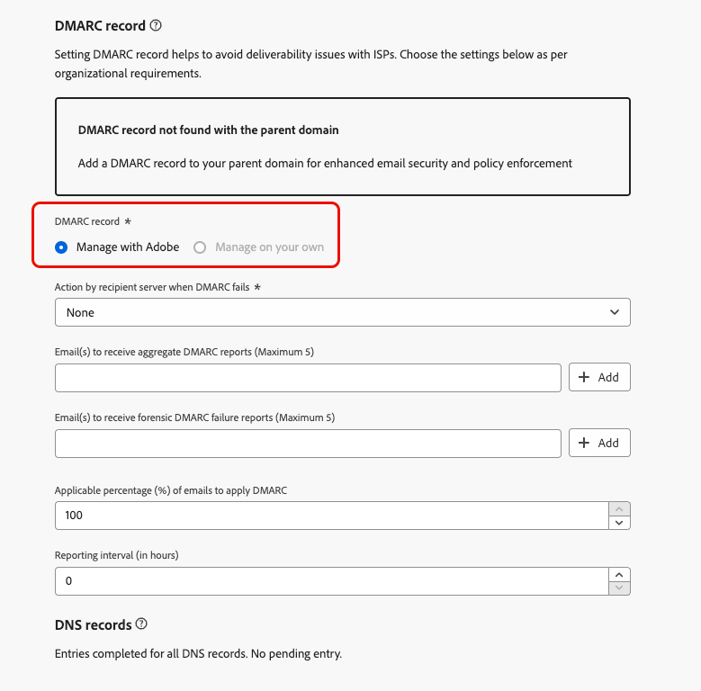

# Registro DMARC {#dmarc-record}

>[!CONTEXTUALHELP]
>id="ajo_admin_dmarc_record"
>title="Establecimiento del registro DMARC"
>abstract="DMARC es un método de autenticación por correo electrónico que permite a los propietarios del dominio proteger su dominio de un uso no autorizado y evitar problemas de entregabilidad con los proveedores de buzones de correo. Como parte del cumplimiento de las mejores prácticas del sector, Google y Yahoo! le exigen que tenga un registro DMARC para cualquier dominio que utilice para enviarles un correo electrónico."

## ¿Qué es DMARC? {#what-is-dmarc}

La autenticación de mensajes basada en dominios, sistemas de informes y conformidad (DMARC) es un método de autenticación por correo electrónico que permite a los propietarios de dominios proteger su dominio contra el uso no autorizado. Al ofrecer una política clara a los proveedores de correo electrónico y de servicios de Internet (ISP), ayuda a evitar que actores maliciosos envíen correos electrónicos que afirman ser de su dominio. La implementación de DMARC reduce el riesgo de que los correos electrónicos legítimos se marquen como correo no deseado o se rechacen y mejora su entregabilidad

DMARC también ofrece informes sobre los mensajes que no superan la autenticación, junto con control sobre el manejo de los correos electrónicos que no pasan la validación de DMARC. Según la [política de DMARC](#dmarc-policies) implementada, estos correos electrónicos se pueden supervisar, poner en cuarentena o rechazar. Estas funcionalidades le permiten realizar acciones para mitigar y abordar posibles errores.

Para ayudarle a evitar problemas de envío mientras obtiene control sobre el correo que falla en la autenticación, [!DNL Journey Optimizer] ahora admite la tecnología de DMARC directamente en su interfaz de administración. [Más información](#implement-dmarc)

### ¿Cómo funciona DMARC? {#how-dmarc-works}

SPF y DKIM se utilizan para asociar un correo electrónico con un dominio y trabajar juntos para autenticar el correo electrónico. DMARC va un paso más allá y ayuda a evitar la suplantación haciendo coincidir el dominio comprobado por DKIM y SPF.

>[!NOTE]
>
>En Journey Optimizer, SPF y DKIM están configurados automáticamente.

Para pasar DMARC, un mensaje debe pasar SPF o DKIM:

* SPF (Marco de Política del Remitente) ayuda a verificar que el mensaje de correo electrónico proviene de una fuente autorizada comprobando la dirección IP del servidor remitente con una lista de direcciones IP autorizadas para el dominio.
* DKIM (DomainKeys Identified Mail) añade una firma digital a los mensajes de correo electrónico, lo que permite al destinatario verificar la integridad y autenticidad del mensaje.

Si ambas o alguna de estas falla en la autenticación, DMARC fallará y el correo electrónico se enviará según la política de DMARC seleccionada.

<!--DMARC requires alignment between the 'From" and 'Return-Path' address.-->

### Políticas de DMARC {#dmarc-policies}

Si un correo electrónico falla en la autenticación de DMARC, puede decidir qué acción se aplicará a ese mensaje. DMARC tiene tres opciones de directiva:

* Monitor (p=none): indica al proveedor del buzón/ISP que haga lo que normalmente haría con el mensaje.
* Cuarentena (p=quarantine): indica al proveedor del buzón/ISP que entregue el correo que no pasa DMARC a la carpeta de correo no deseado del destinatario.
* Reject (p=reject): indica al proveedor/ISP del buzón que bloquee el correo que no pasa DMARC, lo que provoca un rechazo.

>[!NOTE]
>
>Aprenda a establecer la directiva de DMARC con [!DNL Journey Optimizer] en [esta sección](#set-up-dmarc).

## Actualización de requisitos de DMARC {#dmarc-update}

Como parte del cumplimiento de las prácticas recomendadas del sector, Google y Yahoo! ambos requieren que tenga un **registro de DMARC** para cualquier dominio que use para enviarles correo electrónico. Este nuevo requisito se aplica desde el **1 de febrero de 2024**. 

>[!CAUTION]
>
>Se espera que el incumplimiento de este nuevo requisito de Gmail y Yahoo! provoque que los correos electrónicos acaben en la carpeta de spam o sean bloqueados.

Por lo tanto, Adobe recomienda encarecidamente que realice las siguientes acciones:

* Asegúrese de tener **registro de DMARC** configurado para **todos los subdominios que ya ha delegado** a Adobe en [!DNL Journey Optimizer]. [Descubra cómo](#check-subdomains-for-dmarc)

* Al **delegar cualquier nuevo subdominio** a Adobe, puede **configurar DMARC** directamente **en la interfaz de administración de [!DNL Journey Optimizer]**. [Descubra cómo](#implement-dmarc)

## Implementar DMARC en [!DNL Journey Optimizer] {#implement-dmarc}

La interfaz de administración [!DNL Journey Optimizer] le permite configurar el registro de DMARC para todos los subdominios que ya ha delegado o que está delegando a Adobe. A continuación se describen los pasos detallados.

### Compruebe los subdominios existentes de DMARC {#check-subdomains-for-dmarc}

Para asegurarse de que tiene configurado el registro de DMARC para todos los subdominios que ha delegado en [!DNL Journey Optimizer], siga los pasos a continuación.

1. Acceda al menú **[!UICONTROL Administración]** > **[!UICONTROL Canales]** > **[!UICONTROL Configuración de correo electrónico]** > **[!UICONTROL Subdominios]** y haga clic en **[!UICONTROL Configurar subdominio]**.

1. Para cada subdominio delegado, compruebe la columna **[!UICONTROL Registro de DMARC]**. Si no se ha encontrado ningún registro para un subdominio determinado, se muestra una alerta.

   

   >[!CAUTION]
   >
   >Para cumplir con el nuevo requisito de Gmail y Yahoo!, y evitar problemas de envío con los principales ISP, se recomienda configurar el registro de DMARC para todos los subdominios delegados. [Más información](dmarc-record-update.md)

1. Seleccione un subdominio sin registro de DMARC asociado y rellene la sección **[!UICONTROL registro de DMARC]** según las necesidades de su organización. Los pasos para rellenar los campos de registro de DMARC se detallan en [esta sección](#implement-dmarc).

   <!---->

   >[!NOTE]
   >
   >Dependiendo de si se encuentra un registro de DMARC con el dominio principal o no, puede elegir utilizar los valores del dominio principal o hacer que Adobe administre el registro de DMARC. [Más información](#implement-dmarc)

1. Si está editando un subdominio:

   * [Se ha delegado completamente](delegate-subdomain.md#set-up-subdomain) a Adobe, no se requiere ninguna otra acción.

   * Configurado con [CNAME](delegate-subdomain.md#cname-subdomain-setup), debe copiar el registro DNS de DMARC en su solución de alojamiento para generar los registros DNS coincidentes.

     

     Asegúrese de que el registro DNS se haya generado en la solución de alojamiento de dominios y marque la casilla &quot;Confirmo...&quot;.

1. Guarde los cambios.

### Configuración de DMARC para nuevos subdominios {#set-up-dmarc}

Al delegar nuevos subdominios a Adobe en [!DNL Journey Optimizer], se creará un registro de DMARC en DNS para su dominio. Siga los pasos a continuación para implementar DMARC.

>[!CAUTION]
>
>Para cumplir con el nuevo requisito de Gmail y Yahoo!, y evitar problemas de envío con los principales ISP, se recomienda configurar el registro de DMARC para todos los subdominios delegados. [Más información](dmarc-record-update.md)

<!--If you fail to comply with the new requirement from Gmail and Yahoo! to have DMARC record for all sending domains, your emails are expected to land into the spam folder or to get blocked.-->

1. Configure un nuevo subdominio. [Descubra cómo](delegate-subdomain.md)

1. Vaya a la sección **[!UICONTROL registro de DMARC]**.

1. Si hay un registro DMARC disponible en el dominio principal asociado al subdominio, se muestran dos opciones:

   

   * **[!UICONTROL Administrar con Adobe]**: Puede hacer que Adobe administre el registro de DMARC para su subdominio. Siga los pasos detallados en [esta sección](#manage-dmarc-with-adobe).

   * **[!UICONTROL Administrar por su cuenta]**: <!--This option is selected by default.-->Esta opción le permite administrar el registro de DMARC fuera de [!DNL Journey Optimizer], utilizando los valores de su dominio principal. Estos valores se muestran en la interfaz, pero no se pueden editar.

     {width="80%"}

1. Si no se encuentra ningún registro de DMARC en el dominio principal, solo está disponible la opción **[!UICONTROL Administrar con Adobe]**. Siga los pasos [debajo de](#manage-dmarc-with-adobe) para configurar el registro de DMARC para su subdominio.

   {width="80%"}

### Administración de registros de DMARC con Adobe {#manage-dmarc-with-adobe}

Para que Adobe administre el registro de DMARC por usted, seleccione la opción **[!UICONTROL Administrar con Adobe]** y siga los pasos a continuación.

>[!NOTE]
>
>Si lo obtuvo [!DNL Journey Optimizer], puede usar los mismos valores que se resaltaron en la interfaz o cambiarlos según sea necesario.

{width="80%"}

>[!NOTE]
>
>Si no añade ningún valor, se utilizarán los valores predeterminados rellenados previamente.

1. Defina la acción que realizará el servidor de destinatarios si DMARC falla. Según la [directiva de DMARC](#dmarc-policies) que desee aplicar, seleccione una de las tres opciones:

   * **[!UICONTROL None]** (valor predeterminado): indica al destinatario que no realice ninguna acción contra los mensajes que no superen la autenticación de DMARC, pero que, aun así, envíe informes de correo electrónico al remitente.
   * **[!UICONTROL Cuarentena]**: indica al servidor de correo electrónico receptor que ponga en cuarentena el correo electrónico que falla en la autenticación de DMARC. Esto generalmente significa colocar dichos mensajes en la carpeta de correo no deseado o correo no deseado del destinatario.
   * **[!UICONTROL Rechazar]**: indica al destinatario que rechace (devuelva) por completo cualquier mensaje de correo electrónico del dominio que no supere la autenticación. Con esta directiva habilitada, solo los correos electrónicos verificados como 100 % autenticados por el dominio tendrán la oportunidad de colocarse en la bandeja de entrada.

   >[!NOTE]
   >
   >Como práctica recomendada, se recomienda implementar lentamente la implementación de DMARC escalando la directiva de DMARC de **None**, a **Cuarentena**, a **Rechazar** a medida que vaya entendiendo el impacto potencial de DMARC.

1. De manera opcional, agregue una o más direcciones de correo electrónico de su elección para indicar a qué parte de su organización deben ir los **informes de DMARC** sobre los mensajes de correo electrónico que [no superan la autenticación](#how-dmarc-works). Se pueden agregar hasta cinco direcciones para cada informe.

   >[!NOTE]
   >
   >Asegúrese de que dispone de una bandeja de entrada original (no de Adobe) en el control donde puede recibir dichos informes.

   Los ISP generan dos informes diferentes que los remitentes pueden recibir a través de las etiquetas RUA/RUF en su directiva de DMARC:

   * **Informes agregados** (RUA): no contienen ninguna PII (información de identificación personal) que pueda ser confidencial con respecto al RGPD.
   * **Informes de errores forenses** (RUF): Contienen direcciones de correo electrónico que distinguen el RGPD. Antes de usar, compruebe internamente cómo tratar la información que necesita cumplir con el RGPD.

   >[!NOTE]
   >
   >Estos informes, de carácter muy técnico, proporcionan una visión general de los correos electrónicos que se intentan suplantar. Se digieren mejor mediante una herramienta de terceros.

1. Seleccione el **porcentaje aplicable** de correos electrónicos para DMARC.

   Este porcentaje depende de la confianza que tenga en la infraestructura de correo electrónico y de la tolerancia de los falsos positivos (los correos electrónicos legítimos se marcan como fraudulentos). Es común que las organizaciones empiecen con la directiva de DMARC establecida en **None**, aumenten gradualmente el porcentaje de directiva de DMARC y supervisen de cerca el impacto en la entrega de correo electrónico legítimo.

   >[!NOTE]
   >
   >Trabaje con los administradores de correo electrónico y el equipo de TI para aumentar gradualmente el porcentaje a medida que vaya ganando confianza en las prácticas de autenticación de correo electrónico.

   Como práctica recomendada, establezca una tasa de conformidad con DMARC alta, idealmente cercana al 100 %, para maximizar los beneficios de seguridad y minimizar el riesgo de falsos positivos.

1. Seleccione un **intervalo de informe** entre 24 y 168 horas. Permite a los propietarios de dominio recibir actualizaciones regulares de los resultados de autenticación por correo electrónico y tomar las medidas necesarias para mejorar la seguridad del correo electrónico.

<!--The DMARC reporting interval is specified in the DMARC policy published in the DNS (Domain Name System) records for a domain. The reporting interval can be set to daily, weekly, or another specified frequency, depending on the domain owner's preferences.

The default value (24 hours) is generally the email providers' expectation.

**********

Setting up a DMARC record involves adding a DNS TXT record to your domain's DNS settings. This record specifies your DMARC policy, such as whether to quarantine or reject messages that fail authentication. Implementing DMARC is a proactive step towards enhancing email security and protecting both your organization and your recipients from email-based threats.

DMARC helps prevent malicious actors from sending emails that appear to come from your domain. By setting up DMARC, you can specify how email providers should handle messages that fail authentication checks, reducing the likelihood that phishing emails will reach recipients.

DMARC helps improve email deliverability by providing a clear policy for email providers to follow when encountering messages claiming to be from your domain. This can reduce the chances of legitimate emails being marked as spam or rejected.

DMARC helps protect against email spoofing, phishing, and other fraudulent activities.

It allows you to decide how a mailbox provider should handle emails that fail SPF and DKIM checks, providing a way to authenticate the sender's domain and prevent unauthorized use of the domain for malicious purposes.

## What are the benefits of DMARC? {#dmarc-benefits}

The key benefits or DMARC are as folllows:

* DMARC allows email receivers to easily identify the authentication of emails, which could potentially improve delivery.

* It offers reporting on which messages fail SPF and/or DKIM, enabling senders to gain visibility.

* This increased visibility allows for steps to be taken to mitigate further errors. It gives senders a degree of control over what happens with mail that does not pass either of these authentication methods.

-->
