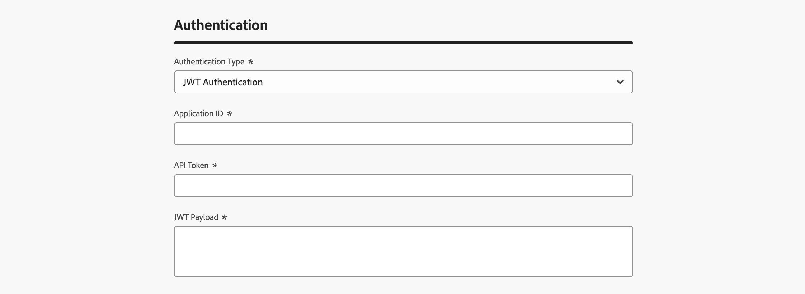

# Creación de webhooks de comentarios para campañas activadas por API {#webhooks}

Los enlaces web de comentarios le permiten recibir actualizaciones de estado en tiempo real de los mensajes enviados a través de campañas transaccionales activadas por API. Al configurar un gancho web, puede recibir automáticamente los resultados de la entrega directamente en sus sistemas, lo que permite la monitorización, el registro y el procesamiento automatizado.

Puede administrar las configuraciones del webhook desde el menú **[!UICONTROL Administración]** / **[!UICONTROL Canales]** / **[!UICONTROL Configuración del webhook de comentarios]**.


>[!NOTE]
>Solo se permite una configuración de webhook por cada combinación de **Organización + zona protegida**.

## Crear un webhook de comentarios

Para crear un webhook, siga estos pasos:

1. Vaya a **[!UICONTROL Administración]** / **[!UICONTROL Canales]** / **[!UICONTROL Configuración del enlace web de comentarios]**.

1. Haga clic en **Crear webhook de comentarios**.

1. En la sección **[!UICONTROL Configuración básica]**, proporcione los siguientes detalles:

   

   * **Nombre del webhook**: escriba un nombre descriptivo para identificar el webhook.
   * **Canales**: seleccione los canales para los cuales este webhook debe recibir comentarios (correo electrónico o SMS).
   * **URL de webhook**: proporcione el extremo HTTPS donde se deben entregar los eventos de comentarios.

1. En la sección **[!UICONTROL Authentication]**, seleccione el método de autenticación:

   

   * **Sin autenticación**: no se agregan encabezados de autenticación.
   * **Autenticación JWT**: proporcione los detalles necesarios si el extremo requiere autenticación JWT.

1. En la sección **[!UICONTROL Parámetros de encabezado]**, configure encabezados personalizados adicionales para enviarlos con cada solicitud de webhook.

   

1. Haga clic en **[!UICONTROL Enviar]** para guardar la configuración.

>[!NOTE]
>
>Puede editar un webhook en cualquier momento. Para ello, ábralo desde el inventario y haga clic en el botón **[!UICONTROL Editar]**.

## Estructura de carga útil de webhook

Después de la ejecución de un mensaje, **[!DNL Journey Optimizer]** envía la siguiente carga útil al extremo configurado.

```
{
  "requestId": "8NoByJneShCdCGRnrGS1t1m3CdA73dhR",
  "imsOrg": "myImsOrg",
  "sandbox": {
    "id": "068abf40-575e-11ea-8512-9b1bfdb82603",
    "name": "prod"
  },
  "channel": "email",
  "eventType": "message.feedback",
  "messageExecution": {
    "messageExecutionID": "HUMA-26362805",
    "messageType": "transactional",
    "campaignID": "16f24a15-7e21-477c-848a-d5695ca7f137",
    "campaignVersionID": "2ca10c10-56dd-4505-87cd-fa5da84e7a5d"
  },
  "messageDeliveryFeedback": {
    "feedbackStatus": {
      "value": "bounce"
    },
    "offers": null,
    "messageExclusion": null,
    "messageFailure": {
      "category": "sync",
      "type": "Ignored",
      "code": "25",
      "reason": "Admin Failure"
    },
    "retryCount": 0
  },
  "identityMap": {
    "email": [
      {
        "id": "john.doe@luma.com",
        "primary": true
      }
    ]
  }
}
```

El webhook puede capturar los siguientes eventos:

* Enviados
* Entregados
* Devolución (consulte el ejemplo anterior)
* Errores

Cada solicitud entrante también incluye un requestId único que se devuelve al webhook.

## Próximos pasos {#next}

Una vez que se haya creado un webhook de comentarios, puedes habilitarlo al configurar una audiencia de **campaña desencadenada por API transaccional**. Obtenga más información en esta sección: [Habilitar webhooks](../campaigns/api-triggered-campaign-audience.md#webhook)
