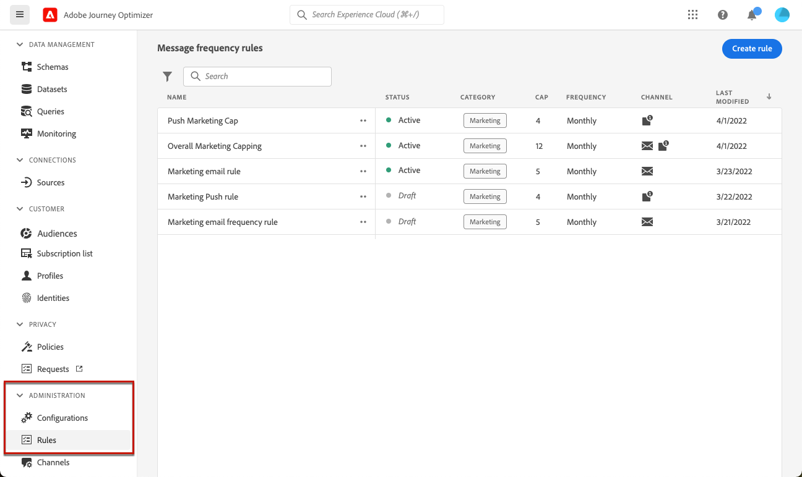
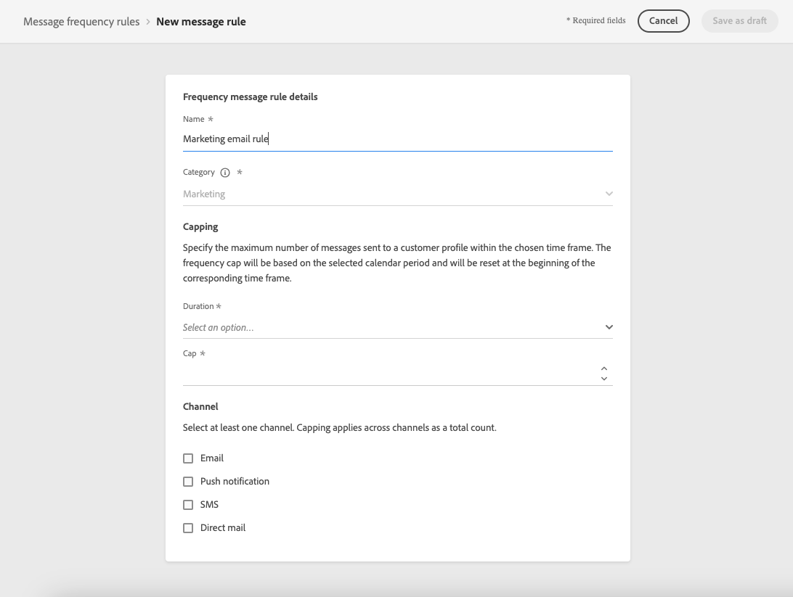

# Configurar reglas empresariales {#frequency-rules}

>[!CONTEXTUALHELP]
>id="ajo_business_rules_message_frequency_rules"
>title="Reglas empresariales"
>abstract="Las reglas de frecuencia de mensajes son un tipo de regla empresarial que restringe el número de veces que los usuarios reciben mensajes o entran en recorridos a través de uno o varios canales. Estas reglas en canales múltiples excluyen automáticamente los perfiles muy solicitados de mensajes y acciones."

[!DNL Journey Optimizer] le permite controlar la frecuencia con la que los usuarios recibirán un mensaje o entrarán en un recorrido a través de uno o varios canales. Reglas de frecuencia de mensajes que excluyen automáticamente los perfiles saturados de mensajes y acciones.

Por ejemplo, para una marca una regla podría ser no enviar más de 4 mensajes de marketing al mes a sus clientes. Para ello, puede utilizar una regla de negocio que limite el número de mensajes enviados en función de uno o más canales durante un periodo mensual del calendario.

>[!NOTE]
>
>Las reglas empresariales son diferentes de la administración de la exclusión, que permite a los usuarios cancelar la suscripción y evitar recibir comunicaciones de una marca. [Más información](../privacy/opt-out.md#opt-out-management)

➡️ [Descubra esta funcionalidad en vídeo](#video)

## Acceso a reglas empresariales {#access-rules}

Las reglas de negocio están disponibles en el menú **[!UICONTROL Administración]** > **[!UICONTROL Reglas de negocio]**. Todas las reglas se enumeran y se ordenan por fecha de modificación. Utilice el icono de filtro para filtrar por categoría, estado o canal. También puede buscar en la etiqueta del mensaje.

### Permisos{#permissions-frequency-rules}

Para acceder, crear, editar o eliminar reglas de negocio, debe tener el permiso **[!UICONTROL Administrar reglas de frecuencia]**.

Los usuarios con el permiso **[!UICONTROL Ver reglas de frecuencia]** pueden ver las reglas, pero no modificarlas ni eliminarlas.

Puede obtener más información sobre permisos en [esta sección](../administration/high-low-permissions.md).

## Crear una regla empresarial {#create-new-rule}

>[!CONTEXTUALHELP]
>id="ajo_rules_category"
>title="Seleccione la categoría de regla de mensaje"
>abstract="Cuando está activada y se aplica a un mensaje, todas las reglas empresariales que coinciden con la categoría seleccionada se aplican automáticamente a este mensaje. Actualmente, solo está disponible la categoría Marketing."

>[!CONTEXTUALHELP]
>id="ajo_rules_capping"
>title="Establecer el límite de la regla empresarial"
>abstract="Especifique el número máximo de mensajes enviados a un perfil de cliente en el lapso de tiempo elegido. El límite de frecuencia se basará en el período de calendario seleccionado y se restablecerá al principio del lapso de tiempo correspondiente."

>[!CONTEXTUALHELP]
>id="ajo_rules_channel"
>title="Definir los canales a los que se aplica la regla empresarial"
>abstract="Seleccione al menos un canal. El límite se aplica a todos los canales como un recuento total."

Para crear una nueva regla de negocio, siga los pasos a continuación.

1. Acceda a la lista **[!UICONTROL Reglas de negocio]** y haga clic en **[!UICONTROL Crear regla]**.

   

1. Defina el nombre de la regla y seleccione la categoría de regla de mensaje.

   >[!NOTE]
   >
   >Solo está disponible la categoría **[!UICONTROL Marketing]**.

   

1. En la lista desplegable **[!UICONTROL Duración]**, seleccione un lapso de tiempo para aplicar el límite. [Más información](#frequency-cap)

1. Establezca el límite de la regla, es decir, el número máximo de mensajes que se pueden enviar a un perfil de usuario individual cada mes o la semana <!--or day-->, según la selección anterior.

   <!---->

1. Seleccione el canal que desee usar para esta regla: **[!UICONTROL Correo electrónico]**, **[!UICONTROL Notificación push]**, **[!UICONTROL SMS]** o **[!UICONTROL Correo directo]**.

   

   >[!NOTE]
   >
   >Debe seleccionar al menos un canal para poder crear la regla.

1. Seleccione varios canales si desea aplicar un límite a todos los canales seleccionados como recuento total.

   Por ejemplo, establezca el límite en 15 y seleccione los canales push y de correo electrónico. Si un perfil ya ha recibido 10 correos electrónicos de marketing y 5 notificaciones push de marketing para el periodo seleccionado, este perfil se excluye de la siguiente entrega de cualquier correo electrónico de marketing o notificación push.

1. Haga clic en **[!UICONTROL Guardar como borrador]** para confirmar la creación de la regla. El mensaje se agrega a la lista de reglas, con el estado **[!UICONTROL Borrador]**.

   

### Límite de frecuencia {#frequency-cap}

En la lista desplegable **[!UICONTROL Duración]**, seleccione si desea que el límite se aplique mensual o semanalmente.

>[!NOTE]
>
>El límite diario de frecuencia también está disponible bajo demanda. [Más información](#daily-frequency-cap)

El límite de frecuencia se basa en el periodo de calendario seleccionado. Se restablece al principio del lapso de tiempo correspondiente.

La caducidad del contador para cada período es la siguiente:

* **[!UICONTROL Mensual]**: el límite de frecuencia es válido hasta el último día del mes a las 23:59:59 UTC. Por ejemplo, la caducidad mensual para enero es del 01 al 31 23:59:59 UTC.

* **[!UICONTROL Semanal]**: El límite de frecuencia es válido hasta el sábado 23:59:59 UTC de esa semana, ya que la semana del calendario comienza el domingo. La caducidad es independiente de la creación de la regla. Por ejemplo, si la regla se crea el jueves, es válida hasta el sábado a las 23:59:59.

### Límite de frecuencia diario {#daily-frequency-cap}

Además del límite de frecuencia mensual y semanal, también está disponible bajo demanda. Para obtener más información, póngase en contacto con su representante de Adobe.

El límite de frecuencia diaria es válido para el día hasta el 23:59:59 UTC y se restablece en 0 al comienzo del día siguiente.

>[!NOTE]
>
>Para garantizar la precisión de las reglas diarias de restricción de frecuencia, se recomienda el uso de [segmentación de transmisión](https://experienceleague.adobe.com/docs/experience-platform/segmentation/ui/streaming-segmentation.html?lang=es){target="_blank"}. Obtenga más información acerca de los métodos de evaluación de audiencia en [esta sección](../audience/about-audiences.md#evaluation-method-in-journey-optimizer).

## Activar una regla de negocio {#activate-rule}

Cuando se crea, una regla de negocio tiene el estado **[!UICONTROL Borrador]** y aún no afecta a ningún mensaje. Para habilitarlo, haga clic en los puntos suspensivos junto a la regla y seleccione **[!UICONTROL Activar]**.

La activación de una regla afectará a cualquier mensaje al que se aplique en su próxima ejecución. Aprenda a [aplicar una regla de negocio a un mensaje](#apply-frequency-rule).

>[!NOTE]
>
>Una regla puede tardar hasta 10 minutos en activarse completamente. No es necesario modificar los mensajes ni volver a publicar los recorridos para que una regla surta efecto.

Para desactivar una regla de negocio, haga clic en los puntos suspensivos junto a la regla y seleccione **[!UICONTROL Desactivar]**.

El estado de la regla cambiará a **[!UICONTROL Inactiva]** y la regla no se aplicará a futuras ejecuciones de mensajes. Los mensajes que se estén ejecutando actualmente no se verán afectados.

>[!NOTE]
>
>La desactivación de una regla no afecta ni restablece ningún recuento en perfiles individuales.

## Aplicación de una regla de negocio a un mensaje {#apply-frequency-rule}

Para aplicar una regla de negocio a un mensaje, siga los pasos a continuación.

1. Al crear un [recorrido](../building-journeys/journey-gs.md), agregue un mensaje seleccionando uno de los canales definidos para la regla.

1. Seleccione la categoría que definió para la [regla que creó](#create-new-rule).

   

   >[!NOTE]
   >
   >Actualmente, solo está disponible la categoría **[!UICONTROL Marketing]** para reglas de negocio.

1. Puede hacer clic en el vínculo **[!UICONTROL Regla de frecuencia]** para ver la pantalla de reglas de frecuencia en una nueva pestaña. [Más información](#access-rules)

   Todas las reglas que coincidan con la categoría y los canales seleccionados se aplicarán automáticamente a este mensaje.

   >[!NOTE]
   >
   >Los mensajes donde la categoría seleccionada es **[!UICONTROL Transaccional]** no se evaluarán con reglas de frecuencia.

1. Puede ver el número de perfiles excluidos del envío en el [informe de Customer Journey Analytics](../reports/report-gs-cja.md) y en el [informe en vivo](../reports/live-report.md), donde las reglas de negocio se enumerarán como un posible motivo para que los usuarios excluidos del envío.

>[!NOTE]
>
>Se pueden aplicar varias reglas al mismo canal, pero una vez alcanzado el límite inferior, el perfil se excluye de los siguientes envíos.

## Ejemplo: combinar varias reglas {#frequency-rule-example}

Puede combinar varias reglas de negocio, como se describe en el ejemplo siguiente.

1. [Cree una regla de negocio](#create-new-rule) llamada *Límite de marketing general*:

   * Seleccione todos los canales.
   * Establezca un límite de 12 al mes.

   

1. Para restringir aún más el número de notificaciones push basadas en marketing que se envía a un usuario, cree una segunda regla llamada *Límite de marketing push*:

   * Seleccione Canal push.
   * Establezca un límite de 4 al mes.

   

1. Guarde y [active](#activate-rule) la regla.

1. [Crea un mensaje](../building-journeys/journeys-message.md) para cada canal por el que quieras comunicarte y selecciona la categoría **[!UICONTROL Marketing]** para cada mensaje. [Aprenda a aplicar una regla de negocio](#apply-frequency-rule)

   

<!--
Learn how to create a message for the different channels in the following sections:
* [Create an email](../email/create-email.md)
* [Create a push notification](../push/create-push.md)
* [Create an SMS](../sms/create-sms.md)
* [Create a direct mail](../direct-mail/create-direct-mail.md)

Create an email and select the **[!UICONTROL Marketing]** category for that message. [Learn more](../email/create-email.md)

Create a push notification and select the **[!UICONTROL Marketing]** category for that message. [Learn more](../push/create-push.md)

Create an SMS and select the **[!UICONTROL Marketing]** category for that message. [Learn more](../sms/create-sms.md)

Create a direct mail and select the **[!UICONTROL Marketing]** category for that message. [Learn more](../direct-mail/create-direct-mail.md)
-->

En esta situación, un perfil individual:
* puede recibir hasta 12 mensajes de marketing al mes;
* pero se excluirán de las notificaciones push de marketing una vez que hayan recibido 4 notificaciones push.

>[!NOTE]
>
>Al probar reglas de negocio, se recomienda usar un [perfil de prueba](../audience/creating-test-profiles.md) recién creado, ya que una vez que se alcanza el límite de frecuencia de un perfil, no hay forma de restablecer el contador hasta el mes siguiente. Al desactivar una regla, los perfiles con límite pueden recibir mensajes, pero no se elimina ni elimina ningún incremento de contador.

## Vídeo práctico {#video}

Obtenga información sobre cómo crear, activar, probar e informar sobre reglas empresariales.

>[!VIDEO](https://video.tv.adobe.com/v/344451?quality=12)
