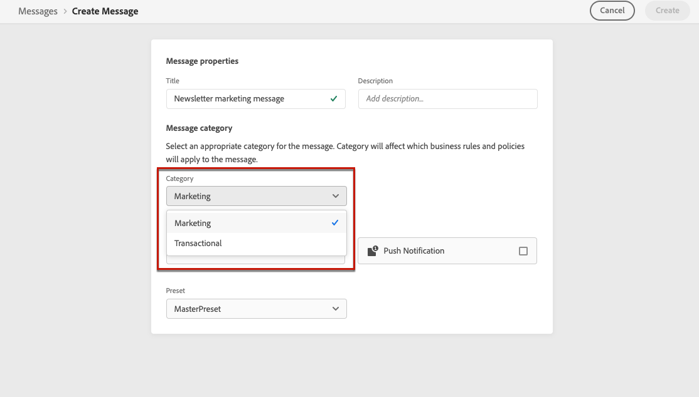

# Reglas de frecuencia de mensajes {#frequency-rules}

[!DNL Journey Optimizer] le permite controlar la frecuencia con la que los usuarios recibirán un mensaje o entrar en un recorrido estableciendo reglas de canales cruzados que excluyan automáticamente los perfiles saturados de mensajes y acciones.

Por ejemplo, no desea que la marca envíe más de tres mensajes de marketing al mes a sus clientes.

Para ello, puede utilizar una regla de frecuencia que limite el número de mensajes enviados en función de uno o varios canales durante un periodo de calendario mensual.

>[!NOTE]
>
>Las reglas de frecuencia de mensajes son diferentes de la administración de exclusión, que permite a los usuarios cancelar la suscripción para recibir comunicaciones de una marca. [Más información](../messages/consent.md#opt-out-management)

## Reglas de acceso {#access-rules}

Las reglas están disponibles en el **[!UICONTROL Administration]** > **[!UICONTROL Rules]** para abrir el Navegador. Se muestran todas las reglas, ordenadas por fecha de modificación.

>[!NOTE]
>
>Para acceder, crear, editar o eliminar las reglas de frecuencia de mensajes, debe tener la variable [Administrar reglas de frecuencia](../administration/high-low-permissions.md#manage-frequency-rules) permiso.

Utilice el icono de filtro para filtrar por categoría, estado o canal. También puede buscar en la etiqueta del mensaje.

## Crear una regla {#create-new-rule}

Para crear una regla nueva, siga los pasos a continuación.

1. Acceda a la **[!UICONTROL Message frequency rules]** a continuación, haga clic en **[!UICONTROL Create rule]**.

   

1. Defina el nombre de la regla.

   

1. Seleccione la categoría de regla de mensaje.

   >[!NOTE]
   >
   >Actualmente solo el **[!UICONTROL Marketing]** está disponible.

1. Establezca el límite de la regla, es decir, el número máximo de mensajes que se pueden enviar a un perfil de usuario individual cada mes.

   

   >[!NOTE]
   >
   >El límite de frecuencia se basa en un período de calendario mensual. Se restablece al principio de cada mes.

1. Seleccione el canal que desee utilizar para esta regla: **[!UICONTROL Email]** o **[!UICONTROL Push notification]**.

   

   >[!NOTE]
   >
   >Debe seleccionar al menos un canal para poder crear la regla.

1. Seleccione varios canales si desea aplicar límites a todos los canales seleccionados como recuento total.

   Por ejemplo, defina el límite en 15 y seleccione los canales de correo electrónico y push. Si un perfil ya ha recibido 10 correos electrónicos de marketing y 5 notificaciones push de marketing, este perfil se excluirá de la siguiente entrega de cualquier correo electrónico de marketing o notificación push.

1. Haga clic en **[!UICONTROL Save as draft]** para confirmar la creación de la regla. El mensaje se añade en la lista de reglas, con la variable **[!UICONTROL Draft]** estado.

   

## Activar una regla {#activate-rule}

Cuando se crea, una regla de frecuencia de mensaje tiene la variable **[!UICONTROL Draft]** y aún no afecta a ningún mensaje. Para habilitarlo, haga clic en los puntos suspensivos junto a la regla y seleccione **[!UICONTROL Activate]**.

La activación de una regla afectará a los mensajes a los que se aplique en la siguiente ejecución. Obtenga información sobre cómo [aplicar una regla de frecuencia a un mensaje](#apply-frequency-rule).

>[!NOTE]
>
>No es necesario modificar o volver a publicar mensajes o recorridos para que una regla surta efecto.

Para desactivar una regla de frecuencia de mensaje, haga clic en los puntos suspensivos junto a la regla y seleccione **[!UICONTROL Deactivate]**.

El estado de la regla cambiará a **[!UICONTROL Inactive]** y la regla no se aplicará a futuras ejecuciones de mensajes. Los mensajes que se encuentren en ejecución no se verán afectados.

>[!NOTE]
>
>La desactivación de una regla no afecta a los perfiles individuales ni los restablece.

## Aplicación de una regla de frecuencia a un mensaje {#apply-frequency-rule}

Para aplicar una regla de frecuencia a un mensaje, siga los pasos a continuación.

1. Cree un mensaje. [Más información](../messages/get-started-content.md#create-new-message)

1. Seleccione la categoría que definió para la variable [regla creada](#create-new-rule).

   

   >[!NOTE]
   >
   >Actualmente solo el **[!UICONTROL Marketing]** está disponible para reglas de frecuencia de mensajes.

1. Seleccione los canales que desee para el mensaje.

   

1. Puede hacer clic en el botón **[!UICONTROL Frequency rule]** para ver las reglas de frecuencia que se aplicarán a la categoría y a los canales seleccionados.

   

   Se abrirá una nueva pestaña para mostrar las reglas de frecuencia de mensaje coincidentes.

1. [Diseño](../design/design-emails.md) y [publicar](../messages/publish-manage-message.md) su mensaje.

Todas las reglas de frecuencia que coincidan con la categoría y los canales seleccionados se aplicarán automáticamente a este mensaje.

<!--Clicking the link out button next to the category selector will jump you over to the rules inventory screen to see which rules will be applied to the message.-->

Puede ver el número de perfiles excluidos del envío en la [Vistas en directo y globales](../reports/message-monitoring.md)y en la [informe de actividades de correo electrónico](../reports/email-live-report.md), donde las reglas de frecuencia se enumerarán como un posible motivo para los usuarios excluidos del envío.

>[!NOTE]
>
>Se pueden aplicar varias reglas al mismo canal, pero una vez alcanzado el límite inferior, el perfil se excluye de los siguientes envíos.

## Ejemplo: combinar varias reglas {#frequency-rule-example}

Puede combinar varias reglas de frecuencia de mensajes, como se describe en el ejemplo siguiente.

1. [Crear una regla](#create-new-rule) llamado *Restricción general de marketing*:

   * Seleccione todos los canales (correo electrónico, push).
   * Establezca el límite en 12.

   

1. Para restringir aún más el número de notificaciones push basadas en marketing que envía un usuario, cree una segunda regla llamada *Límite de marketing push*:

   * Seleccione Canal push.
   * Establezca el límite en 4.

   

1. Guardar y [activar](#activate-rule) la regla.

1. Cree un mensaje. [Más información](../messages/get-started-content.md#create-new-message)

1. Seleccione el **[!UICONTROL Marketing]** categoría.

   

1. Seleccione el **[!UICONTROL Email]** y **[!UICONTROL Push Notification]** canales.

   

1. Puede hacer clic en el botón **[!UICONTROL Frequency rule]** para ver las reglas de frecuencia que se aplicarán a la categoría y a los canales seleccionados.

1. [Diseño](../design/design-emails.md) y [publicar](../messages/publish-manage-message.md) su mensaje.

En este escenario, un perfil individual:
* puede recibir hasta 12 mensajes de marketing al mes;
* pero se excluirán de las notificaciones push de marketing una vez que hayan recibido 4 notificaciones push.
