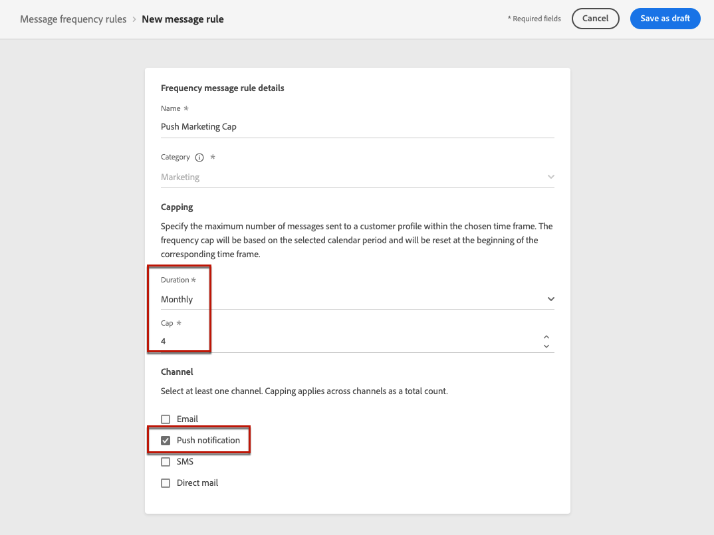

# Reglas de frecuencia de mensaje {#frequency-rules}

[!DNL Journey Optimizer] permite controlar la frecuencia con la que los usuarios recibirán un mensaje o entrarán en un recorrido configurando reglas multicanal que excluirán automáticamente los perfiles saturados de los mensajes y las acciones.

Por ejemplo, para una marca una regla podría ser no enviar más de 4 mensajes de marketing al mes a sus clientes. Para ello, puede utilizar una regla de frecuencia que limite el número de mensajes enviados en función de uno o más canales durante un periodo mensual del calendario.

>[!NOTE]
>
>Las reglas de frecuencia de mensajes son diferentes de la administración de exclusión, que permite a los usuarios cancelar la suscripción y evitar recibir comunicaciones de una marca. [Más información](../privacy/opt-out.md#opt-out-management)

➡️ [Descubra esta función en vídeo](#video)

## Reglas de acceso {#access-rules}

Las reglas están disponibles en **[!UICONTROL Administration]** > **[!UICONTROL Reglas]** menú. Todas las reglas se enumeran y se ordenan por fecha de modificación.

Utilice el icono de filtro para filtrar por categoría, estado o canal. También puede buscar en la etiqueta del mensaje.

### Permisos{#permissions-frequency-rules}

Para acceder, crear, editar o eliminar reglas de frecuencia de mensajes, debe tener el **[!UICONTROL Administrar reglas de frecuencia]** permiso.

Usuarios con **[!UICONTROL Ver reglas de frecuencia]** Los permisos de pueden ver las reglas, pero no modificarlas ni eliminarlas.

Puede obtener más información sobre permisos en [esta sección](../administration/high-low-permissions.md).

## Crear una regla {#create-new-rule}

>[!CONTEXTUALHELP]
>id="ajo_rules_category"
>title="Seleccione la categoría de regla de mensaje"
>abstract="Cuando está activada y se aplica a un mensaje, todas las reglas de frecuencia que coincidan con la categoría seleccionada se aplican automáticamente a este mensaje. Actualmente solo está disponible la categoría Marketing."

>[!CONTEXTUALHELP]
>id="ajo_rules_capping"
>title="Establezca el límite de la regla"
>abstract="Especifique el número máximo de mensajes enviados a un perfil de cliente cada mes. El límite de frecuencia se basará en un período de calendario mensual y se restablecerá al principio de cada mes."

>[!CONTEXTUALHELP]
>id="ajo_rules_channel"
>title="Definir los canales a los que se aplica la regla"
>abstract="Seleccione al menos un canal. El límite se aplica a todos los canales como un recuento total."

Para crear una regla nueva, siga los pasos a continuación.

1. Acceda a la **[!UICONTROL Reglas de frecuencia de mensaje]** y haga clic en **[!UICONTROL Crear regla]**.

   

1. Defina el nombre de la regla y seleccione la categoría de regla de mensaje.

   >[!NOTE]
   >
   >Actualmente solo el **[!UICONTROL Marketing]** La categoría está disponible.

   <!---->

1. Desde el **[!UICONTROL Duración]** , seleccione un lapso de tiempo para aplicar el límite.

   

   El límite de frecuencia se basa en el periodo de calendario seleccionado. Se restablece al principio del lapso de tiempo correspondiente.

   La caducidad del contador para cada período es la siguiente:

   <!--* **[!UICONTROL Daily]**: The frequency cap is valid for the day until 23:59:59 UTC and resets to 0 at the start of the next day.-->

   * **[!UICONTROL Semanalmente]**: El límite de frecuencia es válido hasta el sábado 23:59:59 UTC de esa semana, ya que la semana del calendario comienza el domingo. La caducidad es independiente de la creación de la regla. Por ejemplo, si la regla se crea el jueves, es válida hasta el sábado a las 23:59:59.

   * **[!UICONTROL Mensual]**: el límite de frecuencia es válido hasta el último día del mes a las 23:59:59 UTC. Por ejemplo, la caducidad mensual para enero es del 31 al 01 23:59:59 UTC.

   &lt;!—NOTA: Cuando se trata de [segmentación por lotes](https://experienceleague.adobe.com/docs/experience-platform/segmentation/home.html#batch){target="_blank"}, the daily counters may not accurately reflect the current values as the daily counter snapshot is taken at midnight UTC the night before. Consequently, relying on daily counters in this scenario becomes impractical, as the snapshot does not reflect the most up-to-date counter values on the profile. To ensure accuracy for daily frequency capping rules, the use of [streaming segmentation](https://experienceleague.adobe.com/docs/experience-platform/segmentation/ui/streaming-segmentation.html){target="_blank"} se recomienda. <!--Learn more on audience evaluation methods in [this section](using/audience/about-audiences.md#evaluation-method-in-journey-optimizer).-->

1. Establezca el límite de la regla, es decir, el número máximo de mensajes que se pueden enviar a un perfil de usuario individual cada mes o semana <!--or day--> - según su selección anterior.

   <!---->

1. Seleccione el canal que desee utilizar para esta regla: **[!UICONTROL Correo electrónico]**, **[!UICONTROL Notificación push]**, **[!UICONTROL SMS]** o **[!UICONTROL Correo directo]**.

   

   >[!NOTE]
   >
   >Debe seleccionar al menos un canal para poder crear la regla.

1. Seleccione varios canales si desea aplicar un límite a todos los canales seleccionados como recuento total.

   Por ejemplo, establezca el límite en 15 y seleccione los canales push y de correo electrónico. Si un perfil ya ha recibido 10 correos electrónicos de marketing y 5 notificaciones push de marketing para el periodo seleccionado, este perfil se excluye de la siguiente entrega de cualquier correo electrónico de marketing o notificación push.

1. Clic **[!UICONTROL Guardar como borrador]** para confirmar la creación de la regla. El mensaje se añade a la lista de reglas, con el **[!UICONTROL Borrador]** estado.

   

## Activar una regla {#activate-rule}

Cuando se crea, una regla de frecuencia de mensaje tiene el **[!UICONTROL Borrador]** estado y aún no afecta a ningún mensaje. Para habilitarlo, haga clic en los puntos suspensivos junto a la regla y seleccione **[!UICONTROL Activar]**.

La activación de una regla afectará a cualquier mensaje al que se aplique en su próxima ejecución. Obtenga información sobre cómo [aplicación de una regla de frecuencia a un mensaje](#apply-frequency-rule).

>[!NOTE]
>
>Una regla puede tardar hasta 10 minutos en activarse completamente. No es necesario modificar los mensajes ni volver a publicar los recorridos para que una regla surta efecto.

Para desactivar una regla de frecuencia de mensaje, haga clic en los puntos suspensivos junto a la regla y seleccione **[!UICONTROL Desactivar]**.

El estado de la regla cambiará a **[!UICONTROL Inactivo]** y la regla no se aplicará a futuras ejecuciones de mensajes. Los mensajes que se estén ejecutando actualmente no se verán afectados.

>[!NOTE]
>
>La desactivación de una regla no afecta ni restablece ningún recuento en perfiles individuales.

## Aplicación de una regla de frecuencia a un mensaje {#apply-frequency-rule}

Para aplicar una regla de frecuencia a un mensaje, siga los pasos a continuación.

1. Al crear un [recorrido](../building-journeys/journey-gs.md), añada un mensaje seleccionando uno de los canales definidos para la regla.

1. Seleccione la categoría que definió para el [regla que ha creado](#create-new-rule).

   

   >[!NOTE]
   >
   >Actualmente solo el **[!UICONTROL Marketing]** está disponible para reglas de frecuencia de mensajes.

1. Puede hacer clic en **[!UICONTROL Regla de frecuencia]** para ver la pantalla de reglas de frecuencia en una nueva pestaña. [Más información](#access-rules)

   Todas las reglas de frecuencia que coincidan con la categoría y los canales seleccionados se aplicarán automáticamente a este mensaje.

   >[!NOTE]
   >
   >Mensajes en los que se selecciona la categoría **[!UICONTROL Transaccional]** no se evaluarán con reglas de frecuencia.

1. Puede ver el número de perfiles excluidos del envío en la [Informe global](../reports/global-report.md), y en el [Informe en vivo](../reports/live-report.md), donde las reglas de frecuencia se enumerarán como un posible motivo para excluir a los usuarios del envío.

>[!NOTE]
>
>Se pueden aplicar varias reglas al mismo canal, pero una vez alcanzado el límite inferior, el perfil se excluye de los siguientes envíos.

## Ejemplo: combinar varias reglas {#frequency-rule-example}

Puede combinar varias reglas de frecuencia de mensajes, como se describe en el ejemplo siguiente.

1. [Creación de una regla](#create-new-rule) llamado *Límite general de marketing*:

   * Seleccione todos los canales.
   * Establezca un límite de 12 al mes.

   

1. Para restringir aún más el número de notificaciones push basadas en marketing que se envían a un usuario, cree una segunda regla llamada *Límite de marketing push*:

   * Seleccione Canal push.
   * Establezca un límite de 4 al mes.

   

1. Guardar y [activar](#activate-rule) la regla.

1. [Creación de un mensaje](../building-journeys/journeys-message.md) para cada canal con el que desee comunicarse y seleccione **[!UICONTROL Marketing]** categoría para cada mensaje. [Aprenda a aplicar una regla de frecuencia](#apply-frequency-rule)

   

<!--
Learn how to create a message for the different channels in the following sections:
* [Create an email](../email/create-email.md)
* [Create a push notification](../push/create-push.md)
* [Create an SMS](../sms/create-sms.md)
* [Create a direct mail](../direct-mail/create-direct-mail.md)

Create an email and select the **[!UICONTROL Marketing]** category for that message. [Learn more](../email/create-email.md)

Create a push notification and select the **[!UICONTROL Marketing]** category for that message. [Learn more](../push/create-push.md)

Create an SMS and select the **[!UICONTROL Marketing]** category for that message. [Learn more](../sms/create-sms.md)

Create a direct mail and select the **[!UICONTROL Marketing]** category for that message. [Learn more](../direct-mail/create-direct-mail.md)
-->

En esta situación, un perfil individual:
* puede recibir hasta 12 mensajes de marketing al mes;
* pero se excluirán de las notificaciones push de marketing una vez que hayan recibido 4 notificaciones push.

>[!NOTE]
>
>Al probar las reglas de frecuencia, se recomienda utilizar un [perfil de prueba](../audience/creating-test-profiles.md), porque una vez que se alcanza el límite de frecuencia de un perfil, no hay forma de restablecer el contador hasta el mes siguiente. Al desactivar una regla, los perfiles con límite pueden recibir mensajes, pero no se elimina ni elimina ningún incremento de contador.

## Vídeo explicativo {#video}

Obtenga información sobre cómo crear, activar, probar e informar sobre reglas de frecuencia.

>[!VIDEO](https://video.tv.adobe.com/v/344451?quality=12)
