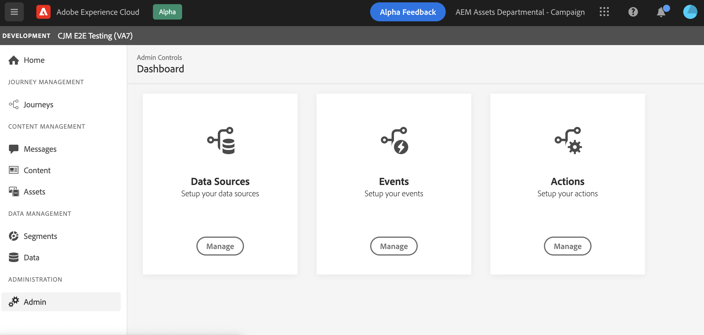

# Introducción a la configuración [!DNL Journey Optimizer]

Al acceder a [!DNL Journey Optimizer] por primera vez, se le aprovisiona un simulador para pruebas de producción y se le asigna un determinado número de direcciones IP en función de su contrato.

Para poder crear sus recorridos y enviar mensajes, debe seguir estos pasos de configuración:

1. **Configurar mensajes y canales**: definir ajustes preestablecidos, adaptar y personalizar los mensajes push y de correo electrónico

   * Defina la configuración de las notificaciones push en [!DNL Adobe Experience Platform] y [!DNL Adobe Experience Platform Launch]. [Más información](../push-gs.md)

   * Cree ajustes preestablecidos de mensaje para configurar todos los parámetros técnicos necesarios para los mensajes de correo electrónico y notificaciones push. [Más información](message-presets.md)

   * Determine qué dirección de correo electrónico utilizar con prioridad para los destinatarios cuando haya varias direcciones disponibles en Adobe Experience Platform. [Más información](primary-email-addresses.md)

   * Administre el número de días durante los cuales se realizan los reintentos antes de enviar direcciones de correo electrónico a la lista de supresión. [Más información](manage-suppression-list.md)

   <!--
    * Understand push notification flow. [Learn more](../push-gs.md)
    -->

1. **Delegar subdominios**: para cualquier nuevo subdominio que se vaya a utilizar en Journey Optimizer, el primer paso será delegarlo. [Más información](about-subdomain-delegation.md)

   

1. **Crear grupos de IP**: mejore su capacidad de envío y reputación de correo electrónico agrupando las direcciones IP aprovisionadas con su instancia. [Más información](ip-pools.md)

   

1. **Configurar recorridos**: para crear recorridos, debe configurar  **[!UICONTROL Data Sources]**,  **[!UICONTROL Events]** y  **[!UICONTROL Actions]**. [Más información](about-data-sources-events-actions.md)

   

   * La configuración **Fuente de datos** permite definir una conexión con un sistema para recuperar información adicional que se utilizará en sus recorridos. Obtenga más información sobre las fuentes de datos en esta [sección](../datasource/about-data-sources.md)

   * **** Los eventos le permiten almacenar en déclencheur sus recorridos de forma unitaria para enviar mensajes, en tiempo real, al individuo que entra en el recorrido. En la configuración de eventos, se configuran los eventos esperados en los recorridos. Los datos entrantes de los eventos se normalizan siguiendo el modelo de datos de Adobe Experience (XDM). Los eventos provienen de las API de ingesta de transmisión para eventos autenticados y no autenticados (como eventos del SDK de Adobe Mobile). Obtenga más información sobre los eventos en esta [sección](../event/about-events.md)

   * [!DNL Journey Optimizer] incorpora capacidades de mensajes: puede diseñar el contenido y publicar el mensaje. Si utiliza un sistema de terceros para enviar mensajes, cree una **acción personalizada**. Obtenga más información sobre las acciones en esta [sección](../action/action.md)